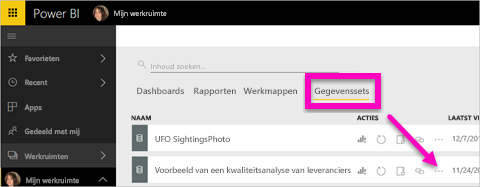
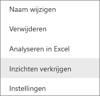
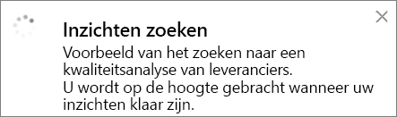
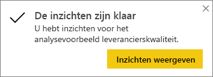
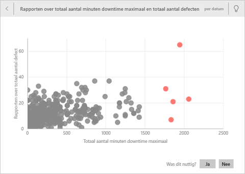
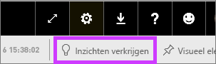
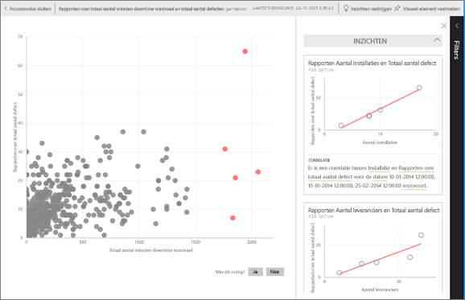
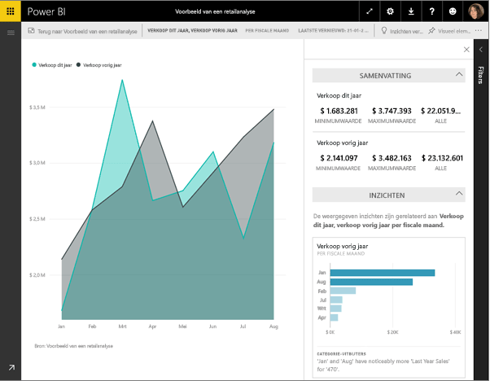

# Snelle inzichten met Power BI
Hebt u een nieuwe gegevensset en weet niet precies waar u moet beginnen?  Moet een snel een dashboard bouwen?  Wilt u snel inzichten zoeken die u hebt gemist?

Voer Snelle inzichten uit om interessante interactieve visualisaties op basis van uw gegevens te genereren. Snelle inzichten kan worden uitgevoerd op een volledige gegevensset (Snelle inzichten) of op een specifieke dashboardtegel (Scoped inzichten). U kunt Snelle inzichten zelfs uitvoeren op een inzicht.

> **Opmerking**: Snelle inzichten werkt niet met DirectQuery. Snelle inzichten werkt alleen met gegevens die zijn geüpload naar Power BI.
> 
> 

De functie Snelle inzichten is gebouwd op een groeiende [set geavanceerde analytische algoritmen](service-insight-types.md) die zijn ontwikkeld samen met Microsoft Research. We blijven Microsoft Research gebruiken om ervoor te zorgen dat meer mensen op nieuwe en intuïtieve manieren inzichten in hun gegevens kunnen vinden.

## Snelle inzichten uitvoeren op een gegevensset
Kijk hoe Amanda Snelle inzichten uitvoert op een gegevensset, een inzicht opent in de focusmodus, een van de snelle inzichten vastmaakt aan haar dashboard en vervolgens snelle inzichten verkrijgt voor haar visual.

<iframe width="560" height="315" src="https://www.youtube.com/embed/et_MLSL2sA8" frameborder="0" allowfullscreen></iframe>

Nu is het uw beurt. Verken Snelle inzichten door gebruik te maken van het de [voorbeeld van kwaliteitsanalyse van leveranciers](sample-supplier-quality.md).

1. Selecteer op het tabblad **Gegevenssets** het beletselteken (...) en kies **Inzichten verkrijgen**.
   
    
   
    
2. Er worden [verschillende algoritmen](service-insight-types.md) in Power BI gebruikt om trends in uw gegevensset te zoeken.
   
    
3. Uw inzichten zijn binnen enkele seconden klaar.  Selecteer **Inzichten weergeven** om visualisaties weer te geven.
   
    
   
   > **Opmerking**: met sommige gegevenssets kunt u geen snelle inzichten genereren, omdat de gegevens niet statistisch significant zijn.  Zie [Uw gegevens optimaliseren voor Snelle inzichten](service-insights-optimize.md) voor meer informatie.
   > 
   > 
4. De visualisaties worden weergeven op een speciaal canvas voor **Snelle inzichten** met maximaal 32 afzonderlijke kaarten met inzichten. Elke kaart bevat een grafiek of diagram plus een korte beschrijving.
   
    

## Interactie met de kaarten met snelle inzichten
  

1. Beweeg de muisaanwijzer over de kaart en selecteer het speldpictogram om de visualisatie toe te voegen aan een dashboard.
2. Beweeg de muisaanwijzer over een kaart en selecteer het pictogram voor de focusmodus om de kaart weer te geven in een volledig scherm.
   
    
3. In de focusmodus kunt u het volgende:
   
   * De visualisaties [filteren](service-interact-with-a-report-in-reading-view.md).  Selecteer de pijl in de rechterbovenhoek van het deelvenster Filters om de filters weer te geven.
     
        
   * Maak de kaar met inzichten vast aan een dashboard door het speldpictogram  of **Visueel element vastmaken** te selecteren.
   * Voer Snelle inzichten uit voor de kaart zelf. Dit wordt aangeduid als **scoped snelle inzichten**. Selecteer in de rechterbovenhoek het gloeilamppictogram of selecteer **Inzichten verkrijgen**.
     
       
     
     Het snelle inzicht wordt aan de linkerkant weergegeven en de nieuwe kaarten, die uitsluitend zijn gebaseerd op dit ene snelle inzicht, worden aan de rechterkant weergegeven.
     
       
4. Selecteer in de linkerbovenhoek **Focusmodus sluiten** om terug te keren naar het oorspronkelijk canvas Snelle inzichten.

## Snelle inzichten uitvoeren op een dashboardtegel
In plaats dat u inzichten zoekt in een complete gegevensset, kunt u uw zoekopdracht afbakenen tot de gegevens die zijn gebruikt om een dashboardtegel te maken. Dit wordt aangeduid als **scoped snelle inzichten**.

1. Open een dashboard.
2. Selecteer een tegel en [open de tegel in de focusmodus](service-focus-mode.md).
3. Selecteer in de rechterbovenhoek **Inzichten verkrijgen**.
   
    
4. De kaarten met inzichten worden in Power BI rechts van de tegel weergegeven.
   
    
5. Wekt een bepaald inzicht uw interesse? Selecteer deze kaart om dieper te graven. Het geselecteerde snelle inzicht wordt aan de linkerkant weergegeven en de nieuwe kaarten met inzichten, die uitsluitend zijn gebaseerd op dit ene snelle inzicht, worden aan de rechterkant weergegeven.
6. Blijf in uw gegevens spitten, en wanneer u een interessante snelle inzicht hebt gevonden, kunt u de bijbehorende visual vastmaken aan uw dashboard door in de rechterbovenhoek **Visueel element vastmaken** te selecteren. U kunt ook feedback verzenden om de eigenaar van de gegevensset te laten weten of een bepaald snel inzicht nuttig was of niet.
   
    

## Volgende stappen
Als u de eigenaar van een gegevensset bent, kunt u deze [optimaliseren voor Snelle inzichten](service-insights-optimize.md)

Meer informatie over de [typen Snelle inzichten die beschikbaar zijn](service-insight-types.md)

Nog vragen? [Misschien dat de Power BI-community het antwoord weet](http://community.powerbi.com/)

