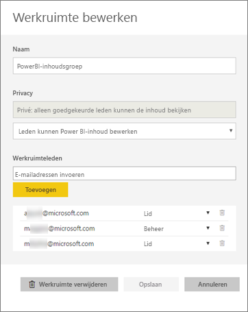
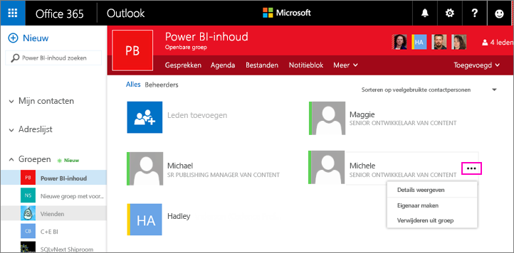
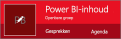
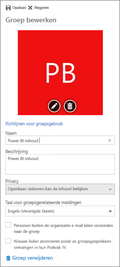

# Uw app-werkruimte beheren in Power BI en Office 365
Als maker of beheerder van een [app-werkruimte in Power BI](service-create-distribute-apps.md) of in Office 365, beheert u bepaalde aspecten van de werkruimte in Power BI. Andere aspecten beheert u in Office 365. 

> [!NOTE]
> Bij de preview van de nieuwe werkruimte-ervaring is de relatie tussen Power BI-werkruimten en Office 365-groepen gewijzigd. Er wordt niet automatisch een Office 365-groep gemaakt wanneer u een van de nieuwe werkruimten maakt. Meer informatie over [het maken van de nieuwe werkruimten (preview)](service-create-the-new-workspaces.md)

**In Power BI** kunt u:

* Leden aan een app-werkruimte toevoegen of verwijderen. U kunt een lid van de werkruimte ook beheerder maken.
* De naam van de app-werkruimte bewerken.
* De app-werkruimte verwijderen.

**In Office 365** kunt u:

* Groepsleden aan uw app-werkruimte toevoegen of verwijderen. U kunt een lid ook beheerder maken.
* De groepsnaam, afbeelding, beschrijving en andere instellingen bewerken.
* Het e-mailadres van de groep zien.
* De groep verwijderen.

U hebt een [Power BI Pro](service-features-license-type.md)-licentie nodig om beheerder of lid van een app-werkruimte te zijn. Uw app-gebruikers hebben ook een Power BI Pro-licentie nodig, tenzij uw app-werkruimte zich in een Power BI Premium-capaciteit bevindt. Lees [Wat is Power BI Premium?](service-premium.md) voor meer informatie.

## Uw app-werkruimte bewerken in Power BI
1. Selecteer in de Power BI-service de pijl naast **Werkruimten** > selecteer het beletselteken (**…**) naast uw werkruimtenaam > **Werkruimte bewerken**. 
   
   
   
   > [!NOTE]
   > U ziet **Werkruimte bewerken** alleen als u beheerder van een app-werkruimte bent.
   > 
   > 
2. Hier kunt u leden een andere naam geven, toevoegen of verwijderen of de app-werkruimte verwijderen. 
   
   
3. Selecteer **Opslaan** of **Annuleren**.

## Eigenschappen van app-werkruimten van Power BI bewerken in Office 365
1. Selecteer in de Power BI-service de pijl naast **Werkruimten** > selecteer het beletselteken (**…**) naast uw werkruimtenaam > **Leden**. 
   
   
   
   Hiermee opent u de groepsweergave van Outlook voor Office 365 van uw app-werkruimte.
   
   Mogelijk moet u zich aanmelden bij uw zakelijke account.
2. Tik op het beletselteken (**...** ) naast de naam van een lid om het lid beheerder te maken of om het lid te verwijderen uit de app-werkruimte. 
   
   

## Een afbeelding toevoegen en andere werkruimte-eigenschappen instellen in de Office 365-groep
Wanneer u uw app uit de app-werkruimte distribueert, wordt de afbeelding die u hier toevoegt de afbeelding voor uw app. Zie de sectie [Een afbeelding toevoegen aan uw app](service-create-workspaces.md#add-an-image-to-your-office-365-app-workspace-optional) van het artikel [De nieuwe werkruimten maken](service-create-workspaces.md).

1. Selecteer de groepsafbeelding om de eigenschappen van de werkruimtegroep te bewerken in de Outlook voor Office 365-weergave van uw app-werkruimte.
   
   
2. U kunt hier de naam, beschrijving en taal bewerken, een afbeelding toevoegen en andere eigenschappen instellen.
   
   
3. Selecteer **Opslaan** of **Verwijderen**.

## Volgende stappen
* [Apps met dashboards en rapporten publiceren in Power BI](service-create-distribute-apps.md)
* Hebt u nog vragen? [Misschien dat de Power BI-community het antwoord weet](http://community.powerbi.com/)

