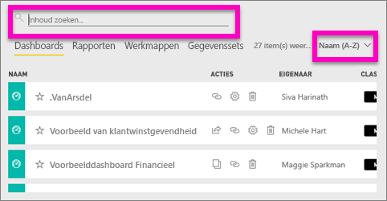
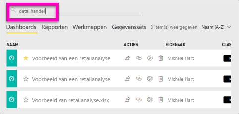
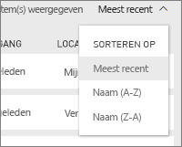
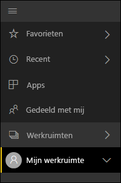
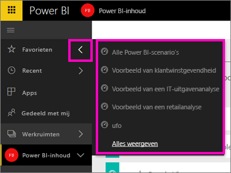

# Navigatie: inhoud zoeken en sorteren in de Power BI-service
Er zijn veel manieren om door uw inhoud in de Power BI-service te bladeren. De inhoud in werkruimten wordt geordend op vier tabbladen: Dashboards, Rapporten, Werkmappen en Gegevenssets.  De inhoud wordt ook ingedeeld per gebruik: Favorieten, Recent, Apps, Gedeeld met mij en Aanbevolen. Via deze verschillende paden naar uw inhoud kunt u snel vinden wat u nodig hebt in de Power BI-service.  

>[!NOTE] 
>Dit artikel is van toepassing op de Power BI-service (app.powerbi.com) en niet op Power BI Desktop.

## Navigatie in werkruimten

In de Power BI-service wordt de inhoud van uw werkruimte gescheiden op type: Dashboards, Rapporten, Werkmappen en Gegevenssets. U ziet deze organisatie wanneer u een werkruimte selecteert. In dit voorbeeld heet de app-werkruimte ‘Voorbeeld van de app Verkoop en marketing’. Deze werkruimte bevat 2 dashboards, 6 rapporten, 1 werkmap en 5 gegevenssets.

________________________________________

## Zoeken en sorteren in werkruimten
Een werkruimte heeft vier inhoudstabbladen: Dashboards, Rapporten, Werkmappen en Gegevenssets.  Elk van deze tabbladen bevat een zoekveld en een knop sorteren.  Wanneer u met de Power BI-service begint, vindt u deze misschien niet handig omdat u slechts één of twee items per tabblad hebt.  In de loop van de tijd kunt u echter lange lijsten met inhoud krijgen.  U kunt zoeken en sorteren gebruiken om eenvoudig te vinden wat u nodig hebt.

* Voer een zoekterm in om een overeenkomst te vinden in het huidige scherm
  
   
* Selecteer de knop Sorteren om opties voor de huidige pagina weer te geven. Met deze opties kunt u sorteren op naam of op eigenaar.
  
   

## Navigatie met behulp van de linkernavigatiebalk
De linkernavigatiebalk classificeert uw inhoud zodanig dat u nog gemakkelijker en sneller kunt vinden wat u nodig hebt.  

Inhoud die u voor eigen gebruik maakt, is te vinden in **Mijn werkruimte**, inhoud die u maakt en deelt met een groep is beschikbaar in een **app-werkruimte**, inhoud die met u wordt gedeeld is beschikbaar in **Gedeeld met mij** en de inhoud die u als laatste hebt bekeken, is beschikbaar in **Recent**.

Bovendien kunt u inhoud labelen als [favoriet](service-dashboard-favorite.md) en [aanbevolen](service-dashboard-featured.md). Kies één dashboard dat u verwacht het meeste weer te geven en stel dit in als uw *aanbevolen* dashboard. Telkens wanneer u de Power BI-service opent, wordt dit dashboard als eerste weergegeven. Hebt u enkele dashboards en apps die u vaak bezoekt? Wanneer u deze instelt als favorieten, zijn ze altijd beschikbaar via de navigatiebalk links.

.

## Aandachtspunten en probleemoplossing
* Voor gegevenssets is **Sorteren op** eigenaar niet beschikbaar.

## Volgende stappen
[Power BI - basisconcepten](service-basic-concepts.md)

Hebt u nog vragen? [Misschien dat de Power BI-community het antwoord weet](http://community.powerbi.com/)