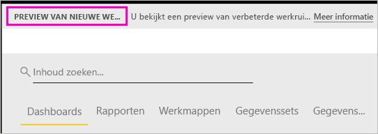
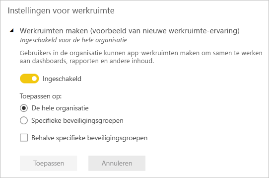

# Werk organiseren in de nieuwe werkruimten (preview) in Power BI

Werkruimten zijn locaties waar u met collega’s kunt samenwerken om verzamelingen van dashboards en rapporten te maken. Vervolgens kunt u deze verzamelingen bundelen in *apps* en deze distribueren naar uw hele organisatie of naar specifieke personen of groepen. In Power BI is een preview-versie van een nieuwe werkruimte-ervaring beschikbaar. 

Met de preview voor nieuwe werkruimten kunt u:

- Werkruimterollen toewijzen aan gebruikersgroepen: beveiligingsgroepen, distributielijsten, Office 365-groepen en personen.
- Een werkruimte in Power BI maken zonder een Office 365-groep te maken.
- Gedetailleerdere werkruimterollen gebruiken voor flexibeler beheer van machtigingen in een werkruimte.

Lees meer over het [maken van een van de nieuwe werkruimten](service-create-the-new-workspaces.md).
 
Wanneer u een van de nieuwe werkruimten maakt, maakt u geen onderliggende, gekoppelde Office 365-groep. Alle werkruimtebeheer vindt plaats in Power BI, niet in Office 365. U kunt nog steeds een Office 365-groep aan de werkruimte toevoegen om gebruikerstoegang tot inhoud via Office 365-groepen te blijven beheren. U kunt echter daarnaast beveiligingsgroepen of distributielijsten gebruiken en personen rechtstreeks toevoegen in Power BI, zodat u de toegang tot werkruimten op allerlei manieren kunt beheren Omdat werkruimtebeheer nu via Power BI verloopt, besluiten Power BI-beheerders wie in een organisatie werkruimten kan maken. Bij de **Werkruimte-instellingen** in de beheerportal kunnen beheerders iedereen of niemand binnen de organisatie toestemming geven om werkruimten te maken. Ze kunnen het maken van werkruimten ook beperken tot leden van specifieke beveiligingsgroepen.

Lees meer over de [Power BI-beheerportal](service-admin-portal.md).

## Nieuwe werkruimten implementeren

Tijdens de preview-periode kunnen oude en nieuwe werkruimten naast elkaar bestaan en kunt u beide maken. Wanneer de preview voor nieuwe werkruimten wordt beëindigd en ze algemeen beschikbaar zijn, zijn oude werkruimten nog steeds een tijdje mogelijk. U kunt ze niet meer maken en u moet zich erop voorbereiden dat uw werkruimten naar de infrastructuur voor nieuwe werkruimten moeten worden gemigreerd. Maar maakt u zich geen zorgen, u krijgt enkele maanden de tijd om de migratie te voltooien.

## Rollen in de nieuwe werkruimten

U voegt gebruikersgroepen of personen aan de nieuwe werkruimten toe als leden, inzenders of beheerders. Iedereen in een gebruikersgroep krijgt de rol die u hebt gedefinieerd. Als een persoon zich in verschillende gebruikersgroepen bevindt, krijgt hij/zij het hoogste niveau van de machtigingen die aan de rol zijn toegewezen.  Zie [Rollen in de nieuwe werkruimten](#roles-in-the-new-workspaces) verderop in dit artikel voor een uitleg over de verschillende rollen.

Iedereen die u aan een werkruimte toevoegt, heeft een Power BI Pro-licentie nodig. Deze gebruikers kunnen in de werkruimte samenwerken aan dashboards en rapporten die u wilt publiceren naar een breder publiek of zelfs uw hele organisatie. Als u inhoud naar anderen binnen uw organisatie wilt distribueren, kunt u Power BI Pro-licenties toewijzen aan die gebruikers of de werkruimte in een Power BI Premium-capaciteit plaatsen.

U kunt met rollen bepalen wie wat kan doen in een werkruimte, zodat teams kunnen samenwerken. U kunt met nieuwe werkruimten rollen toewijzen aan personen en aan gebruikersgroepen: beveiligingsgroepen, Office 365-groepen en distributielijsten. 

Wanneer u rollen aan een gebruikersgroep toewijst, hebben de personen in de groep toegang tot de inhoud. Als u gebruikersgroepen nest, zijn alle ingesloten gebruikers gemachtigd. Aan een gebruiker die zich in verschillende gebruikersgroepen met verschillende rollen bevindt, wordt de machtiging met de meeste rechten toegewezen. 

De nieuwe werkruimten bieden drie rollen: beheerders, leden en inzenders.

**Beheerders kunnen:**

- De werkruimte bijwerken en verwijderen. 
- Personen, met inbegrip van andere beheerders, toevoegen/verwijderen.
- Alles doen wat leden kunnen doen.

**Leden kunnen:** 

- Leden of anderen met minder machtigingen toevoegen.
- Apps publiceren en bijwerken.
- Items en apps delen.
- Anderen toestaan items opnieuw te delen.
- Alles doen wat inzenders kunnen doen.

**Inzenders kunnen:** 

- Inhoud in de werkruimte maken, bewerken en verwijderen. 
- Rapporten publiceren naar de werkruimte, inhoud verwijderen.
- Kunnen nieuwe mensen geen toegang geven tot inhoud. Ze kunnen geen nieuwe inhoud delen, maar kunnen delen met iemand met wie de werkruimte, het item of de app al wordt gedeeld. 
- Kunnen de leden van de groep niet wijzigen.
 
We implementeren overal in de service werkstromen Toegang aanvragen, zodat gebruikers die geen toegang hebben deze kunnen aanvragen. Werkstromen Toegang aanvragen bestaan momenteel voor dashboards, rapporten en apps.

## Oude werkruimten omzetten naar nieuwe werkruimten

Tijdens de preview-periode kunt u uw oude werkruimten niet automatisch converteren naar nieuwe werkruimten. U kunt echter een nieuwe werkruimte maken en uw inhoud naar de nieuwe locatie publiceren. 

Wanneer de nieuwe werkruimten algemeen beschikbaar zijn, kunt u ervoor kiezen de oude werkruimten automatisch te migreren. Op een bepaald moment nadat de nieuwe werkruimten algemeen beschikbaar zijn geworden, moet u de oude werkruimten migreren.

## Veelgestelde vragen over Power BI-apps

### Hoe verschillen de nieuwe werkruimten van de huidige werkruimten?

Voor de nieuwe werkruimten worden enkele functies anders ontworpen. Hier ziet u de wijzigingen die u kunt verwachten die definitief worden doorgevoerd bij de preview. 

* Wanneer u werkruimten maakt, worden er geen bijbehorende entiteiten in Office 365 gemaakt, zoals bij de huidige werkruimten. (U kunt nog steeds een Office 365-groep aan uw werkruimte toevoegen door een rol toe te wijzen.) 
* U kunt in de huidige werkruimten alleen personen toevoegen aan de leden- en beheerderlijsten. In de nieuwe werkruimten kunt u meerdere AD-beveiligingsgroepen, distributielijsten of Office 365-groepen toevoegen aan deze lijsten om het beheer van gebruikers eenvoudiger te maken. 
- U kunt een organisatie-inhoudspakket maken op basis van een huidige werkruimte. U kunt geen organisatie-inhoudspakket op basis van de nieuwe werkruimten maken.
- U kunt een organisatie-inhoudspakket gebruiken op basis van een huidige werkruimte. U kunt geen organisatie-inhoudspakket op basis van de nieuwe werkruimten gebruiken.
- Gedurende de previewperiode wordt een aantal functies nog niet ingeschakeld voor nieuwe werkruimten. Zie de volgende sectie [Geplande nieuwe werkruimtefuncties](service-new-workspaces.md#planned-new-workspace-preview-features) voor meer informatie.

## Geplande preview-functies voor nieuwe werkruimten

Als de preview wordt uitgebracht, wordt een aantal andere preview-functies voor de nieuwe werkruimte nog ontwikkeld. Deze zijn nog niet beschikbaar:

- Geen knop **Werkruimte verlaten**.
- Metrische gegevens over gebruik worden nog niet ondersteund.
- Zo werkt Premium: u kunt werkruimten in een Premium-capaciteit toewijzen en maken, maar voor het verplaatsen van een werkruimte tussen capaciteiten, gaat u naar de instellingen van de werkruimte.
- Het insluiten van SharePoint-webonderdelen wordt nog niet ondersteund.
- Geen knop **OneDrive** voor Office 365-groepen in Gegevens/bestanden ophalen.

## Functies van de werkruimten die anders werken

Sommige functies werken in de nieuwe werkruimten anders dan in de huidige werkruimten. Deze verschillen zijn doorgevoerd op basis van feedback die we van klanten hebben ontvangen en maken een flexibelere benadering voor de samenwerking met werkruimten mogelijk:

- Leden kunnen wel of niet opnieuw delen: vervangen door de rol Inzender
- Alleen-lezenwerkruimten: in plaats van dat u gebruikers alleen-lezentoegang geeft tot een werkruimte, wijst u aan gebruikers de toekomstig beschikbare rol Lezer toe. Hiermee krijgen ze vergelijkbare alleen-lezentoegang tot de inhoud in een werkruimte.

## Bekende problemen

Omdat dit een preview-functie is, zijn er enkele beperkingen waarmee u rekening moet houden. De volgende problemen zijn bekend en er wordt aan een oplossing gewerkt:

- Gratis gebruikers of gebruikersgroepen die zijn toegevoegd als geadresseerden van abonnementen voor e-mails, ontvangen mogelijk geen e-mails terwijl het wel de bedoeling is dat ze deze ontvangen. Het probleem treedt op wanneer een van de nieuwe werkruimten zich in een Premium-capaciteit bevindt, terwijl de Mijn werkruimte van de gebruiker die het abonnement maakt, zich niet in een Premium-capaciteit bevindt. Als de Mijn werkruimte zich in een Premium-capaciteit bevindt, ontvangen gratis gebruikers en gebruikersgroepen de e-mails.
- Nadat een werkruimte van een Premium-capaciteit naar een gedeelde capaciteit is verplaatst, blijven gratis gebruikers en gebruikersgroepen soms e-mailberichten ontvangen, wat niet de bedoeling is. Het probleem treedt op wanneer de Mijn werkruimte van de gebruiker waarmee het abonnement wordt gemaakt, zich in een Premium-capaciteit bevindt.

## Volgende stappen
* [De nieuwe werkruimten maken (preview) in Power BI](service-create-the-new-workspaces.md)
* [De huidige werkruimten maken](service-create-workspaces.md)
* [Apps in Power BI installeren en gebruiken](service-create-distribute-apps.md)
* Vragen? [Misschien dat de Power BI-community het antwoord weet](http://community.powerbi.com/)
