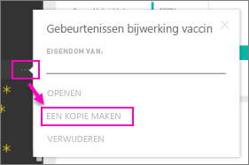

# Organisatie-inhoudspakketten: kopiëren, vernieuwen en toegang verkrijgen

Wanneer een organisatie-inhoudspakket wordt gepubliceerd, zien alle ontvangers de hetzelfde dashboard en dezelfde rapporten, Excel-werkmappen, gegevenssets en gegevens (tenzij het een SSAS-gegevensbron is (SQL Server Analysis Services).  [Alleen de maker van het inhoudspakket kan het inhoudspakket bewerken en opnieuw publiceren](service-organizational-content-pack-manage-update-delete.md).  Alle ontvangers kunnen echter een kopie van het inhoudspakket opslaan die naast het origineel kan bestaan.

Het maken van inhoudspakketten verschilt van het delen van dashboards of het samenwerken aan een dashboard in een groep. Lees [Samen aan dashboards en rapporten werken en deze delen?](service-how-to-collaborate-distribute-dashboards-reports.md) om te bepalen wat de beste optie voor uw situatie is.

> [!NOTE]
> U kunt in de preview voor een nieuwe werkruimte-ervaring geen organisatie-inhoudspakketten maken of installeren. Het is nu een goed moment om uw inhoudspakketten te upgraden naar apps, als u dat nog niet hebt gedaan. Informatie over [de nieuwe werkruimte-ervaring](service-create-the-new-workspaces.md).
> 

## Een kopie maken van een organisatie-inhoudspakket
Maak uw eigen kopie van het inhoudspakket die niet zichtbaar is voor anderen.

1. Selecteer het beletselteken (...) naast het dashboard van het inhoudspakket > Een kopie maken.
   
    
2. Selecteer **Opslaan**.  

U hebt nu een kopie die u kunt wijzigen. Niemand anders ziet de wijzigingen die u aanbrengt.

## Help!  Ik heb geen toegang meer tot het inhoudspakket
Dit kan gebeuren om verschillende redenen:

* **Lidmaatschapswijzigingen**: inhoudspakketten worden gepubliceerd naar e-maildistributiegroepen, beveiligingsgroepen en [Power BI-groepen op basis van Office 365](https://support.office.com/article/Create-a-group-in-Office-365-7124dc4c-1de9-40d4-b096-e8add19209e9).  Als u uit de groep wordt verwijderd, hebt u geen toegang meer tot het inhoudspakket.
* **Distributiewijzigingen**: de maker van het inhoudspakket wijzigt de distributie. Als het inhoudspakket bijvoorbeeld oorspronkelijk is gepubliceerd voor de hele organisatie, maar de maker het opnieuw heeft gepubliceerd voor een kleinere doelgroep, bent u daar mogelijk niet in opgenomen.
* **Gewijzigde beveiligingsinstellingen**: als het dashboard en de rapporten verbinding hebben met on-premises SSAS-gegevensbronnen en er wijzigingen worden aangebracht in de beveiligingsinstellingen, kunnen uw toegangsrechten tot die server worden ingetrokken.

## Hoe worden organisatie-inhoudspakketten vernieuwd?
Wanneer het inhoudspakket is gemaakt, worden de vernieuwingsinstellingen overgenomen bij de gegevensset.  Wanneer u een kopie van het inhoudspakket maakt, blijven de koppeling naar de oorspronkelijke gegevensset en het schema voor gegevensvernieuwing behouden in de nieuwe versie. 

Zie [Organisatie-inhoudspakketten beheren, bijwerken en verwijderen](service-organizational-content-pack-manage-update-delete.md).

## Volgende stappen
* [Inleiding tot organisatie-inhoudspakketten](service-organizational-content-pack-introduction.md)
* [Een groep maken in Power BI](consumer/end-user-create-apps.md)
* Nog vragen? [Misschien dat de Power BI-community het antwoord weet](http://community.powerbi.com/)

