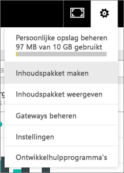
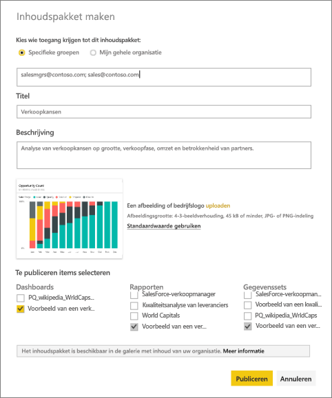
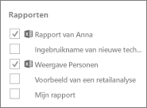
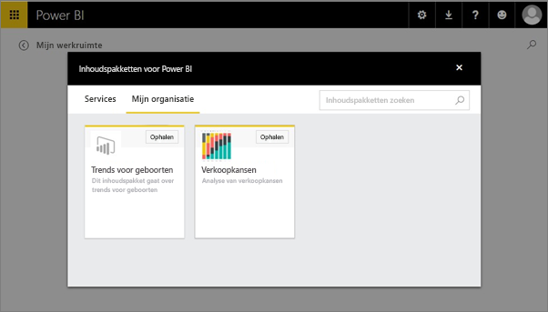

# Organisatie-inhoudspakketten in Power BI maken en publiceren (zelfstudie)
> [!NOTE]
> Hebt u al iets over de nieuwe *apps* gehoord? Apps zijn de nieuwe manier om inhoud naar grote doelgroepen te distribueren in Power BI. U kunt het beste apps in plaats van organisatie-inhoudspakketten of alleen-lezenwerkruimten gebruiken. Meer [informatie over apps](service-install-use-apps.md).
> 
> 

In deze zelfstudie maakt u een organisatie-inhoudspakket, geeft u er een specifieke groep toegang toe en publiceert u het naar de bibliotheek voor inhoudspakketten van uw organisatie op Power BI.

Het maken van inhoudspakketten verschilt van het delen van dashboards of het samenwerken aan een dashboard in een groep. Lees [Hoe kan ik samenwerken aan en dashboards en rapporten en deze delen?](service-how-to-collaborate-distribute-dashboards-reports.md) om te bepalen wat de beste optie voor uw situatie is.

> [!NOTE]
> Voor het maken van een organisatie-inhoudspakket moeten u en uw collega’s beschikken over een [Power BI Pro-account](https://powerbi.microsoft.com/pricing).
> 
> 

Stel u voor dat u releasebeheerder bent bij Contoso en bezig bent de introductie van een nieuw product voor te bereiden.  U hebt een dashboard gemaakt met rapporten die u wilt delen met de andere werknemers die aan de introductie werken. U zoekt een manier om het dashboard en de rapporten te verpakken als een oplossing die uw collega’s kunnen gebruiken. 

Doet u mee? Ga in [Power BI-service](https://powerbi.com) naar **Gegevens ophalen > Voorbeelden > Voorbeeld van een verkoopkansanalyse** > **Verbinden** voor uw eigen exemplaar. 

1. Selecteer in het navigatiedeelvenster links het dashboard **Voorbeeld van een verkoopkansanalyse**.
2. Selecteer in de bovenste navigatiebalk het tandwielpictogram > **Inhoudspakket maken**.    
   
3. Voer in het venster **Inhoudspakket maken** de volgende informatie in.  
   
   Houd er rekening mee dat de bibliotheek voor inhoudspakketten van uw organisatie op den duur honderden inhoudspakketten kan bevatten die gepubliceerd worden voor de organisatie of voor groepen. Neem de tijd om uw inhoudspakket een betekenisvolle naam te geven, een goede beschrijving toe te voegen en de juiste doelgroep te selecteren.  Gebruik woorden die het gemakkelijk maken uw inhoudspakket te vinden met een zoekopdracht.
   
   1.  Selecteer **Specifieke groepen** en voer de volledige e-mailadressen van personen, [Office 365-groepen](https://support.office.com/article/Create-a-group-in-Office-365-7124dc4c-1de9-40d4-b096-e8add19209e9), distributiegroepen of beveiligingsgsgroepen in. Voorbeeld:
      
         salesmgrs@contoso.com; sales@contoso.com
      
      Probeer het voor deze zelfstudie met uw eigen e-mailadres of dat van uw groep.
   
   2.  Noem het inhoudspakket **Verkoopkansen**.
   
      > [!TIP]
      > U zou de naam van het dashboard in de naam van het inhoudspakket kunnen opnemen. Op die manier kunnen uw collega's het dashboard gemakkelijker vinden nadat ze verbinding hebben gemaakt met uw inhoudspakket.
      > 
      > 
   
   3.  Aanbevolen: Voeg een **beschrijving** toe. Dit helpt collega's de inhoudspakketten die ze nodig hebben, gemakkelijker te vinden. Naast een beschrijving kunt u ook sleutelwoorden toevoegen die uw collega's kunnen gebruiken om het inhoudspakket te zoeken. Neem contactgegevens op voor het geval uw collega's een vraag hebben of hulp nodig hebben.
   
   4.  **Upload een afbeelding of logo** om het groepsleden gemakkelijker maken het inhoudspakket te vinden. Het is gemakkelijker naar een afbeelding te bladeren dan om tekst te vinden. Wij hebben een afbeelding gebruikt van de kolomgrafiektegel Aantal verkoopkansen 100% in de schermafbeelding hieronder.
   
   5.  Selecteer het dashboard **Voorbeeld van een verkoopkansanalyse** om het toe te voegen aan het inhoudspakket.  Het bijbehorende rapport en de bijbehorende gegevensset worden automatisch toegevoegd. Als u wilt, kunt u ook andere toevoegen.
   
      > [!NOTE]
      >  Alleen de dashboards, rapporten, gegevenssets en werkmappen die u kunt bewerken worden weergegeven. Dingen die met u gedeeld zijn, staan dus niet in de lijst.
      > 
      > 
   
       
   
   6. Als u Excel-werkmappen hebt, staan deze onder Rapporten, met een Excel-pictogram. U kunt deze ook toevoegen aan het inhoudspakket.
   
     
   
      > [!NOTE]
      > Als leden van de groep de Excel-werkmap niet kunnen bekijken, moet u mogelijk [de werkmap met hen delen in OneDrive voor Bedrijven](https://support.office.com/en-us/article/Share-documents-or-folders-in-Office-365-1fe37332-0f9a-4719-970e-d2578da4941c).
      > 
      > 
4. Selecteer **Publiceren** om het inhoudspakket toe te voegen aan de bibliotheek met organisatie-inhoudspakketten van de groep.  
   
   U krijgt een bericht wanneer het pakket is gepubliceerd. 
5. Wanneer leden van uw groep naar **Gegevens ophalen > Mijn organisatie** gaan, tikken ze in het zoekvak en typen ‘Verkoopkansen’.
   
    
6. Ze zien uw inhoudspakket.  
    
   
   > [!TIP]
   > De URL die wordt weergegeven in uw browser is een uniek adres voor dit inhoudspakket.  Wilt u uw collega's op de hoogte stellen van dit nieuwe inhoudspakket?  Plak de URL in een e-mailbericht.
   > 
   > 
7. Ze selecteren **Verbinden**, en nu kunnen ze [uw inhoudspakket bekijken en ermee werken](service-organizational-content-pack-copy-refresh-access.md). 

### Volgende stappen
* [Inleiding tot organisatie-inhoudspakketten](service-organizational-content-pack-introduction.md)  
* [Organisatie-inhoudspakketten beheren, bijwerken en verwijderen](service-organizational-content-pack-manage-update-delete.md)  
* [Een groep maken in Power BI](service-create-distribute-apps.md)  
* [Wat is OneDrive voor Bedrijven?](https://support.office.com/en-us/article/What-is-OneDrive-for-Business-187f90af-056f-47c0-9656-cc0ddca7fdc2)
* Nog vragen? [Misschien dat de Power BI-community het antwoord weet](http://community.powerbi.com/)

