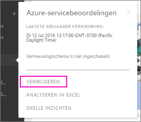

# De verbinding met een organisatie-inhoudspakket van Power BI verwijderen
Een collega heeft een inhoudspakket gemaakt. U hebt het in AppSource gedetecteerd en toegevoegd aan uw Power BI-werkruimte. U hebt het nu niet meer nodig.  Hoe kunt u het verwijderen?

Als u een inhoudspakket wilt verwijderen, moet u de gegevensset ervan verwijderen.  

* Selecteer het weglatingsteken rechts van de gegevensset en selecteer  **Verwijderen \> Ja** in het navigatiedeelvenster links.  
  
  

Als u de gegevensset te verwijdert, verwijdert u ook alle gekoppelde rapporten en dashboards. Als u de verbinding met het inhoudspakket verwijdert, wordt het inhoudspakket echter niet uit de AppSource van uw organisatie verwijderd.  U kunt altijd terugkeren naar AppSource en het inhoudspakket terugzetten naar uw werkruimte. U kunt alleen [een inhoudspakket van AppSource verwijderen](service-organizational-content-pack-manage-update-delete.md) als u degene bent die het pakket heeft gemaakt.

## Volgende stappen
* [Inleiding tot organisatie-inhoudspakketten](service-organizational-content-pack-introduction.md) 
* [Een app maken en distribueren in Power BI](service-create-distribute-apps.md) 
* [Basisconcepten van Power BI](service-basic-concepts.md)  
* Nog vragen? [Misschien dat de Power BI-community het antwoord weet](http://community.powerbi.com/)

