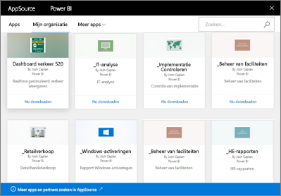

# Inleiding tot organisatie-inhoudspakketten in Power BI
> [!NOTE]
> Hebt u al iets over de nieuwe *apps* gehoord? Apps zijn de nieuwe manier om inhoud naar grote doelgroepen te distribueren in Power BI. We willen organisatie-inhoudspakketten binnenkort afschaffen. Daarom raden we u aan vanaf nu apps te gebruiken. Meer [informatie over apps](service-install-use-apps.md).
> 
> 

Distribueert u regelmatig rapporten per e-mail naar uw team? Probeer in plaats daarvan het volgende eens: verpak uw dashboards, rapporten, Excel-werkmappen en gegevenssets en publiceer ze naar uw team als een *organisatie-inhoudspakket*. De inhoudspakketten die u maakt, zijn gemakkelijk door uw team te vinden. Ze bevinden zich allemaal in AppSource. Omdat ze deel uitmaken van Power BI, kunnen ze gebruikmaken van alle functies van Power BI, met inbegrip van interactieve gegevensverkenning, nieuwe visuals, Q&A, integratie met andere gegevensbronnen, gegevens vernieuwen en meer.

Het maken van inhoudspakketten verschilt van het delen van dashboards of het samenwerken aan een dashboard in een app-werkruimte. Lees [Samen aan dashboards en rapporten werken en deze delen?](service-how-to-collaborate-distribute-dashboards-reports.md) om te bepalen wat de beste optie voor uw situatie is. 

In AppSource kunt u bladeren of zoeken naar inhoudspakketten die zijn gepubliceerd naar de hele organisatie, naar distributie- of beveiligingsgroepen en naar [Office 365-groepen waarvan u deel uitmaakt](https://support.office.com/article/Create-a-group-in-Office-365-7124dc4c-1de9-40d4-b096-e8add19209e9). Als u geen lid van een specifieke groep bent, kunt u geen inhoudspakketten bekijken die met de desbetreffende groep zijn gedeeld. Alle leden van de groep hebben dezelfde alleen-lezentoegang tot de gegevens, rapporten, werkmappen en dashboards van het inhoudspakket (tenzij het een gegevensbron van SQL Server Analysis Services (SSAS) is en uw bevoegdheden dus worden overgenomen van de gegevensbron).

De dashboards, rapporten en Excel-werkmappen hebben het kenmerk alleen-lezen, maar u kunt de dashboards en rapporten kopiëren en gebruiken als uitgangspunt voor van uw eigen gepersonaliseerde versie van het inhoudspakket.

> [!NOTE]
> Organisatie-inhoudspakketten zijn alleen beschikbaar wanneer u en uw collega's over [Power BI Pro](service-free-vs-pro.md) beschikken.
> 
> 

## Wat is *AppSource*?
Wanneer een organisatie-inhoudspakket wordt gepubliceerd, wordt deze toegevoegd aan AppSource.  Dankzij deze centrale opslagplaats kunnen leden gemakkelijk door dashboards, rapporten en gegevenssets bladeren die voor hen zijn gepubliceerd en deze verkennen.  

* Als u AppSource wilt weergeven, selecteert u **Gegevens ophalen** > **Mijn organisatie** > **Ophalen**.

Meer informatie over [het zoeken en openen van organisatie-inhoudspakketten](service-organizational-content-pack-find-and-open.md).

## De levenscyclus van een organisatie-inhoudspakket
Elke Power BI Pro-gebruiker kan organisatie-inhoudspakketten maken, publiceren en open. Alleen de maker van het inhoudspakket kan de werkmap en gegevensset aanpassen, volgens een ingesteld schema vernieuwen en verwijderen.

De levenscyclus ziet er ongeveer als volgt uit:

1. Nate maakt een inhoudspakket in Power BI Pro en publiceert deze naar de groep Marketingdistributie. De vernieuwingsinstellingen worden overgenomen door de gegevensset en kunnen alleen worden gewijzigd door Nate.
   
   > [!NOTE]
   > Als Nate het inhoudspakket maakt in een [Power BI-app-werkruimte](service-create-distribute-apps.md) waartoe hij behoort, kunnen anderen in de Power BI-werkruimte eigenaar worden van de werkruimten, zelfs wanneer hij de werkruimte verlaat.
   > 
   > 
2. Nate verzendt een mail naar de distributiegroep om ze op de hoogte te brengen van het nieuwe inhoudspakket.
3. Jane, een lid van de groep Marketingdistributie, gebruikt Power BI Pro het inhoudspakket in AppSource te zoeken en hier verbinding mee te maken. Ze beschikt nu over een alleen-lezenexemplaar.  Ze weet dat het inhoudspakket alleen kan worden gelezen, omdat er in het navigatiedeelvenster aan de linkerkant een pictogram voor delen links van de dashboard- en rapportnaam wordt weergeven. En wanneer ze het dashboard selecteert, kan Jane aan het vergrendelingspictogram zien dat ze een dashboard van een inhoudspakket bekijkt. 
4. Ze besluit om het dashboard aan te passen. Ze heeft nu haar eigen exemplaar van het dashboard en de rapporten. Haar werk is niet van invloed op de bron, het oorspronkelijke inhoudspakket of andere leden van de distributiegroep. Ze werkt nu aan haar eigen exemplaar van het dashboard en de rapporten.
5. Nate werkt het dashboard bij en publiceert een nieuwe versie van het inhoudspakket zodra hij klaar is.
   
   * Julio, een ander lid van de distributiegroep, heeft het oorspronkelijke inhoudspakket niet gewijzigd. De nieuwe wijzigingen worden automatisch toegepast op deze versie van het inhoudspakket.  
   * Jane heeft het inhoudspakket aangepast. Ze ontvangt een melding dat er een nieuwe versie beschikbaar is.  Ze kan naar AppSource gaan en het bijgewerkte inhoudspakket ophalen zonder dat haar gepersonaliseerde versie verloren gaat. Ze heeft nu twee versies: de gepersonaliseerde versie en het bijgewerkte inhoudspakket.
6. Stel dat Nate de beveiligingsinstellingen wijzigt. Julio en Jane hebben geen toegang meer tot de inhoud. Of stel dat ze zijn verwijderd uit de groep Marketingdistributie.
   
   * Julio heeft het oorspronkelijke inhoudspakket niet aangepast, waardoor de inhoud automatisch wordt verwijderd. 
   * Jane heeft het inhoudspakket aangepast. De volgende keer dat ze het dashboard opent, zijn alle tegels van het oorspronkelijke inhoudspakket verdwenen. De tegels die ze heeft vastgemaakt vanuit andere rapporten (waarvoor ze nog steeds over machtigingen beschikt), worden nog wel weergegeven. De gekoppelde rapporten en gegevenssets zijn niet meer beschikbaar (en worden niet weergegeven in het navigatiedeelvenster aan de linkerkant).
7. Of Nate verwijdert het inhoudspakket.
   
   * Julio heeft het oorspronkelijke inhoudspakket niet aangepast, waardoor de inhoud automatisch wordt verwijderd. 
   * Jane heeft het inhoudspakket aangepast. De volgende keer dat ze het dashboard opent, zijn alle tegels van het oorspronkelijke inhoudspakket verdwenen. De tegels die ze heeft vastgemaakt vanuit andere rapporten, worden nog wel weergegeven. De gekoppelde rapporten en gegevenssets zijn niet meer beschikbaar (en worden niet weergegeven in het navigatiedeelvenster aan de linkerkant).

## Gegevensbeveiliging
Alle distributiegroepsleden beschikken over dezelfde machtigingen voor de gegevens als de maker van het inhoudspakket. De enige uitzondering hierop vormen de on-premises SSAS-gegevenssets (SQL Server Analysis Services) in tabelvorm. Omdat de rapporten en dashboards live verbinding hebben met het on-premises SSAS-model, worden de referenties van elk afzonderlijk lid van de distributiegroep gebruikt om te bepalen tot welke gegevens hij of zij toegang heeft.

## Volgende stappen
* [Organisatie-inhoudspakketten maken en publiceren](service-organizational-content-pack-create-and-publish.md)
* [Een app maken en distribueren in Power BI](service-create-distribute-apps.md) 
* [Power BI - basisconcepten](service-basic-concepts.md)
* Hebt u nog vragen? [Misschien dat de Power BI-community het antwoord weet](http://community.powerbi.com/)

