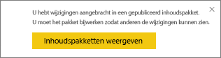
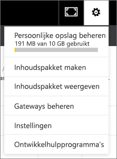

# Organisatie-inhoudspakketten beheren, bijwerken en verwijderen
> [!NOTE]
> U kunt in de preview voor de nieuwe werkruimte-ervaring geen organisatie-inhoudspakketten maken of installeren. Het is nu een goed moment om uw inhoudspakketten te upgraden naar apps, als u dat nog niet hebt gedaan. Informatie over [de nieuwe werkruimte-ervaring](service-create-the-new-workspaces.md).
> 

U kunt uw dashboards, rapporten, Excel-werkmappen en gegevenssets verpakken en met uw collega's delen als [organisatie-inhoudspakketten](service-organizational-content-pack-introduction.md). Uw collega's kunnen ze als zodanig gebruiken of ze kunnen hun eigen exemplaren maken.

Het maken van inhoudspakketten verschilt van het delen van dashboards of het samenwerken aan een dashboard in een groep. Lees [Samen aan dashboards en rapporten werken en deze delen?](service-how-to-collaborate-distribute-dashboards-reports.md) om te bepalen wat de beste optie voor uw situatie is.

U kunt alleen bepaalde taken voor organisatie-inhoudspakketten uitvoeren als u het inhoudspakket hebt gemaakt:

* Opnieuw publiceren.
* De toegang tot het inhoudspakket beperken of uitbreiden.
* De geplande vernieuwing instellen of wijzigen.
* Het inhoudspakket verwijderen.

## Een organisatie-inhoudspakket wijzigen en opnieuw publiceren
Als u wijzigingen aanbrengt in het oorspronkelijke inhoudspakket, dashboard, rapport of de oorspronkelijke Excel-werkmap, wordt u door Power BI gevraagd om opnieuw te publiceren. Daarnaast kun u als maker van het inhoudspakket alle opties bijwerken die u in het venster Inhoudspakket maken hebt geselecteerd toen u het oorspronkelijke inhoudspakket hebt gemaakt. 

## Opnieuw publiceren met nieuwe inhoud
Wanneer u een wijziging aanbrengt en deze opslaat in het dashboard dat u hebt opgenomen in een inhoudspakket, wordt u er door Power BI aan herinnerd het pakket bij te werken zodat anderen de wijziging ook kunnen zien. Bijvoorbeeld als u een nieuwe tegel vastmaakt of alleen de naam van het dashboard wijzigt.

1. Selecteer **Inhoudspakketten weergeven** in het bericht.
   
   
2. Of selecteer in de rechterbovenhoek het tandwielpictogram  en vervolgens **Inhoudspakketten weergeven**.
   
   
   
   Let op het waarschuwingspictogram .  Dit wordt weergegeven om u te laten weten dat u het inhoudspakket op een bepaalde manier hebt gewijzigd en het pakket niet meer overeenkomt met het inhoudspakket dat u hebt gepubliceerd.
3. Selecteer **Bewerken**.  
4. Breng in het venster **Inhoudspakket bijwerken** de eventuele benodigde wijzigingen aan en selecteer **Bijwerken**. Het bericht **Geslaagd** wordt weergegeven.
   
   * Voor groepsleden die het inhoudspakket niet hebben aangepast, wordt de update automatisch toegepast.
   * Groepsleden die het inhoudspakket hebben aangepast, ontvangen een melding dat er een nieuwe versie beschikbaar is.  Zij kunnen naar AppSource gaan en het bijgewerkte inhoudspakket ophalen zonder dat hun gepersonaliseerde versie verloren gaat.  Ze hebben nu twee versies: de gepersonaliseerde versie en het bijgewerkte inhoudspakket.  De gepersonaliseerde versie bevat geen tegels meer van het oorspronkelijke inhoudspakket.  Maar tegels die zijn vastgemaakt vanuit andere rapporten worden nog wel weergegeven. Als de eigenaar van het inhoudspakket echter de gegevensset verwijdert waarop het inhoudspakket is gebaseerd, wordt het hele rapport verwijderd.  

## De doelgroep bijwerken: de toegang beperken of uitbreiden
Een andere aanpassing die beschikbaar is voor makers van inhoudspakketten, is het uitbreiden en beperken van toegang tot het inhoudspakket.  Misschien hebt u een inhoudspakket gepubliceerd voor een brede doelgroep en u hebt besloten om de toegang te beperken tot een kleinere groep.  

1. Selecteer het tandwielpictogram  en kies **Inhoudspakketten weergeven**.
2. Selecteer **Bewerken**. 
3. Breng in het venster **Inhoudspakket bijwerken** de eventuele benodigde wijzigingen aan en selecteer **Bijwerken**. Verwijder bijvoorbeeld de oorspronkelijke distributiegroep in het veld **Specifieke groepen** en vervang deze door een andere distributiegroep (met minder leden).
   
   Het bericht Geslaagd wordt weergegeven.
   
   Voor collega's die geen deel uitmaken van de nieuwe alias:
   
   * Wanneer groepsleden het inhoudspakket niet hebben aangepast, beschikken zij niet meer over het bijbehorende dashboard en de bijbehorende rapporten en wordt het inhoudspakket niet weergegeven in het navigatiedeelvenster.
   * Wanneer groepsleden het inhoudspakket wel hebben aangepast en zij het aangepaste dashboard weer openen, zijn alle tegels van het oorspronkelijke inhoudspakket verdwenen.  Maar tegels die zijn vastgemaakt vanuit andere rapporten worden nog wel weergegeven. De oorspronkelijke rapporten en de gegevensset voor het inhoudspakket zijn niet meer beschikbaar en het inhoudspakket wordt niet weer gegeven in het navigatiedeelvenster.   

## Een organisatie-inhoudspakket vernieuwen
Als maker van het inhoudspakket kunt u [een vernieuwingsschema instellen voor de gegevenssets](refresh-data.md).  Wanneer u het inhoudspakket maakt en uploadt, wordt het vernieuwingsschema ook met de gegevenssets geüpload. Als u het vernieuwingsschema wijzigt, moet u het inhoudspakket opnieuw publiceren (zie hierboven).

## Een organisatie-inhoudspakket van AppSource verwijderen
U kunt een inhoudspakket van AppSource alleen verwijderen als u het pakket zelf hebt gemaakt. Als u een organisatie-inhoudspakket hebt gemaakt in een app-werkruimte en vervolgens die werkruimte besluit te verwijderen, moet u eerst het inhoudspakket verwijderen. Als u de werkruimte verwijdert zonder eerst het inhoudspakket te verwijderen, raakt u alle toegang tot die inhoudspakketten kwijt en moet u contact opnemen met Microsoft Ondersteuning voor hulp. 

> [!TIP]
> U kunt [uw verbinding met een inhoudspakket verwijderen](service-organizational-content-pack-disconnect.md) dat u niet hebt gemaakt. Hiermee wordt het inhoudspakket van AppSource niet verwijderd.
> 
> 

1. Als u een inhoudspakket van AppSource wilt verwijderen, gaat u naar de app-werkruimte waar u het inhoudspakket hebt gemaakt, selecteert u het tandwielpictogram  en kiest u **Inhoudspakketten weergeven**.
2. Selecteer **Verwijderen \> Verwijderen**. 
   
   * Als groepsleden het inhoudspakket niet hebben aangepast, worden het bijbehorende dashboard en de bijbehorende rapporten automatisch verwijderd. Ze zijn niet meer beschikbaar en het inhoudspakket wordt niet weergegeven in het navigatiedeelvenster.
   * Wanneer groepsleden het inhoudspakket wel hebben aangepast en zij het aangepaste dashboard weer openen, zijn alle tegels van het oorspronkelijke inhoudspakket verdwenen.  Maar tegels die zijn vastgemaakt vanuit andere rapporten worden nog wel weergegeven. De oorspronkelijke rapporten en de gegevensset voor het inhoudspakket zijn niet meer beschikbaar en het inhoudspakket wordt niet weergegeven in het navigatiedeelvenster.   

## Volgende stappen
* [Inleiding tot organisatie-inhoudspakketten](service-organizational-content-pack-introduction.md)
* [Een app maken en distribueren in Power BI](consumer/end-user-create-apps.md) 
* Nog vragen? [Misschien dat de Power BI-community het antwoord weet](http://community.powerbi.com/)

