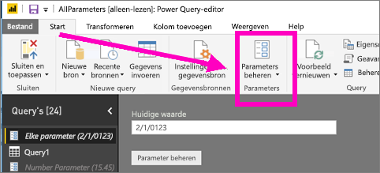
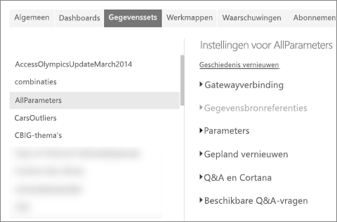
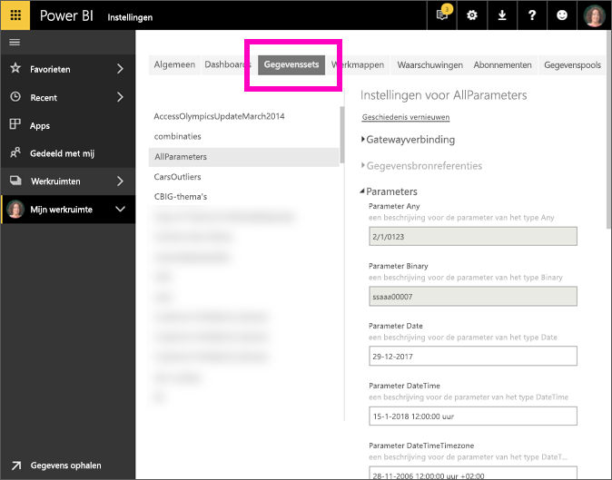

# Wat is een queryparameter?
Queryparameters worden door rapportmakers aan Power BI Desktop toegevoegd. Ze kunnen aan de hand van parameters gedeelten van rapporten maken die afhankelijk zijn van een of meerdere parameter*waarden*. Een maker van een rapport kan bijvoorbeeld een parameter maken waarmee de gegevens worden beperkt tot een land of regio of een parameter maken waarmee acceptabele indelingen worden opgegeven voor bijvoorbeeld datum-, tijd- en tekstvelden.

## Parameters controleren en bewerken in Power BI-service

Nadat de parameters zijn gedefinieerd in Desktop, worden de parameterinstellingen bij het [publiceren van het rapport naar Power BI-service](desktop-upload-desktop-files.md) meegenomen in het rapport. Sommige parameterinstellingen kunnen worden gecontroleerd en bewerkt in Power BI-service, niet de parameters die de beschikbare gegevens beperken, maar de parameters waarmee acceptabele waarden worden gedefinieerd en beschreven.

1. Selecteer in Power BI-service het tandwielpictogram  om **Instellingen** te openen.

2. Selecteer het tabblad **Gegevenssets** en markeer een gegevensset in de lijst. 
    
    

3. Vouw **Parameters** uit.  Als de geselecteerde gegevensset geen parameters bevat, verschijnt een bericht met een koppeling naar Meer informatie over queryparameters. Als de gegevensset wel parameters bevat, worden deze weergegeven wanneer u **Parameters** uitvouwt. 

    

    Controleer de parameterinstellingen en breng eventueel wijzigingen aan. Grijze velden kunnen niet worden bewerkt. 

## Volgende stappen
Een ad-hocmanier om eenvoudige parameters toe te voegen, is [de URL wijzigen](service-url-filters.md).