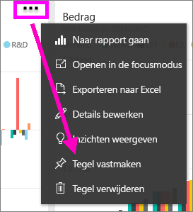
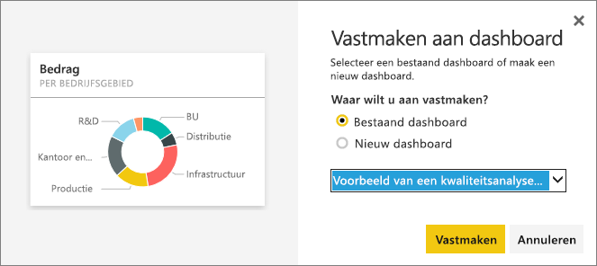
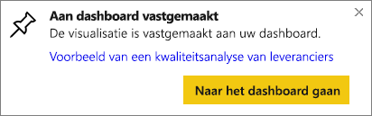

# Een tegel uit een bepaald dashboard vastmaken aan een ander dashboard
U kunt onder meer een nieuwe [dashboardtegel](service-dashboard-tiles.md) toevoegen door een tegel van een ander dashboard te kopiëren. Als u op een dergelijke tegel klikt, biedt deze een koppeling terug naar de locatie waar de tegel is gemaakt, in Q&A of een rapport. 

> [!NOTE]
> U kunt geen tegels van gedeelde dashboards vastmaken.

## Een tegel aan een ander dashboard vastmaken
1. [Gegevens ophalen](service-get-data.md). In dit voorbeeld gebruiken we [het voorbeeld van een IT-uitgavenanalyse](sample-it-spend.md).
2. Open een [dashboard](service-dashboards.md).
3. Beweeg de cursor over de tegel die u wilt vastmaken, selecteer de weglatingstekens (...) en kies **Tegel vastmaken**.  
   
   
4. Maak de tegel vast aan een bestaand dashboard of aan een nieuw dashboard. 
   
   * **Bestaand dashboard**: selecteer de naam van het dashboard in de vervolgkeuzelijst.
   * **Nieuw dashboard**: typ de naam van het nieuwe dashboard.
   
   
5. Selecteer **Vastmaken**.
   Een bericht (in de rechterbovenhoek) laat u weten dat de visualisatie als tegel aan het geselecteerde dashboard is toegevoegd.
   
   
6. Selecteer **Naar dashboard gaan** om de vastgemaakte tegel te bekijken. Daar kunt u de vastgemaakte visualisatie [een andere naam geven, vergroten of verkleinen, koppelen en verplaatsen](service-dashboard-edit-tile.md).

## Volgende stappen
[Tegels in Power BI](service-dashboard-tiles.md)  
[Dashboards in Power BI](service-dashboards.md)  
Hebt u nog vragen? [Misschien dat de Power BI-community het antwoord weet](http://community.powerbi.com/)

