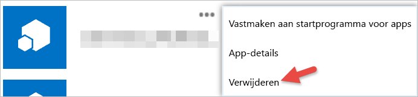

# Aan de slag met apps van derden
Met Power BI kunt u een app gebruiken die is gemaakt door een ander bedrijf of individu dan Microsoft. U kunt bijvoorbeeld een app van derden gebruiken die Power BI-tegels integreert in een op maat gebouwde webtoepassing. Wanneer u een app van derden gebruikt, wordt u gevraagd om die toepassing bepaalde machtigingen te verlenen voor uw Power BI-account en resources. Het is belangrijk dat u alleen machtigingen verleent aan toepassingen die u kent en vertrouwt. Machtigingen voor een toepassing kunnen op elk gewenst moment worden ingetrokken. Zie [Machtigingen van apps van derden intrekken](#revoke).

Dit zijn de typen toegang die een toepassing kan aanvragen.

## App-machtigingen voor Power BI
* **Alle dashboards weergeven**
  
  * Deze machtiging biedt een toepassing de mogelijkheid om alle dashboards weer te geven waartoe u toegang hebt. Dit omvat dashboards die van u zijn, die u hebt verkregen vanuit inhoudspakketten en die met u zijn gedeeld en in groepen staan waarvan u deel uitmaakt. De toepassing kan geen wijzigingen aanbrengen in het dashboard. Deze machtiging kan onder andere worden gebruikt door een toepassing om uw dashboardinhoud in te sluiten in de ervaringen.
* **Alle rapporten weergeven**
  
  * Deze machtiging biedt een toepassing de mogelijkheid om alle rapporten weer te geven waartoe u toegang hebt. Dit zijn rapporten die van u zijn, die u hebt verkregen vanuit inhoudspakketten en die in groepen staan waarvan u deel uitmaakt. Voor het weergeven van het rapport moet de toepassing ook toegang hebben tot de gegevens daarin. De toepassing kan geen wijzigingen aanbrengen in de rapporten zelf. Deze machtiging kan onder andere worden gebruikt door een toepassing om uw rapportinhoud in te sluiten in de ervaringen.
* **Alle gegevenssets weergeven**
  
  * Deze machtiging biedt een toepassing de mogelijkheid om een lijst te maken van alle gegevenssets waartoe u toegang hebt. Dit zijn gegevenssets die van u zijn, die u hebt verkregen vanuit inhoudspakketten en die in groepen staan waarvan u deel uitmaakt. Een toepassing kan niet alleen de namen van alle gegevenssets zien, maar ook de structuur ervan, zoals tabel- en kolomnamen. Deze machtiging verleent rechten om de gegevens in een gegevensset te lezen. De machtiging verleent de toepassing geen rechten om wijzigingen toe te voegen aan of aan te brengen in een gegevensset.
* **Alle gegevenssets lezen en schrijven**
  
  * Deze machtiging biedt een toepassing de mogelijkheid om een lijst te maken van alle gegevenssets waartoe u toegang hebt. Dit zijn gegevenssets die van u zijn, die u hebt verkregen vanuit inhoudspakketten en die in groepen staan waarvan u deel uitmaakt. Een toepassing kan niet alleen de namen van alle gegevenssets zien, maar ook de structuur ervan, zoals tabel- en kolomnamen. Deze machtiging verleent rechten om de gegevens in een gegevensset te lezen en schrijven. De toepassing kan ook nieuwe gegevenssets maken of wijzigingen aanbrengen in bestaande gegevenssets. Dit wordt voornamelijk gebruikt door een toepassing om gegevens rechtstreeks naar Power BI te verzenden.
* **Groepen van de gebruiker weergeven**
  
  * Deze machtiging biedt de toepassing de mogelijkheid om een lijst te maken van alle groepen waarvan u lid bent. De toepassing kan deze machtiging, samen met enkele andere genoemde machtigingen, gebruiken om inhoud voor die specifieke groep weer te geven of bij te werken. De toepassing kan geen wijzigingen aanbrengen in de groep zelf.

<a name="revoke"/>

## Machtigingen van apps van derden intrekken
U kunt machtigingen voor een app van derden intrekken door naar de site Mijn Apps van Office 365 te gaan.

Op de site **Mijn apps van Office 365** kunt u als volgt machtigingen van derden intrekken:

1. Ga naar de site [Mijn Apps van Office 365](https://portal.office.com/myapps).
2. Zoek de app van derden op de pagina **Mijn apps** op.
3. Beweeg de muisaanwijzer over de app-tegel, klik op de knop **(...)**  en klik op **Verwijderen**.
   
   

