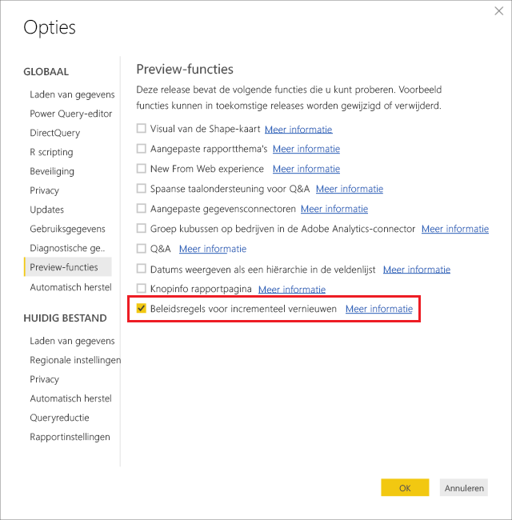
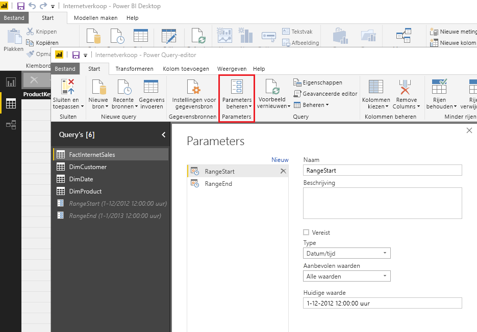
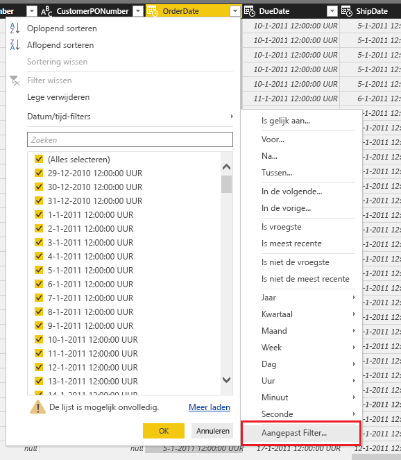
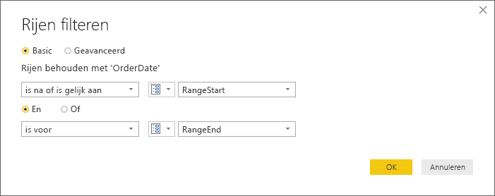
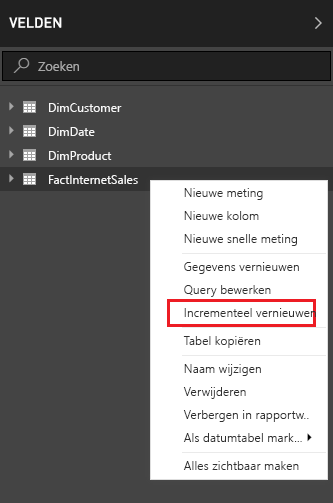
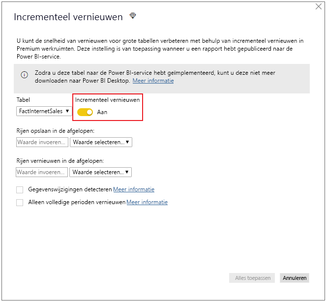
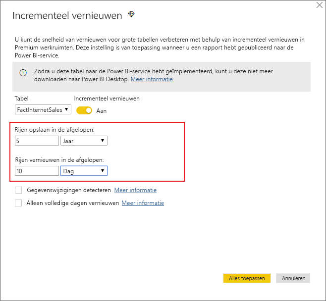
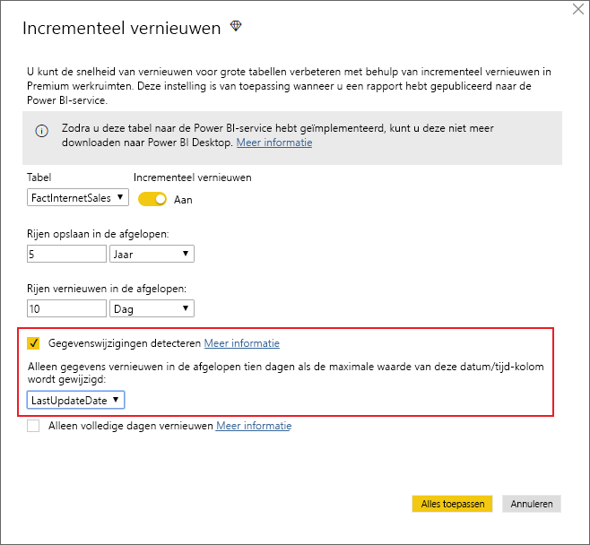
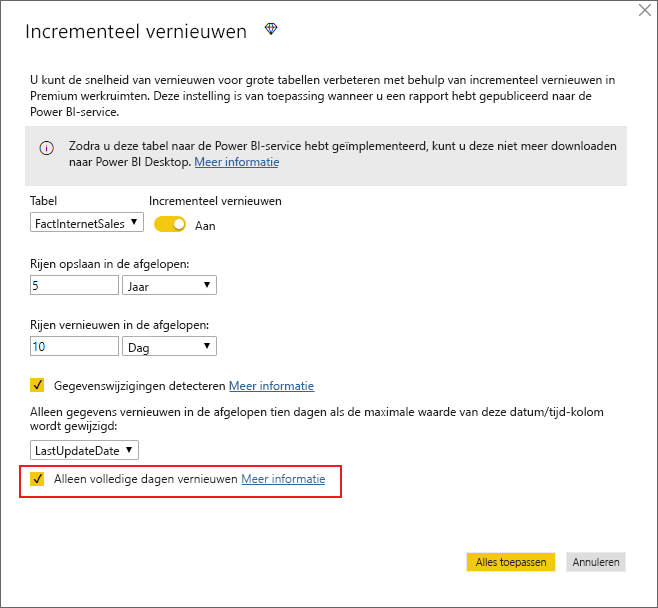
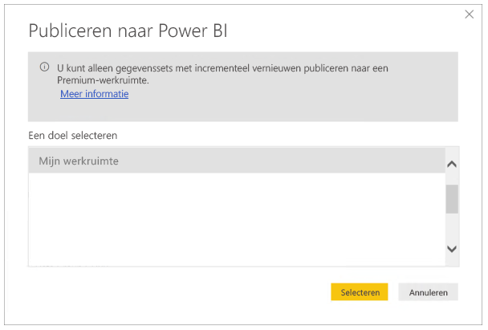

# <a name="incremental-refresh-in-power-bi-premium"></a>Incrementeel vernieuwen in Power BI Premium

Incrementele vernieuwing maakt zeer grote gegevenssets in de Power BI Premium-service mogelijk, met de volgende voordelen:

- **Vernieuwingen worden sneller uitgevoerd.** Alleen gegevens die zijn gewijzigd, hoeven te worden vernieuwd. Vernieuw bijvoorbeeld alleen de laatste vijf dagen van een gegevensset van tien jaar.

- **Vernieuwingen zijn betrouwbaarder.** Het is bijvoorbeeld niet nodig om langdurige verbindingen met vluchtige bronsystemen te onderhouden.

- **Er worden minder resources gebruikt.** Als er minder gegevens zijn om te vernieuwen, wordt het algemene verbruik van geheugen en andere resources verlaagd.

## <a name="how-to-use-incremental-refresh"></a>Incrementeel vernieuwen leren gebruiken

Beleid voor incrementele vernieuwing wordt gedefinieerd in Power BI Desktop en toegepast zodra het beleid naar de Power BI-service gepubliceerd.

Begin door incrementele vernieuwingen in de preview-functies in te schakelen.



### <a name="filter-large-datasets-in-power-bi-desktop"></a>Grote gegevenssets filteren in Power BI Desktop

Grote gegevenssets met potentieel miljarden rijen passen mogelijk niet in Power BI Desktop omdat dit meestal is beperkt door de resources die beschikbaar zijn op de desktop-pc van de gebruiker. Dergelijke gegevenssets worden daarom doorgaans gefilterd tijdens de import zodat ze in Power BI Desktop passen. Dit is altijd het geval, of u nu wel of geen incrementele vernieuwing gebruikt.

#### <a name="rangestart-and-rangeend-parameters"></a>De parameters RangeStart en RangeEnd

Als u gebruik wilt maken van incrementele vernieuwing in de Power BI-service, moet u filteren met behulp van de datum-/tijd-parameters van Power Query in combinatie met de gereserveerde, hoofdlettergevoelige namen **RangeStart** en **RangeEnd**.

Selecteer **Parameters beheren** in de Power Query Editor om parameters met standaardwaarden te definiëren.



Wanneer u de parameters hebt gedefinieerd, kunt u het filter toepassen door de menuoptie **Aangepast filter** voor een kolom te selecteren.



Zorg ervoor dat rijen worden gefilterd waarbij de kolomwaarde *na of gelijk is aan* **RangeStart** en *voor* **RangeEnd**.



> [!TIP]
> Hoewel het gegevenstype van de parameters datum/tijd moet zijn, is het wel mogelijk om ze te converteren zodat ze voldoen aan de vereisten van de gegevensbron. De volgende Power Query-functie converteert bijvoorbeeld een datum/tijd-waarde zodat deze overeenkomt met een surrogaatsleutel voor gehele getallen in de indeling *jjjjmmdd*, die vaker wordt gebruikt voor gegevenswarehouses. De functie kan worden aangeroepen door de filterstap.
>
> `(x as datetime) => Date.Year(x)*10000 + Date.Month(x)*100 + Date.Day(x)`

Selecteer **Sluiten en toepassen** in de Power Query Editor. U moet een subset van de gegevensset in Power BI Desktop hebben.

> [!NOTE]
> Na publicatie worden de parameterwaarden automatisch door de Power BI-service overschreven. U hoeft ze niet in te stellen bij de gegevenssetinstellingen.

### <a name="define-the-refresh-policy"></a>Het vernieuwingsbeleid definiëren

Incrementele vernieuwing is beschikbaar in het contextmenu voor tabellen, met uitzondering van liveverbindingsmodellen.



#### <a name="incremental-refresh-dialog"></a>Het dialoogvenster Incrementeel vernieuwen

Het dialoogvenster Incrementele vernieuwing wordt weergegeven. Gebruik de wisselknop om het dialoogvenster in te schakelen.



> [!NOTE]
> Als de Power Query-expressie voor de tabel niet naar de parameters met gereserveerde namen verwijst, wordt de wisselknop uitgeschakeld.

In de koptekst wordt het volgende uitgelegd:

-   Incrementele vernieuwing wordt alleen ondersteund voor werkruimten met Premium-capaciteit. Vernieuwingsbeleid wordt gedefinieerd in Power BI Desktop; het wordt toegepast door vernieuwingsbewerkingen in de service.

-   Als u het PBIX-bestand met een beleid voor incrementele vernieuwing uit de Power BI-service kunt downloaden, wordt deze niet geopend in Power BI Desktop. Het is binnenkort helemaal niet meer mogelijk om dit bestand te downloaden. Dit wordt mogelijk in de toekomst wel ondersteund, maar vergeet niet dat deze gegevenssets zo groot kunnen worden dat het niet praktisch is om deze te downloaden en op een gewone desktop-pc te openen.

#### <a name="refresh-ranges"></a>Bereiken vernieuwen

Het volgende voorbeeld definieert een vernieuwingsbeleid voor het opslaan van in totaal vijf jaar aan gegevens, met incrementele vernieuwing van tien dagen aan gegevens. Als de gegevensset dagelijks wordt vernieuwd, wordt het volgende uitgevoerd voor elke vernieuwingsbewerking.

-   Voeg een nieuwe dag aan gegevens toe.

-   Vernieuw tien dagen tot aan de huidige datum.

-   Verwijder kalenderjaren die ouder zijn dan vijf jaar voorafgaand aan de huidige datum. Als de huidige datum bijvoorbeeld 1 januari 2019 is, wordt het jaar 2013 verwijderd.

De eerste vernieuwing in de Power BI-service kan langer duren omdat alle vijf jaren moeten worden geïmporteerd. Daarop volgende vernieuwingen kunnen in een fractie van die tijd worden voltooid.



**Definitie van deze bereiken is wellicht alles wat u nodig hebt. In dat geval kunt u meteen doorgaan naar de onderstaande publicatiestap. De extra vervolgkeuzelijsten zijn bedoeld voor geavanceerde functies.**

#### <a name="detect-data-changes"></a>Gegevenswijzigingen detecteren

Incrementele vernieuwing van tien dagen is natuurlijk veel efficiënter dan vernieuwing van vijf jaar. Maar het kan wellicht nog beter. Als u het selectievakje **Gegevenswijzigingen detecteren** inschakelt, kunt u een datum/tijd-kolom selecteren voor de identificatie en die alleen wordt vernieuwd als er gegevens zijn gewijzigd. Hierbij wordt ervan uitgegaan dat een dergelijke kolom in het bronsysteem bestaat, wat gebruikelijk is voor controledoeleinden. De maximumwaarde van deze kolom wordt geëvalueerd voor elke periode in het incrementele bereik. Als deze nog niet is gewijzigd sinds de laatste vernieuwing, hoeft u de periode niet te vernieuwen. In het voorbeeld kan hiermee het aantal dagen dat wordt vernieuwd nog eens verder worden beperkt van tien tot misschien twee dagen.



> [!TIP]
> Voor het huidige ontwerp moet de kolom die gegevenswijzigingen detecteert persistent zijn en in het cachegeheugen worden geplaatst. U kunt overwegen een van de volgende technieken te gebruiken om de kardinaliteit en het geheugenverbruik te beperken.
>
> Behoud alleen de maximumwaarde van deze kolom op het moment van de vernieuwing, bijvoorbeeld met behulp van een Power Query-functie.
>
> Beperk de nauwkeurigheid naar een niveau dat acceptabel is gezien uw vereisten voor de vernieuwingsfrequentie.
>
> We willen op een later tijdstip de definitie van aangepaste query's voor gegevenswijzigingdetectie toestaan. Dit kan worden gebruikt om te voorkomen dat de kolomwaarde helemaal wordt behouden.

#### <a name="only-refresh-complete-periods"></a>Alleen volledige perioden vernieuwen

Stel dat u hebt gepland dat vernieuwing elke ochtend om 4:00 uur wordt uitgevoerd. Als gegevens in die vier uur in het bronsysteem worden weergegeven, wilt u mogelijk dat hier geen rekening mee wordt gehouden. Some zakelijke metrische gegevens, zoals vaten per dag in de olie- en gasindustrie, zijn niet logisch bij gedeeltelijke dagen.

Een ander voorbeeld is het vernieuwen van gegevens in een financieel systeem waar gegevens voor de vorige maand op de 12e kalenderdag van de maand worden goedgekeurd. U kunt het incrementele bereik instellen op 1 maand en de vernieuwing plannen op de twaalfde dag van de maand. Als u deze optie hebt ingeschakeld, worden bijvoorbeeld de gegevens van januari op 12 februari vernieuwd.



> [!NOTE]
> Vernieuwingsbewerkingen in de service worden in UTC-tijd uitgevoerd. Dit kan invloed hebben op de ingangsdatum en op volledige perioden. We zullen de mogelijkheid om de ingangsdatum voor een vernieuwingsbewerking binnenkort toevoegen.

## <a name="publish-to-the-service"></a>Publiceren naar de service

Aangezien incrementele vernieuwing alleen een Premium-functie is, kunt u in het dialoogvenster Publiceren alleen werkruimten selecteren bij de Premium-capaciteit.



U kunt het model nu vernieuwen. De eerste vernieuwing kan langer duren omdat de historische gegevens moeten worden geïmporteerd. Daarop volgende vernieuwingen kunnen veel sneller worden uitgevoerd omdat hiervoor incrementele vernieuwing wordt gebruikt.

## <a name="query-timeouts"></a>Time-outs voor query’s

In het artikel [Problemen met vernieuwing oplossen](https://docs.microsoft.com/power-bi/refresh-troubleshooting-refresh-scenarios) wordt uitgelegd dat vernieuwingsbewerkingen in de Power BI-service onderhevig zijn aan time-outs. Voor query's kan ook de standaardtime-out voor de gegevensbron worden ingesteld. De meeste relationele bronnen staan het overschrijven van time-outs in de M-expressie toe. De onderstaande expressie gebruikt bijvoorbeeld de [SQL Server-functie voor toegang tot gegevens](https://msdn.microsoft.com/query-bi/m/sql-database) om dit op twee uur in te stellen. Elke periode die door de beleidsbereiken wordt gedefinieerd, stuurt een query in waarbij rekening wordt gehouden met de time-outinstelling voor de opdracht.

```
let
    Source = Sql.Database("myserver.database.windows.net", "AdventureWorks", [CommandTimeout=#duration(0, 2, 0, 0)]),
    dbo_Fact = Source{[Schema="dbo",Item="FactInternetSales"]}[Data],
    #"Filtered Rows" = Table.SelectRows(dbo_Fact, each [OrderDate] >= RangeStart and [OrderDate] < RangeEnd)
in
    #"Filtered Rows"
```
