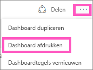
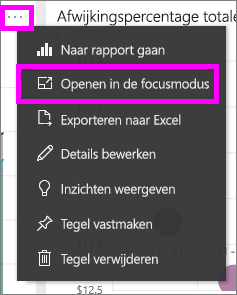
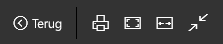
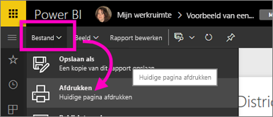

# Afdrukken via de Power BI-service
U kunt een volledig dashboard, een dashboardtegel, een rapportpagina of een rapportvisual afdrukken via de Power BI-service. Rapporten kunnen slechts pagina voor pagina worden afgedrukt. U kunt niet het hele rapport in een keer afdrukken.

> [!NOTE]
> Afdrukken is alleen beschikbaar in de Power BI-service, niet in Power BI Desktop.
> 
> 

Kijk hoe Amanda afdrukt vanuit haar dashboard en rapport. Volg vervolgens de stapsgewijze instructies onder de video om het zelf te proberen.

<iframe width="560" height="315" src="https://www.youtube.com/embed/jtlLGRKBvXY" frameborder="0" allowfullscreen></iframe>

## Een dashboard afdrukken
1. Open het dashboard dat u wilt afdrukken.
2. Selecteer in de rechterbovenhoek de weglatingstekens (...) en kies **Dashboard afdrukken**.
   
    
3. Het venster Afdrukken voor uw browser wordt geopend. Kies de instellingen en de afdrukbestemming en selecteer **Afdrukken**.
   
   > [!NOTE]
   > Welk afdrukvenster wordt weergegeven, is afhankelijk van de browser die u gebruikt.
   > 
   
    

## Een dashboardtegel afdrukken
1. [Open de tegel in de focusmodus](service-focus-mode.md) door het weglatingsteken te selecteren en het focuspictogram  te kiezen.
   
    
2. Open de tegel in de [modus Volledig scherm](service-fullscreen-mode.md) door in de navigatiebalk aan de bovenkant het pictogram voor de modus Volledig scherm  te selecteren.
3. Beweeg de muisaanwijzer over de tegel om het menu Opties weer te geven.
   
    
4. Selecteer het pictogram voor afdrukken .     
   
   > [!NOTE]
   > Welk afdrukvenster wordt weergegeven, is afhankelijk van de browser die u gebruikt.
   > 
   > 

## Een rapportpagina afdrukken
Rapporten kunnen alleen pagina voor pagina worden afgedrukt.

1. Open het rapport in de lees- of bewerkingsweergave.
2. Selecteer **Bestand** > **Afdrukken** om de huidige rapportpagina af te drukken.
   
    
3. Het venster Afdrukken voor uw browser wordt geopend.
   
   > [!NOTE]
   > Welk afdrukvenster wordt weergegeven, is afhankelijk van de browser die u gebruikt.
   > 
   > 

## Een rapportvisual afdrukken
1. [Open de visual in de focusmodus](service-focus-mode.md) door de muisaanwijzer over de tegel te bewegen en in de rechterbovenhoek het focuspictogram  te selecteren.
2. Volg stap 2 en 3 hierboven onder *Een rapportpagina afdrukken*.

## Overwegingen en probleemoplossing
* V: Ik kan de knop **Afdrukken** niet vinden.    
* A: Als u Power BI Desktop gebruikt, wordt afdrukken niet ondersteund.  Afdrukken werkt alleen in de Power BI-service.
* V: Ik kan niet alle rapportpagina's in een keer afdrukken.    
* A: Dat klopt. Rapportpagina's kunnen alleen pagina voor pagina worden afgedrukt.
* V: Ik kan niet afdrukken naar PDF.    
* A: Deze optie wordt alleen weergegeven als u het PDF-stuurprogramma al hebt geconfigureerd in uw browser.    
* V: Wat wordt weergegeven wanneer ik **Afdrukken** selecteer, komt niet overeen met wat ik hier zie.    
* A: De afdrukschermen kunnen per browser en softwareversie verschillen.
* V: Mijn afdruk is niet goed geschaald.  Mijn dashboard past niet op de pagina. Andere vragen over schalen en de afdrukstand.    
* A: We kunnen niet garanderen dat de afdruk exact hetzelfde is als de weergave in de Power BI-service. Elementen als het schalen, de marges, de visuele details, de afdrukstand en de grootte worden niet bepaald door Power BI. Raadpleeg de documentatie voor uw specifieke browser voor hulp bij dergelijke problemen.      

## Volgende stappen
[Dashboards en rapporten delen met collega's en anderen](service-share-dashboards.md)

Nog vragen? [Misschien dat de Power BI-community het antwoord weet](http://community.powerbi.com/)

