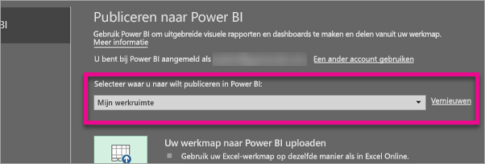
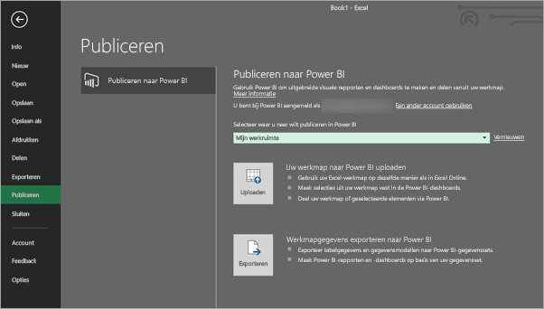
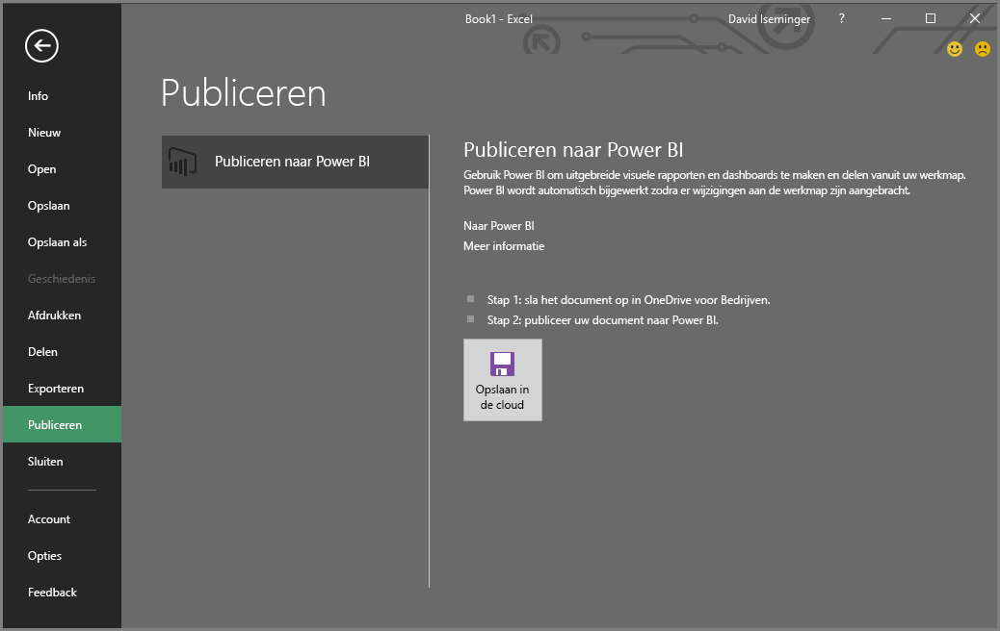
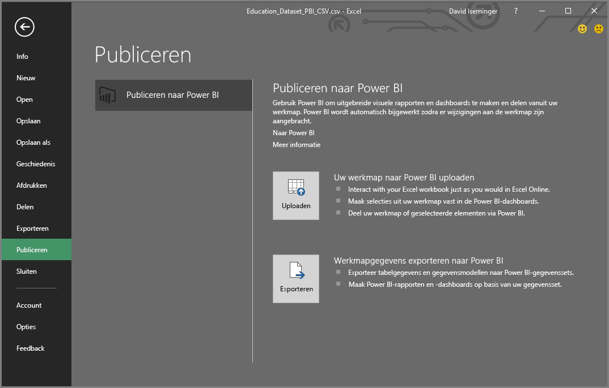
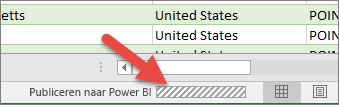

# Vanuit Excel 2016 publiceren naar Power BI
U kunt uw Excel-werkmappen met Excel 2016 direct naar uw [Power BI](https://powerbi.microsoft.com)-site publiceren, waar u interactieve rapporten en dashboards op basis van uw werkmapgegevens kunt maken. Vervolgens kunt u uw inzichten delen met anderen in uw organisatie.

Voordat we verder gaan, zijn er nog een paar dingen die we in gedachten moeten houden:

* Voordat u met Power BI kunt publiceren, moet uw werkmap worden opgeslagen op OneDrive voor bedrijven.
* Het account waarmee u zich aanmeldt bij Office, OneDrive voor bedrijven en Power BI moet hetzelfde account zijn.
* U kunt een lege werkmap of een werkmap zonder door Power BI ondersteunde inhoud niet publiceren.
* U kunt geen versleutelde of met wachtwoord beveiligde werkmappen of werkmappen met Information Protection-beheer publiceren.
* Publiceren naar Power BI vereist dat moderne verificatie ingeschakeld is (standaard). Indien uitgeschakeld, is de optie Publiceren niet beschikbaar in het menu Bestand.

## Uw Excel-werkmap publiceren
Selecteer in Excel **Bestand** > **Publiceren**.

### Lokaal bestand publiceren
Vanaf de update van februari 2017 ondersteunt Excel 2016 het publiceren van lokale Excel-bestanden. Ze hoeft niet te worden opgeslagen in OneDrive voor bedrijven of SharePoint Online.

> [!IMPORTANT]
> Alleen Excel 2016 met een Office 365-abonnement heeft ervaring met het publiceren van lokale bestanden. In de zelfstandige installatie van Excel 2016 moet voor Publiceren de Excel-werkmap nog worden opgeslagen in OneDrive voor bedrijven of SharePoint Online.
> 
> 

Wanneer u **Publiceren** selecteert, kunt u de werkruimte selecteren die u wilt publiceren. Dit kan uw persoonlijke werkruimte of groepswerkruimte zijn.

Hier krijgt u twee opties voor het ophalen van uw werkmap in Power BI.

Na de publicatie wordt deze opgeslagen als een kopie in Power BI, los van het lokale bestand. Als u het bestand in Power BI wilt bijwerken, moet u de bijgewerkte versie opnieuw publiceren. U kunt de gegevens vernieuwen en een geplande vernieuwing instellen voor de werkmap of de gegevensset in Power BI.

### Publiceren van zelfstandige Excel-versie
Als uw werkmap nog niet op OneDrive is opgeslagen, moet u deze hier eerst opslaan. Selecteer Opslaan naar Cloud en kies een locatie in OneDrive voor bedrijven.

Zodra uw werkmap is opgeslagen op OneDrive, krijgt u wanneer u **Publiceren** selecteert, twee opties voor het ophalen van uw werkmap in Power BI.

#### Uw werkmap naar Power BI uploaden
Als u deze optie kiest, verschijnt uw werkmap in Power BI net als in Excel Online. Maar, anders dan in Excel Online, hebt u hier een aantal handige functies waarmee u elementen uit uw werkbladen direct aan uw dashboards kunt vastmaken.

U kunt uw werkmap niet bewerken in Power BI maar als u wijzigingen wilt aanbrengen, kunt u **Bewerken** selecteren en uw werkmap vervolgens bewerken in Excel Online of openen in Excel op uw computer. Eventuele wijzigingen worden opgeslagen in de werkmap op OneDrive.

Bij uploaden wordt geen gegevensset gemaakt in Power BI. Uw werkmap wordt weergegeven in rapporten, in het navigatiedeelvenster van uw werkruimte. Werkmappen die naar Power BI zijn geüpload, hebben een speciaal Excel-pictogram om ze te identificeren als Excel-werkmappen die zijn geüpload.

Selecteer deze optie als er alleen gegevens in de werkbladen staan of als u draaitabellen en grafieken hebt die u wilt weergeven in Power BI.
Uploaden van Publiceren naar Power BI in Excel werkt bijna hetzelfde als Gegevens ophalen > Bestand > OneDrive voor bedrijven > Verbinding maken, Beheren en Excel weergeven in Power BI vanuit Power BI in uw browser.

#### Werkmapgegevens exporteren naar Power BI
Als u deze optie kiest, worden alle ondersteunde gegevens in tabellen en/of een gegevensmodel geëxporteerd naar een nieuwe gegevensset in Power BI. Als u Power View-werkbladen hebt, worden deze opnieuw gemaakt in Power BI als rapporten.

U kunt uw werkmap blijven bewerken. Wanneer uw wijzigingen worden opgeslagen, moeten ze worden gesynchroniseerd met de gegevensset in Power BI, meestal binnen een uur. Als u sneller resultaat nodig hebt, kunt u alleen opnieuw Publiceren selecteren en uw wijzigingen worden direct geëxporteerd. Alle visuele elementen in uw rapporten en dashboards worden ook bijgewerkt.

Kies deze optie als u gegevens ophalen en transformeren of Power Pivot hebt gebruikt om gegevens te laden in een gegevensmodel, of als uw werkmap Power View-bladen bevat met visualisaties die u wilt weergeven in Power BI.

Exporteren van Publiceren naar Power BI in Excel werkt bijna hetzelfde als Gegevens ophalen > Bestand > OneDrive voor bedrijven > Excel-gegevens exporteren naar Power BI vanuit Power BI in uw browser.

## Publiceren
Wanneer u een van beide opties kiest, wordt Excel bij Power BI met uw huidige account aangemeld en wordt uw werkboek op uw Power BI-site gepubliceerd. Let op de statusbalk in Excel. Deze laat zien hoe het gaat.

Als u klaar bent, kunt u naar Power BI rechts van Excel gaan.

## Volgende stappen
[Excel-gegevens in Power BI](service-excel-workbook-files.md)  
Nog vragen? [Misschien dat de Power BI-community het antwoord weet](http://community.powerbi.com/)

