# Publiceren op internet vanuit Power BI

Met Power BI **Publiceren op internet** kunt u eenvoudig interactieve Power BI-visualisaties op elk apparaat online invoegen, zoals blogberichten, websites, e-mailberichten of sociale media.

U kunt uw gepubliceerde visuele elementen ook eenvoudig bewerken, bijwerken en vernieuwen of het delen ervan opheffen.

> [!WARNING]
> Als u **Publiceren op internet** gebruikt, kan het rapport of het visuele element dat u publiceert door iedereen op het internet worden bekeken. Er wordt geen verificatie gebruikt bij het weergeven van deze rapporten. Gebruik Publiceren op internet alleen voor rapporten en gegevens die iedereen op het internet (niet-geverifieerde leden of openbaar) mag zien. Dit omvat gegevens op detailniveau die in uw rapporten zijn opgenomen. Zorg voordat u dit rapport publiceert dat u bevoegd bent gegevens en visualisaties openbaar te delen. Publiceer geen vertrouwelijke gegevens of eigendomsinformatie. Controleer bij twijfel vóór publicatie de beleidsregels van uw organisatie.

## Publiceren op internet gebruiken

**Publiceren op internet** is beschikbaar voor rapporten in uw persoonlijke werkruimte en in groepswerkruimten die u kunt bewerken.  U kunt Publiceren op internet niet gebruiken voor rapporten die met u zijn gedeeld of rapporten die afhankelijk zijn van gegevensbeveiliging op rijniveau. Zie de sectie **Beperkingen** hieronder voor een volledige lijst met aanvragen waarbij Publiceren op internet niet wordt ondersteund. Bekijk de **waarschuwing** eerder in dit artikel voordat u Publiceren op internet gebruikt.

U kunt zien hoe deze functie werkt in de volgende *korte video*. Volg daarna onderstaande stappen om het zelf te proberen.

<iframe width="560" height="315" src="https://www.youtube.com/embed/UF9QtqE7s4Y" frameborder="0" allowfullscreen></iframe>

In de volgende stappen wordt het gebruik van **Publiceren op internet** beschreven.

1. Selecteer **Bestand > Publiceren op internet** voor een rapport in uw werkruimte die u kunt bewerken.
   
   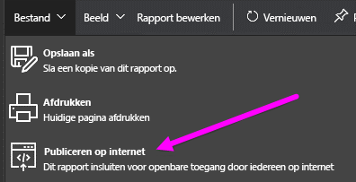

2. Neem in de inhoud van het dialoogvenster door en selecteer **Een invoegcode maken**, zoals aangegeven in het volgende dialoogvenster.
   
   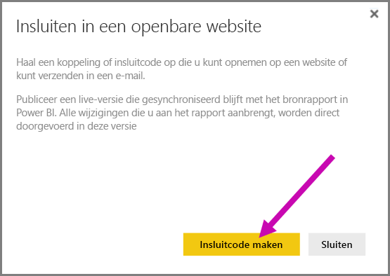

3. Bekijk de waarschuwing in het volgende dialoogvenster en bevestig dat de gegevens op een openbare website mogen worden geplaatst. Als dit het geval is, selecteert u **Publiceren**.
   
   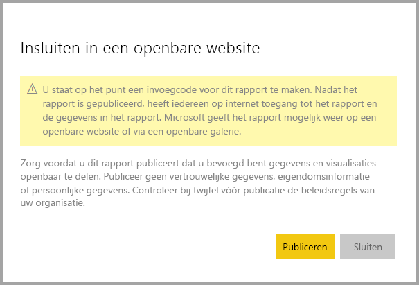

4. Er verschijnt een dialoogvenster met een koppeling die kan worden verzonden via e-mail of ingesloten in code (zoals een iFrame) of die u rechtstreeks op uw internetpagina's of blog kunt plakken.
   
   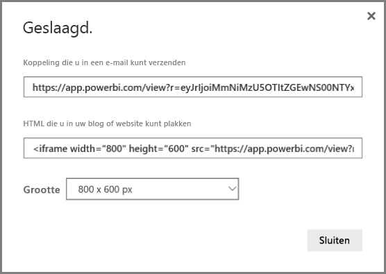

5. Als u al eerder een invoegcode voor het rapport hebt gemaakt, wordt de invoegcode snel weergegeven. U kunt slechts één invoegcode per rapport maken.
   
   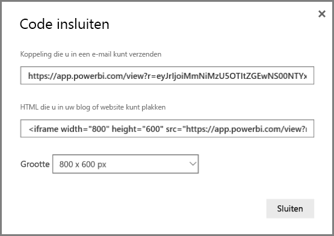

## Tips en trucs voor weergavemodi

Wanneer u inhoud binnen een blogbericht wilt invoegen, moet deze doorgaans binnen een bepaalde grootte van het scherm passen.  U kunt ook de hoogte en breedte in de iFrame-tag aanpassen, maar u moet er ook voor zorgen dat uw rapport binnen het opgegeven gebied van de iFrame past. U kunt het beste een juiste weergavemodus instellen tijdens het bewerken van het rapport.

De volgende tabel bevat richtlijnen over de weergavemodus en hoe deze wordt weergegeven als deze is ingesloten. 

| Weergavemodus | Voorbeelden van invoegen |
| --- | --- |
| 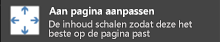 |**Passend op pagina** houdt zich aan de paginahoogte en -breedte van uw rapport. Als u uw pagina instelt op dynamische verhoudingen, zoals 16:9 of 4:3, wordt uw inhoud passend gemaakt binnen de iFrame die u hebt opgegeven. Bij opname in een iFrame kan het gebruiken van **Passend op pagina** leiden tot **letterboxing**, waarbij een grijze achtergrond wordt weergegeven in de gebieden van de iFrame achter de inhoud die passend is gemaakt binnen de iFrame. Stel de hoogte/breedte van uw iFrame in om letterboxing te minimaliseren. |
| 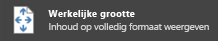 |**Ware grootte** zorgt ervoor dat het rapport de grootte zoals ingesteld op de rapportpagina behoudt. Dit kan ertoe leiden dat er schuifbalken in uw iFrame aanwezig zijn. Stel de hoogte en breedte van de iFrame in om schuifbalken te vermijden. |
|  |**Passend in breedte** zorgt ervoor dat de inhoud binnen het horizontale gebied voor uw iFrame past. Er wordt wel een rand weergegeven, maar de inhoud wordt passend gemaakt zodat alle beschikbare horizontale ruimte wordt gebruikt. |

## Tips en trucs voor de hoogte en breedte van uw iFrame

De invoegcode die u ontvangt nadat u Publiceren op internet hebt gebruikt, ziet er als volgt uit:

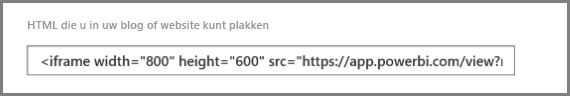

U kunt de breedte en hoogte handmatig bewerken om er zeker van te zijn dat deze precies past op de pagina waarop u deze invoegt.

Als u het beeld beter passend wilt maken, kunt u proberen 56 pixels aan de hoogte-afmeting van de iFrame toe te voegen. Dit biedt plaats aan de huidige grootte van de onderste balk. Als uw rapportagepagina gebruik maakt van dynamische verhoudingen, biedt de onderstaande tabel enkele afmetingen die u kunt gebruiken om het beeld passend te krijgen zonder letterboxing.

| Verhouding | Grootte | Dimensie (breedte x hoogte) |
| --- | --- | --- |
| 16:9 |Klein |640 x 416 px |
| 16:9 |Normaal |800 x 506 px |
| 16:9 |Groot |960 x 596 px |
| 4:3 |Klein |640 x 536 px |
| 4:3 |Normaal |800 x 656 px |
| 4:3 |Groot |960 x 776 px |

## Invoegcodes beheren

Als u een invoegcode voor **Publiceren op internet** hebt gemaakt, kunt u de codes die u maakt beheren vanuit het menu **Instellingen** van de Power BI-service. Met de optie Invoegcodes beheren kan het beoogde visuele element of rapport voor een code worden verwijderd (waardoor de invoegcode onbruikbaar wordt) of kan de invoegcode opnieuw worden verkregen.

1. Als u de invoegcode voor **Publiceren op internet** wilt beheren, opent u het tandwiel **Instellingen** en selecteert u **Invoegcodes beheren**.
   
   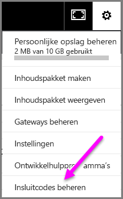

2. De lijst met invoegcodes die u hebt gemaakt wordt weergegeven, zoals op de volgende afbeelding.
   
   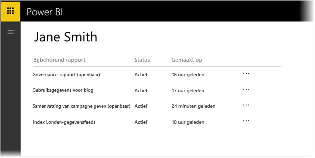

3. Voor elke invoegcode voor **Publiceren op internet** in de lijst kunt u de invoegcode ophalen of de invoegcode verwijderen. In het laatste geval werken koppelingen naar dat rapport of visuele element niet meer.
   
   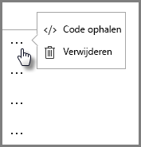

4. Als u **Verwijderen** selecteert, wordt u gevraagd of u zeker weet dat u de invoegcode wilt verwijderen.
   
   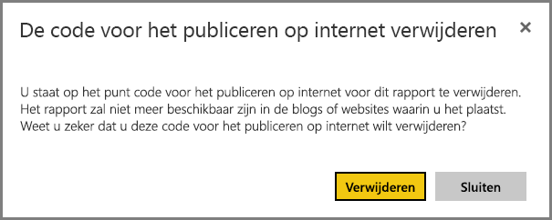

## Updates voor rapporten en gegevens vernieuwen

Nadat u de invoegcode voor **Publiceren op internet** hebt gemaakt en gedeeld, wordt het rapport bijgewerkt met de wijzigingen die u aanbrengt. U moet wel weten dat het even kan duren voordat de update zichtbaar is voor uw gebruikers. Het weergeven van updates voor een rapport of visueel element in invoegcodes voor Publiceren op internet duurt ongeveer één uur.

Wanneer u **Publiceren op internet** voor het eerst gebruikt om een invoegcode te verkrijgen, is de koppeling voor de invoegcode direct actief en kan deze worden bekeken door iedereen die de koppeling opent.  Na de eerste actie voor Publiceren op internet kan het ongeveer een uur duren voordat latere updates van rapporten of visuele elementen waar een koppeling voor Publiceren op internet naar verwijst, zichtbaar zijn voor uw gebruikers.

Zie de sectie **Hoe werkt het** verderop in dit artikel voor meer informatie. Als u wilt dat uw updates onmiddellijk beschikbaar zijn, kunt u de invoegcode verwijderen en een nieuwe maken.

## Gegevens vernieuwen

Vernieuwde gegevens worden automatisch in uw ingevoegde rapport of visuele element verwerkt. Het kan ongeveer 1 uur duren voordat vernieuwde gegevens zichtbaar zijn in invoegcodes. U kunt automatisch vernieuwen uitschakelen door **Niet vernieuwen** te selecteren in het schema voor de gegevensset die door het rapport wordt gebruikt.  

## Aangepaste visuele elementen

Aangepaste visuele elementen worden ondersteund in **Publiceren op internet**. Wanneer u Publiceren op internet gebruikt, hoeven gebruikers met wie u uw gepubliceerde visuele elementen deelt, aangepaste visuele elementen niet in te schakelen om het rapport te bekijken.

## Beperkingen

**Publiceren op internet** wordt ondersteund voor de meeste gegevensbronnen en rapporten in de Power BI-service. De volgende opties worden **momenteel echter niet ondersteund of zijn niet beschikbaar** voor Publiceren op internet:

- Rapporten met beveiliging op rijniveau.
- Rapporten die als gegevensbron gebruikmaken van Live Connection, waaronder Analysis Services Tabular dat on-premises wordt gehost, Analysis Services Multidimensional en Azure Analysis Services.
- Rapporten die direct of via een organisatie-inhoudspakket met u worden gedeeld.
- Rapporten in een groep waarvan u geen lid bent met machtigingen voor bewerken.
- Visuele R-elementen worden momenteel niet ondersteund in Publiceren op internet-rapporten.
- Exporteren van gegevens uit de visuele elementen in een rapport dat is gepubliceerd naar het web
- ArcGIS Maps for Power BI visuals
- Rapporten met DAX-metingen op rapportniveau
- Gegevensquerymodellen voor eenmalige aanmelding
- [Beveilig vertrouwelijke of eigendomsinformatie](#publish-to-web-from-power-bi)

## Tenantinstelling

Power BI-beheerders kunnen de functie voor publiceren op internet in- of uitschakelen. Ze kunnen ook de toegang tot specifieke groepen beperken. De mogelijkheid om een invoegcode te maken wijzigt op basis van deze instelling.

|Functie |Ingeschakeld voor de hele organisatie |Uitgeschakeld voor de hele organisatie |Specifieke beveiligingsgroepen   |
|---------|---------|---------|---------|
|**Publiceren op internet** onder het menu **Bestand** van het rapport.|Ingeschakeld voor iedereen|Niet voor iedereen zichtbaar|Alleen zichtbaar voor gemachtigde gebruikers of groepen.|
|**Invoegcodes beheren** onder **Instellingen**|Ingeschakeld voor iedereen|Ingeschakeld voor iedereen|Ingeschakeld voor iedereen  Optie * **Verwijderen** alleen voor gemachtigde gebruikers of groepen. * **Ophalen van codes** ingeschakeld voor iedereen.|
|**Codes invoegen** binnen de beheerportal|De status geeft een van de volgende opties weer: * Actief * Niet ondersteund * Geblokkeerd|De status geeft **Uitgeschakeld** weer|De status geeft een van de volgende opties weer: * Actief * Niet ondersteund * Geblokkeerd  Als een gebruiker niet is geautoriseerd op basis van de tenantinstelling, wordt de status weergegeven als **geschonden**.|
|Bestaande gepubliceerde rapporten|Iedereen ingeschakeld|Iedereen uitgeschakeld|Rapporten blijven weergeven voor iedereen.|

## Inzicht in de kolom met de invoegcodestatus

Als de pagina **Invoegcodes beheren** voor uw invoegcodes voor **Publiceren op internet** wordt weergegeven, is een statuskolom aanwezig. Invoegcodes zijn standaard actief, maar hieronder worden alle mogelijke statussen vermeld.

| Status | Beschrijving |
| --- | --- |
| **Actief** |Het rapport is beschikbaar voor internetgebruikers die het kunnen weergeven en ermee kunnen werken. |
| **Geblokkeerd** |De inhoud van het rapport maakt inbreuk op de [Servicevoorwaarden van Power BI](https://powerbi.microsoft.com/terms-of-service). Het is door Microsoft geblokkeerd. Neem contact op met de ondersteuning als u denkt dat de inhoud ten onrechte is geblokkeerd. |
| **Niet ondersteund** |De gegevensset van het rapport maakt gebruik van beveiliging op rijniveau of een andere niet-ondersteunde configuratie. Zie de sectie **Beperkingen** voor een volledige lijst. |
| **Geschonden** |De invoegcode valt buiten het opgegeven tenantbeleid. Dit gebeurt meestal wanneer een invoegcode is gemaakt en de tenantinstelling voor publiceren op internet wordt gewijzigd om de gebruiker die de invoegcode beheert, uit te sluiten. Wanneer de tenantinstelling is uitgeschakeld of wanneer de gebruiker geen invoegcodes meer mag maken, krijgen bestaande invoegcodes de status **Geschonden**. |

## Een probleem met Publiceren op internet melden

Als u een probleem wilt melden dat is gerelateerd aan **Publiceren op internet**-inhoud die is ingesloten in een website of blog, gebruikt u het **vlag**-pictogram in de onderste balk, zoals op de volgende afbeelding. U wordt gevraagd om een e-mail te sturen naar Microsoft waarin u het probleem toelicht. Microsoft evalueert de inhoud op basis van de Servicevoorwaarden voor Power BI en zal passende actie ondernemen.

Als u een probleem wilt melden, selecteert u het **vlag**-pictogram in de onderste balk van het Publiceren op internet-rapport dat wordt weergegeven.

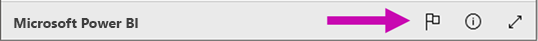

## Licenties en prijzen

U kunt **Publiceren op internet** allen gebruiken als u gebruiker van Microsoft Power BI bent. De consumenten van uw rapport (lezers, bezoekers) hoeven geen Power BI-gebruikers te zijn.

## Hoe het werkt (technische details)

Wanneer u een invoegcode maakt met **Publiceren op internet**, wordt het rapport zichtbaar voor gebruikers op het internet. Het is openbaar beschikbaar, dus u kunt verwachten dat bezoekers het rapport eenvoudig via sociale media zullen delen. Terwijl gebruikers het rapport bekijken, doordat ze de directe openbare URL openen of de ingesloten versie op een webpagina of blog bekijken, worden de rapportdefinitie en de resultaten van de query's die nodig zijn om het rapport weer te geven door Power BI in de cache opgeslagen. Deze aanpak zorgt ervoor dat het rapport door duizenden gebruikers gelijktijdig kan worden bekeken zonder invloed op prestaties.

De cache heeft een lange levensduur. Als u de rapportdefinitie bijwerkt (bijvoorbeeld als u de weergavemodus wijzigt) of de rapportgegevens vernieuwt, duurt het ongeveer een uur voordat wijzigingen worden doorgevoerd in de versie van het rapport die door uw gebruikers kan worden gelezen. U kunt daarom het beste uw werkzaamheden ver van tevoren plannen en de invoegcode voor **Publiceren op internet** alleen maken wanneer u tevreden bent met de instellingen.

Nog vragen? [Misschien dat de Power BI-community het antwoord weet](http://community.powerbi.com/)
