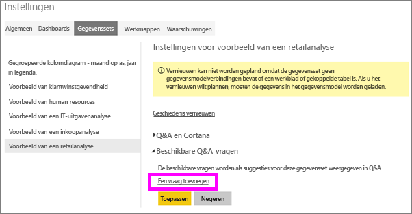
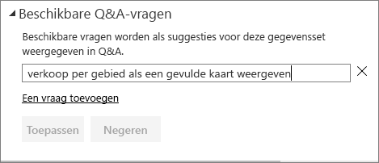
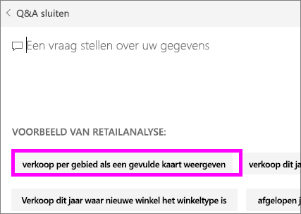
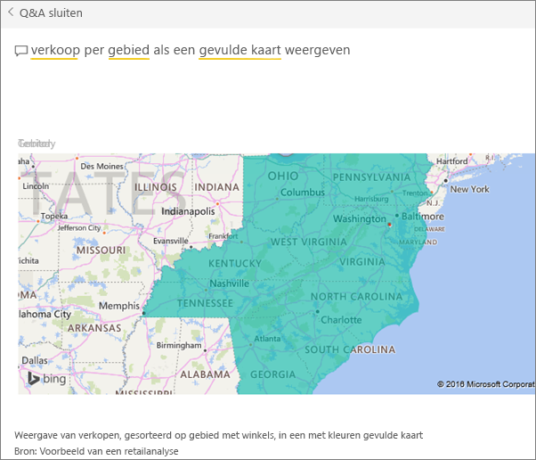

# Aanbevolen vragen voor Q&A-functie van Power BI maken
Als u beschikt over een gegevensset, kunt u uw eigen aanbevolen vragen toevoegen aan deze dataset.  En de Q&A-functie van Power BI toont deze vragen aan collega's die uw gegevensset (*Verbruiken*) gebruiken.  Aanbevolen vragen geven uw collega's ideeën over de typen vragen die ze kunnen stellen over de gegevensset. U bepaalt zelf welke aanbevolen vragen u toevoegt: u kunt populaire vragen, vragen die interessante resultaten weergeven of vragen die mogelijk moeilijk zijn te formuleren toevoegen.

Kijk hoe Will een aantal aanbevolen vragen toevoegt aan Power BI Q&A en die vragen vervolgens gebruikt om de gegevensset te verkennen. Gebruik vervolgens de stapsgewijze instructies onder de video om het zelf te proberen.

<iframe width="560" height="315" src="https://www.youtube.com/embed/E1mIAyEXuF4" frameborder="0" allowfullscreen></iframe>

> [!NOTE]
> Vragen in Q&A zijn beschikbaar voor gebruik in de [Microsoft Power BI-app voor iOS op iPads, iPhones en iPod Touch-apparaten](mobile-apps-ios-qna.md) en in de Q&A-preview van Power BI Desktop. Het maken van de vragen is echter alleen beschikbaar in de Power BI-service (app.powerbi.com).
> 

In dit artikel wordt het [voorbeeld van een retailanalyse](sample-datasets.md) gebruikt.

1. Selecteer het vakje Q&A op het dashboard.   U ziet dat Q&A al een handige lijst weergeeft met termen die voorkomen in de gegevensset.
2. Als u items wilt toevoegen aan deze lijst, selecteert u tandwielpictogram in de rechterbovenhoek van Power BI.  
   
3. Selecteer **Instellingen** &gt; **Gegevenssets** &gt; **Voorbeeld van een retailanalyse** &gt; **Aanbevolen Q&A-vragen** .  
4. Selecteer **Een vraag toevoegen**.
   
   
5. Typ uw vraag in het tekstvak in en selecteer **Toepassen**.   Selecteer desgewenst **Een vraag toevoegen** om nog een vraag toe te voegen.  
   
6. Ga terug naar het Power BI-dashboard voor het voorbeeld van een retailanalyse en plaats de cursor in het Q&A-vraagvak.   
   
7. De nieuwe aanbevolen vraag, **Verkoop per regio als een kaart**, wordt als eerste in de lijst weergegeven. Selecteer deze vraag.  
8. Het antwoord wordt als een visualisatie met een gevulde kaart weergegeven.  
   

### Volgende stappen
[Q&A in Power BI](power-bi-q-and-a.md)  
[Zelfstudie: Inleiding tot Q&A in Power BI](power-bi-visualization-introduction-to-q-and-a.md)  
[Power BI - basisconcepten](service-basic-concepts.md)  
Hebt u nog vragen? [Misschien dat de Power BI-community het antwoord weet](http://community.powerbi.com/)

