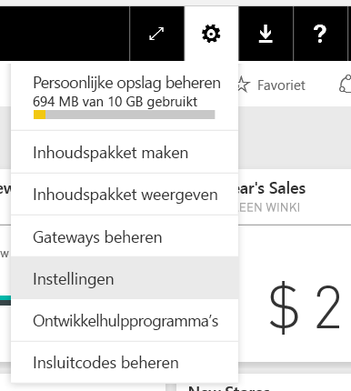
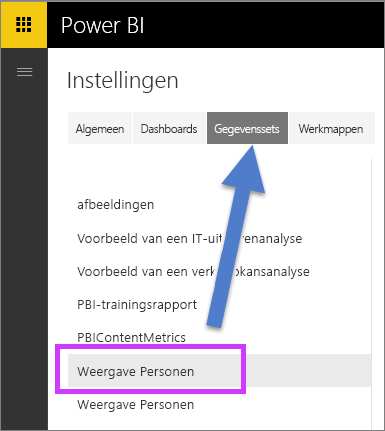

# Q&A inschakelen voor live-verbindingen
## Wat is een on-premises gegevensgateway?  Wat is een live-verbinding?
U kunt gegevenssets importeren in Power BI of u kunt een live-verbinding met ze opzetten. Gegevenssets met een live-verbinding worden vaak aangeduid als 'on-premises'. De live-verbindingen worden beheerd met behulp van een [gateway](service-gateway-onprem.md), en gegevens en query's worden uitgewisseld via live-query's.

## Q&A voor gegevenssets via on-premises gegevensgateway
Als u Q&A wilt gebruiken met gegevenssets die toegankelijk zijn via een gateway, moet u deze eerst inschakelen.

Als dat is gebeurd, maakt Power BI een index van de gegevensbron en wordt er een subset van die gegevens geüpload naar Power BI om het stellen van vragen mogelijk te maken. Het kan enkele minuten duren om de eerste index te maken. De index wordt vervolgens automatisch onderhouden en bijgewerkt door Power BI als de gegevens worden gewijzigd. Als u Q&A wilt gebruiken met deze gegevenssets, doet u dit op dezelfde manier als met gegevens die naar Power BI zijn gepubliceerd. De volledige set met functies die beschikbaar is in de Q&A-ervaring wordt in beide gevallen ondersteund, inclusief het gebruik van de gegevensbron met Cortana.

Als u vragen stelt in Power BI, bepaalt Q&A aan de hand van een index van uw gegevensset welke visueel element of rapportblad het beste antwoord geeft op uw vraag. Na het vaststellen van het best mogelijke antwoord, gebruikt Q&A DirectQuery om via de gateway live-gegevens op te halen uit de gegevensbron voor het vullen van grafieken en diagrammen. Dit zorgt ervoor dat in resultaten van Q&A van Power BI altijd de meest actuele gegevens uit de onderliggende gegevensbron worden weergegeven.

Q&A van Power BI gebruikt de tekst- en schemawaarden uit uw gegevensbron om te bepalen hoe in het onderliggende model moet worden gezocht naar antwoorden. Zoekopdrachten naar specifieke nieuwe of verwijderde tekstwaarden (zoals het vragen naar de naam van een klant voor een onlangs toegevoegde tekstrecord) kunnen dan ook alleen goed worden uitgevoerd als de index steeds up-to-date is met de meest recente waarden. Power BI zorgt er automatisch voor dat de tekst- en schema-index elke 60 minuten wordt bijgewerkt.

Zie deze onderwerpen voor meer informatie:

* Wat is een [on-premises gegevensgateway](service-gateway-onprem.md)?
* [Q&A in Power BI](power-bi-q-and-a.md)

## Q&A inschakelen
Als de gegevensgateway is ingesteld, kunt u vanuit Power BI verbinding maken met uw gegevens.  Maak een dashboard op basis van uw on-premises gegevens of upload een PBIX-bestand dat gebruikmaakt van on-premises gegevens.  Mogelijk hebt u ook al on-premises gegevens in dashboards, rapporten en gegevenssets die met u zijn gedeeld.

1. Selecteer in de rechterbovenhoek van de Power BI-service het tandwielpictogram  en kies **Instellingen**.
   
   
2. Selecteer **gegevenssets** en kies de gegevensset die u wilt inschakelen voor Q&A.
   
   
3. Vouw **Q&A en Cortana** uit, schakel het selectievakje **Q&A inschakelen voor deze gegevensset** in en kies **Toepassen**.
   
    

## Welke gegevens worden in de cache geplaatst en hoe wordt de privacy beschermd?
Wanneer u Q&A inschakelt voor uw on-premises gegevens, wordt er een subset van uw gegevens opgeslagen in de cache van de service. Dit wordt gedaan om ervoor te zorgen dat Q&A met redelijke prestaties kan worden uitgevoerd. Power BI sluit waarden die langer zijn dan 24 tekens uit van cachebewerkingen. De cache wordt binnen enkele uren verwijderd als u aangeeft dat u Q&A niet meer wilt gebruiken door het selectievakje **Q&A inschakelen voor deze gegevensset** uit te schakelen of wanneer u de gegevensset verwijdert.

## Aandachtspunten en probleemoplossing
Tijdens de preview-fase van deze functie gelden verschillende beperkingen:

* In eerste instantie is de functie alleen beschikbaar voor gegevensbronnen in tabelvorm van SQL Server 2016 Analysis Services. De functie is geoptimaliseerd om te werken met gegevens in tabelvorm. Bepaalde functionaliteit is beschikbaar voor multidimensionale gegevensbronnen, maar de volledige Q&A-ervaring wordt nog niet ondersteund voor dit type gegevensbronnen. In de loop van de tijd worden er extra gegevensbronnen doorgevoerd die worden ondersteund door de on-premises gegevensgateway.
* Volledige ondersteuning voor beveiliging op rijniveau die is gedefinieerd in SQL Server Analysis Services is in eerste instantie niet beschikbaar in de openbare preview. Tijdens het stellen van vragen in Q&A kan de functie Automatisch aanvullen suggesties weergeven waartoe een gebruiker geen toegang heeft. De RLS die is gedefinieerd in het model wordt echter in acht genomen voor visuele elementen in rapporten en grafieken, zodat er geen onderliggende numerieke gegevens kunnen worden blootgesteld. Opties voor het beheren van dit gedrag worden in komende updates uitgebracht.
* Live-verbindingen worden alleen ondersteund met de on-premises gegevensgateway. Deze verbindingen kunnen dus niet worden gebruikt met de persoonlijke gateway.

## Volgende stappen
[On-premises gegevensgateway](service-gateway-onprem.md)  
[Manage your data source - Analysis Services](service-gateway-enterprise-manage-ssas.md) (Uw gegevensbron beheren - Analysis Services)  
[Power BI - basisconcepten](service-basic-concepts.md)  
[Overzicht van Q&A-functie in Power BI](power-bi-q-and-a.md)  

Nog vragen? [Misschien dat de Power BI-community het antwoord weet](http://community.powerbi.com/)

