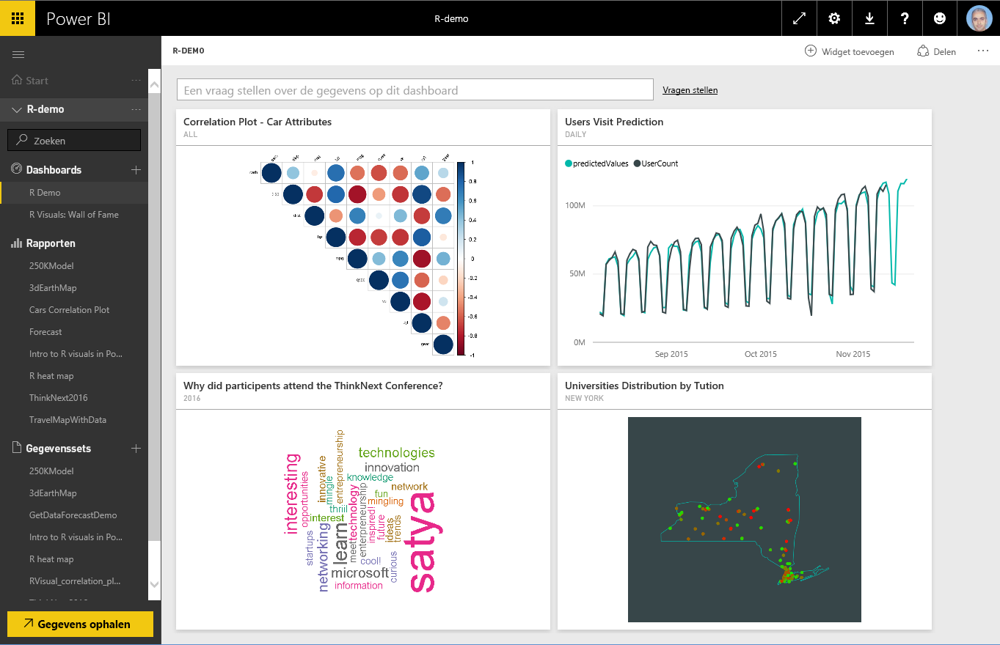
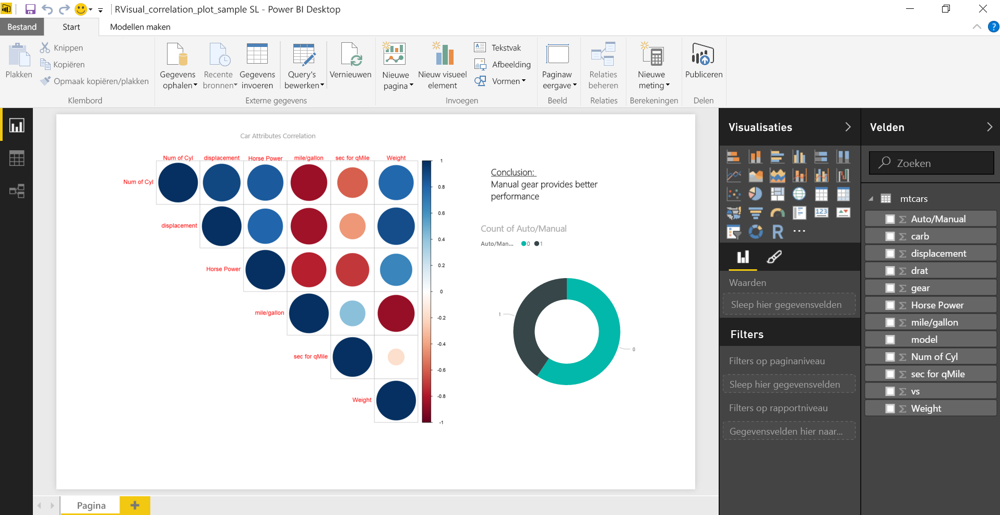
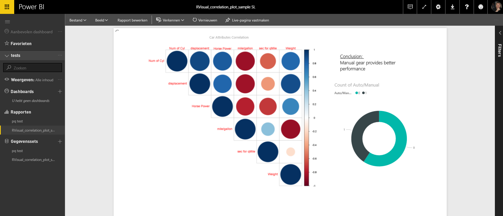
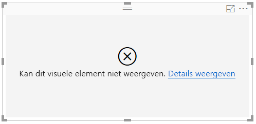
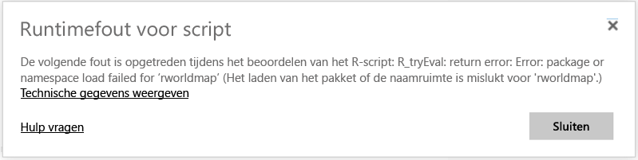
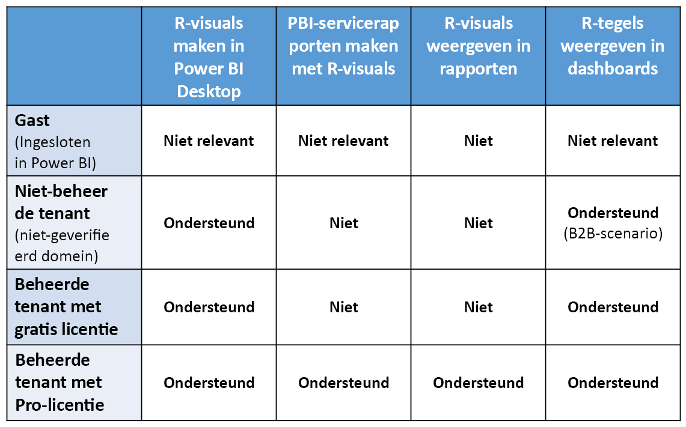

# R-visuals maken in de Power BI-service
De Power BI-service ondersteunt de weergave van en de interactie met visuele elementen die zijn gemaakt met R-scripts. Visuele elementen die zijn gemaakt met R-scripts, vaak *R-visuals* genoemd, kunnen geavanceerde vormgeving en analyses van gegevens bieden, zoals prognoses. Hiervoor wordt gebruikgemaakt van de krachtige analysemogelijkheden en visualisatievoorzieningen van R.

> [!NOTE]
> De [R-programmeertaal](https://www.r-project.org/) is onder statistici, gegevenswetenschappers en bedrijfsanalisten een van de meest gebruikte programmeertalen. De R-taal heeft een open source-community die meer dan 7000 invoegtoepassingen heeft ontwikkeld. Daarnaast bevat de community een groot aantal [R-gebruikersgroepen](http://msdsug.microsoft.com/). De versie van R die is geïmplementeerd in de Power BI-service is *Revolution R Open 3.2.2.*
> 
> 

In de volgende afbeelding ziet u een Power BI-dashboard met een verzameling R-visuals die worden gebruikt voor geavanceerde analyses.

R-visuals worden gemaakt in een [Power BI Desktop-rapport](desktop-get-the-desktop.md), zoals het rapport in de volgende afbeelding.

Wanneer het rapport is gemaakt in **Power BI Desktop**, kunt u het rapport met daarin een of meer R-visuals publiceren naar de Power BI-service. R-visuals kunnen op dit moment alleen worden gemaakt in **Power BI Desktop**, en vervolgens naar de Power BI-service worden gepubliceerd. Zie [Create Power BI visuals using R (Power BI Desktop)](desktop-r-visuals.md) (Power BI-visuals maken met R (Power BI Desktop)) voor meer informatie over het maken van R-visuals.

Houd er rekening mee dat in de service niet alle R-pakketten worden ondersteund. Aan het einde van dit artikel vindt u een lijst met pakketten die momenteel worden ondersteund in de Power BI-service.

U kunt dit [voorbeeldbestand voor Power BI Desktop](http://download.microsoft.com/download/D/9/A/D9A65269-D1FC-49F8-8EC3-1217E3A4390F/RVisual_correlation_plot_sample SL.pbix) (PBIX-bestand) downloaden om te experimenteren met enkele R-visuals en te zien hoe dit werkt.

R-visuals die zijn gemaakt in **Power BI Desktop** en vervolgens naar de Power BI-service zijn gepubliceerd, gedragen zich voor het overgrote deel als elk ander visueel element in de Power BI-service. Dit wil zeggen dat u interactie met de elementen kunt hebben, ze kunt filteren, segmenteren en vastmaken aan een dashboard of delen met anderen. Lees dit artikel over [het delen van een dashboard met collega's en anderen](service-share-dashboards.md) voor meer informatie over het delen van dashboards en visuele elementen. Een verschil met andere visuele elementen is dat R-visuals geen knopinfo kunnen weergeven en niet kunnen worden gebruikt voor het filteren van andere visuele elementen.

Zoals u in de volgende afbeelding kunt zien, is er in hoofdlijnen nauwelijks verschil tussen de weergave en het gedrag van R-visuals in de Power BI-service (in dashboards of rapporten) en alle andere visuele elementen. Gebruikers hoeven dan ook niet op de hoogte te zijn van het onderliggende R-script waarmee het visuele element is gemaakt.

## Beveiliging van R scripts
R-visuals worden gemaakt van R-scripts, die in mogelijk code kunnen bevatten met beveiligings- of privacyrisico's.

Deze risico's doen zich voornamelijk voor in de ontwerpfase, wanneer het script door de auteur van het script op de eigen computer wordt uitgevoerd.

De Power BI-service hanteert een *sandbox*-technologie om gebruikers en de service te beschermen tegen beveiligingsrisico's.

Deze *sandbox*-benadering legt een aantal beperkingen op voor de R-scripts die worden uitgevoerd in de Power BI-service, zoals toegang tot internet of toegang tot andere bronnen die niet vereist zijn voor het maken van de R-visual.

## Foutafhandeling in R-scripts
Wanneer er een fout optreedt in een R-script, wordt de R-visual niet uitgezet en wordt er een foutbericht weergegeven. Als u meer wilt weten over de fout, selecteert u **Details bekijken** in de fout op het canvas van de R-visual, zoals wordt weergegeven in de volgende afbeelding.

Om nog een voorbeeld te geven, ziet u in de volgende afbeelding het foutbericht dat wordt weergegeven wanneer een R-script niet goed kan worden uitgevoerd omdat er een R-pakket ontbreekt in Azure.

## Licentieverlening
R-visuals vereisen een [Power BI Pro](service-self-service-signup-for-power-bi.md)-licentie om te worden weergegeven in rapporten, en bewerkingen voor vernieuwen, filteren en kruislings filteren. Zie [Power BI Premium - wat is het?](service-premium.md) voor meer informatie over Power BI Pro-licenties en hoe deze verschillen van gratis licenties.

Gebruikers van de gratis versie van Power BI kunnen alleen tegels zien die met hen zijn gedeeld. Zie [Purchasing Power BI Pro](service-admin-purchasing-power-bi-pro.md) (Power BI Pro kopen) voor meer informatie.

In de volgende tabel worden de mogelijkheden van R-visuals beschreven op basis van licentieverlening.

## Bekende beperkingen
R-visuals in de Power BI-service hebben enkele beperkingen:

* De ondersteuning voor R-visuals is beperkt tot de pakketten die op de volgende pagina worden genoemd <make this a link to the supported packages page per my excel>. Er is momenteel geen ondersteuning voor aangepaste pakketten.
* Beperkingen voor gegevensgrootte: de grootte van gegevens die door de R-visual worden gebruikt voor het uitzetten, is beperkt tot 150.000 rijen. Als er meer dan 150.000 rijen zijn geselecteerd, worden alleen de bovenste 150.000 rijen gebruikt en wordt er een bericht weergegeven op de afbeelding.
* Beperking voor tijdsberekening: als de berekening van een R-visual langer duurt dan 60 seconden, treedt er een time-out op voor het script, met een fout tot gevolg.
* R-visuals worden vernieuwd op het moment dat gegevens worden bijgewerkt, gefilterd en gemarkeerd. De afbeelding zelf is echter niet interactief en biedt geen ondersteuning voor knopinfo.
* R-visuals reageren op de markering van andere visuele elementen, maar u kunt niet klikken op elementen in de R-visual om kruislings te filteren op andere elementen.
* R-visuals worden momenteel niet ondersteund voor het gegevenstype *Tijd*. Gebruik in plaats daarvan Datum/tijd.
* R-visuals worden niet weergegeven wanneer u **Publiceren op internet** gebruikt.
* R-visuals worden op dit moment niet samen afgedrukt met dashboards en rapporten.
* R-visuals worden momenteel niet ondersteund in de DirectQuery-modus van Analysis Services.
* Chinese, Japans en Koreaanse lettertypen werken alleen goed in de Power BI-service als aan deze volgende aanvullende stappen is voldaan:
  
  * Installeer eerst het R-pakket *showtext* en alle bijbehorende afhankelijkheden. U kunt dit doen door het volgende script uit te voeren:
    
        *install.packages("showtext")*
  * Voeg vervolgens de volgende regel toe aan het begin van het R-script:
    
        powerbi_rEnableShowTextForCJKLanguages =  1

## Overzicht van R-pakketten
R-pakketten zijn verzamelingen R-functies, gegevens en gecompileerde code die zijn gecombineerd in een zorgvuldig gedefinieerde indeling. R wordt geïnstalleerd met een standaardset pakketten, en andere pakketten zijn beschikbaar voor downloaden en installeren. Na de installatie moeten R-pakketten in de sessie worden geladen om te kunnen worden gebruikt. De primaire bron van gratis R-pakketten is CRAN, wat staat voor [Comprehensive R Archive Network](https://cran.r-project.org/web/packages/available_packages_by_name.html).

In **Power BI Desktop** kunnen alle typen R-pakketten zonder beperking worden gebruikt. U kunt R-pakketten voor eigen gebruik installeren in **Power BI Desktop** (met behulp van [RStudio IDE](https://www.rstudio.com/) bijvoorbeeld).

R-visuals in de **Power BI-service** worden ondersteund door de pakketten die worden vermeld in de sectie **Ondersteunde pakketten** in [dit artikel](service-r-packages-support.md). Als in de lijst met ondersteunde pakketten een pakket ontbreekt waarin u geïnteresseerd bent, kunt u ondersteuning voor het pakket aanvragen. Zie [R-pakketten in de Power BI-service](service-r-packages-support.md) voor informatie over het aanvragen van ondersteuning.

### Vereisten en beperkingen van R-pakketten
Er zijn een paar vereisten en beperkingen voor R-pakketten:

* De Power BI-service ondersteunt vrij wel alle R-pakketten met gratis en open source-softwarelicenties zoals GPL-2, GPL 3, MIT +, enzovoort.
* De Power BI-service ondersteunt pakketten die zijn gepubliceerd in CRAN. De service biedt geen ondersteuning voor persoonlijke of aangepaste R-pakketten. We adviseren gebruikers om hun persoonlijke pakketten beschikbaar te maken op CRAN en dan pas een aanvraag te versturen om het pakket beschikbaar te maken in de Power BI-service.
* Voor **Power BI Desktop** zijn er twee verschillende R-pakketten:
  
  * Voor R-visuals kunt u elk pakket installeren, met inbegrip van aangepaste R-pakketten
  * Voor aangepaste R-visuals worden alleen openbare CRAN-pakketten ondersteund voor automatische installatie van de pakketten
* Uit veiligheids- en privacyoverwegingen worden momenteel geen R-pakketten ondersteund die in de service client-serverquery's via het World Wide Web aanbieden (zoals RgoogleMaps). De netwerktoegang wordt geblokkeerd voor deze pogingen. Zie [R-pakketten in de Power BI-service](service-r-packages-support.md) voor een lijst met ondersteunde en niet-ondersteunde R-pakketten.
* Het goedkeuringsproces voor het toevoegen van een nieuw R-pakket heeft een structuur van afhankelijkheden. Enkele afhankelijkheden die moeten worden geïnstalleerd in de service, kunnen niet worden ondersteund.

### Ondersteunde pakketten
Zie het volgende artikel voor een lange lijst met ondersteunde R-pakketten (en de korte lijst van niet-ondersteunde pakketten):

* [R-pakketten in de Power BI-service](service-r-packages-support.md)

