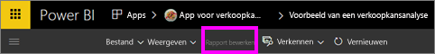
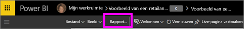
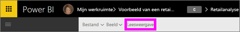

# Leesweergave en bewerkweergave in rapporten van de Power BI-service
In de Power BI-service (geen Power BI Desktop) zijn er twee modi voor het weergeven en werken met rapporten: de leesweergave en de bewerkweergave.  

De leesweergave is beschikbaar voor alle gebruikers, terwijl de bewerkweergave alleen beschikbaar is voor rapporten voor makers en eigenaren. De leesweergave is ontworpen voor *consumenten* van het rapport, oftewel collega’s die rapporten vanuit Apps openen of met wie rapporten zijn gedeeld. De leesweergave zorgt ervoor dat elke afzonderlijke consument van een specifiek rapport hetzelfde rapport, identieke visualisaties en dezelfde filters ziet.  Consumenten kunnen met uw rapport werken, maar geen wijzigingen opslaan.

>**Opmerking**: in bepaalde omstandigheden kunnen rapportconsumenten verschillende gegevens zien vanwege beveiligings- en gegevensmachtigingen op rijniveau. 

De bewerkweergave is alleen beschikbaar voor personen die het rapport hebben gemaakt of die mede-eigenaar van een rapport zijn als lid of beheerder van een app-werkruimte.

## Leesweergave

De leesweergave is een plezierige en veilige manier om te oefenen en om inzicht in uw gegevens te krijgen. De leesweergave is niet zo interactief als de [bewerkweergave](service-interact-with-a-report-in-editing-view.md), maar toch hebt u hier veel mogelijkheden om uw gegevens te verkennen. Dit is bijvoorbeeld handig als u rapporten weergeeft [die met u zijn gedeeld](service-share-dashboards.md) en die alleen kunnen worden geopend in de leesweergave.

Zie [Leesweergave voor Power BI-rapporten](service-interact-with-a-report-in-reading-view.md) voor meer informatie.

## Bewerkweergave
In de Bewerkweergave in Power BI (vergeleken met de [Leesweergave](service-interact-with-a-report-in-reading-view.md)) kunt u nog dieper in uw gegevens graven door velden toe te voegen en te verwijderen, het type visualisatie te veranderen, nieuwe visualisaties te maken en visualisaties en pagina's uit het rapport toe te voegen en te verwijderen.

Zie [Bewerkweergave voor Power BI-rapporten](service-interact-with-a-report-in-editing-view.md) voor meer informatie.

## Navigeren tussen de bewerkweergave en de leesweergave
Onthoud dat alleen makers en eigenaren van rapporten een rapport in de bewerkweergave kunnen openen.

1. Een rapport wordt standaard geopend in de leesweergave. U kunt zien dat u zich in de leesweergave bevindt als u de optie **Rapport bewerken** ziet staan. Als **Rapport bewerken** grijs wordt weergegeven, bent u niet gemachtigd om het rapport te openen in de bewerkweergave.

   

2. Als **Rapport bewerken** niet grijs wordt weergegeven, selecteert u deze optie om het rapport in de bewerkweergave te openen. 
   
   
   
   Het rapport is nu in de bewerkweergave en maakt gebruik van dezelfde [weergave-instellingen](power-bi-report-display-settings.md) als die u voor het laatst hebt gebruikt in de leesweergave.

2. Als u terug wilt naar de leesweergave, selecteert u **Leesweergave** in de bovenste navigatiebalk.
   
    

Er zijn vele manieren om met een rapport in de leesweergave te werken en om uw gegevens zodanig op te delen dat u inzichten en antwoord op uw vragen krijgt.  In het volgende onderwerp [Interactie met een rapport in de leesweergave](service-interact-with-a-report-in-editing-view.md) wordt dit uitvoerig beschreven.

### Volgende stappen
[Interactie met een rapport in de leesweergave](service-interact-with-a-report-in-editing-view.md)    
Terug naar [Rapporten in Power BI](service-reports.md)    
Nog vragen? [Misschien dat de Power BI-community het antwoord weet](http://community.powerbi.com/) 

