# Realtimestreaming in Power BI
Met behulp van realtimestreaming van Power BI kunt u gegevens streamen en dashboards in real time bijwerken. Elk visueel element of dashboard dat kan worden gemaakt in Power BI, kan ook worden gemaakt voor het weergeven en bijwerken van realtimegegevens en visuele elementen. De apparaten en bronnen van gestreamde gegevens kunnen variëren van fabriekssensoren tot bronnen van sociale media, maar ook gebruiksgegevens van services en alle andere bronnen waaruit tijdgebonden gegevens kunnen worden verzameld of verzonden.

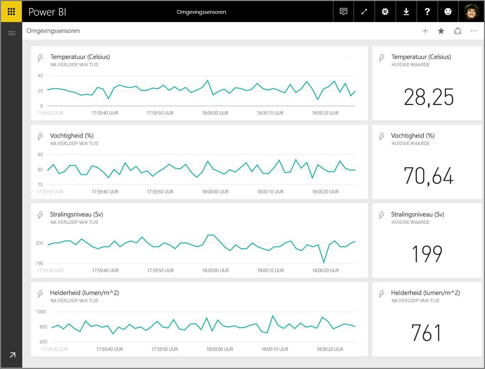

In dit artikel leest u hoe u in Power BI realtimestreaming instelt voor een gegevensset. Maar voordat we dat gaan doen, is het belangrijk om te begrijpen welke typen realtimegegevenssets er beschikbaar zijn voor weergave in tegels (en dashboards) en hoe deze gegevenssets verschillen.

## Typen realtimegegevenssets
Er zijn drie soorten realtimegegevenssets die zijn ontworpen voor weergave in realtimedashboards:

* Pushgegevensset
* Streaminggegevensset
* PubNub-streaminggegevensset

We gaan eerst de verschillen tussen deze gegevenssets behandelen (deze sectie) en vervolgens bespreken we hoe u gegevens naar elk van deze gegevenssets kunt pushen.

### Pushgegevensset
Met een **pushgegevensset** worden gegevens naar de Power BI-service gepusht. Wanneer de gegevensset wordt gemaakt, maakt de Power BI-service automatisch een nieuwe database in de service voor het opslaan van de gegevens. Omdat er een onderliggende database is waarin de binnenkomende gegevens worden opgeslagen, kunnen er rapporten worden gemaakt aan de hand van de gegevens. Deze rapporten en hun visuele elementen verschillen niet van andere visuele elementen voor rapporten, wat betekent dat u alle opbouwfuncties voor rapporten van Power BI-rapport kunt gebruiken om visuele elementen te maken, inclusief aangepaste visuele elementen, gegevenswaarschuwingen en vastgemaakte dashboardtegels.

Wanneer u een rapport maakt met behulp van de pushgegevensset, kunt u visuele elementen van het rapport vastmaken aan een dashboard. Op dit dashboard worden visuele elementen in real time bijgewerkt wanneer de gegevens worden bijgewerkt. Binnen de service triggert het dashboard het vernieuwen van de tegel op het moment dat er nieuwe gegevens worden ontvangen.

Er zijn twee overwegingen met betrekking tot vastgemaakte tegels uit een pushgegevensset:

* Het vastmaken van een volledig rapport met behulp van de optie *Live-pagina vastmaken* betekent **niet** dat de gegevens automatisch worden bijgewerkt.
* Zodra een visueel element is vastgemaakt aan een dashboard, kunt u **Q&A** gebruiken om in natuurlijke taal vragen te stellen aan de pushgegevensset. Als u een **Q&A**-query hebt gemaakt, kunt u het resulterende visuele element weer vastmaken aan het dashboard en dat dashboard wordt dan *ook* in real time bijgewerkt.

### Streaminggegevensset
Met een **streaminggegevensset** worden gegevens ook naar de Power BI-service gepusht, maar met één belangrijk verschil: in Power BI worden de gegevens alleen opgeslagen in een tijdelijke cache, die snel verloopt. De tijdelijke cache wordt alleen gebruikt om visuele elementen weer te geven waarvoor een vergankelijke tijdsperiode geldt, zoals een lijndiagram met een tijdvenster van één uur.

In het geval van een **streaminggegevensset** is er *geen* onderliggende database, dus u kunt *geen* visuele elementen voor rapporten bouwen met behulp van de gegevens die worden aangevoerd vanuit de stream. Dit betekent dat geen gebruik kunt maken van rapportfunctionaliteit zoals filters, aangepaste visuele elementen en andere rapportfuncties.

De enige manier om een streaminggegevensset te visualiseren, is door het toevoegen van een tegel en de streaminggegevensset te gebruiken als een gegevensbron met **aangepaste streaminggegevens**. De aangepaste streamingtegels die zijn gebaseerd op een **streaminggegevensset** zijn geoptimaliseerd voor het snel weergeven van realtimegegevens. Er is weinig vertraging tussen het moment dat de gegevens naar de Power BI-service worden gepusht en het moment dat het visuele element wordt bijgewerkt. De reden hiervoor is dat het niet nodig is om de gegevens in te voeren in een database of hieruit te lezen.

In de praktijk zijn streaminggegevenssets en de bijbehorende visuele elementen het meest geschikt voor situaties waarin het essentieel is om de vertraging tussen het pushen en visualiseren van de gegevens zoveel mogelijk te beperken. Bovendien wordt het aanbevolen om de gegevens te pushen in een indeling die als zodanig kan worden weergegeven, dus zonder dat extra aggregaties nodig zijn. Voorbeelden van dergelijke gegevens zijn temperaturen en vooraf berekende gemiddelden.

### PubNub-streaminggegevensset
In het geval van een **PubNub**-streaminggegevensset gebruikt de Power BI-webclient de PubNub-SDK om een bestaande PubNub-gegevensstroom te lezen. Er worden geen gegevens opgeslagen door de Power BI-service.

Net als een **streaminggegevensset** heeft de **PubNub-streaminggegevensset** geen onderliggende database in Power BI en kunt u dus geen visuele rapportelementen maken op basis van de gegevens die via de stream binnenkomen. U kunt dus evenmin voordeel hebben van rapportfunctionaliteit zoals filters, aangepaste visuele elementen, enzovoort. Dit betekent dat ook de **PubNub-streaminggegevensset** alleen kan worden gevisualiseerd door een tegel toe te voegen aan het dashboard, en een PubNub-gegevensstroom als de bron te configureren.

Tegels die zijn gebaseerd op een **PubNub-streaminggegevensset** zijn geoptimaliseerd voor het snel weergeven van realtimegegevens. Aangezien Power BI rechtstreeks is verbonden met de PubNub-gegevensstroom, is er nauwelijks vertraging tussen het moment dat de gegevens naar de Power BI-service worden gepusht en het moment dat het visuele element wordt bijgewerkt.

### Matrix van streaminggegevenssets
In de volgende tabel (of matrix als u dat liever hebt) worden de drie typen gegevenssets voor realtimestreaming beschreven, plus een lijst met mogelijkheden en beperkingen van elk type.

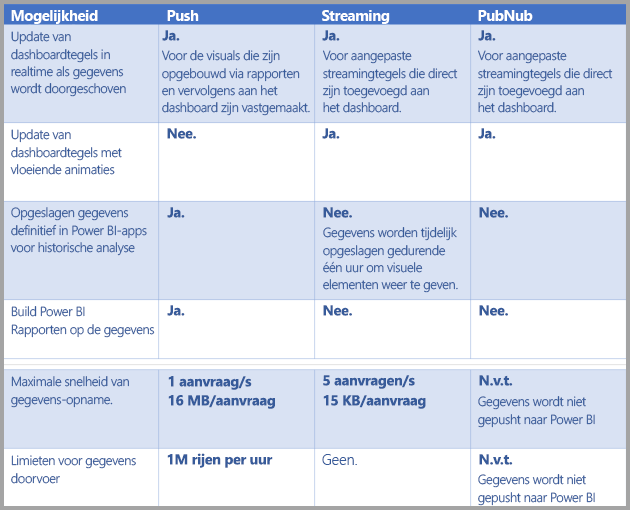

> [!NOTE]
> Raadpleeg [dit MSDN-artikel](https://msdn.microsoft.com/library/dn950053.aspx) voor meer informatie over **push**-limieten voor de hoeveelheid gegevens die kan worden gepusht.
> 
> 

## Gegevens naar gegevenssets pushen
In de vorige sectie worden de drie belangrijkste typen realtimegegevenssets beschreven die u kunt gebruiken in realtimestreaming en hoe deze van elkaar verschillen. In deze sectie wordt aandacht besteed aan het maken en pushen van gegevens naar deze gegevenssets.

Er zijn in hoofdlijnen drie manieren om gegevens naar een gegevensset te pushen:

* Met de REST-API's van Power BI
* Met behulp van de gebruikersinterface voor streaminggegevenssets
* Met Azure Stream Analytics

We gaan deze verschillende manieren hieronder afzonderlijk bespreken.

### Gegevens pushen met behulp van REST-API's van Power BI
**REST-API's van Power BI** kunnen worden gebruikt voor het maken en verzenden van gegevens naar **push**-gegevenssets en **streaming**gegevenssets. Wanneer u een gegevensset maakt met behulp van REST-API's van Power BI, bepaalt de vlag *defaultMode* of de gegevensset van het type push of streaming is. Als er geen vlag *defaultMode* is ingesteld, wordt de gegevensset standaard gemaakt als een **push**-gegevensset.

Als de vlag *defaultMode* wordt ingesteld op *pushStreaming*, is de gegevensset een **push**- *en* een **streaming**-gegevensset, met dus de voordelen van beide typen gegevensset. In het REST-API-[artikel voor **Create Dataset** ](https://msdn.microsoft.com/library/mt203562.aspx) wordt uitgelegd hoe u een streaminggegevensset maakt en ziet u ook hoe de vlag *defaultMode* werkt.

> [!NOTE]
> Wanneer u gegevenssets gebruikt met de vlag *defaultMode* ingesteld op *pushStreaming*, en een aanvraag de beperking van 15 kB voor een **streaming**gegevensset overschrijdt, maar kleiner is dan de limiet van 16 MB voor een **push**-gegevensset, kan de aanvraag worden uitgevoerd en worden de gegevens in de pushgegevensset bijgewerkt. Het streamen van gegevens naar tegels mislukt dan echter tijdelijk.
> 
> 

Nadat er een gegevensset is gemaakt, gebruikt u de REST-API's om gegevens te pushen met behulp van de API [**Add rows**](https://msdn.microsoft.com/library/mt203561.aspx), zoals [wordt gedemonstreerd in dit artikel](https://msdn.microsoft.com/library/mt203561.aspx).

Alle aanvragen naar REST-API's zijn beveiligd met **Azure AD OAuth**.

### Gegevens pushen met behulp van de gebruikersinterface voor streaminggegevenssets
In de Power BI-service kunt u een gegevensset maken door de **API**-aanpak te volgen benaderen zoals wordt weergegeven in de volgende afbeelding.

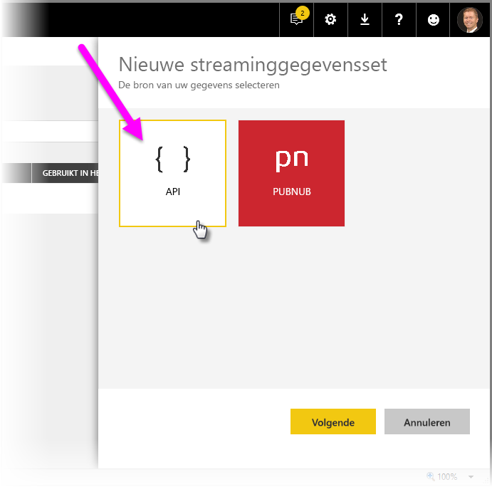

Wanneer u de nieuwe streaminggegevensset maakt, kunt u de optie **Analyse van historische gegevens** inschakelen (zie hieronder), die een aanzienlijke invloed heeft.

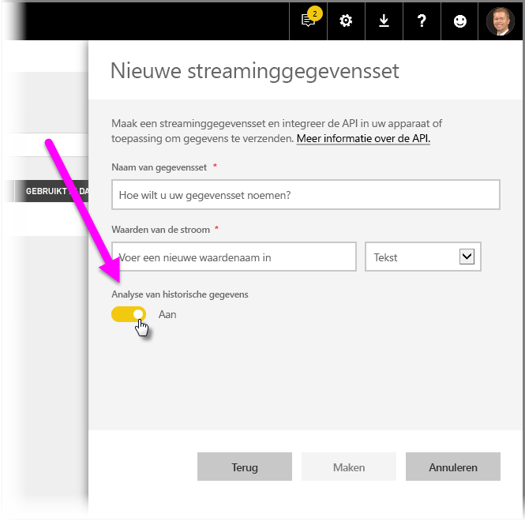

Als **Analyse van historische gegevens** is uitgeschakeld (dit is de standaardinstelling), wordt er een **streaminggegevensset** gemaakt zoals eerder in dit artikel wordt beschreven. Als **Analyse van historische gegevens** is *ingeschakeld*, wordt er een gegevensset gemaakt die zowel een **streaminggegevensset** als een **pushgegevensset** is. Dit komt overeen met het gebruiken van de REST-API's van Power BI voor het maken van een gegevensset met de vlag *defaultMode* ingesteld op *pushStreaming*, zoals eerder in dit artikel wordt beschreven.

> [!NOTE]
> Voor streaminggegevenssets die zijn gemaakt met behulp van de gebruikersinterface van de Power BI-service, zoals wordt beschreven in de vorige alinea, is geen Azure AD-verificatie vereist. In dergelijke gegevenssets ontvangt de eigenaar van de gegevensset een URL met een rowkey waarmee de aanvrager toestemming krijgt om gegevens naar de gegevensset te pushen, zonder dat hiervoor een bearer-token van Azure AD OAuth nodig is. De aanpak via Azure AD (AAD) werkt zo nog steeds om gegevens naar de gegevensset te pushen.
> 
> 

### Gegevens pushen met behulp van Azure Stream Analytics
U kunt Power BI toevoegen als een uitvoer aan **Azure Stream Analytics** (ASA) en die gegevensstromen vervolgens in real time visualiseren in de Power BI-service. In deze sectie vindt u technische informatie over hoe dat proces plaatsvindt.

Azure Stream Analytics maakt gebruik van de REST-API's van Power BI voor het maken van de uitvoerstroom met gegevens voor Power BI. Hierbij wordt *defaultMode* ingesteld op *pushStreaming* (zie eerdere secties in dit artikel voor meer informatie over *defaultMode*), wat resulteert in een gegevensset die geschikt is voor zowel het **pushen** als **streamen** van gegevens. Tijdens het maken van de gegevensset door Azure Stream Analytics, wordt ook de vlag **retentionPolicy* ingesteld op *basicFIFO*. Met deze instelling kunnen in de database die deze pushgegevensset ondersteunt, 200.000 rijen worden opgeslagen. Als deze limiet is bereikt, worden rijen verwijderd op basis van FIFO.

> [!CAUTION]
> Als uw Azure Stream Analytics-query zeer snelle uitvoer naar Power BI oplevert (bijvoorbeeld een of twee keer per seconde), wordt deze afzonderlijke uitvoer door Azure Stream Analytics in één aanvraag geplaatst. Hierdoor kan de grootte van de aanvraag de streaminglimiet voor tegels overschrijden. In dat geval worden tegels met streaminggegevens niet weergegeven, zoals vermeld in vorige secties. In dergelijke gevallen wordt het aanbevolen om de snelheid van de gegevensuitvoer naar Power BI te vertragen, bijvoorbeeld door het maximum niet in te stellen op elke seconde maar op meer dan tien seconden.
> 
> 

## Realtime-streaminggegevensset instellen in Power BI
U bent nu bekend met de drie belangrijkste typen gegevenssets voor realtimestreaming en de drie belangrijkste manieren om gegevens naar een gegevensset te pushen. Tijd dus om uw realtime-streaminggegevensset aan het werk te zien in Power BI.

Om aan de slag te gaan met realtimestreaming, moet u een keuze maken tussen de twee manieren waarop streaminggegevens kunnen worden verwerkt in Power BI:

* **tegels** met visuele elementen met streaminggegevens
* **gegevenssets** gemaakt op basis van streaminggegevens die aanwezig blijven in Power BI

In beide gevallen moet u **streaminggegevens** instellen in Power BI. Om dit te doen, selecteert u in uw dashboard (een bestaand of nieuw dashboard) de optie **Tegel toevoegen** en selecteert u vervolgens **Aangepaste streaminggegevens**.

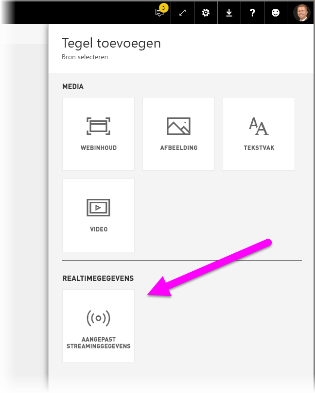

Als u nog geen streaminggegevens hebt ingesteld, kunt u dat doen door **gegevens beheren** te kiezen.

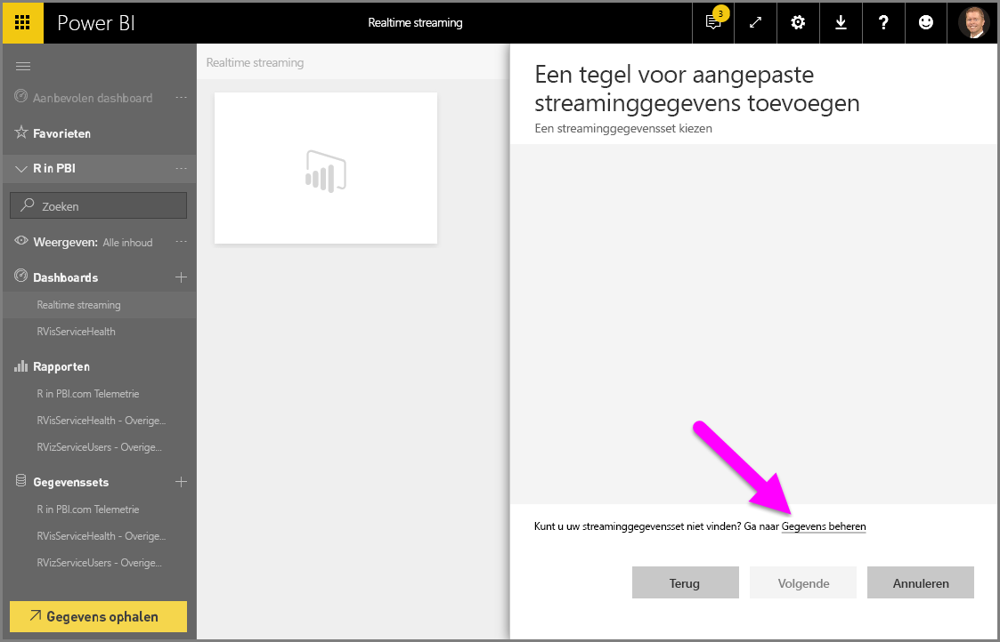

Op deze pagina kunt u het eindpunt van uw streaminggegevensset invoeren, als u deze al hebt gemaakt (in het tekstvak). Als u nog geen streaminggegevensset hebt, selecteert u het plusteken ( **+** ) in de rechterbovenhoek om de beschikbare opties te zien voor het maken van een streaminggegevensset.

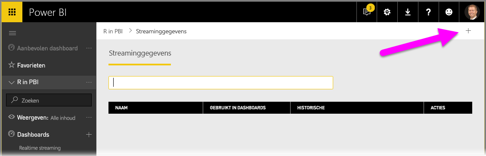

Wanneer u op het pictogram **+** klikt, ziet u twee opties:

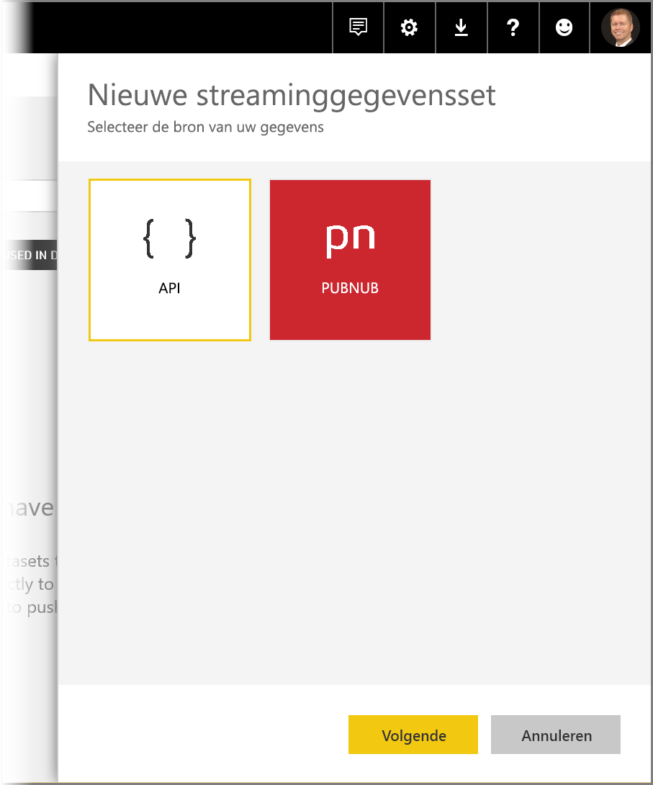

Deze opties worden beschreven in de volgende sectie. Er wordt dan ook dieper ingegaan op het maken van een **tegel** met streaminggegevens of het maken van een **gegevensset** met behulp van de gegevens die uit de bron worden gestreamd. Deze gegevensset kunt u later gebruiken om rapporten samen te stellen.

## Een streaminggegevensset maken met de optie die u het best bevalt
Er zijn twee manieren om een feed met realtime-streaminggegevens te maken die kan worden gebruikt en gevisualiseerd door Power BI:

* **REST-API van Power BI** en een eindpunt voor realtimestreaming
* **PubNub**

In de volgende secties worden deze twee opties uitvoeriger besproken.

### REST-API van Power BI gebruiken
**REST-API van Power BI** -De REST-API van Power BI is onlangs verbeterd met als doel realtimestreaming eenvoudiger te maken voor ontwikkelaars. Wanneer u **API** selecteert in het venster **Nieuwe streaminggegevensset**, krijgt u de beschikking over opties om Power BI verbinding te laten maken met uw eindpunt en dit te gebruiken:

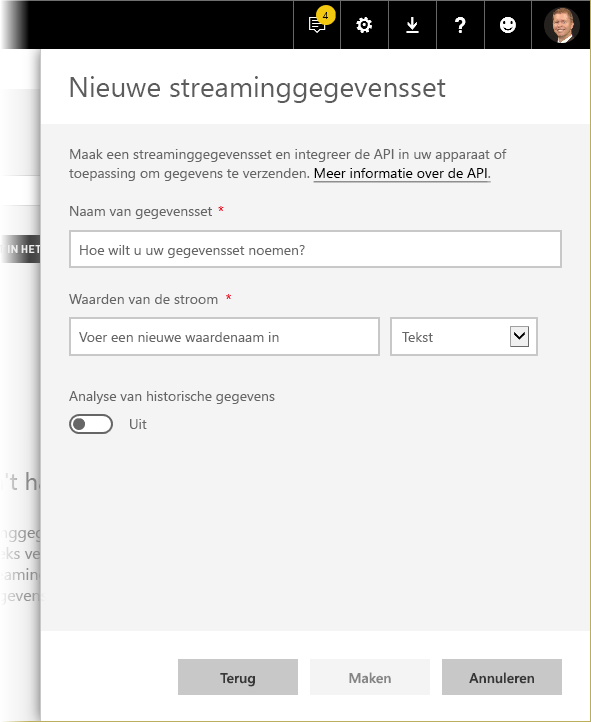

Als u wilt dat Power BI de gegevens opslaat die worden verzonden via deze gegevensstroom, schakelt u de optie *Analyse van historische gegevens* in. U kunt dan rapportages en analyses uitvoeren op de verzamelde gegevens. [Meer informatie over de API](https://msdn.microsoft.com/library/dn877544.aspx).

Als u de gegevensstroom hebt gemaakt, krijgt u de URL voor het eindpunt van de REST-API. Deze URL kan door de toepassing via *POST*-aanvragen worden aangeroepen om uw gegevens te pushen naar de **streaming**-gegevensset van Power BI die u hebt gemaakt.

Bij het opstellen van *POST*-aanvragen is het belangrijk dat de hoofdtekst van de aanvraag overeenkomt met de voorbeeld-JSON die wordt aangeboden in de gebruikersinterface van Power BI. Verpak uw JSON-objecten bijvoorbeeld in een matrix.

### PubNub gebruiken
De integratie van **PubNub**-streaming met Power BI maakt het mogelijk om bestaande **PubNub**-gegevensstromen met lage latentie te gebruiken in Power BI. U kunt natuurlijk ook nieuwe stromen maken. Wanneer u **PubNub** selecteert en vervolgens **Volgende** kiest, ziet u het volgende venster:

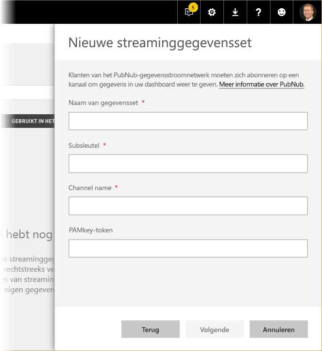

> [!WARNING]
> PubNub kanalen kunnen worden beveiligd met een PAM-verificatiesleutel (PubNub Access Manager). Deze sleutel wordt gedeeld met alle gebruikers die toegang tot het dashboard hebben. Lees hier [meer informatie over PubNub-toegangsbeheer](https://www.pubnub.com/docs/web-javascript/pam-security).
> 
> 

**PubNub**-gegevensstromen zijn vaak erg omvangrijk, en zijn niet altijd geschikt om in hun oorspronkelijke vorm te worden gebruikt voor opslag en historische analyse. Als u Power BI wilt gebruiken voor een historische analyse van PubNub-gegevens, moet u de onbewerkte PubNub-stroom aggregeren en dan verzenden naar Power BI. [Azure Stream Analytics](https://azure.microsoft.com/services/stream-analytics/) is één manier om dat te doen.

## Voorbeeld van realtimestreaming in Power BI
Hier volgt een kort voorbeeld van de werking van realtimestreaming in Power BI. U kunt het voorbeeld volgen om zelf te zien wat de toegevoegde waarde is van realtimestreaming.

In dit voorbeeld gebruiken we een vrij toegankelijke stream van **PubNub**. Dit zijn de stappen:

1. Selecteer in de **Power BI-service** een dashboard (of maak een nieuw), selecteer **Tegel toevoegen** > **Aangepaste streaminggegevens** en selecteer vervolgens de knop **Volgende**.
   
   
2. Als u nog geen bronnen voor streaminggegevens hebt, selecteert u de koppeling **gegevens beheren** (net boven de knop **Volgende**) en selecteert u daarna **+ Streaminggegevens toevoegen** via de koppeling rechtsboven in het venster. Selecteer **PubNub** en selecteer vervolgens **Volgende**.
3. Geef een naam op voor de gegevensset, plak de volgende waarden in het venster dat wordt weergegeven en selecteer ten slotte **Volgende**:
   
   *Subsleutel:*
   
       sub-c-5f1b7c8e-fbee-11e3-aa40-02ee2ddab7fe
   *Kanaalnaam:*
   
       pubnub-sensor-network
   
   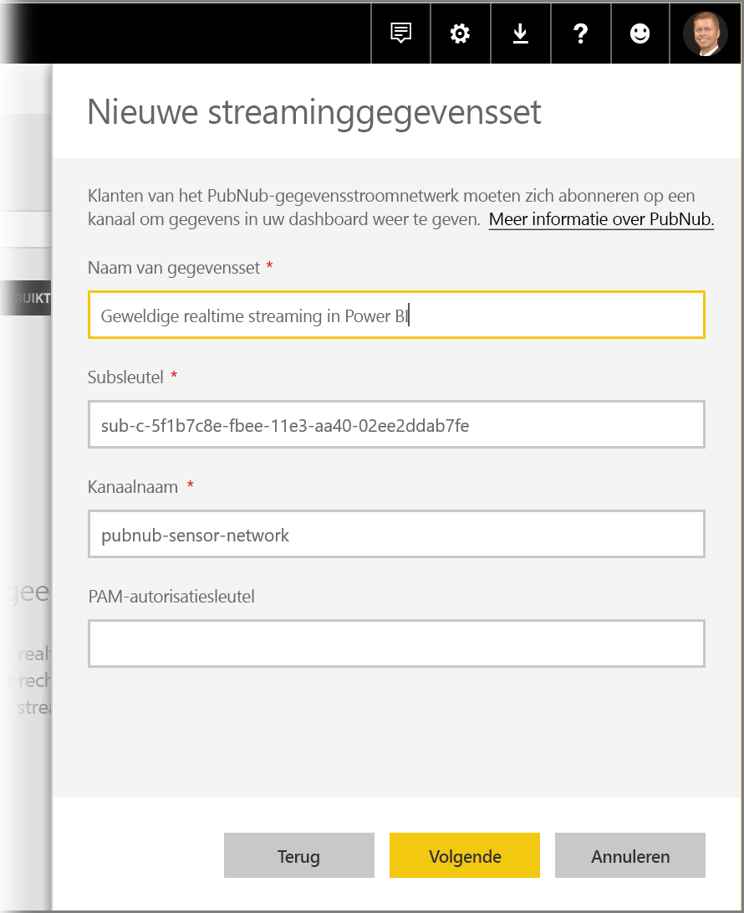
4. In het volgende venster kunt u de standaardinstellingen laten staan (deze worden automatisch ingevuld). Selecteer vervolgens **Maken**.
   
   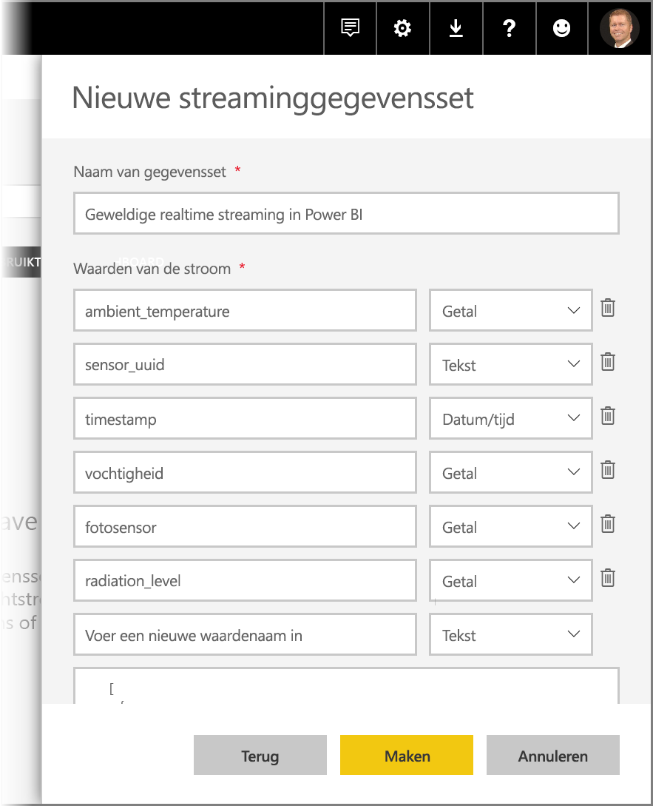
5. U keert terug naar de werkruimte van Power BI, waar u een nieuw dashboard maakt en vervolgens een tegel toevoegt (zie eventueel de bovenstaande stappen voor instructies). Als u nu een tegel maakt en **Aangepaste streaminggegevens** selecteert, beschikt u over een streaminggegevensset waarmee u aan de slag kunt. U kunt het beste gewoon wat dingen uitproberen. Als u *getal*velden toevoegt aan de lijndiagrammen en vervolgens andere tegels toevoegt, krijgt u een realtimedashboard dat er ongeveer zo uitziet:
   
   

U kunt het voorbeeld van de gegevensset gebruiken om te experimenteren. Vervolgens kunt u zelf gegevenssets maken en live-gegevens naar Power BI streamen.

## Vragen en antwoorden
Hier volgen enkele veelgestelde vragen over realtimestreaming in Power BI, en natuurlijk de antwoorden.

#### Kan ik filters gebruiken met een pushgegevensset? En met een streaminggegevensset?
Streaminggegevenssets bieden helaas geen ondersteuning voor filteren. Voor pushgegevenssets kunt u een rapport maken, het rapport filteren en de gefilterde visuele elementen vervolgens aan een dashboard vastmaken. Er is echter geen manier om het filter voor visuele elementen te wijzigen nadat deze zich in het dashboard bevinden.

Het is ook mogelijk om de live-rapporttegel aan het dashboard vast te maken. In dat geval is het wel mogelijk om de filters te wijzigen. Live-rapporttegels worden echter niet in real time bijgewerkt wanneer er gegevens binnenkomen. U zult het visuele element dan handmatig moeten bijwerken met behulp van de optie *Dashboardtegels vernieuwen* in het menu **Meer**.

Als u filters toepast op pushgegevenssets met *Datum/tijd*-velden met een precisie van milliseconden, worden *equivalentie*-operatoren niet ondersteund. Operatoren zoals groter dan (>) of kleiner dan (<) werken wel goed.

#### Hoe kan ik de nieuwste waarde zien in een pushgegevensset? En in een streaminggegevensset?
Streaminggegevenssets zijn ontworpen voor het weergeven van de recentste gegevens. U kunt het visuele element voor streaminggegevens **Kaart** gebruiken om eenvoudig de nieuwste numerieke waarden te zien. Kaarten bieden helaas geen ondersteuning voor gegevens van het type *Datum/tijd* of *Tekst*.
Voor pushgegevenssets kunt u proberen een visueel rapportelement te maken met behulp van het filter Laatste N. Er moet dan wel een tijdstempel zijn opgenomen in het schema.

#### Kan ik verbinding maken met push- of streaminggegevenssets in Power BI Desktop?
Dit is helaas niet mogelijk op dit moment.

#### Naar aanleiding van het antwoord op de vorige vraag; hoe kan ik modellering toepassen op realtimegegevenssets?
Modellering is niet mogelijk voor een streaminggegevensset, aangezien de gegevens niet permanent worden opgeslagen. Voor een pushgegevensset kunt u met de REST-API's voor gegevensset/tabel bijwerken metingen en relaties toevoegen. Meer informatie kunt u lezen in het artikel over [Update Table Schema](https://msdn.microsoft.com/library/mt203560.aspx) en over [eigenschappen van gegevenssets](https://msdn.microsoft.com/library/mt742155.aspx).

#### Hoe kan ik alle waarden van een pushgegevensset wissen? En voor een streaminggegevensset?
Voor een pushgegevensset kunt u de REST-API delete rows gebruiken. U kunt ook een speciale tool gebruiken die fungeert als een wrapper voor de REST-API's. Er is op dit momenteel geen manier beschikbaar om gegevens te wissen uit een streaminggegevensset. Het is wel zo dat de gegevens automatisch worden gewist na een uur.

#### Ik heb uitvoer van Azure Stream Analytics omgeleid naar Power BI, maar ik zie de uitvoer niet in Power BI. Wat doe ik fout?
Hier is een checklist die u kunt volgen om het probleem op te lossen:

1. Herstart de Azure Stream Analytics-taak (taken die zijn gemaakt voor de algemene release van de streamingversie, moeten opnieuw worden gestart)
2. Probeer de Power BI-verbinding in Azure Stream Analytics opnieuw te autoriseren
3. Welke werkruimte hebt u opgegeven in de uitvoer van Azure Stream Analytics? Wordt deze (zelfde) werkruimte ook ingecheckt in de Power BI-service?
4. Wordt de uitvoer van de Azure Stream Analytics-query expliciet omgeleid naar de uitvoer van Power BI? (met behulp van het sleutelwoord INTO)
5. Is er sprake van een gegevensstroom door de Azure Stream Analytics-taak? De gegevensset wordt alleen gemaakt als er gegevens worden verzonden.
6. Kunt u kijken of er fouten of waarschuwingen staan in de logboeken van Azure Stream Analytics?

## Volgende stappen
Hier volgen enkele koppelingen naar Engelstalige informatiebronnen die handig kunnen zijn bij het werken met realtimestreaming in Power BI:

* [Overview of Power BI REST API](https://msdn.microsoft.com/library/dn877544.aspx)
* [Power BI REST API limitations](https://msdn.microsoft.com/library/dn950053.aspx)
* [REST-API-artikel voor **Create Dataset**](https://msdn.microsoft.com/library/mt203562.aspx)
* [**REST-API-artikel voor Add Rows**](https://msdn.microsoft.com/library/mt203561.aspx)
* [Azure Stream Analytics](https://azure.microsoft.com/services/stream-analytics/)

