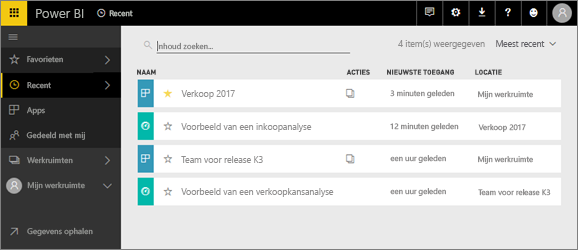
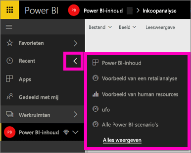
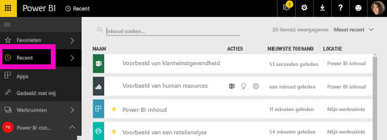

# **Recente** inhoud in Power BI-service

## Wat is recente inhoud
Recente inhoud zijn de laatste items die u hebt bezocht. Dit zijn maximaal 20 items.  Deze omvatten: dashboards, rapporten, apps en de werkmappen voor al uw werkruimten.

Kijk hoe Amanda laat zien hoe inhoudslijsten voor **Recent** worden gevuld. Volg vervolgens de stapsgewijze instructies onder de video om het zelf te proberen.

<iframe width="560" height="315" src="https://www.youtube.com/embed/G26dr2PsEpk" frameborder="0" allowfullscreen></iframe>

## Recente inhoud weergeven
Selecteer de pijl rechts van **Recent** in de linkernavigatiebalk voor een overzicht van de vijf meest recent bezochte items.  Hier kunt u recent geopende inhoud selecteren om te openen. Alleen de vijf meest recente items worden weergegeven.

Als u meer dan vijf onlangs bezochte items hebt, selecteert u **Alles weergeven** om het scherm Recent te openen (zie hieronder). U kunt ook **Recent** of het pictogram Recent  gebruiken in het linker navigatievenster.

Van hieruit kunt u met de inhoud werken zoals u zou doen op de afzonderlijke schermen van de [ **dashboards**](service-dashboards.md), [ **rapporten**](service-reports.md) en  **werkmappen** tabbladen en [ **apps** ](service-install-use-apps.md).

## Volgende stappen
[Power BI-service apps](service-install-use-apps.md)

Nog vragen? [Misschien dat de Power BI-community het antwoord weet](http://community.powerbi.com/)

