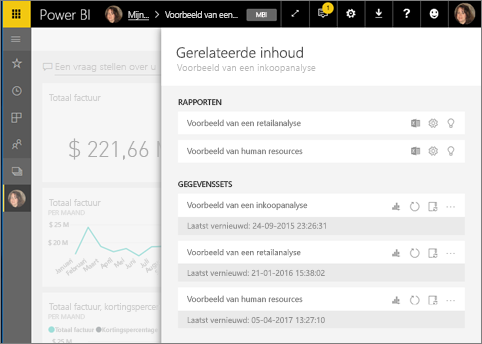
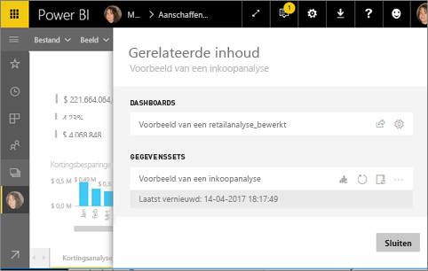
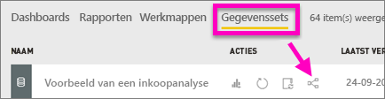
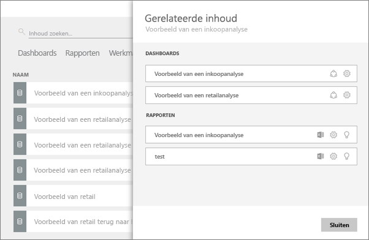

# Gerelateerde inhoud in Power BI-service bekijken
In het deelvenster **Gerelateerde inhoud** ziet u hoe uw Power BI-service-inhoud -- dashboards, rapporten en gegevenssets -- onderling zijn verbonden.  En het wordt nog beter. Vanuit dit deelvenster kunt u gemeenschappelijke taken uitvoeren zoals vernieuwen, hernoemen, inzichten genereren, en nog veel meer. Selecteer een gerelateerd rapport of dashboard en het wordt geopend in uw Power BI-werkruimte.   

Zoals u waarschijnlijk al hebt ontdekt, zijn rapporten gebaseerd op gegevenssets, worden visualisaties van rapporten vervolgens vastgemaakt aan dashboards en worden dashboardvisualisaties teruggekoppeld naar rapporten. Maar hoe weet u op welke dashboards visualisaties uit uw marketingrapport worden gehost? En hoe kunt u deze dashboards vinden? Maakt uw Inkoop-dashboard gebruik van visualisaties uit meer dan één gegevensset? Zo ja, hoe worden ze genoemd en hoe kunt u ze openen en bewerken? Wordt uw HR-gegevensset gebruikt in rapporten of dashboards of kan deze worden verplaatst zonder dat er verbroken koppelingen ontstaan? Vragen als deze kunnen allemaal worden beantwoord op het deelvenster **Gerelateerde inhoud**.  Het deelvenster toont niet alleen de gerelateerde inhoud, maar stelt u ook in staat om actie te ondernemen op de inhoud en eenvoudig te navigeren tussen de gerelateerde content.

> [!NOTE]
> De functie gerelateerde inhoud werkt niet voor het streamen van gegevenssets.
> 
> 

## Gerelateerde inhoud voor een dashboard weergeven
Bekijk hoe Will gerelateerde inhoud voor een dashboard weergeeft. Volg vervolgens de stapsgewijze instructies onder de video om het zelf te proberen met behulp van de gegevensset van het voorbeeld van een inkoopanalyse.

<iframe width="560" height="315" src="https://www.youtube.com/embed/B2vd4MQrz4M#t=3m05s" frameborder="0" allowfullscreen></iframe>

U hebt ten minste *weergavemachtigingen* nodig voor een dashboard om het deelvenster **Gerelateerde inhoud** te openen. In dit voorbeeld gebruiken we het [Voorbeeld van een inkoopanalyse](sample-procurement.md).

**Methode 1**

Selecteer in een werkruimte het tabblad **Dashboards** en selecteer vervolgens het pictogram **Gerelateerde items weergeven**.

 

**Methode 2**

Open een dashboard en selecteer  in de bovenste menubalk.

Het deelvenster **Gerelateerde inhoud** wordt geopend. Het laat alle rapporten zien waarvan de visualisaties zijn vastgemaakt aan het dashboard en de bijbehorende gegevenssets. Voor dit dashboard zijn er visualisaties van 3 verschillende rapporten vastgemaakt en die rapporten zijn gebaseerd op 3 verschillende gegevenssets.

Vanaf hier kunt u direct met de gerelateerde inhoud aan de slag.  Selecteer bijvoorbeeld de naam van een rapport om het te openen.  Selecteer voor een vermeld rapport een pictogram voor [analyseren in Excel](service-analyze-in-excel.md), [hernoemen](service-rename.md)of [inzichten verkrijgen](service-insights.md). Selecteer voor een gegevensset een pictogram voor [een nieuw rapport aanmaken](service-report-create-new.md), [vernieuwen](refresh-data.md), hernoemen, [analyseren in Excel](service-analyze-in-excel.md), [inzichten verkrijgen](service-insights.md)of open het venster **Instellingen** voor de gegevensset.  

## Gerelateerde inhoud voor een rapport weergeven
U hebt ten minste *weergavemachtigingen* voor een rapport nodig om het deelvenster **Gerelateerde inhoud** te openen. In dit voorbeeld gebruiken we het [Voorbeeld van een inkoopanalyse](sample-procurement.md).

**Methode 1**

Selecteer in een werkruimte het tabblad **Rapporten** en selecteer vervolgens het pictogram **Gerelateerde items weergeven**.

 
**Methode 2**

Open het rapport in [Leesweergave](service-reading-view-and-editing-view.md) en selecteer  in de bovenste menubalk.

Het deelvenster **Gerelateerde inhoud** wordt geopend. De bijbehorende gegevensset en alle dashboards waaraan minstens één tegel uit het rapport zijn vastgemaakt, worden weergegeven. Voor dit rapport zijn er visualisaties die zijn vastgemaakt aan 2 verschillende dashboards.

Vanaf hier kunt u direct met de gerelateerde inhoud aan de slag.  Selecteer bijvoorbeeld de naam van een dashboard om het te openen.  Selecteer een pictogram voor een dashboard in de lijst om [het dashboard te delen met anderen](service-share-dashboards.md) of open het venster **Instellingen** voor het dashboard. Selecteer voor de gegevensset een pictogram voor [een nieuw rapport aanmaken](service-report-create-new.md), [vernieuwen](refresh-data.md), hernoemen, [analyseren in Excel](service-analyze-in-excel.md), [inzichten verkrijgen](service-insights.md)of open het venster **Instellingen** voor de gegevensset.  

## Gerelateerde inhoud voor een gegevensset weergeven
U hebt ten minste *weergavemachtigingen* voor een gegevensset nodig om het deelvenster **Gerelateerde inhoud** te openen. In dit voorbeeld gebruiken we het [Voorbeeld van een inkoopanalyse](sample-procurement.md).

Selecteer in een werkruimte het tabblad **Gegevenssets** en selecteer vervolgens het pictogram **Gerelateerde items weergeven**.

Selecteer het pictogram om het deelvenster **Gerelateerde inhoud**  te openen.

Vanaf hier kunt u direct met de gerelateerde inhoud aan de slag.  Selecteer bijvoorbeeld de naam van een dashboard of rapport om het te openen.  Selecteer een pictogram voor een dashboard in de lijst om [het dashboard te delen met anderen](service-share-dashboards.md) of open het venster **Instellingen** voor het dashboard. Selecteer voor een rapport een pictogram voor [analyseren in Excel](service-analyze-in-excel.md), [hernoemen](service-rename.md)of [inzichten verkrijgen](service-insights.md).  

## Beperkingen en probleemoplossing
* Als uw browser niet genoeg ruimte heeft, ziet u geen optie voor **Gerelateerde items weergeven**, maar ziet u nog steeds het pictogram Gerelateerde items weergeven . Selecteer het pictogram om het deelvenster **Gerelateerde inhoud**  te openen.
* Als u gerelateerde inhoud voor een rapport wilt openen, moet u in de [Leesweergave](service-reading-view-and-editing-view.md) zijn.
* Gerelateerde inhoud is niet beschikbaar in Power BI Desktop.
* De functie Gerelateerde inhoud werkt niet voor het streamen van gegevenssets.

## Volgende stappen
* [Aan de slag met Power BI Service](service-get-started.md)
* Nog vragen? [Misschien dat de Power BI-community het antwoord weet](http://community.powerbi.com/)

