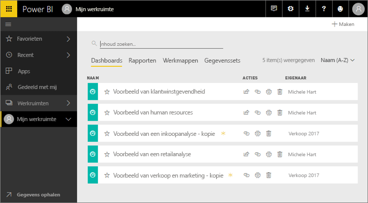
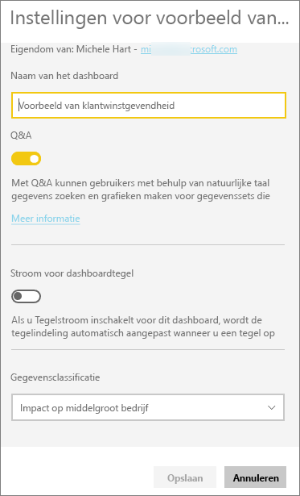
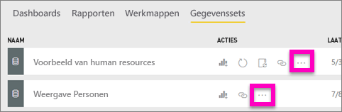
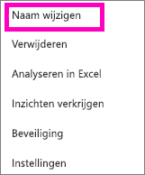
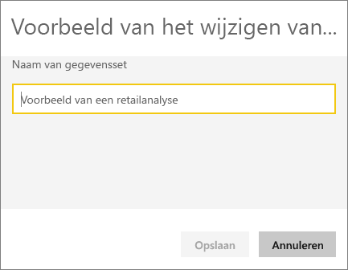
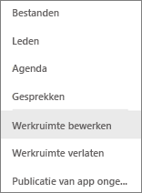
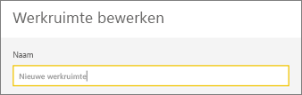
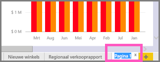
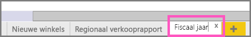

# In de Power BI-service kunt u van vrijwel alles de naam wijzigen
In dit artikel leert u hoe u de naam van een dashboard, rapport, rapportpagina, werkmap, gegevensset, app en werkruimte wijzigt in de Power BI-service.

**Kan ik de naam wijzigen?**

| Inhoudstype | Ik ben de auteur of maker | Gedeeld met mij |
| --- | --- | --- |
| Dashboard in een werkruimte |Ja |Nee |
| Rapport in een werkruimte |Ja |Nee |
| Werkmap in een werkruimte |Ja |Nee |
| Gegevensset in een werkruimte |Ja |Nee |
| App-werkruimte |Ja, als u de eigenaar bent of beheerdersmachtigingen hebt |Nee |
| Gepubliceerde apps |Niet via het app-scherm. U kunt de naam van de app wijzigen in de app-werkruimte en deze opnieuw publiceren met de nieuwe naam. Hiervoor moet u wel over beheerdersmachtigingen beschikken |Nee |
| App-inhoud (dashboard, report, werkmap, gegevensset) |Niet via het app-scherm. U kunt de naam van de inhoud van de app wijzigen in de app-werkruimte en de inhoud vervolgens opnieuw publiceren met de nieuwe naam. Hiervoor moet u wel over beheerdersmachtigingen beschikken |Nee |
| Inhoud in **Gedeeld met mij** |Nee |Nee |

## De naam van een dashboard, rapport of werkmap wijzigen
1. Open een werkruimte en selecteer het tabblad **Dashboards**, **Rapporten** of **Werkmappen**. Beweeg de muisaanwijzer over het item waarvan u de naam wilt wijzigen en selecteer het tandwielpictogram . Als er geen tandwielpictogram beschikbaar is, bent u niet gemachtigd om de naam te wijzigen.
   
   
2. Typ de nieuwe naam op de pagina Instellingen en selecteer **Opslaan**.
   
   

## De naam van een gegevensset wijzigen
1. Open een werkruimte en selecteer het tabblad **Gegevenssets**.
   
   
2. Beweeg met de muis over het item waarvan u de naam wilt wijzigen, selecteer de weglatingstekens (...), en kies **Naam wijzigen**.  
   
      
   
   > [!NOTE]
   > De opties in de vervolgkeuzelijst variëren.
   > 
   > 
3. Typ en nieuwe naam op de pagina Instellingen en selecteer **Opslaan**.
   
     

## De naam van een app-werkruimte wijzigen
Iedereen met beheerdersmachtigingen kan de naam van een app-werkruimte wijzigen.

1. Start in de werkruimte waarvan u de naam wilt wijzigen.
2. Selecteer in de rechterbovenhoek de weglatingstekens (...) en kies **Werkruimte bewerken**. Als u deze optie niet ziet, bent u niet gemachtigd om de naam van deze werkruimte te wijzigen. 
   
    
3. Typ een nieuwe naam voor de werkruimte en selecteer**Opslaan**.
   
   

## De naam van een pagina in een rapport wijzigen
Niet tevreden over de naam van een pagina in uw Power BI-rapport?  U kunt in slechts een paar klikken de naam wijzigen. De naam van een pagina kan worden gewijzigd in de [weergave voor het bewerken van rapporten](service-interact-with-a-report-in-editing-view.md).

1. Open het rapport in de [bewerkingsweergave](consumer/end-user-reading-view.md).
2. Zoek de tabbladen voor de rapportpagina's onder aan het Power BI-venster.
   
    
3. Open de rapportpagina waarvan u de naam wilt wijzigen door het tabblad te selecteren.
4. Dubbelklik op de naam op het tabblad om deze te markeren.  
   
    
5. Typ een nieuwe naam voor de rapportpagina en selecteer ENTER.
   
    

## Aandachtspunten en probleemoplossing
* Als het item waarvan de naam moet worden gewijzigd, met u is gedeeld of deel uitmaakt van een inhoudspakket, wordt er geen tandwielpictogram weergegeven u hebt geen toegang tot de instellingen.
* Als u geen weglatingstekens (...) op het tabblad **Gegevenssets** ziet, breidt u het browservenster uit.

Nog vragen? [Misschien dat de Power BI-community het antwoord weet](http://community.powerbi.com/)

