# Een nieuw rapport in de Power BI-service maken door een gegevensset te importeren
U hebt [Rapporten in Power BI](service-reports.md) gelezen en u wilt nu uw eigen rapport maken. Er zijn veel verschillende manieren om een rapport te maken. In dit artikel beginnen we met het maken van een zeer eenvoudig rapport vanuit een Excel-gegevensset met de Power BI-service. Als u de basisbeginselen van het maken van een rapport onder de knie hebt, kunt u met de **Volgende stappen** onderaan verder naar meer geavanceerde onderwerpen over rapporten.  

> **TIP**: zie [Een rapport kopiëren](power-bi-report-copy.md) voor informatie over het maken van een rapport op basis van een bestaand rapport.
> 
### Vereisten
- Power BI-service (zie [Rapportweergave in Desktop](desktop-report-view.md) om rapporten te maken met Power BI Desktop)  
- Gegevensset Voorbeeld van een retailanalyse

## De gegevensset importeren
Bij deze methode om een rapport te maken begint u met een gegevensset en een leeg rapportcanvas. Volg ons en [download de Excel-gegevensset Voorbeeld van een retailanalyse](http://go.microsoft.com/fwlink/?LinkId=529778) en sla deze op onder OneDrive voor bedrijven (voorkeur) of lokaal.

1. We maken het rapport in een Power BI-servicewerkruimte. Selecteer daarom een bestaande werkruimte of maak een nieuwe.
   
   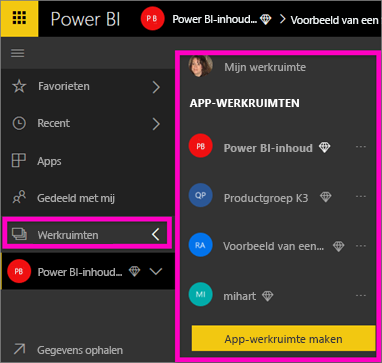
2. Selecteer **Gegevens ophalen** onder in het navigatiedeelvenster aan de linkerkant.
   
   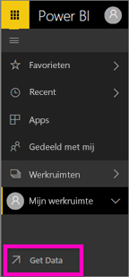
3. Selecteer **Bestanden** en navigeer naar de locatie waar u het voorbeeld van een retailanalyse hebt opgeslagen.
   
    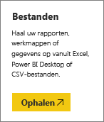
4. Selecteer voor deze oefening **Importeren**.
   
   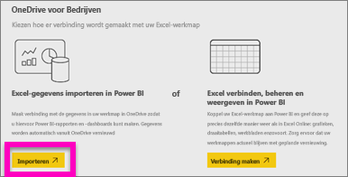
5. Als de gegevensset is geïmporteerd, selecteert u **Gegevensset weergeven**.
   
   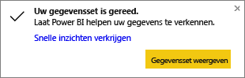
6. Als u een gegevensset bekijkt, wordt de rapporteditor geopend.  U ziet een leeg canvas en de bewerkingshulpmiddelen voor het rapport.
   
   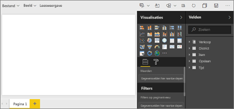

> **TIP**: als u niet weet hoe u een rapportcanvas moet bewerken of als u uw kennis wilt opfrissen, kunt u [een rondleiding van de rapporteditor volgen ](service-the-report-editor-take-a-tour.md) voordat u doorgaat.
> 
> 

## Een radiale meter toevoegen aan het rapport
Nu onze gegevensset is geïmporteerd, kunnen we vragen beantwoorden.  Onze Chief Marketing Officer (CMO) wil weten hoe dicht we de verkoopdoelstellingen voor dit jaar zijn genaderd. Een meter is een [goede visualisatiekeuze](power-bi-report-visualizations.md) om dit soort informatie weer te geven.

1. Selecteer **Verkoop** > **Omzet van dit jaar** > **Waarde** in het deelvenster Velden.
   
    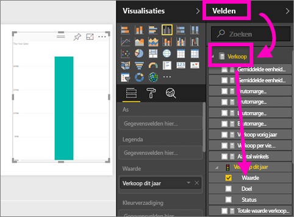
2. Converteer de visual naar een meter door de metersjabloon te selecteren  in het deelvenster **Visualisaties**.
   
    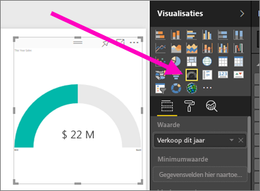
3. Sleep **Verkoop** > **Omzet van dit jaar** > **Doel** naar de bron **Doelwaarde**. Het lijkt erop dat we heel dicht bij ons doel zijn.
   
    
4. Dit is een goed moment om [uw rapport op te slaan](service-report-save.md).
   
   

## Een vlakdiagram en slicer toevoegen aan het rapport
Onze CMO heeft nog een paar vragen voor ons. Ze wil graag weten hoe de omzet dit jaar zich verhoudt tot de omzet van vorig jaar. En ze wil graag de resultaten per district zien.

1. Laten we eerst wat ruimte maken op ons canvas. Selecteer de meter en verplaats deze naar de rechterbovenhoek. Pak en sleep een van de hoeken om het vlak kleiner te maken.
2. Hef de selectie van de meter op. Selecteer **Verkoop** > **Omzet van dit jaar** > **Waarde** in het deelvenster Velden en selecteer **Verkoop**  >  **Omzet van vorig jaar**.
   
    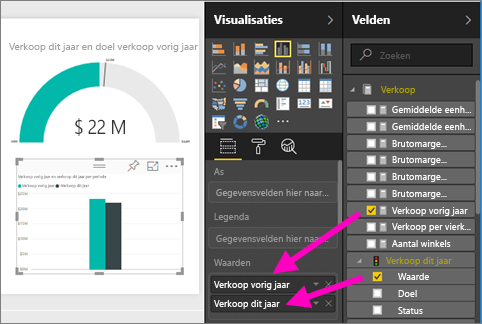
3. Converteer de visual naar een vlakdiagram door de vlakdiagramsjabloon  te selecteren in het deelvenster **Visualisaties**.
4. Selecteer **Tijd** > **Periode** om deze toe te voegen aan de bron **As**.
   
    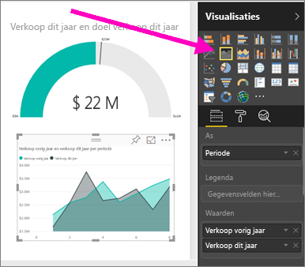
5. Als u de visualisatie wilt sorteren op tijdsperiode, selecteert u de weglatingstekens en kiest u **Sorteren op periode**.
6. Nu gaan we de slicer toevoegen. Selecteer een leeg gebied in het canvas en kies de sjabloon     Slicer. Hiermee wordt een lege slicer aan het canvas toegevoegd.
   
        
7. Selecteer **District** > **District** in het deelvenster Velden. Verplaats de slicer en verander het formaat ervan.
   
    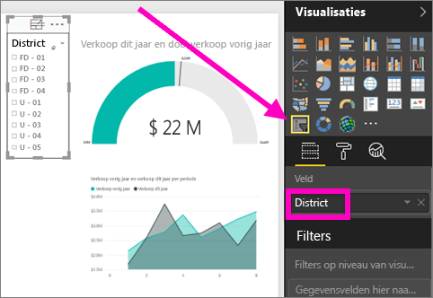  
8. Ga met de slicer zoeken naar patronen en inzichten per district.
   
     

Blijf uw gegevens verkennen en visualisaties toevoegen. Wanneer u interessante inzichten tegenkomt, kunt u deze [vastmaken aan een dashboard](service-dashboard-pin-tile-from-report.md).

## Volgende stappen
* [Een nieuwe pagina aan het rapport toevoegen](power-bi-report-add-page.md)  
* Meer informatie over [visualisaties aan een dashboard vastmaken](service-dashboard-pin-tile-from-report.md)   
* Nog vragen? [Misschien dat de Power BI-community het antwoord weet](http://community.powerbi.com/)

