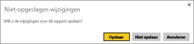
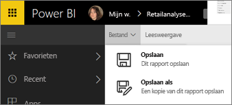
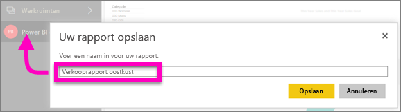

# Een rapport opslaan in de Power BI-service en Power BI Desktop
Nadat u wijzigingen in een rapport in Power BI hebt aangebracht, kunt u het rapport opslaan, opslaan met een nieuwe naam, of sluiten zonder uw wijzigingen op te slaan. Stel dat u het rapport opent, een visualisatie maakt en deze vastmaakt aan uw dashboard. Als u de visualisatie nu sluit zonder op te slaan, blijft de tegel op het dashboard, maar wordt de visualisatie niet in het rapport opgeslagen. Als u op deze tegel op het dashboard klikt, wordt het rapport geopend, maar bestaat de visualisatie niet in het rapport.

> [!TIP]
> Let u op welke werkruimte actief is, zodat u het opgeslagen rapport kunt vinden. Het rapport wordt opgeslagen in de actieve werkruimte.
> 
> 

### Ga als volgt te werk om een rapport op te slaan:
1. Als u probeert te navigeren vanuit een rapport en het rapport is gewijzigd, wordt een prompt weergegeven in Power BI.
   
   
2. U kunt het rapport ook op een andere manier opslaan, door **BESTAND** \> **Opslaan** of **Opslaan als** te selecteren. Als u zich in de [Leesweergave](service-reading-view-and-editing-view.md) bevindt, ziet u alleen de optie Opslaan als. 
   
   
3. Als dit een nieuw rapport (Opslaan) is of een nieuwe versie van een bestaand rapport (Opslaan als), geeft u het rapport een beschrijvende naam.  **Het rapport wordt toegevoegd aan de actieve werkruimte**.
   
    

### Volgende stappen
Lees meer over [rapporten in Power BI](service-reports.md)

[Power BI - basisconcepten](service-basic-concepts.md)

Hebt u nog vragen? [Misschien dat de Power BI-community het antwoord weet](http://community.powerbi.com/)

