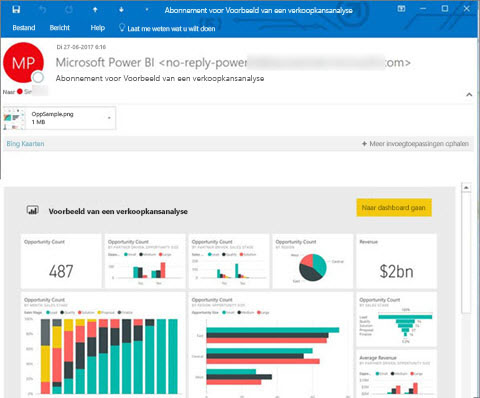
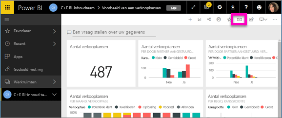
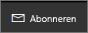
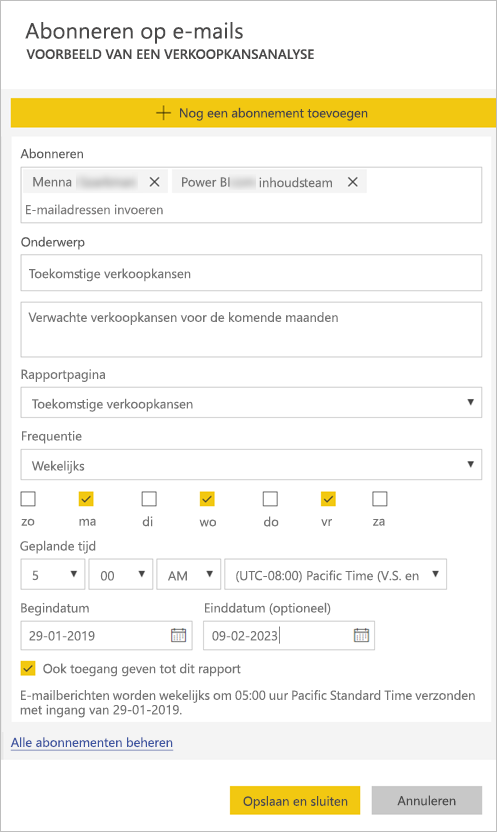
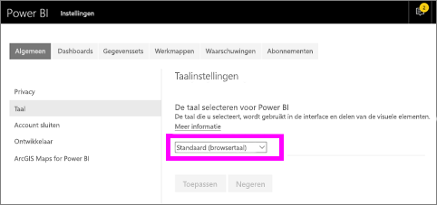
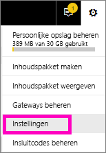
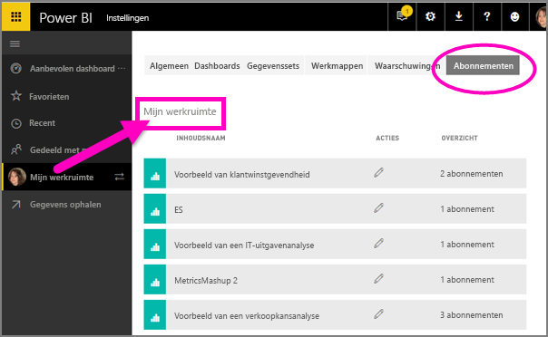

# Uzelf en anderen abonneren op een rapport of dashboard in de Power BI-service

U kunt uzelf en uw collega's abonneren op de rapportpagina's en dashboards die voor u het belangrijkst zijn, zodat u een e-mail van Power BI in uw postvak ontvangt met een momentopname. U geeft aan in Power BI hoe vaak u de e-mailberichten wilt ontvangen: dagelijks, wekelijks, of eenmaal daags na de initiële vernieuwing van gegevens.  Als u dagelijks of wekelijks kiest, kunt u de tijd(en) kiezen waarop u graag wilt dat het abonnement wordt uitgevoerd.  Alles met elkaar kunt u maximaal 24 verschillende abonnementen per dag voor elke rapportpagina en elk dashboard instellen.

 

U kunt alleen abonnementen maken in de Power BI-service. U ontvangt een e-mail met een momentopname van de rapportpagina of het dashboard met een koppeling voor het openen van het rapport of dashboard. Wanneer deze koppeling wordt geselecteerd op een mobiel apparaat waarop Power BI-apps zijn geïnstalleerd, wordt de Power BI-app gestart in plaats van dat het rapport of het dashboard op de website van Power BI wordt geopend.

## Vereisten
- Een abonnement **maken** is een functie van Power BI Pro.
- U hebt geen bewerkingsmachtigingen nodig voor de inhoud (dashboard of rapport) om een abonnement voor uzelf te maken, maar u moet wel over deze machtigingen beschikken om er eentje te maken voor iemand anders. 
- Vanaf januari 2019 hoeft u niet langer de functie Gegevensset vernieuwen te hebben ingesteld om een abonnement uit te voeren.  Deze wordt uitgevoerd onafhankelijk van eventueel geplande vernieuwingen die u hebt ingesteld.  

## Abonneren op een dashboard of een rapportpagina
Het proces voor het abonneren op een dashboard of rapport is vergelijkbaar. U kunt u met dezelfde knop abonneren op dashboards en rapporten van de Power BI-service.
 
.

1. Open het dashboard of het rapport.
2. Selecteer in de bovenste menubalk **Abonneren** of selecteer het enveloppictogram .
   
   

3. Gebruik de gele schuifregelaar om het abonnement in of uit te schakelen.  Als u de schuifregelaar instelt op **Uit**, wordt het abonnement niet verwijderd. Selecteer het prullenbakpictogram om het abonnement te verwijderen.

4. Uw e-mailadres bevindt zich al in het vak **Abonneren**. U kunt tevens andere e-mailadressen toevoegen aan het abonnement, maar alleen in hetzelfde domein. Als het rapport of het dashboard wordt gehost in [Premium-capaciteit](service-premium.md), kunt u andere afzonderlijke e-mailadressen en groepsaliassen abonneren. Als het rapport of het dashboard wordt gehost in Premium-capaciteit, kunt u andere afzonderlijke e-mailadressen en groepsaliassen abonneren. Zie [Aandachtspunten en probleemoplossing](#considerations-and-troubleshooting) hieronder voor uitgebreide informatie. 

5. Vul de gegevens **Onderwerp** en **bericht** voor het e-mailbericht in. 

5. Selecteer een **frequentie** voor uw abonnement: **Dagelijks**, **Wekelijks** of **Nadat gegevens zijn vernieuwd (dagelijks)**.  Als u het e-mailbericht van het abonnement alleen op bepaalde dagen wilt ontvangen, selecteert u **wekelijks** en selecteert u de dagen waarop u het wilt ontvangen.  Als u bijvoorbeeld het e-mailbericht van het abonnement alleen op weekdagen wilt, ontvangen, selecteert u **Wekelijks** en schakelt u de selectievakjes voor de **Za** en **Zo** uit.  

6. Als u kiest voor **Dagelijks** of **Wekelijks**, kunt u ook een **Geplande tijd** voor het abonnement kiezen.  U kunt de verzending op het hele uur of om 15, 30 of 45 minuten erna laten uitvoeren.  Selecteer ochtend (AM) of middag/avond (PM). U kunt ook de tijdzone opgeven.

7. De begindatum voor uw abonnement is standaard de datum waarop u het hebt gemaakt. U hebt de mogelijkheid om een einddatum te selecteren. Als u geen einddatum instelt, is de einddatum automatisch één jaar na de begindatum. U kunt deze op elk gewenst moment wijzigen in ongeacht welke datum in de toekomst (tot het jaar 9999) voordat het abonnement afloopt. Wanneer een abonnement een einddatum heeft bereikt, wordt het stopgezet tenzij u het opnieuw inschakelt. U ontvangt vóór de geplande einddatum een melding/meldingen met de vraag of u wilt verlengen.    

    Merk op in de onderstaande schermafbeelding dat wanneer u zich op een rapport abonneert, u zich feitelijk abonneert op een rapport*pagina*.  Als u zich op meer dan één pagina in een rapport wilt abonneren, selecteert u **Nog een abonnement toevoegen** en selecteert u een andere pagina. 
      
     

7. Selecteer **Opslaan en sluiten**. Degenen die zijn geabonneerd, ontvangen een e-mailbericht en een momentopname van het dashboard of de rapportpagina voor de frequentie en de tijd die u hebt geselecteerd. Alles bij elkaar kunt u maximaal 24 abonnementen per rapport of dashboard maken en kunt u zorgen voor unieke ontvangers, tijden en frequenties voor elk abonnement.  Alle abonnementen die zijn ingesteld op **Nadat gegevens zijn vernieuwd** voor uw dashboard of rapport verzenden nog steeds alleen een e-mailbericht na de eerste geplande vernieuwing.   
      
   > [!TIP]
   > Wilt u het e-mailbericht verzenden direct vanuit een abonnement of op aanvraag op elk gewenst moment? Selecteer **Nu uitvoeren** voor de abonnementen voor het dashboard of rapport dat u wilt verzenden. U ziet een melding dat er een e-mailbericht onderweg is naar iedereen voor dat specifieke abonnement.  U kunt dit zo vaak doen als u wilt. Het wordt niet meegeteld in uw limiet van 24 geplande abonnementsuitvoeringen per dag per rapport of dashboard. Let erop dat u hiermee NIET een vernieuwing van gegevens van de onderliggende gegevensset activeert. 
   > 
   > 
   
## E-mailtalen

De e-mail en momentopname gebruiken de taal die is ingesteld in de instellingen van Power BI (zie [Ondersteunde talen en landen/regio's voor Power BI](supported-languages-countries-regions.md)). Als er geen taal is ingesteld, gebruikt Power BI de taal van de lokale instellingen in uw huidige browser. Als u uw voorkeurstaal wilt bekijken of instellen, selecteert u het tandwielpictogram  > **Instellingen > Algemeen > Taal**. 

## Uw abonnementen beheren
Alleen degene die het abonnement heeft gemaakt, kan dit beheren.  Er zijn twee paden naar het scherm voor het beheren van uw abonnementen.  Voor het eerste pad selecteert u de optie **Alle abonnementen beheren** in het dialoogvenster **Abonneren op e-mails** (zie de schermafbeeldingen onder stap 4 hierboven). Voor het tweede pad selecteert u in de bovenste menubalk het tandwielpictogram  van Power BI en kiest u **Instellingen**.

Welke abonnementen worden weergegeven, is afhankelijk van de werkruimte die op dat moment actief is.  Als u alle abonnementen voor alle werkruimten allemaal in één keer wilt weergeven, moet u ervoor zorgen dat **Mijn werkruimte** actief is. Zie [Werkruimten in Power BI](service-create-workspaces.md) voor meer informatie over werkruimten.

Een abonnement wordt beëindigd als de Pro-licentie is verlopen, de eigenaar het dashboard of rapport verwijdert of het gebruikersaccount wordt verwijderd dat is gebruikt om het abonnement te maken.

## Aandachtspunten en probleemoplossing
* Dashboards met meer dan 25 vastgemaakte tegels of 4 vastgemaakte live-rapportpagina’s worden mogelijk niet volledig weergegeven in naar gebruikers verzonden e-mailberichten voor het abonnement.  Abonnementen op dashboards met meer dan dit aantal tegels worden niet geblokkeerd, maar deze worden beschouwd als niet-ondersteund als u problemen ondervindt en moeten dienovereenkomstig worden aangepast om voor ondersteuning in aanmerking te komen.
* Als voor e-mailabonnementen in een dashboard beveiliging op rijniveau (RLS) is toegepast op een of meer tegels, worden deze tegels niet weergegeven.  Als de gegevensset RLS gebruikt voor e-mailabonnementen voor rapporten, kunt u geen abonnement maken.
* Abonnementen op rapportpagina’s zijn gekoppeld aan de naam van de rapportpagina. Als u zich abonneert op een rapportpagina en daarna de naam ervan wijzigt, moet u uw abonnement opnieuw maken.
* Uw organisatie kan bepaalde instellingen in Azure Active Directory configureren, waardoor de mogelijkheid wordt beperkt om e-mailabonnementen in Power BI te gebruiken.  Deze beperkingen omvatten, maar zijn niet beperkt tot, het gebruik van meervoudige verificatie of beperkingen voor IP-bereik bij het openen van resources.
* Momenteel worden e-mailabonnementen op rapporten/dashboards waarvoor gegevenssets van liveverbindingen worden gebruikt, niet ondersteund wanneer u andere gebruikers dan uzelf abonneert.
* E-mailabonnementen bieden geen ondersteuning voor de [aangepaste visuals](power-bi-custom-visuals.md).  De enige uitzondering hierop vormen de aangepaste visuals die zijn [gecertificeerd](power-bi-custom-visuals-certified.md).  
* E-mailabonnementen bieden op dit moment geen ondersteuning voor de aangepaste R-visuals.  
* Als beveiliging op rijniveau (RLS) is toegepast op een of meer dashboardtegels, worden deze tegels niet weergegeven.
* U kunt andere gebruikers niet abonneren op een rapport waarop RLS is toegepast.
* E-mailabonnementen worden verzonden met de standaard filter- en slicerstatus voor het rapport. De wijzigingen die u aanbrengt in de standaardwaarden nadat u zich abonneert, worden niet weergegeven in het e-mailbericht.    
* Voor dashboardabonnementen geldt dat bepaalde soorten tegels nog niet worden ondersteund.  Hierbij gaat het om: streamingtegels, videotegels, tegels voor aangepaste webinhoud.     
* Als u een dashboard deelt met een collega buiten uw tenant, kunt u niet ook een abonnement maken voor deze collega. Als u aaron@xyz.com bent, kunt u delen met anyone@ABC.com, maar kunt u anyone@ABC.com nog niet abonneren en kunnen zij zich niet abonneren op gedeelde inhoud.      
* Mogelijk kunt u zich vanwege de maximale e-mailgrootte niet abonneren op dashboards of rapporten met extreem grote afbeeldingen.    
* Wanneer dashboards of rapporten langer dan twee maanden niet worden bezocht, wordt de vernieuwing van de bijbehorende gegevenssets automatisch door Power BI onderbroken.  Als u echter een abonnement aan een dashboard of rapport toevoegt, wordt het dashboard of rapport niet onderbroken, ook net als het niet wordt bezocht.    
* Als u geen e-mails voor een abonnement ontvangt, controleert u of uw User Principal Name (UPN) e-mails kan ontvangen. [Het Power BI-team werkt aan een versoepeling van deze vereiste](https://community.powerbi.com/t5/Issues/No-Mail-from-Cloud-Service/idc-p/205918#M10163). 
* Als uw dashboard of rapport zich in Premium-capaciteit bevindt, kunt u e-mailaliassen van een groep gebruiken voor abonnementen, in plaats van alle collega's één voor één met het eigen e-mailadres te abonneren. De aliassen zijn gebaseerd op de huidige Active Directory. 

## Volgende stappen
* Nog vragen? [Misschien dat de Power Bi-community het antwoord weet](http://community.powerbi.com/).    
* [Lees het blogbericht](https://powerbi.microsoft.com/blog/introducing-dashboard-email-subscriptions-a-360-degree-view-of-your-business-in-your-inbox-every-day/)

