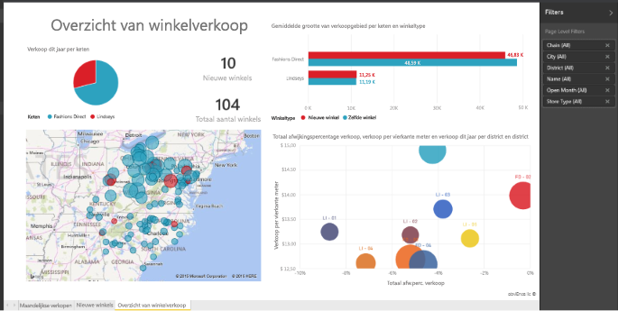

# Rapporten in Power BI
## Wat is een Power BI-rapport?
Een Power BI-***rapport*** biedt een meervoudige weergave van een gegevensset, met visualisaties die andere bevindingen en inzichten uit die gegevensset weergeven.  Een rapport kan één visualisatie of pagina's vol visualisaties hebben. Afhankelijk van uw functie bent u mogelijk iemand die rapporten *maakt* en/of iemand die rapporten *verbruikt* of gebruikt.

Dit rapport heeft 3 pagina's (of tabbladen) en momenteel wordt de overzichtspagina Winkelverkoop weergegeven. Op deze pagina zijn 6 verschillende visualisaties en een paginatitel. Visualisaties kunnen worden *vastgemaakt* aan dashboards. Wanneer deze vastgemaakte visualisatie wordt geselecteerd, wordt het rapport waaruit het rapport is vastgemaakt, geopend.

Als u geen ervaring hebt met Power BI kunt u een goede basis leggen door de [basisconcepten van Power BI](service-basic-concepts.md) te lezen

Rapporten zijn een functie van Power BI-service en Power BI Desktop. De ervaring van het werken met rapporten is bijna identiek. Voor mobiel kunt u echter geen rapporten aanmaken, maar u kunt wel rapporten [weergeven, delen en aantekeningen maken](mobile-reports-in-the-mobile-apps.md).

## Voordelen van rapporten
Rapporten zijn gebaseerd op een enkele gegevensset. De visualisaties in een rapport vertegenwoordigen een schat aan informatie. En de visualisaties zijn niet statisch; u kunt gegevens toevoegen en verwijderen, visualisatietypen wijzigen en filters en slicers toepassen terwijl u zich verder in de gegevens verdiept om inzichten te ontdekken en antwoorden te zoeken. Net als een dashboard, maar dan nog meer, is een rapport zeer interactief en zeer aanpasbaar en de visualisaties worden bijgewerkt naarmate de onderliggende gegevens veranderen.

## Dashboards versus rapporten
[Dashboards](service-dashboards.md) worden vaak verward met rapporten omdat dit ook canvassen met visualisaties zijn. Er zijn echter enkele belangrijke verschillen.  

| **Mogelijkheid** | **Dashboards** | **Rapporten** |
| --- | --- | --- |
| Pagina's |Eén pagina |Een of meer pagina's |
| Gegevensbronnen |Een of meer rapporten en een of meer gegevenssets per dashboard |Eén gegevensset per rapport |
| Beschikbaar in Power BI Desktop |Nee |Ja, u kunt rapporten maken en bekijken in Desktop |
| Vastmaken |U kunt bestaande visualisaties (tegels) alleen vanaf het huidige dashboard aan uw andere dashboards vastmaken |U kunt visualisaties (als tegels) aan elk dashboard vastmaken. U kunt hele rapportpagina's aan uw dashboards vastmaken. |
| Abonneren |U kunt zich niet abonneren op een dashboard |U kunt zich abonneren op een rapportpagina |
| Filteren |U kunt niet filteren of segmenteren |Er zijn verschillende manieren voor filteren, markeren en segmenteren |
| Waarschuwingen instellen |U kunt waarschuwingen aanmaken om u te e-mailen wanneer aan bepaalde voorwaarden is voldaan |Nee |
| Functie |U kunt één dashboard instellen als uw aanbevolen dashboard |U kunt geen aanbevolen rapport aanmaken |
| Query’s in natuurlijke taal |Op dashboard beschikbaar |Niet beschikbaar in rapporten |
| U kunt het visualisatietype wijzigen |Nee. In feite, als een eigenaar van een rapport het visualisatietype in het rapport wijzigt, wordt de vastgemaakte visualisatie op het dashboard niet bijgewerkt |Ja |
| U kunt onderliggende tabellen en velden van de gegevensset bekijken |Nee. U kunt gegevens exporteren maar tabellen en velden niet in het dashboard zelf zien. |Ja. U kunt tabellen en velden en waarden van gegevenssets bekijken. |
| U kunt visualisaties maken |Beperkt tot het toevoegen van widgets aan het dashboard met Tegel toevoegen |U kunt veel verschillende soorten visuele elementen maken, aangepaste visualisaties toevoegen, visualisaties bewerken en meer met Machtigingen bewerken |
| Aanpassen |U kunt dingen doen met de visualisaties (tegels) zoals verplaatsen en rangschikken, vergroten/verkleinen, koppelingen toevoegen, hernoemen, verwijderen en schermvullend weergeven. Maar de gegevens en visualisaties zelf zijn alleen-lezen. |In de leesweergave kunt u publiceren, insluiten, filteren, exporteren, downloaden als .pbix, gerelateerde inhoud weergeven, QR-codes genereren, analyseren in Excel en meer.  In de Bewerkweergave kunt u alles wat tot nu toe is vermeld en nog veel meer doen. |

## ***Makers*** en ***verbruikers*** van rapporten
Afhankelijk van uw rol bent u mogelijk iemand die rapporten maakt voor uw eigen gebruik of om te delen met collega's. U wilt meer informatie over het maken en delen van rapporten. Of misschien bent u iemand die rapporten van andere ontvangt. U wilt meer informatie over het begrijpen en communiceren met de rapporten.

Hier vindt u enkele onderwerpen per functie zodat u aan de slag kunt.

### Als u rapporten wilt maken en delen
* Begin met een [rondleiding van Power BI-service](service-basic-concepts.md) zodat u weet waar u rapporten en hulpprogramma's voor rapporten kunt vinden.
* Bekijk een rondleiding door de [Rapporteditor](service-the-report-editor-take-a-tour.md).
* Meer informatie over het [maken van een uit een gegevensset](service-report-create-new.md).
* [Informatie over het gebruik van visualisaties, pagina en filters op rapportniveau](power-bi-how-to-report-filter.md)
* Ontdek verschillende manieren om [een rapport te delen met collega's](service-share-dashboards.md).

### Als u rapporten ontvangt en gebruikt
* Begin met een [rondleiding van Power BI-service](service-basic-concepts.md) zodat u weet waar u rapporten en hulpprogramma's voor rapporten kunt vinden.
* Meer informatie over het [openen van een rapport](service-report-open.md) en alle beschikbare interacties in de [Leesweergave](service-reading-view-and-editing-view.md).
* Raak vertrouwd met rapporten door het bekijken van een van onze [voorbeelden](sample-tutorial-connect-to-the-samples.md).  
* Hebt u het rapport niet meer nodig? U kunt het [verwijderen](service-delete.md).
* Zie [Gerelateerde inhoud weergeven](service-related-content.md) om te zien welke gegevensset gebruik maakt van het rapport en welke dashboards tegels hebben die vanuit het rapport zijn vastgemaakt.

> [!TIP]
> Gebruik, als u hier niet hebt gevonden wat u zoekt, de inhoudsopgave links om door alle onderwerpen over *rapporten* te bladeren.
> 
> 

## Volgende stappen
[Aan de slag met Power BI](service-get-started.md) 

[Power BI - basisconcepten](service-basic-concepts.md)

Hebt u nog vragen? [Misschien dat de Power BI-community het antwoord weet](http://community.powerbi.com/)

