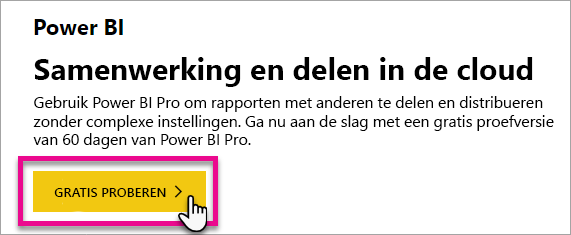
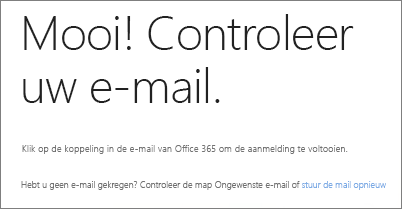
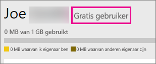
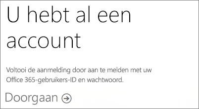
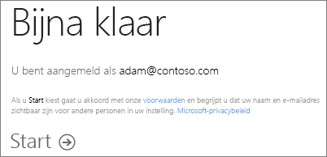

# Registreren voor Power BI als afzonderlijke gebruiker
Lees hoe u zich registreert voor Power BI en aan de slag kunt met rapporten en visualisaties.

Power BI kan uw persoonlijk hulpprogramma voor rapportage en visualisatie zijn, maar ook de oplossing voor analyse en besluitvorming voor groepsprojecten, afdelingen en complete bedrijven.

In dit artikel wordt stapsgewijs beschreven hoe u zich kunt registreren voor de Power BI-service en ermee aan de slag kunt. Zie [Power BI Free vs Pro](service-free-vs-pro.md) (Gratis versie van Power BI vergeleken met Power BI Pro) voor meer informatie over de verschillen tussen de gratis versie van Power BI en Power BI Pro.

## Verschillende mogelijkheden
Als een individu hebt u verschillende mogelijkheden om u te registreren en aan de slag te gaan met Power BI. U kunt kiezen voor de gratis versie of u kunt een abonnement op Power BI Pro kopen. Als u zich registreert voor een gratis account, kunt u daarna in de service kiezen voor een gratis evaluatieversie van Power BI Pro van 60 dagen.

Als u deel uitmaakt van een bestaande organisatie die Office 365 gebruikt, kunt u zich nog steeds registreren voor een gratis account. Uw IT-beheerder heeft ook enkele opties om Power BI Pro te kopen en licenties toe te wijzen. Zie [Purchasing Power BI Pro](service-admin-purchasing-power-bi-pro.md) (Power BI Pro kopen) voor meer informatie over de opties beschikbaar zijn voor een IT-beheerder.

> [!NOTE]
> Als u deel uitmaakt van een organisatie, is de functie voor afzonderlijke aanmelding mogelijk uitgeschakeld. Zie [Afzonderlijke aanmelding is uitgeschakeld](#individual-sign-up-has-been-turned-off) voor meer informatie als u een foutmelding krijgt dat deze functie is uitgeschakeld.
> 
> 

## Wat u nodig hebt om u te registreren
Als u zich wilt registreren voor Power BI, moet u een zakelijke e-mailadres hebben. Een persoonlijke e-mailadres werkt niet met de Power BI-service.

<a name="what-email-address-can-be-used-with-power-bi"/>

### Welk e-mailadres kan worden gebruikt met Power BI?
Power BI is vereist dat u een e-mailadres van uw werk, of school, gebruikt bij de registratie. Power BI biedt geen ondersteuning voor e-mailadressen die worden geleverd door e-mailservices voor consumenten of door telecomproviders. Het betreft onder andere deze e-mailadressen: outlook.com, hotmail.com en gmail.com.

Als u zich probeert te registreren met een persoonlijk e-mailadres, wordt u gevraagd om een e-mailadres van uw werk of school te gebruiken.

> [!NOTE]
> Power BI ondersteunt op dit moment geen selfserviceregistratie voor adressen met de extensie .gov of .mil. Neem contact op met uw Office 365-beheerder.
> 
> 

## Welke versie heb ik nodig?
U kunt bepalen welke versie u nodig hebt door te kijken wat er bij elk licentietype wordt geleverd. Gratis gebruikers hebben toegang tot de meeste functionaliteit van de services, met uitzondering van de functies voor delen en samenwerking. Power BI Pro-gebruikers kunnen alle functies in de service gebruiken, maar dit is niet gratis. Als u geen plannen hebt om inhoud te delen, is de gratis versie waarschijnlijk een prima keuze. Meer informatie vindt u op de [pagina met prijzen van Power BI](https://powerbi.microsoft.com//pricing/).

In de rest van dit artikel wordt uitgelegd hoe u zich voor beide varianten kunt opgeven.

## Registreren voor Power BI (gratis) als afzonderlijke gebruiker
De snelste manier om u te registreren voor Power BI is door een (gratis) Power BI-account aan te vragen. Er zijn geen kosten verbonden aan dit account en u kunt het gebruiken voor veel van de functies die beschikbaar zijn in de service.

> [!NOTE]
> Als u een bericht krijgt dat u al geregistreerd bent, gaat u naar https://app.powerbi.com en meldt u zich aan.
> 
> 

Als u zich wilt registreren voor Power BI, kunt u het volgende doen.

1. Ga naar [powerbi.com](https://powerbi.microsoft.com).
2. Selecteer **Start Free** of **Sign up free**.
   
    
3. Selecteer op de pagina Getting Started **Try Free >** onder Power BI.
   
    
4. Voer het e-mailadres in waarmee u zich wilt registreren en selecteer vervolgens **Registreren**. Gebruik een e-mailadres dat is toegestaan voor registratie. Zie [Welk e-mailadres kan worden gebruikt met Power BI](#what-email-address-can-be-used-with-power-bi) voor meer informatie over welk e-mailadres u kunt gebruiken.
   
    
5. U krijgt een bericht met het verzoek om uw e-mail te controleren.
   
    
6. Selecteer de koppeling in de e-mail van Office 365 om uw e-mailadres te bevestigen. U gaat nu terug naar het registratieproces. U moet mogelijk nog wat extra informatie over uzelf opgeven.
7. Vervolgens gaat u naar https://app.powerbi.com en kunt u Power BI gratis gaan gebruiken.

### Uw account controleren in de service
Wanneer u zich in de service bevindt, kunt u controleren of u inderdaad een gratis account hebt door eerst het **tandwielpictogram** te selecteren en vervolgens **Persoonlijke opslag beheren**.

### Wat gebeurt er als u al deel uitmaakt van een bestaande organisatie?
Als uw account deel uitmaakt van een bestaande organisatie, krijgt u het verzoek om om u zich met dat account aan te melden. Selecteer **Doorgaan** en meld u aan met uw Office 365-referenties.

Vervolgens wordt u gevraagd om **Start** te selecteren.

## Proefversie van Power BI Pro voor 60 dagen
Nadat u zich hebt aangemeld voor een gratis account, kunt u eventueel Pro 60 dagen gratis uitproberen. U hebt dan toegang tot alle functies van het Pro-abonnement voor de duur van de proefversie. Power BI Pro heeft alle functies van de gratis versie van Power BI, plus aanvullende functies voor delen en samenwerking. Meer informatie vindt u op de [pagina met prijzen van Power BI](https://powerbi.microsoft.com/pricing). Als u Power BI Pro gedurende 60 dagen gratis wilt uitproberen, meldt u zich aan bij Power BI en probeert u een van deze Power BI Pro functies:

* [Een app-werkruimte maken](service-create-distribute-apps.md)
* [Een dashboard delen](service-share-dashboards.md)

Wanneer u een van deze functies probeert uit te voeren, wordt u gevraagd een gratis proefversie te starten. U kunt de proefversie ook kiezen door het tandwielpictogram te selecteren en vervolgens **Persoonlijke opslag beheren** te selecteren. Selecteer vervolgens **Pro gratis uitproberen** aan de rechterkant.

Daarna kunt u selecteren **Proefversie starten** selecteren.

>[!NOTE]
>Gebruikers die ervoor kiezen om op deze manier de proefversie van Power BI Pro te activeren, worden in het Office 365-beheerportal niet weergegeven als gebruikers van de proefversie van Power BI Pro (maar als gebruikers van de gratis versie van Power BI). Ze worden echter wel weergegeven als gebruikers van de Power BI Pro-proefversie op de pagina **Opslag beheren** in Power BI.

>[!NOTE]
>Als u IT-beheerder bent en u wilt Power BI-proefabonnementlicenties voor meerdere gebruikers in uw organisatie verkrijgen en implementeren zonder dat afzonderlijke gebruikers gebruikersvoorwaarden hoeven te accepteren, kunt u zich registreren voor een [proefabonnement voor Power BI](https://portal.office.com/Signup/MainSignup15.aspx?OfferId=d59682f3-3e3b-4686-9c00-7c7c1c736085&dl=POWER_BI_PRO). U moet globale beheerder of factureringsbeheerder van Office 365 zijn of een nieuwe tenant maken om uzelf te registreren voor een proefabonnement. Zie [Purchasing Power BI Pro](service-admin-purchasing-power-bi-pro.md) (Power BI Pro kopen) voor meer informatie.
> 
> [!NOTE]
> Met de beschikbaarheid van Power BI Premium, en de wijzigingen van de gratis aanbieding van Power BI op 1 juni 2017, is het mogelijk dat u in aanmerking komt voor een verlengde Pro-proefversie. Zie [Extended Pro Trial activation](service-extended-pro-trial.md) (De verlengde Pro-proefversie activeren) voor meer informatie.
> 
> 

### Uw account controleren in de service
Wanneer u zich in de service bevindt, kunt u controleren of u inderdaad een proefabonnement van Pro hebt door eerst het *tandwielpictogram* te selecteren en vervolgens **Persoonlijke opslag beheren**.

## Wat moet ik doen om over de volledige Power BI Pro te beschikken?
Er is geen manier om als individu een licentie van Power BI Pro te kopen. U moet contact opnemen met uw IT-beheerder en deze vragen een licentie te kopen en aan uw account toe te wijzen. Zie [Purchasing Power BI Pro](service-admin-purchasing-power-bi-pro.md) (Power BI Pro kopen) voor meer informatie.

## Problemen oplossen
In veel gevallen kunt u zich registreren voor Power BI door de bovenstaande stappen van het proces voor selfserviceregistratie uit te voeren. Er zijn echter enkele redenen waarom u de selfserviceregistratie mogelijk niet kunt voltooien.  In de onderstaande tabel ziet u enkele van de meest voorkomende oorzaken voor het niet kunnen registreren en wat u eraan kunt doen.

| **Symptoom/foutbericht** | **Oorzaak en tijdelijke oplossing** |
| --- | --- |
| **Persoonlijk e-mailadres (bijvoorbeeld nancy@gmail.com)** U krijgt bij het aanmelden een bericht als het volgende:    *U hebt een persoonlijke e-mailadres ingevoerd. Voer uw zakelijke e-mailadres zodat we uw bedrijfsgegevens veilig kunnen opslaan.*    of    *Dat ziet eruit als een persoonlijke e-mailadres. Voer uw zakelijke e-mailadres in zodat we u kunnen koppelen aan anderen in uw bedrijf. En u hoeft zich geen zorgen te maken. We delen uw adres met niemand.* |Power BI biedt geen ondersteuning voor e-mailadressen die worden geleverd door e-mailservices voor consumenten of door telecomproviders.    U kunt de registratie alsnog proberen te voltooien door gebruik te maken van een e-mailadres dat is toegewezen door uw werk of school.    Als u zich nog steeds niet kunt registreren en u er geen bezwaar tegen hebt om een meer geavanceerde registratie te voltooien, kunt u zich [registreren voor een nieuw proefabonnement op Office 365 en gebruikt u dat e-mailadres voor de registratie](service-admin-signing-up-for-power-bi-with-a-new-office-365-trial.md). |
| **Selfserviceregistratie uitgeschakeld** U krijgt bij het aanmelden een bericht als het volgende:    *De registratie kan niet worden voltooid. Uw IT-afdeling heeft registratie voor Microsoft Power BI uitgeschakeld. Neem contact met ze op om de registratie te voltooien.*    of    *Dat ziet eruit als een persoonlijke e-mailadres. Voer uw zakelijke e-mailadres in zodat we u kunnen koppelen aan anderen in uw bedrijf. En u hoeft zich geen zorgen te maken. We delen uw adres met niemand.* |De IT-beheerder van uw organisatie heeft registratie via selfservice voor Power BI uitgeschakeld.    Om de registratie alsnog te voltooien, neemt u contact op met uw IT-afdeling en vraagt u of ze via de instructies op de onderstaande pagina bestaande gebruikers toestemming willen geven om zich te registreren voor Power BI en om nieuwe gebruikers toestemming te geven lid te worden van uw bestaande tenant.    Dit probleem kan ook optreden als u zich via een partner hebt geregistreerd voor Office 365. [Meer informatie](service-admin-syndication-partner.md)    [Power BI in uw organisatie](https://support.office.com/en-ca/article/Power-BI-in-your-Organization-d7941332-8aec-4e5e-87e8-92073ce73dc5#BKMK_HowCanIAllowO365Tenant) |
| **E-mailadres is geen Office 365-id** U krijgt bij de registratie een bericht als het volgende:    *We kunnen u niet vinden op contoso.com.  Gebruikt u een andere id op het werk of school?   Probeer u met die id aan te melden en als dat niet lukt, neemt u contact op met uw IT-afdeling.* |Uw organisatie gebruikt id's voor aanmelding bij Office 365 en andere Microsoft-services die verschillen van uw e-mailadres.  Bijvoorbeeld: uw e-mailadres is Nancy.Smith@contoso.com, maar uw id is nancys@contoso.com.    Om de registratie te voltooien, gebruikt u de id die uw organisatie u heeft toegewezen voor aanmelding bij Office 365 of andere Microsoft-services.  Als u die id niet weet, kunt u contact opnemen met uw IT-beheerder.    Als u zich nog steeds niet kunt registreren en u er geen bezwaar tegen hebt om een meer geavanceerde registratie te voltooien, kunt u zich [registreren voor een nieuw proefabonnement op Office 365 en gebruikt u dat e-mailadres voor de registratie](service-admin-signing-up-for-power-bi-with-a-new-office-365-trial.md). |

## Volgende stappen
[Power BI (free) in your organization](service-admin-service-free-in-your-organization.md) (Power BI (gratis) in uw organisatie)  
[Purchasing Power BI Pro](service-admin-purchasing-power-bi-pro.md) (Power BI Pro kopen)  
[Power BI-serviceovereenkomst voor afzonderlijke gebruikers](https://powerbi.microsoft.com/terms-of-service/)  
[Power BI Premium - wat is het?](service-premium.md)  
[Technisch document over Power BI Premium](https://aka.ms/pbipremiumwhitepaper)  

Nog vragen? [Misschien dat de Power BI-community het antwoord weet](http://community.powerbi.com/)

