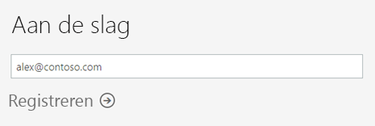
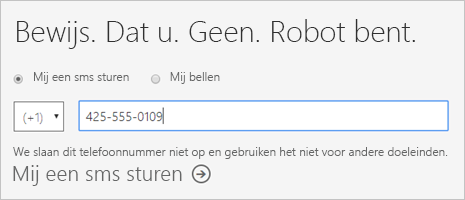
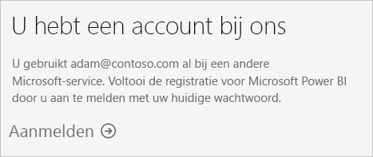
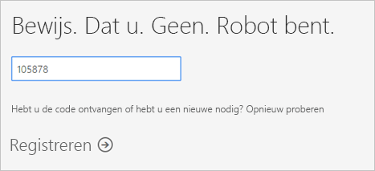
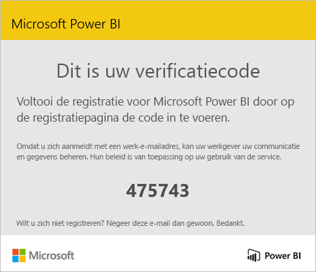
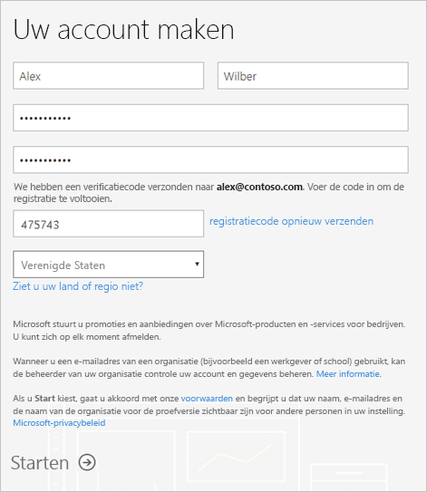
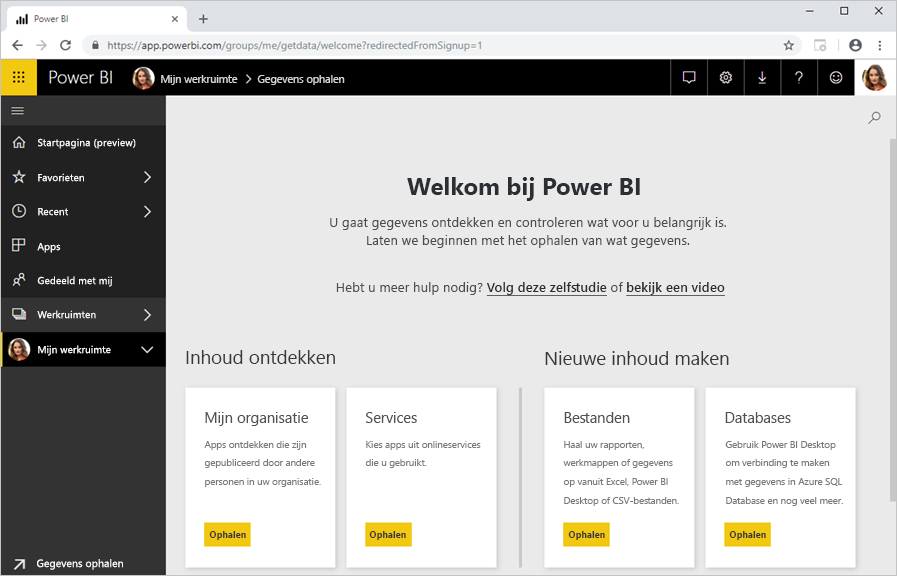

# Registreren voor Power BI als afzonderlijke gebruiker

Power BI kan uw persoonlijk hulpprogramma voor rapportage en visualisatie zijn, maar ook de oplossing voor analyse en besluitvorming voor groepsprojecten, afdelingen en complete bedrijven. In dit artikel wordt uitgelegd hoe u zich als afzonderlijke gebruiker kunt registreren voor een Power BI-proefversie. Zie [Power BI-licenties in uw organisatie](service-admin-licensing-organization.md) als u Power BI-beheerder bent.

## Ondersteunde e-mailadressen

Voordat u het aanmeldingsproces start, is het belangrijk dat u begrijpt welke typen e-mailadressen u in Power BI kunt gebruiken:

* Voor registratie bij Power BI dient u een e-mailadres van uw werk of school te gebruiken. U kunt niet registreren met e-mailadressen die worden geleverd door e-mailservices voor consumenten of door telecomproviders. Het betreft onder andere deze e-mailadressen: outlook.com, hotmail.com en gmail.com.

* Nadat u zich heb geregistreerd, kunt u [gastgebruikers uitnodigen](https://docs.microsoft.com/azure/active-directory/active-directory-b2b-what-is-azure-ad-b2b) om uw Power BI-inhoud te bekijken met elk e-mailadres, inclusief persoonlijke accounts.

* U kunt zich registreren voor Power BI met gov- of mil-adressen, maar hiervoor geldt een ander proces. Zie [Uw Amerikaanse overheidsorganisatie registreren bij de Power BI-service](service-govus-signup.md) voor meer informatie.

## Registreren voor een proefversie

Volg deze stappen om u te registreren voor een Power BI Pro-proefversie. Zie de volgende sectie, [Vervaldatum van de proefversie](#trial-expiration), voor een overzicht van uw opties wanneer deze proefversie vervalt.

1. Ga naar de [registratiepagina](https://app.powerbi.com/signupredirect?pbi_source=web) in Power BI.

1. Voer uw e-mailadres in en selecteer vervolgens **Registreren**.

    

1. Als u een bericht zoals het volgende krijgt, kiest u een optie om een verificatiecode te ontvangen. Ga daarna verder met de volgende stap in deze procedure.

    

    Als u een bericht zoals het volgende krijgt, voltooit u de stappen om u aan te melden en Power BI te gebruiken.

    

1. Voer de code in die u hebt ontvangen en selecteer vervolgens **Registreren**.

    

1. Controleer of u een e-mailbericht als het volgende hebt ontvangen.

    

1. Voer op het volgende scherm uw informatie en de verificatiecode uit de e-mail in. Selecteer een regio, controleer de beleidsregels waarnaar vanaf dit scherm wordt verwezen en selecteer vervolgens **Start**.

    

1. U wordt omgeleid naar https://app.powerbi.com en kunt Power BI gaan gebruiken.

    

## Vervaldatum van de proefversie

Wanneer uw Power BI Pro-proefversie vervalt, wordt uw licentie gewijzigd in een Power BI-licentie (gratis). Wanneer dit gebeurt, hebt u niet langer toegang tot functies waarvoor een Power BI Pro-licentie is vereist. Zie [Functies per licentietype](service-features-license-type.md) voor meer informatie.

Als een Power BI-licentie (gratis) voldoende is, is er geen actie vereist. Als u wilt profiteren van Power BI Pro-functies, moet u contact opnemen met uw IT-beheerder over de aanschaf van een Power BI Pro-licentie.

## Problemen met het registratieproces oplossen

In de meeste gevallen kunt u zich registreren voor Power BI door het zojuist beschreven proces te volgen. Er kunnen zich echter problemen voordoen waardoor het niet mogelijk is om u te registreren. In de volgende tabel worden deze problemen en oplossingen besproken.

|                                                                                                                                                                                                                          **Symptoom/foutbericht**                                                                                                                                                                                                                           |                                                                                                                                                                                                                                                                                                                                                **Oorzaak en tijdelijke oplossing**                                                                                                                                                                                                                                                                                                                                                |
|--------------------------------------------------------------------------------------------------------------------------------------------------------------------------------------------------------------------------------------------------------------------------------------------------------------------------------------------------------------------------------------------------------------------------------------------------------------------------------|------------------------------------------------------------------------------------------------------------------------------------------------------------------------------------------------------------------------------------------------------------------------------------------------------------------------------------------------------------------------------------------------------------------------------------------------------------------------------------------------------------------------------------------------------------------------------------------------------------------------------------------------------------------------------------------------------------------------|
| <strong>Persoonlijk e-mailadres (bijvoorbeeld nancy@gmail.com)</strong> U krijgt bij het aanmelden een bericht als het volgende:    *U hebt een persoonlijke e-mailadres ingevoerd. Voer uw zakelijke e-mailadres zodat we uw bedrijfsgegevens veilig kunnen opslaan.*    of    *Dat ziet eruit als een persoonlijke e-mailadres. Voer uw zakelijke e-mailadres in zodat we u kunnen koppelen aan anderen in uw bedrijf. En u hoeft zich geen zorgen te maken. We delen uw adres met niemand.* |                          Power BI biedt geen ondersteuning voor e-mailadressen die worden geleverd door e-mailservices voor consumenten of door telecomproviders.    U kunt de registratie alsnog proberen te voltooien door gebruik te maken van een e-mailadres dat is toegewezen door uw werk of school.    Als u zich nog steeds niet kunt registreren en u er geen bezwaar tegen hebt om een meer geavanceerde registratie te voltooien, kunt u zich [registreren voor een nieuw proefabonnement op Office 365 en gebruikt u dat e-mailadres voor de registratie](service-admin-signing-up-for-power-bi-with-a-new-office-365-trial.md).    U kunt ook zich ook door een bestaande gebruiker [als gast laten uitnodigen](service-admin-azure-ad-b2b.md).                           |
|            **Selfserviceregistratie uitgeschakeld** U krijgt bij het aanmelden een bericht als het volgende:    *De registratie kan niet worden voltooid. Uw IT-afdeling heeft registratie voor Microsoft Power BI uitgeschakeld. Neem contact met ze op om de registratie te voltooien.*    of    *Dat ziet eruit als een persoonlijke e-mailadres. Voer uw zakelijke e-mailadres in zodat we u kunnen koppelen aan anderen in uw bedrijf. En u hoeft zich geen zorgen te maken. We delen uw adres met niemand.*             |                             De IT-beheerder van uw organisatie heeft registratie via selfservice voor Power BI uitgeschakeld.    Als u de registratie wilt voltooien, neemt u contact op met uw IT-beheerder en vraagt u die om [de instructies te volgen zodat u zich kunt registreren](service-admin-licensing-organization.md#enable-or-disable-individual-user-sign-up-in-azure-active-directory).    Dit probleem kan ook optreden als u zich [via een partner hebt geregistreerd voor Office 365](service-admin-syndication-partner.md). |
|                                                                                          **E-mailadres is geen Office 365-id** U krijgt bij de registratie een bericht als het volgende:    *We kunnen u niet vinden op contoso.com.  Gebruikt u een andere id op het werk of school?   Probeer u met die id aan te melden en als dat niet lukt, neemt u contact op met uw IT-afdeling.*                                                                                           | Uw organisatie gebruikt id's voor aanmelding bij Office 365 en andere Microsoft-services die verschillen van uw e-mailadres.  Bijvoorbeeld: uw e-mailadres is Nancy.Smith@contoso.com, maar uw id is nancys@contoso.com.    Om de registratie te voltooien, gebruikt u de id die uw organisatie u heeft toegewezen voor aanmelding bij Office 365 of andere Microsoft-services.  Als u die id niet weet, kunt u contact opnemen met uw IT-beheerder.    Als u zich nog steeds niet kunt registreren en u er geen bezwaar tegen hebt om een meer geavanceerde registratie te voltooien, kunt u zich [registreren voor een nieuw proefabonnement op Office 365 en gebruikt u dat e-mailadres voor de registratie](service-admin-signing-up-for-power-bi-with-a-new-office-365-trial.md). |
|  |  |

## Volgende stappen

[Purchasing Power BI Pro](service-admin-purchasing-power-bi-pro.md) (Power BI Pro kopen)  
[Power BI-serviceovereenkomst voor afzonderlijke gebruikers](https://powerbi.microsoft.com/terms-of-service/)  

Hebt u nog vragen? [Misschien dat de Power BI-community het antwoord weet](http://community.powerbi.com/)