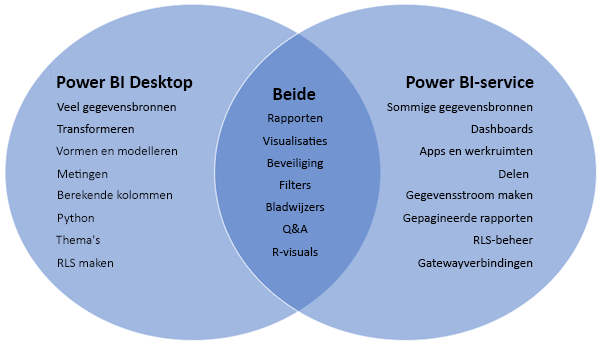
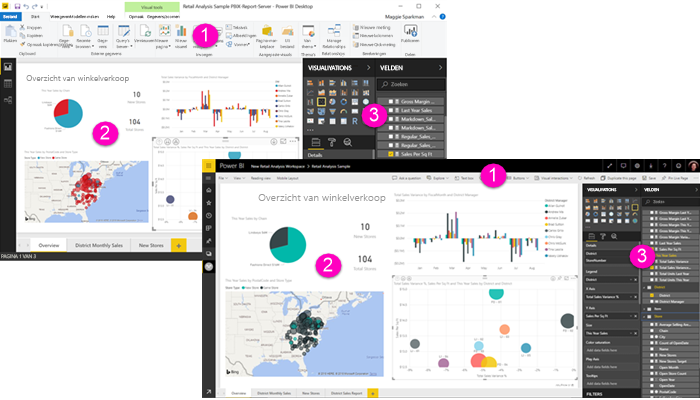

# Power BI Desktop en de Power BI-service vergelijken

In een Venn-diagram waarin de Power BI Desktop en de Power BI-service worden vergeleken, ziet u in het midden waar de twee overlappen. Bepaalde taken kunt u ofwel in Power BI Desktop of in de service uitvoeren. Maar aan weerskanten van het Venn-diagram hebben de toepassing en de service elk unieke functies.  

**Power BI Desktop** is een compleet hulpprogramma voor gegevensanalyse en het maken van rapporten. Wanneer u de gratis toepassing op uw lokale computer installeert, kunt u verbinding maken met tal van gegevensbronnen en deze in een gegevensmodel combineren (dit wordt modellering genoemd). In de [introductiehandleiding voor Power BI Desktop](desktop-getting-started.md) wordt het proces uitgelegd.

De **Power BI-service** is een op de cloud gebaseerde onlineservice voor lichte rapportbewerking en samenwerking voor teams en corporaties. In de Power BI-service kunt u ook verbinding maken met gegevensbronnen, maar modellering is dan beperkt. 

De meeste rapportontwerpers die aan business intelligence-projecten werken, gebruiken **Power BI Desktop** om rapporten te maken en gebruiken vervolgens de **Power BI-service** om hun rapporten met anderen te delen.

## Rapporten bewerken

In zowel de toepassing als de service kunt u *rapporten* maken en bewerken. Een rapport kan een of meer pagina’s hebben, met visuals en verzamelingen met visuals. U kunt bladwijzers, knoppen, filters en drillthroughs toevoegen om de navigatie in uw rapporten te verbeteren.

De rapporteditors in Power BI Desktop en in de service zijn vergelijkbaar. Ze bestaan uit drie delen:  

1. De bovenste navigatiebalken. Deze zijn verschillend in Power BI Desktop en de service    
2. Het rapportcanvas     
3. De deelvensters **Velden**, **Visualisaties** en **Filters**

Deze video toont de rapporteditor in Power BI Desktop. 

<iframe width="560" height="315" src="https://www.youtube.com/embed/IkJda4O7oGs" frameborder="0" allowfullscreen></iframe>

## Samenwerken in de Power BI-service

Nadat u uw rapporten hebt gemaakt, kunt u deze opslaan naar een *werkruimte* in de **Power BI-service**, waarin u en uw collega’s samenwerken. U bouwt *dashboards* bovenop die rapporten. Vervolgens deelt u die dashboards en rapporten met gebruikers van rapporten in en buiten uw organisatie. De gebruikers van uw rapporten bekijken ze in de Power BI-service in de [leesweergave](consumer/end-user-reading-view.md), niet de bewerkingsweergave. Ze hebben geen toegang tot alle functies die beschikbaar zijn voor de makers van rapporten. 

## Volgende stappen

[Wat is Power BI Desktop?](desktop-what-is-desktop.md)

[Een rapport maken](service-report-create-new.md) in de Power BI-service

[Basisconcepten voor rapportontwerpers](service-basic-concepts.md)

Hebt u nog vragen? [Misschien dat de Power BI-community het antwoord weet](http://community.powerbi.com/)

