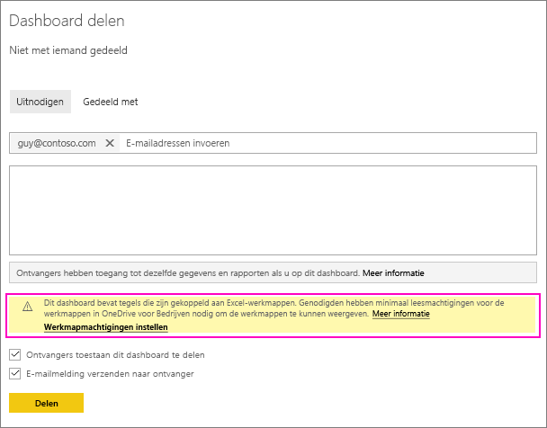
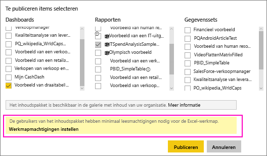
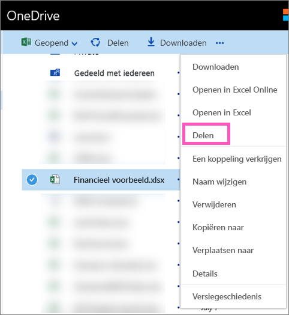

# Een Power BI-dashboard delen dat is gekoppeld aan een Excel-bestand in OneDrive
U kunt in Power BI [verbinding maken met Excel-werkmappen in OneDrive voor Bedrijven](service-excel-workbook-files.md) en tegels vastmaken aan een dashboard uit die werkmap. Wanneer u dat dashboard deelt of een inhoudspakket maakt waarin dat dashboard is opgenomen:

* Uw collega's kunnen de tegels bekijken zonder dat ze machtigingen voor de werkmap zelf nodig hebben. U kunt dus een inhoudspakket waarvan u weet dat uw collega's de tegels kunnen bekijken die zijn gemaakt op basis van de Excel-werkmap in OneDrive.
* Door op de tegel te klikken, wordt de werkmap geopend in Power BI. De werkmap wordt alleen geopend als uw collega's ten minste over [leesmachtigingen](https://support.office.com/en-us/article/Share-documents-or-folders-in-Office-365-1fe37332-0f9a-4719-970e-d2578da4941c) beschikken voor de werkmap in OneDrive voor Bedrijven.

## Een dashboard delen dat werkmaptegels bevat
Zie [Een dashboard delen](service-share-dashboards.md) om een dashboard te delen dat is teruggekoppeld naar een Excel-werkmap in OneDrive voor Bedrijven. Het verschil is dat u over de mogelijkheid beschikt om de machtigingen voor de gekoppelde Excel-werkmap te wijzigen voordat u deze deelt.

  

1. Voer de e-mailadressen van uw collega's in.
2. Selecteer **Naar OneDrive voor Bedrijven gaan om de werkmapmachtigingen in te stellen** om uw collega's de mogelijkheid te bieden om de werkmap in Power BI weer te geven.
3. Indien nodig [wijzigt u de machtigingen](https://support.office.com/en-US/article/Share-files-and-folders-and-change-permissions-9fcc2f7d-de0c-4cec-93b0-a82024800c07) in OneDrive.
4. Selecteer **Delen**.

>[!NOTE]
>Uw collega's kunnen geen aanvullende tegels voor die werkmap vastmaken of wijzigingen in de Excel-werkmap aanbrengen via Power BI.
> 
> 

## Een organisatie-inhoudspakket maken met een dashboard dat werkmaptegels bevat
Wanneer u [een inhoudspakket publiceert](service-organizational-content-pack-create-and-publish.md) moet u individuele collega's of groepen toegang verlenen. Wanneer u een inhoudspakket met werkmapkoppelingen publiceert, hebt u de mogelijkheid om de machtigingen voor de gekoppelde Excel-werkmap te wijzigen voordat u het inhoudspakket publiceert.

1. Voer in het scherm **Inhoudspakket maken** de e-mailadressen in, geef een titel en beschrijving voor het pakket op en upload een afbeelding.
2. Selecteer het dashboard en/of het rapport dat is gekoppeld aan de Excel-werkmap in OneDrive voor Bedrijven.
   
    
3. Selecteer **Naar OneDrive voor Bedrijven gaan om werkmapmachtigingen in te stellen**.
4. Indien nodig [wijzigt u de machtigingen](https://support.office.com/en-US/article/Share-files-and-folders-and-change-permissions-9fcc2f7d-de0c-4cec-93b0-a82024800c07) in OneDrive.
5. Selecteer **Publiceren**.

## Een dashboard via een Power BI-werkruimte
Het delen van een dashboard via een Power BI-werkruimte is vergelijkbaar met het delen van een dashboard via uw eigen werkruimte. Het enige verschil is dat de bestanden zich in een Office 365-werkruimtesite bevinden in plaats van uw persoonlijke OneDrive voor Bedrijven. Wijzig de machtigingen voor de Excel-werkmap voordat u het dashboard deelt met personen buiten de werkruimte.

## Volgende stappen
* [Een tegel aan een Power BI-dashboard vastmaken via Excel](service-dashboard-pin-tile-from-excel.md)
* [Basisconcepten van Power BI](service-basic-concepts.md)
* Nog vragen? [Misschien dat de Power BI-community het antwoord weet](http://community.powerbi.com/)

