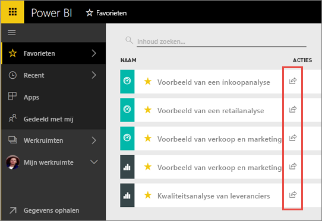
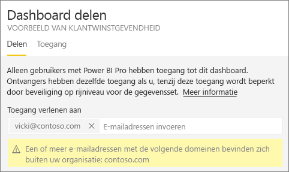
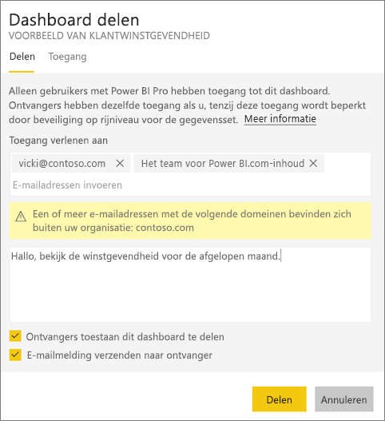
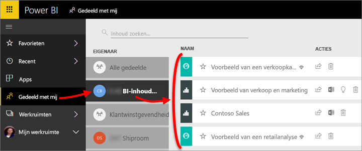
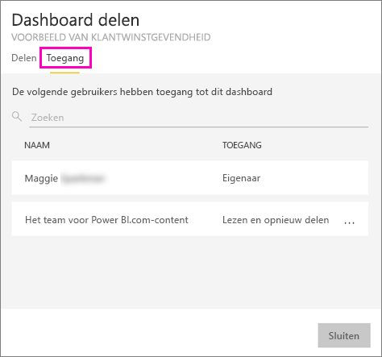
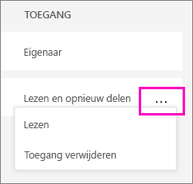
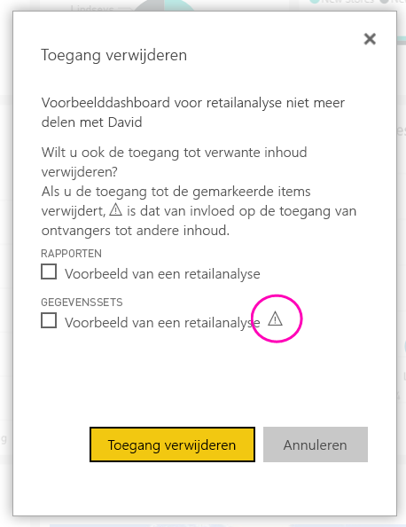
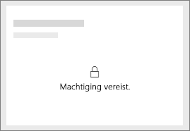
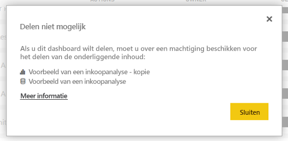

# Uw Power BI-dashboards en -rapporten delen met collega's en anderen
*Delen* is een goede manier om enkele personen toegang te geven tot uw dashboards en rapporten. Power BI ondersteunt ook [verschillende andere manieren om samen te werken en uw dashboards en rapporten te distribueren](service-how-to-collaborate-distribute-dashboards-reports.md).

Als u inhoud wilt gaan delen, hebt u een [Power BI Pro-licentie](service-free-vs-pro.md) nodig, ongeacht of u inhoud binnen of buiten uw organisatie deelt. Uw ontvangers hebben ook een Power BI Pro-licentie hebben nodig, of de inhoud moet zich in een [Premium-capaciteit](service-premium.md) bevinden. 

U kunt dashboards en rapporten delen vanaf de meeste plaatsen in de Power BI-service: uw Favorieten, Recent, Gedeeld met mij (als de eigenaar het toestaat), Mijn werkruimte of andere werkruimten. Wanneer u een dashboard of rapport deelt, kunnen de personen met wie u het deelt ernaar kijken en er interactie mee hebben, maar ze kunnen het niet bewerken. In het dashboard of rapport zien ze dezelfde gegevens als u, tenzij er [beveiliging op rijniveau](service-admin-rls.md) wordt toegepast. De collega's met wie u het dashboard of rapport deelt, kunnen het ook weer met hun collega's delen, maar alleen als u dat toestaat. De personen buiten uw organisatie kunnen het dashboard of rapport ook bekijken en er interactie mee hebben, maar ze kunnen het niet delen. 

U kunt [een dashboard ook delen vanuit een van de mobiele apps van Power BI](consumer/mobile/mobile-share-dashboard-from-the-mobile-apps.md). U kunt dashboards delen vanuit de Power BI-service en de mobiele Power BI-apps, maar niet vanuit Power BI Desktop.

## Video: Een dashboard delen
Kijk hoe Amanda haar dashboard deelt met collega's binnen en buiten haar bedrijf. Gebruik vervolgens de stapsgewijze instructies onder de video om het zelf te proberen.

<iframe width="560" height="315" src="https://www.youtube.com/embed/0tUwn8DHo3s?list=PL1N57mwBHtN0JFoKSR0n-tBkUJHeMP2cP" frameborder="0" allowfullscreen></iframe>

## Een dashboard of rapport delen

1. Selecteer **Delen**  in een lijst met dashboards of rapporten, of in een geopend dashboard of rapport.

1. Typ in het bovenste vak het volledige e-mailadres voor afzonderlijke personen, distributiegroepen of beveiligingsgroepen. U kunt niet delen met dynamische distributielijsten. 
   
   U kunt delen met mensen met adressen buiten uw organisatie, maar u ziet dan wel een waarschuwing.
   
    
 
3. Typ desgewenst een bericht. Dit is niet verplicht.
4. Als collega's uw inhoud met anderen mogen delen, selecteert u **Ontvangers toestaan uw dashboard/rapport te delen**.
   
   Anderen toestaan om te delen, wordt *opnieuw delen* genoemd. Zij kunnen uw dashboard dan opnieuw delen vanuit de Power BI-service en de mobiele apps, of de e-mail met de uitnodiging doorsturen naar anderen in uw organisatie. De uitnodiging verloopt na één maand. Personen buiten uw organisatie kunnen niet opnieuw delen. Als eigenaar van de inhoud kunt u de mogelijkheid om de inhoud opnieuw te delen in het algemeen of alleen voor bepaalde personen uitschakelen. Zie [Het delen van inhoud stoppen of het delen van inhoud door anderen niet toestaan](service-share-dashboards.md#stop-sharing-or-stop-others-from-sharing) hieronder.

5. Selecteer **Delen.**
   
     
   
   Power BI verstuurt een e-mailuitnodiging naar personen, maar niet naar groepen. De e-mail bevat een koppeling naar de gedeelde inhoud. U ziet de melding **Geslaagd**. 
   
   Wanneer ontvangers in uw organisatie op de koppeling klikken, wordt het dashboard of rapport door Power BI toegevoegd aan de lijstpagina **Gedeeld met mij** van die personen. Ze kunnen uw naam selecteren om alle inhoud te zien die u met hen hebt gedeeld. 
   
   
   
   Wanneer ontvangers buiten uw organisatie op de koppeling klikken, zien ze het dashboard of rapport, maar niet in de gebruikelijke Power BI-portal. Zie [Inhoud delen met personen buiten uw organisatie](service-share-dashboards.md#share-a-dashboard-with-people-outside-your-organization) hieronder voor meer informatie.

## Wie heeft er toegang tot een dashboard of rapport dat u hebt gedeeld?
Soms moet u de personen zien met wie u inhoud hebt gedeeld en zien met wie zij die vervolgens hebben gedeeld.

1. Selecteer **Delen**  in de lijst met dashboards en rapporten of in het dashboard of rapport zelf. 
2. Selecteer **Toegang** in het dialoogvenster **Dashboard/rapport delen**.
   
    
   
    Personen buiten uw organisatie worden aangeduid als **Gast**.

## Het delen van inhoud stoppen of het delen van inhoud door anderen niet toestaan
Alleen de eigenaar van het dashboard of het rapport kan opnieuw delen in- en uitschakelen.

### Als u de uitnodiging nog niet hebt verzonden
* Verwijder het vinkje uit het selectievakje **Ontvangers toestaan uw dashboard/rapport te delen** onderaan de uitnodiging voordat u deze verzendt.

### Als u het dashboard of rapport al hebt gedeeld
1. Selecteer **Delen**  in de lijst met dashboards en rapporten of in het dashboard of rapport zelf. 
2. Selecteer **Toegang** in het dialoogvenster **Dashboard/rapport delen**.
   
    
3. Selecteer het weglatingsteken (**...** ) naast **Lezen en opnieuw delen** en selecteer:
   
   
   
   * **Lezen** om te voorkomen dat deze persoon met iemand anders deelt.
   * **Toegang verwijderen** om ervoor te zorgen dat die persoon de gedeelde inhoud helemaal niet meer ziet.

4. In het dialoogvenster **Toegang verwijderen** geeft u aan of u de toegang tot de bijbehorende inhoud, zoals rapporten en gegevenssets, ook wilt verwijderen. Als u items met een waarschuwingspictogram  verwijdert, wordt aangeraden verwante inhoud te verwijderen omdat deze niet correct wordt weergegeven.

    

## Een dashboard of rapport delen met personen buiten uw organisatie
Wanneer u inhoud deelt met personen buiten uw organisatie, krijgen zij een e-mail met een koppeling naar het gedeelde dashboard of rapport en moeten ze zich aanmelden bij Power BI om het te zien. Als ze geen licentie voor Power BI Pro hebben, kunnen ze er één aanvragen nadat ze op de koppeling hebben geklikt.

Nadat ze zich hebben aangemeld, zien ze het gedeelde dashboard of rapport in een eigen browservenster zonder het linkernavigatiedeelvenster, dus niet in de gebruikelijke Power BI-portal. Ze moeten een bladwijzer voor de koppeling toevoegen om dit dashboard of rapport in de toekomst te kunnen bekijken.

Ze kunnen geen inhoud van dit dashboard of rapport bewerken. Ze kunnen interactie hebben met de grafieken en filters of slicers wijzigen in het rapport, maar ze kunnen hun wijzigingen niet opslaan.

Alleen uw directe ontvangers kunnen het gedeelde dashboard of rapport zien. Als u bijvoorbeeld een uitnodiging stuurt naar Vicki@contoso.com, kan alleen Vicki het dashboard zien. Niemand anders kan dat dashboard zien, zelfs niet als ze de koppeling hebben, en Vicki moet hetzelfde e-mailadres gebruiken om toegang te krijgen tot dit dashboard. Als ze zich aanmeldt met een ander e-mailadres, heeft ze ook geen toegang tot het dashboard.

Personen buiten uw organisatie kunnen helemaal geen gegevens zien als rolbeveiliging of beveiliging op rijniveau is geïmplementeerd op on-premises tabellaire modellen van Analysis Services.

Als u vanuit een mobiele app van Power BI een koppeling verstuurt naar personen buiten uw organisatie, wordt het dashboard na het klikken op de koppeling geopend in een browser, niet in de mobiele Power BI-app.

## Beperkingen en overwegingen
Houd rekening met de volgende zaken bij het delen van dashboards en rapporten:

* In het algemeen zien u en uw collega's dezelfde gegevens in het dashboard of rapport. Dus als u gemachtigd bent om meer gegevens te zien dan zij, kunnen zij al uw gegevens in het dashboard of rapport bekijken. Als er echter [beveiliging op rijniveau](service-admin-rls.md) wordt toegepast op de gegevensset van een dashboard of rapport, worden de referenties van elke persoon gebruikt om te bepalen welke gegevens ze mogen zien.
* Iedereen met wie u uw dashboard deelt, kan dit zien en kan in de [leesweergave](service-reading-view-and-editing-view.md) interactie hebben met de gerelateerde rapporten. Ze kunnen geen rapporten maken of wijzigingen in bestaande rapporten opslaan.
* Niemand kan de gegevensset zien of downloaden.
* Iedereen kan [de gegevens handmatig vernieuwen](refresh-data.md).
* Als u Office 365 gebruikt voor e-mail, kunt u delen met leden van een distributiegroep door het e-mailadres in te voeren dat is gekoppeld aan de distributiegroep.
* Collega's met hetzelfde e-maildomein als u, en collega's met een ander domein maar dat wel binnen dezelfde tenant is geregistreerd, kunnen het dashboard delen met anderen. Stel dat de domeinen contoso.com en contoso2.com bijvoorbeeld zijn geregistreerd in dezelfde tenant. Als uw e-mailadres konrads@contoso.com is, kunnen ravali@contoso.com en gustav@contoso2.com allebei delen, uiteraard alleen als u ze hiervoor toestemming hebt gegeven.
* Als uw collega's al toegang hebben tot een specifiek dashboard of rapport, kunt u een directe koppeling verzenden door de URL te kopiëren wanneer u zich in het dashboard of rapport bevindt. Bijvoorbeeld:`https://powerbi.com/dashboards/g12466b5-a452-4e55-8634-xxxxxxxxxxxx`
* Als uw collega's al toegang tot een specifiek dashboard hebben, kunt u ook [een directe koppeling naar het onderliggende rapport versturen](service-share-reports.md). 

## Problemen met delen oplossen

### De ontvangers van mijn dashboard zien een vergrendelingspictogram in een tegel of een bericht 'Machtiging is vereist'

De personen met wie u inhoud deelt zien mogelijk een vergrendelde tegel in een dashboard of het bericht 'Machtiging is vereist' wanneer ze proberen om een rapport weer te geven.

Als dit het geval is, moet u hen toestemming geven voor de onderliggende gegevensset. U doet dit als volgt:

1. Ga naar het tabblad **Gegevenssets** in de inhoudslijst.

1. Selecteer het beletselteken (**...** ) naast de gegevensset > **Machtigingen beheren**.

    

3. Selecteer **Gebruiker toevoegen**.

    

1. Typ het volledige e-mailadres voor afzonderlijke personen, distributiegroepen of beveiligingsgroepen. U kunt niet delen met dynamische distributielijsten.

    

5. Selecteer **Toevoegen**.

### Ik kan geen dashboards of rapporten delen

Als u een dashboard of rapport wilt delen, hebt u toestemming nodig om de onderliggende inhoud opnieuw te delen -- verwante rapporten en gegevenssets. Als een bericht wordt weergegeven dat u niet kunt delen, vraagt u de auteur van het rapport u toestemming te geven deze rapporten en gegevenssets opnieuw te delen.

## Volgende stappen
* Wilt u feedback geven? Dit kan op de [site van de Power BI-community](https://community.powerbi.com/).
* [Hoe kan ik samenwerken aan dashboards en rapporten en deze delen?](service-how-to-collaborate-distribute-dashboards-reports.md)
* [Een gefilterd Power BI-rapport delen](service-share-reports.md)
* Vragen? [Misschien dat de Power BI-community het antwoord weet](http://community.powerbi.com/)

