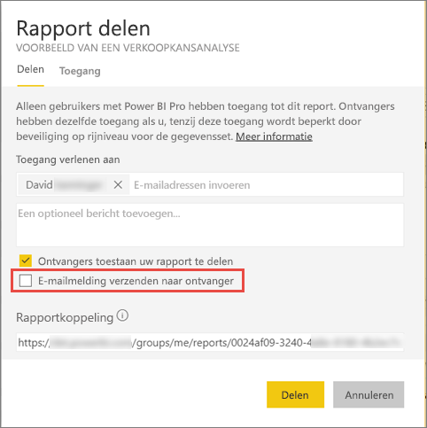

# Een gefilterd Power BI-rapport delen met uw collega 's
*Delen* is een goede manier om enkele personen toegang te geven tot uw dashboards en rapporten. Power BI ondersteunt ook [verschillende andere manieren om samen te werken en uw rapporten te distribueren](service-how-to-collaborate-distribute-dashboards-reports.md).

Als u wilt gaan delen, moeten u en de ontvangers een [Power BI Pro licentie](service-features-license-type.md) hebben, of de inhoud moet zich in een [Premium-capaciteit](service-premium.md) bevinden. 

U kunt een rapport delen met collega's in hetzelfde e-maildomein als u, vanaf de meeste plaatsen in de Power BI-service: uw Favorieten, Recent, Gedeeld met mij (als de eigenaar het toestaat), Mijn werkruimte of andere werkruimten. Wanneer u een rapport deelt, kunnen degenen met wie u het rapport deelt dit bekijken en de inhoud ervan op verschillende manieren weergeven, maar niet bewerken. Ze zien dezelfde gegevens die u ziet in het rapport, tenzij [beveiliging op rijniveau](service-admin-rls.md) wordt toegepast. 

Wat gebeurt er als u een gefilterde versie van een rapport wilt delen? Dit kan bijvoorbeeld een rapport zijn dat alleen gegevens weergeeft voor een specifieke stad of verkoper of jaar. Maak een aangepaste URL. Het rapport wordt gefilterd zodra ontvangers dit voor de eerste keer openen. Ze kunnen het filter verwijderen door de URL aan te passen.

## Een rapport filteren en delen

1. Open het rapport in de [bewerkingsweergave](consumer/end-user-reading-view.md), pas het filter toe en sla het rapport op.
   
   In dit voorbeeld wordt het [Voorbeeld van een retailanalyse](sample-tutorial-connect-to-the-samples.md) zo gefilterd dat alleen de waarden worden weergegeven waarbij **Gebied** gelijk is aan **NC**.
   
   
2. Voeg het volgende toe aan het einde van de URL van de rapportpagina:
   
   ?filter=*tabelnaam*/*veldnaam* eq *waarde*
   
    Het veld moet van het type **tekenreeks** zijn. De waarden *tablename* of *fieldname* mogen geen spaties bevatten.
   
   In ons voorbeeld is de naam van de tabel **Store** (winkel), de naam van het veld **Territory** (gebied) en de waarde waarop we willen filteren is **NC**:
   
    ?filter=Winkel/Gebied eq 'NC'
   
   
   
   Uw browser voegt speciale tekens toe om slashes, spaties en apostrofs weer te geven, zodat het uiteindelijke resultaat is:
   
   app.powerbi.com/groups/me/reports/010ae9ad-a9ab-4904-a7a1-xxxxxxxxxxxx/ReportSection2?filter=Store%252FTerritory%20eq%20%27NC%27

3. [Deel het rapport](service-share-dashboards.md), maar verwijder het vinkje in het selectievakje **E-mailmelding verzenden naar ontvanger**. 

    

4. Verzend de koppeling met het filter dat u eerder hebt gemaakt.

## Volgende stappen
* Wilt u feedback geven? Dit kan op de [site van de Power BI-community](https://community.powerbi.com/).
* [Hoe kan ik samenwerken aan dashboards en rapporten en deze delen?](service-how-to-collaborate-distribute-dashboards-reports.md)
* [Een dashboard delen](service-share-dashboards.md)
* Nog vragen? [Misschien dat de Power BI-community het antwoord weet](http://community.powerbi.com/).

