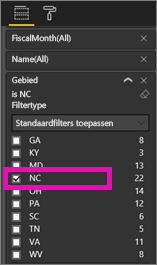
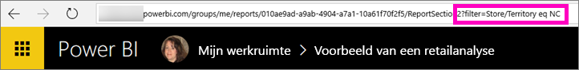

# Power BI-rapporten delen met uw collega's
*Delen* is een goede manier om enkele personen toegang te geven tot uw dashboards en rapporten. Power BI ondersteunt [verschillende manieren om samen te werken en uw rapporten te distribueren](service-how-to-collaborate-distribute-dashboards-reports.md). Delen is hier slechts één van.

Als u wilt gaan delen, moeten u en de ontvangers een [Power BI Pro licentie](service-free-vs-pro.md) hebben, of de inhoud moet zich in een [Premium-capaciteit](service-premium.md) bevinden. Suggesties? Het team van Power BI is altijd geïnteresseerd in uw feedback. Ga hiervoor naar de [site van de Power BI-community](https://community.powerbi.com/).

U kunt een rapport delen met collega's in hetzelfde e-maildomein, vanuit uw eigen werkruimte of vanuit een app-werkruimte. Wanneer u een rapport deelt, kunnen de personen met wie u het rapport deelt dit bekijken en de inhoud ervan op verschillende manieren weergeven, maar niet bewerken. Ze zien dezelfde gegevens die u ziet in het rapport, tenzij [beveiliging op rijniveau](service-admin-rls.md) wordt toegepast. 

## Een Power BI-rapport delen
1. [Maak een dashboard](service-dashboard-create.md) in de Power BI-service met ten minste één tegel die is gekoppeld aan het rapport dat u wilt delen. 
   
    Ook als u alleen het rapport wilt delen, moet u eerst een dashboard maken dat aan het rapport is gekoppeld voordat u het kunt delen. 

1. Selecteer in de rechterbovenhoek van het dashboard **Delen**.

     
  
2. Adresseer het rapport aan de beoogde ontvangers. Als u hen geen mail over het dashboard wilt sturen, schakelt u het selectievakje **E-mailbericht naar ontvangers verzenden** uit.

     

4. Selecteer **Delen**.

      De personen waarmee u het dashboard deelt, hebben nu toestemming om het onderliggende rapport te bekijken. 

1. Open het rapport in de Power BI-service en kopieer de URL van de rapportpagina. Verzendt de URL naar uw collega's. 
   
    Als zij de koppeling selecteren, wordt door Power BI een alleen-lezen versie van het rapport geopend.

## Een gefilterde versie van een rapport delen
Wat gebeurt er als u een gefilterde versie van een rapport wilt delen? Dit kan bijvoorbeeld een rapport zijn dat alleen gegevens weergeeft voor een specifieke stad of verkoper of jaar. Hiervoor kunt u een aangepaste URL maken.

1. Open het rapport in de [bewerkingsweergave](service-reading-view-and-editing-view.md), pas het filter toe en sla het rapport op.
   
   In dit voorbeeld wordt het [Voorbeeld van een retailanalyse](sample-tutorial-connect-to-the-samples.md) zo gefilterd dat alleen de waarden worden weergegeven waarbij **Gebied** gelijk is aan **NC**.
   
   
2. Voeg het volgende toe aan het einde van de URL van de rapportpagina:
   
   ?filter=*tabelnaam*/*veldnaam* eq *waarde*
   
    Het veld moet van het type **tekenreeks** zijn en de *tabelnaam* en de *veldnaam* mogen geen spaties bevatten.
   
   In ons voorbeeld is de naam van de tabel **Store** (winkel), de naam van het veld **Territory** (gebied) en de waarde waarop we willen filteren is **NC**:
   
    ?filter=Store/Territory eq NC
   
   
   
   Uw browser voegt speciale tekens toe om slashes en spaties weer te geven, zodat het uiteindelijke resultaat is:
   
   app.powerbi.com/groups/me/reports/010ae9ad-a9ab-4904-a7a1-10a61f70f2f5/ReportSection2?filter=Store%252FTerritory%20eq%20NC
3. Stuur deze URL naar uw collega's. 
   
   Als zij de koppeling selecteren, wordt door Power BI een alleen-lezen versie van het gefilterde rapport geopend.

## Volgende stappen
* Wilt u feedback geven? Dit kan op de [site van de Power BI-community](https://community.powerbi.com/).
* [Hoe kan ik samenwerken aan dashboards en rapporten en deze delen?](service-how-to-collaborate-distribute-dashboards-reports.md)
* [Een dashboard delen](service-share-dashboards.md)
* Nog vragen? [Misschien dat de Power BI-community het antwoord weet](http://community.powerbi.com/).

