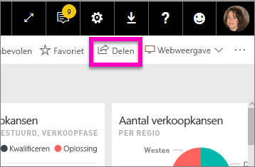
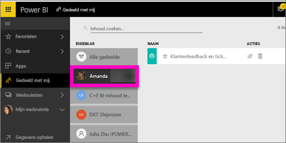

# De Power BI-dashboards weergeven die met mij zijn gedeeld
## Gedeeld met mij

Als een collega een dashboard met u deelt, wordt de titel ervan toegevoegd aan uw lijst **Gedeeld met mij**. Het dashboard is alleen beschikbaar vanuit **Gedeeld met mij**, niet vanuit een werkruimte of vanuit **Apps**.

Kijk hoe Amanda de inhoudslijst **Gedeeld met mij** uitlegt en demonstreert hoe u naar de lijst navigeert en deze filtert. Volg vervolgens de stapsgewijze instructies onder de video om het zelf te proberen. Als u met u gedeelde dashboards wilt weergeven, moet u beschikken over een Power BI Pro-licentie. Lees [Wat is Power BI Premium?](service-premium.md) voor meer informatie.

<iframe width="560" height="315" src="https://www.youtube.com/embed/G26dr2PsEpk" frameborder="0" allowfullscreen></iframe>

U krijgt veel opties om met het dashboard en het onderliggende rapport te communiceren, afhankelijk van de machtigingen die de eigenaar u heeft gegeven. Hierbij zijn de mogelijkheden inbegrepen om kopieën van het dashboard te maken, het rapport [in leesweergave](service-reading-view-and-editing-view.md) te openen en opnieuw te delen met andere collega's.

## Acties die via de scherm **Gedeeld met mij** beschikbaar zijn
* Selecteer het sterpictogram op [Een dashboard aan favorieten toevoegen](service-dashboard-favorite.md).
* [Een dashboardtegel verwijderen](service-delete.md) 
* Sommige dashboards kunnen opnieuw worden gedeeld  
* Bovendien kunt u, als uw lijsten met dashboards lang worden, [via het zoekveld en sorteren vinden wat u nodig hebt](service-navigation-search-filter-sort.md).
  
  > [!NOTE]
  > Voor informatie over EGRC-classificaties selecteert u de classificatie-knop of [gaat u naar Classificatie van dashboardgegevens](service-data-classification.md).
  > 
  > 
* Selecteer de naam van een dashboard om deze te openen en te verkennen. Als u de gedeelde dashboard hebt geopend, kunt u via Q & A vragen stellen over de onderliggende gegevens of een tegel selecteren die u wilt openen om in de leesweergave te kunnen communiceren met het rapport.

## Gedeelde dashboards filteren op eigenaar
De inhoud in het scherm **Gedeeld met mij** kan verder worden gefilterd op de eigenaar van de inhoud. Als ik bijvoorbeeld **Amanda** selecteer, zie ik alleen het dashboard dat Amanda met mij heeft gedeeld.

## Volgende stappen
[Power BI - basisconcepten](service-basic-concepts.md)  
[Power BI Premium - wat is het?](service-premium.md)  

Nog vragen? [Misschien dat de Power BI-community het antwoord weet](http://community.powerbi.com/)

