# Navigeren in de Power BI-service

Als u de Power BI-service al een tijdje gebruikt, is het u ongetwijfeld opgevallen dat de gebruikersinterface aanzienlijk is aangepast.  De meeste van deze wijzigingen zijn van invloed op hoe uw inhoud (dashboards, rapporten en gegevenssets) wordt geordend en op de paden die u moet volgen (klikken) om taken voor die inhoud uit te voeren. 

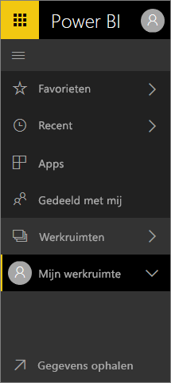

## Hoe kan ik...
Diegenen die bekend zijn met de vorige interface van de Power BI-service, kunnen deze referentiehandleiding gebruiken om te bepalen hoe bepaalde acties worden uitgevoerd in de nieuwe gebruikersinterface. We realiseren ons dat u in eerste instantie misschien wat gedesoriënteerd bent, maar we zijn ervan overtuigd dat u na verloop van tijd tal van tijdbesparende voordelen van de nieuwe indeling zult ontdekken. 

**Snelzoekgids**

| Actie | Nieuw (huidig) pad |
| --- | --- | --- |
| Een dashboard toevoegen aan Favorieten |Werkruimte > Dashboards en selecteer het sterpictogram zodat dit geel wordt weergegeven |
| Een lijst met favoriete dashboards weergeven |Selecteer in het navigatievenster links de optie **Favorieten**. |
| Een lijst met onlangs bezochte dashboards en rapporten weergeven |Selecteer in het navigatievenster links de optie **Recent**. |
| Een lijst weergeven met dashboards die met u zijn gedeeld |Selecteer in het navigatievenster links de optie **Gedeeld met mij**. |
| Een dashboard delen |Open het dashboard en selecteer **Delen** of maak en publiceer een app. |
| Een dashboard verwijderen |Mijn werkruimte > Dashboards > prullenbakpictogram |
| Een rapport verwijderen |Mijn werkruimte > Rapporten > prullenbakpictogram |
| Een gegevensset verwijderen |Mijn werkruimte > Gegevenssets > ... > Verwijderen |
| Een dashboard openen |Werkruimte > Dashboards > selecteer de naam van het dashboard |
| Een rapport openen |Werkruimte > Rapporten > selecteer de naam van het dashboard |
| Een gegevensset openen |Werkruimte > Gegevenssets > selecteer de naam van de gegevensset |
| Een dashboard maken |Selecteer in de bovenste navigatiebalk Maken > Dashboard |
| Een rapport maken |Selecteer in de bovenste navigatiebalk Maken > Rapport |
| Een gegevensset maken |Selecteer in de bovenste navigatiebalk Maken > Gegevensset |
| Een app maken |Werkruimten > App-werkruimte maken |
| Een lijst weergeven met alle dashboards, rapporten en gegevenssets waarvan u de eigenaar bent |Werkruimten > Mijn werkruimte |

## Waarom is de navigatiefunctie van de Power BI-service gewijzigd?
* De lijsten voor dashboards, rapporten, werkmappen en gegevenssets zijn gestroomlijnd.    
* Er zijn flyoutmenu's toegevoegd zodat u snel uw favorieten, de meest recente inhoud of een werkruimte kunt selecteren.    
* Er is een manier toegevoegd om gerelateerde inhoud voor dashboards, rapporten en gegevenssets te identificeren.    
* Er is een apart inhoudsgebied voor werkmappen toegevoegd.    
* Er is een apart gebied gemaakt voor uw favoriete dashboards.    
* Er is een apart gebied gemaakt voor inhoud die met u is gedeeld. 
* Er is een apart gebied gemaakt voor uw meest recente inhoud.  
* Het aantal benodigde klikken om een taak uit te voeren, is gereduceerd. De lijsten met inhoud en de acties die u voor die inhoud kunt uitvoeren worden nu weergegeven in hetzelfde scherm. Bijvoorbeeld het schakelen tussen dashboards en rapporten.</td></tr></table>

Laat u door Amanda meenemen op een rondleiding door de nieuwe navigatiefunctie, waarin de verbeteringen worden uitgelegd en gedemonstreerd.  Volg vervolgens de stapsgewijze instructies onder de video om zelf op verkenning uit te gaan.

<iframe width="560" height="315" src="https://www.youtube.com/embed/G26dr2PsEpk" frameborder="0" allowfullscreen></iframe>

## Er zijn enkele gloednieuwe functies toegevoegd
Volg de stapsgewijze instructies om zelf op verkenning uit te gaan.

### Inhoud weergeven (dashboards, rapporten, werkmappen, gegevenssets, werkruimten en apps)
Laten we beginnen door te kijken hoe de basisinhoud (dashboards, rapporten, gegevenssets en werkmappen) wordt geordend. Voorheen werd al uw inhoud weergegeven in het navigatievenster aan de linkerkant. U kunt dit nog steeds doen, maar de inhoud wordt nu standaard weergegeven in de context van de werkruimte, op basis van het type inhoud. Selecteer in het linkernavigatievenster een werkruimte zodat de tabbladen voor de bijbehorende inhoud (dashboards, rapporten, werkmappen, gegevenssets) worden weergegeven op het Power BI-canvas aan de rechterkant.

Als u de gratis versie van Power BI gebruikt, wordt er slechts één werkruimte weergegeven, namelijk **Mijn werkruimte**.

### Dashboards aan Favorieten toevoegen
Met **Favorieten** hebt u snel toegang tot uw belangrijkste dashboards.  

1. Open het dashboard en selecteer in de rechterbovenhoek **Aan favorieten toevoegen**.
   
   
   
   **Aan favorieten toevoegen** wordt gewijzigd in **Uit favorieten verwijderen** en het sterpictogram wordt geel weergegeven.
   
   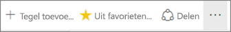
2. Als u een lijst wilt weergeven met alle dashboards die u aan Favorieten hebt toegevoegd, selecteert u in het navigatievenster aan de linkerkant de pijl rechts van **Favorieten**. Omdat het linkernavigatievenster een permanente functie van de Power BI-service is, hebt u overal in de Power BI-service toegang tot deze lijst.
   
    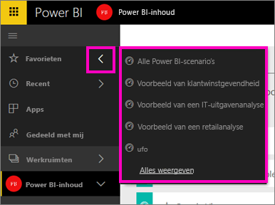
   
    Hier kunt u een dashboard selecteren om dit te openen.
3. Als u het deelvenster **Favorieten** wilt openen, selecteer in het navigatievenster aan de linkerkant de optie **Favorieten** of selecteert u het pictogram Favorieten .
   
   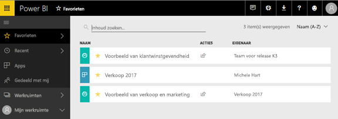
   
   Hier kunt u een dashboard selecteren om dit te openen, zien wie de eigenaar van een dashboard is, een dashboard uit de favorieten verwijderen of een dashboard delen met collega's.
4. U kunt een dashboard ook op het tabblad **Dashboards** als favoriet markeren.  Hiervoor opent u de werkruimte met het dashboard en selecteert u het sterpictogram links van de naam van het dashboard.
   
   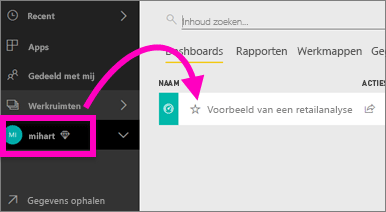

Zie [Een dashboard aan favorieten toevoegen](service-dashboard-favorite.md)

### Recent geopende
Hiermee geeft u het deelvenster **Recent geopende** weer, zodat u snel toegang hebt tot de rapporten en dashboards die u het recentst hebt geopend. Het venster bevat inhoud uit al uw verschillende werkruimten.

  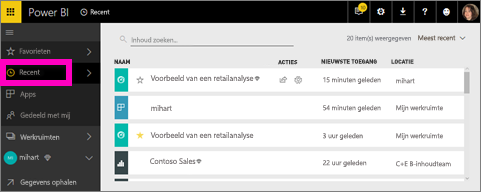

Net als bij Favorieten hebt u overal in de Power BI-service snel toegang tot uw recent geopende inhoud door in het linkernavigatievenster de pijl naast **Recent geopende** te selecteren.

  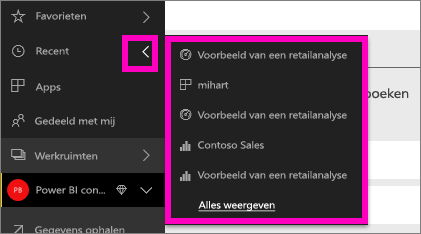

Zie [Recent geopende in Power BI](service-recent.md) voor meer informatie.

### Apps
Een app is een verzameling dashboards en rapporten die is gebouwd om belangrijke metrische gegevens op één plek te leveren. U kunt interne apps voor uw organisatie maar ook [apps voor externe services](service-connect-to-services.md) gebruiken, zoals Google Analytics en Microsoft Dynamics CRM. 

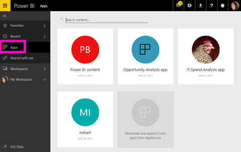

Zie **App-werkruimten** (hieronder) en [Wat zijn Power BI-apps](service-install-use-apps.md) voor meer informatie.

### Gedeeld met mij
**Gedeeld met mij** is de locatie voor alle dashboards die collega's met u hebben gedeeld.  Filter op dashboardeigenaar, gebruik het zoekveld om relevante informatie te vinden en sorteer de items op datum.  U kunt de gedeelde inhoud die u regelmatig bezoekt, in de weergave **Gedeeld met mij** eenvoudig toevoegen aan uw favorieten.

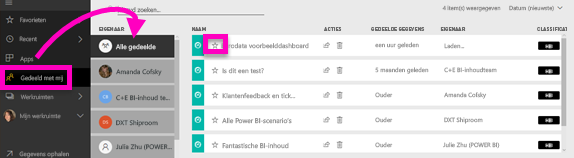

Zie [Gedeeld met mij](service-shared-with-me.md) voor meer informatie.

### Werken met werkruimten
Het volgende element in het linkernavigatievenster is de optie *Werkruimten*. Werkruimten zijn als het ware *containers* voor uw Power BI-inhoud. Er zijn twee soorten werkruimten: **Mijn werkruimte** en app-werkruimten.

Als u geen lid van een app-werkruimte of geen beheerder bent, worden er mogelijk geen app-werkruimten weergegeven in het linkernavigatievenster. Als u met de gratis versie van Power BI werkt, worden er ook geen app-werkruimten weergegeven.

#### Mijn werkruimte
Alle inhoud waarvan u de eigenaar bent, wordt opgeslagen in **Mijn werkruimte**. Deze werkruimte kunt u beschouwen als een persoonlijke sandbox of persoonlijk werkgebied voor uw eigen inhoud. U kunt vanuit Mijn werkruimte inhoud delen met collega's. De inhoud in Mijn werkruimte wordt geordend op vier tabbladen: Dashboards, Rapporten, Werkmappen en Gegevenssets.

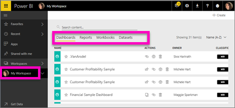

#### App-werkruimten
Apps en app-werkruimten zijn een functie van Power BI Pro. Als u dashboards en rapporten voor anderen ontwerpt, gebruikt u hiervoor app-werkruimten. Een app-werkruimte is de plaats waar u de app maakt. Voordat u een app kunt maken, moet u dus eerst de app-werkruimte maken. Het zijn in feite verder ontwikkelde groepswerkruimten: ruimten met tijdelijke bestanden en containers voor de inhoud van de app.  U en uw collega's kunnen samenwerken aan dashboards, rapporten en andere inhoud die u wilt distribueren naar een breder publiek of zelfs uw hele organisatie.

Ga naar [Een app maken en distribueren in Power BI](service-create-distribute-apps.md#app-workspaces) voor meer informatie.

Net als voor **Mijn werkruimte** wordt de inhoud geordend op vier tabbladen: Dashboards, Rapporten, Werkmappen en Gegevenssets.

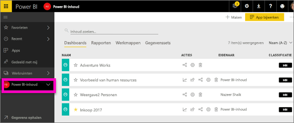

U kunt tussen werkruimten schakelen door in het linkernavigatievenster **Werkruimten** te selecteren.

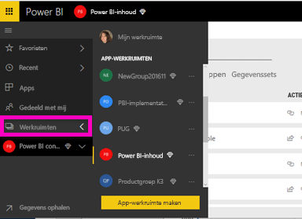

### Inhoud zoeken en sorteren
Met de nieuwe inhoudsweergave kunt u makkelijker inhoud zoeken, filteren en sorteren. Als u een dashboard, rapport of werkmap wilt zoeken, typt u in het zoekgebied. Power BI-filters zijn alleen van toepassing op inhoud waarvan de naam uw zoekreeks bevat.

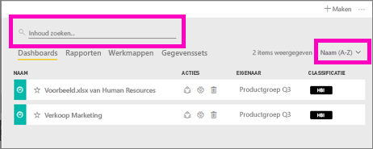

U kunt de inhoud ook sorteren op naam of eigenaar.  

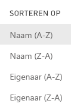

Zie [Power BI-navigatie: zoeken, sorteren en filteren](service-navigation-search-filter-sort.md) voor meer informatie.

## Volgende stappen
Vragen of feedback? [Bezoek de Power BI-community](http://community.powerbi.com/t5/Navigation-Preview-Forum/bd-p/NavigationPreview).

