# Zelfstudie: Verbinding maken met een GitHub-voorbeeld met Power BI
In deze zelfstudie gebruikt u echte gegevens in de GitHub-service met Power BI en Power BI maakt automatisch dashboards en rapporten. U maakt verbinding met de opslagplaats voor openbare Power BI-inhoud (ook wel *repo* genoemd) en ziet de volgende informatie: Hoeveel mensen dragen bij aan de openbare Power BI-inhoud? Wie levert de meeste bijdragen? Op welke dag van de wek worden de meeste bijdragen geleverd? En antwoorden op andere vragen. 

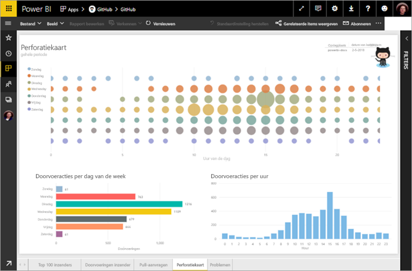

In deze zelfstudie voert u de volgende stappen uit:

> [!div class="checklist"]
> * Meld u aan voor een GitHub-account als u dat nog niet hebt 
> * Meld u aan bij uw Power BI-account, of meld u aan voor een account als u dat nog niet hebt
> * De Power BI-service openen
> * De GitHub-app zoeken
> * De informatie voor de openbare GitHub-opslagplaats van Power BI invoeren
> * Het dashboard en rapport met GitHub-gegevens bekijken
> * De app verwijderen om resources te wissen

Als u zich niet hebt geregistreerd voor Power BI, kunt u zich hier [aanmelden voor een gratis proefversie](https://app.powerbi.com/signupredirect?pbi_source=web) voordat u begint.

## Vereisten

Voor het voltooien van deze zelfstudie hebt u een GitHub-account nodig, als u dit nog niet hebt. 

- Aanmelden voor een [GitHub-account](https://docs.microsoft.com/contribute/get-started-setup-github)

## Verbinding maken
1. Aanmelden bij de Power BI-service (http://powerbi.com)). 
2. Selecteer in het linkernavigatievenster de optie **Apps** en vervolgens **Apps downloaden**.
   
   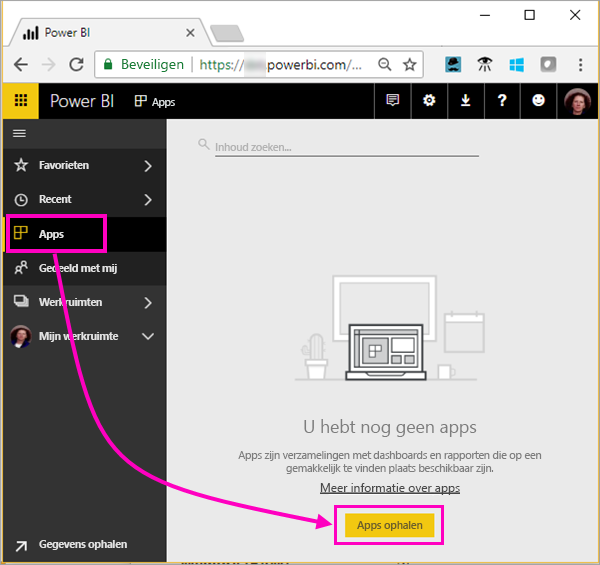 

3. Selecteer **Apps**, typ **github** in het zoekvak > **Nu downloaden**.
   
   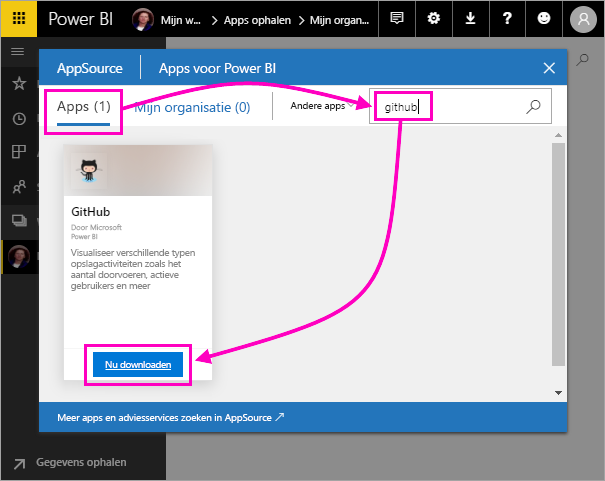 

4. Voer de naam in van de opslagplaats en de naam van de eigenaar van de opslagplaats. De URL voor deze opslagplaats is https://github.com/MicrosoftDocs/powerbi-docs, dus de **Eigenaar van opslagplaats** is **MicrosoftDocs** en de **Opslagplaats** is **powerbi-docs**. 
   
    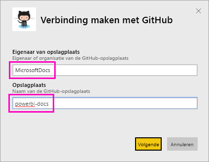

5. Voer de GitHub-referenties die u hebt gemaakt in. Power BI kan deze stap overslaan als u zich al hebt aangemeld bij GitHub in uw browser. 

6. Selecteer voor **Verificatiemethode** **oAuth2**\> **Aanmelden**.

7. Volg de verificatie-instructies van Github. Geef Power BI toestemming voor de GitHub-gegevens.
   
   Power BI kan nu verbinding maken met GitHub en de gegevens.  De gegevens worden eenmaal per dag vernieuwd.

8. Nadat Power BI de gegevens heeft geïmporteerd, ziet u de nieuwe GitHub-tegel. 
 
   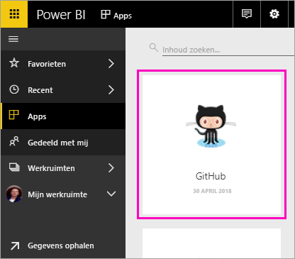 

8. Selecteer het algemene navigatiepictogram om de navigatie aan de linkerkant te minimaliseren, zodat u meer ruimte hebt.

    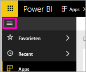

10. Selecteer de GitHub-tegel bij stap 8. 
    
    Het GitHub-dashboard wordt geopend. Dit zijn livegegevens, dus de waarden die u ziet, kunnen afwijken.

    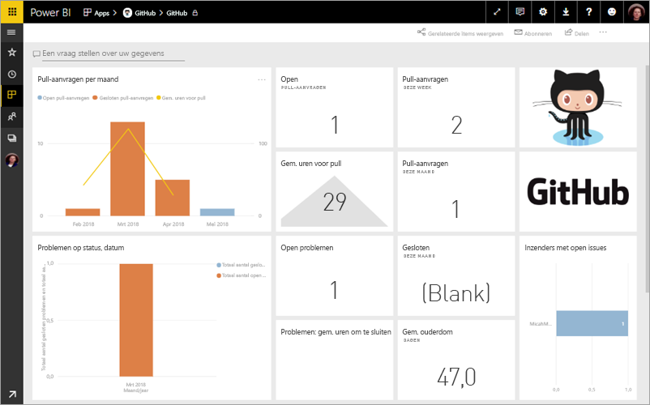

    

## Een vraag stellen

11. Plaats de cursor in het vak **Stel een vraag over uw gegevens** en selecteer **pull-aanvragen**. 

    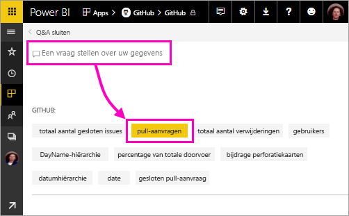

12. Typ **Per maand**.
 
    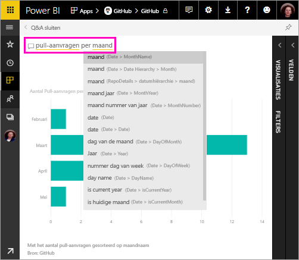

     Power BI maakt een staafdiagram met daarin het aantal pull-aanvragen per maand.

13. Selecteer **Q&A afsluiten**.

## Het GitHub-rapport weergeven 

1. In het GitHub-dashboard selecteert u de gecombineerde kolom- en lijngrafiek **Pull-aanvragen per maand** om het bijbehorende rapport te openen.

    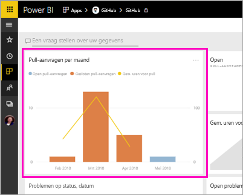

2. Selecteer een gebruikersnaam in de grafiek **Totaal aantal pull-aanvragen per gebruiker**. U ziet, zoals in dit voorbeeld, dat ze gemiddeld meer uren hadden dan het totale gemiddelde voor maart.

    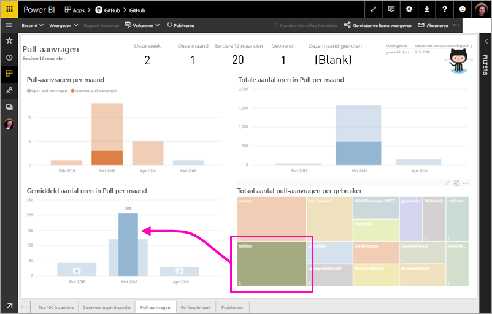

3. Selecteer het tabblad **Perforatiekaart** om de volgende pagina in het rapport weer te geven. 
 
    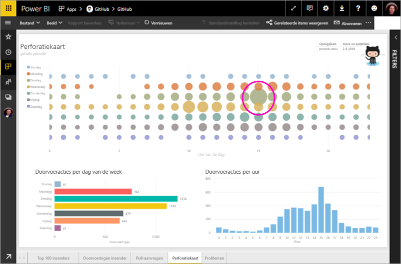

    Zo te zien is dinsdag om 15:00 uur het meest gangbare tijdstip en de meest gangbare dag van de week voor *bevestigingen*, wanneer mensen zich inchecken bij hun werk.

## Resources opschonen

Nu u de zelfstudie hebt voltooid, kunt u de GitHub-app verwijderen. 

1. Selecteer **Apps** in de linkernavigatiebalk.
2. Beweeg de cursor boven de GitHub-tegel en selecteer de prullenbak **Verwijderen**.

    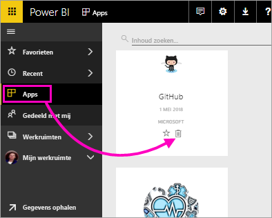

## Volgende stappen

In deze zelfstudie hebt u verbinding gemaakt met een openbare GitHub-opslagplaats en gegevens gedownload, die door Power BI naar een dashboard en rapport zijn geformatteerd. U hebt een aantal vragen over de gegevens beantwoord door het dashboard en rapport te verkennen. U kunt nu meer leren over verbinding maken met andere services zoals Salesforce, Microsoft Dynamics en Google Analytics. 
 
> [!div class="nextstepaction"]
> [Verbinding maken met de onlineservices die u gebruikt](service-connect-to-services.md)

