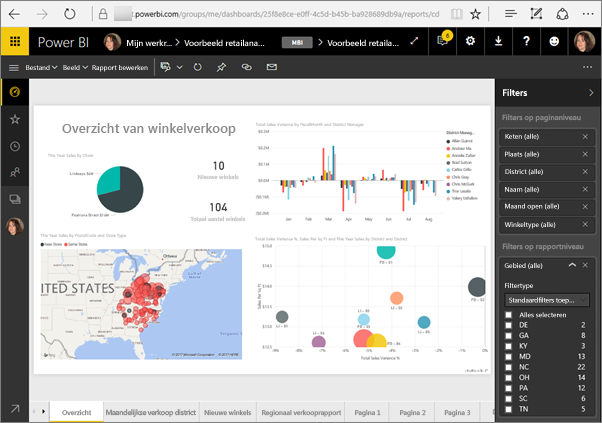
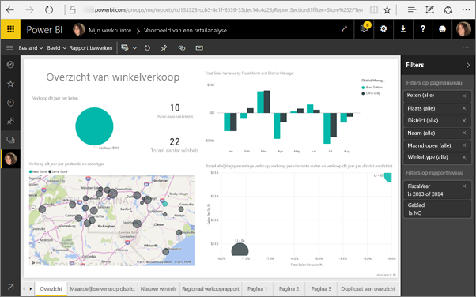
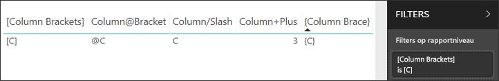

# <a name="filter-a-report-using-query-string-parameters-in-the-url"></a>Een rapport filteren door queryreeksparameters in de URL te gebruiken

Wanneer u een rapport in Power BI-service opent, heeft elke pagina van het rapport een eigen unieke URL. Als u deze rapportpagina wilt filteren, kunt u het deelvenster met filters gebruiken op het rapportcanvas.  U kunt ook queryreeksparameters toevoegen aan de URL om het rapport vooraf te filteren. Misschien hebt u een rapport dat u aan collega's wilt laten zien en u wilt het voor hen vooraf filteren. U kunt beginnen met de standaard-URL voor het rapport, de filterparameters toevoegen aan de URL en hen vervolgens via e-mail de volledige nieuwe URL sturen.



## <a name="uses-for-query-string-parameters"></a>Manieren om queryreeksparameters te gebruiken

Stel dat u werkt in Power BI Desktop. U wilt een rapport maken met koppelingen naar andere Power BI-rapporten, maar u wilt slechts een deel van de informatie in de andere rapporten opnemen. Filter om te beginnen de rapporten met queryreeksparameters en sla de URL's op. Maak vervolgens in Desktop een tabel met deze nieuwe rapport-URL's.  Publiceer en deel het rapport vervolgens.

U kunt queryreeksparameters ook gebruiken om een geavanceerde Power BI-oplossing te maken.  Er kan met DAX een rapport worden gemaakt dat dynamisch een gefilterde rapport-URL genereert op basis van de selectie die de klant maakt in het huidige rapport. Wanneer de klant op de URL klikt, wordt alleen de benodigde informatie weergegeven. 

## <a name="query-string-parameter-syntax-for-filtering"></a>Syntaxis van queryreeksparameter voor filteren

U kunt parameters gebruiken om het rapport te filteren op een of meer waarden, zelfs als die waarden spaties of speciale tekens bevatten. De basissyntaxis is vrij eenvoudig: start met de URL van het rapport, voeg een vraagteken toe en vervolgens uw filtersyntaxis.

URL?filter=***Tabel***/***Veld*** eq '***waarde***'


* De namen van de **tabel** en het **veld** zijn hoofdlettergevoelig, de **waarde** is dat niet.
* Velden die verborgen zijn in de rapportageweergave kunnen nog steeds worden gefilterd.

### <a name="reports-in-apps"></a>Rapporten in apps

Als u een URL-filter wilt toevoegen aan een rapport in een app, is de opmaak enigszins anders. Koppelingen naar rapporten in een app hebben een queryparameter (ctid) die wordt toegevoegd aan de URL. Queryparameters moeten worden gescheiden door een en-teken (&). Dus moet u de query toevoegen als '&filter=' (na de ctid-parameter) in plaats van als '?filter='. 

Zoals in dit voorbeeld:

app.powerbi.com/groups/me/apps/*app-id*/reports/*report-id*/ReportSection?ctid=*ctid*&filter=*Table*/*Field* eq '*value*'

### <a name="field-types"></a>Veldtypen

Een veld kan een cijfer, datum/tijd of tekenreeks bevatten. Het type dat u kiest, moet overeenkomen met het type dat wordt ingesteld in de gegevensset.  Als u bijvoorbeeld een tabelkolom van het type Tekenreeks maakt, ontstaat er een probleem als u een datum/tijd of numerieke waarde wilt opgeven in een gegevenssetkolom van het type Datum, zoals Table/StringColumn eq 1.

* **Tekenreeksen** moeten tussen enkele aanhalingstekens staan: 'naam manager'.
* **Cijfers** hoeven niet op een speciale manier te worden opgemaakt.
* **Datums en tijden** moeten tussen enkele aanhalingstekens staan. In OData v3 moeten deze vooraf worden gegaan door de tekst 'datum/tijd'. Dit is echter niet nodig in OData v4.

Als het nog steeds verwarrend voor u is, lees dan verder en we zullen het voor u uitsplitsen.  

## <a name="filter-on-a-field"></a>Filteren op een veld

Stel dat de URL van ons rapport als volgt is.


En we zien op onze visualisatiekaart (boven) dat we winkels in North Carolina hebben.

>[!NOTE]
>Dit voorbeeld is gebaseerd op het [Voorbeeld van een retailanalyse](sample-datasets.md).
> 

Als u het rapport zodanig wilt filteren dat er alleen winkels in North Carolina (NC) worden weergegeven, voegt u het volgende aan de URL toe:

?filter=Winkel/Gebied eq 'NC'


>[!NOTE]
>*NC* is de waarde voor North Carolina zoals opgeslagen in het veld **Gebied** van de tabel **Winkel**.
> 

Nu is het rapport gefilterd op North Carolina. Alle visualisaties op de rapportpagina bevatten alleen gegevens voor North Carolina.



## <a name="filter-on-multiple-fields"></a>Filteren op meerdere velden

U kunt ook filteren op meerdere velden door extra parameters aan uw URL toe te voegen. Daarvoor gaat u terug naar de oorspronkelijke filterparameter.

```
?filter=Store/Territory eq 'NC'
```

Als u wilt filteren op aanvullende velden, voegt u een '**and**' en een ander veld toe in dezelfde indeling als hierboven. Hier volgt een voorbeeld.

```
?filter=Store/Territory eq 'NC' and Store/Chain eq 'Fashions Direct'
```

<iframe width="640" height="360" src="https://www.youtube.com/embed/0sDGKxOaC8w?showinfo=0" frameborder="0" allowfullscreen></iframe>

## <a name="operators"></a>Operators

Power BI ondersteunt naast '**and**' nog verschillende andere operators. De volgende tabel bevat deze operators en het type inhoud waar de operators ondersteuning voor bieden.

|operator  | definitie | tekenreeks  | getal | Datum |  Voorbeeld|
|---------|---------|---------|---------|---------|---------|
|**and**     | en |  ja      | ja |  ja|  product/price le 200 and price gt 3.5 |
|**eq**     | is gelijk aan |  ja      | ja   |  ja       | Address/City eq 'Redmond' |
|**ne**     | is niet gelijk aan |   ja      | ja  | ja        |  Address/City ne 'London' |
|**ge**     |  groter dan of gelijk aan       | nee | ja |ja |  product/price ge 10
|**gt**     | groter dan        |nee | ja | ja  | product/price gt 20
|**le**     |   kleiner dan of gelijk aan      | nee | ja | ja  | product/price le 100
|**lt**     |  kleiner dan       | nee | ja | ja |  product/price lt 20
|**in\*\***     |  inclusief       | ja | ja |  ja | Student/Age in (27, 29)


\*\*Als u **in** gebruikt, kunnen de waarden rechts van **in** in een lijst met door komma's gescheiden waarden zijn geplaatst, tussen haakjes. Er kan ook een expressie worden geplaatst waarmee een verzameling wordt geretourneerd.

### <a name="numeric-data-types"></a>Numerieke gegevenstypen

Power BI-URL-filters kunnen in de volgende indelingen cijfers bevatten.

|Type getal  |Voorbeeld  |
|---------|---------|
|**geheel getal**     |   5      |
|**long**     |   5 L of 5 l      |
|**double**     |   5.5, 55e-1, 0.55e+1, 5D, 5d, 0.5e1D, 0.5e1d, 5.5D, 5.5d, 55e-1D of 55e-1d     |
|**decimal**     |   5 M of 5 m of 5,5 M of 5,5 m      |
|**float**     | 5 F of 5 f of 0,5e1 F of 0,5e-1 d        |

### <a name="date-data-types"></a>Datumgegevenstypen

Power BI biedt ondersteuning voor OData V3 en V4 voor de gegevenstypen **Date** en **DateTimeOffset**.  Datums worden weergegeven met de EDM-indeling (2019-02-12T00:00:00). Als u een datum op als JJJJ-MM-DD, wordt deze door Power BI geïnterpreteerd als JJJJ-MM-DDT00:00:00.

Waarom is dit onderscheid van belang? Stel dat u de queryreeksparameter **Table/Date gt 2018-08-03** maakt.  Bevat het resultaat dan 3 augustus 2018 of wordt er begonnen bij 4 augustus 2018? Omdat Power BI uw query omzet in **Table/Date gt 2018-08-03T00:00:00**, omvatten de resultaten alle datums met een tijddeel dat niet uit alleen nullen bestaat. Deze datums zijn immers 'groter' dan **2018-08-03T00:00:00**.

## <a name="special-characters-in-url-filters"></a>Speciale tekens voor URL-filters

Speciale tekens en spaties vereisen aanvullende opmaak. Als uw query spaties, streepjes of andere niet-ASCII-tekens bevat, gebruikt u vóór die speciale tekens een *escape-code*, die begint met een onderstrepingsteken en een X (**_x**), vervolgens de viercijferige **Unicode**, gevolgd door nog een onderstrepingsteken. Als de Unicode uit minder dan vier tekens bestaat, moet u opvulnullen gebruiken. Hieronder ziet u een aantal voorbeelden.

|Id  |Unicode  | Code voor Power BI  |
|---------|---------|---------|
|**Tabelnaam**     | Ruimte is 0x20        |  Table_x0020_Name       |
|**Column**@**Number**     |   @ is 0x40     |  Column_x0040_Number       |
|**[Column]**     |  [is 0x0058] is 0x0050       |  _x0058_Column_x0050       |
|**Column+Plus**     | + is 0x2B        |  Column_x002B_Plus       |

Table_x0020_Name/Column_x002B_Plus eq 3 


Table_x0020_Special/_x005B_Column_x0020_Brackets_x005D_ eq '[C]' 

## <a name="use-dax-to-filter-on-multiple-values"></a>DAX gebruiken om op meerdere waarden te filteren

U kunt ook op meerdere velden filteren door een berekende kolom te maken waarmee twee velden worden samengevoegd in één waarde. Vervolgens kunt u filteren op die waarde.

We hebben bijvoorbeeld twee velden: gebied en keten. U kunt in Power BI Desktop een [nieuw berekende kolom maken](desktop-tutorial-create-calculated-columns.md) (veld) met de naam GebiedKeten. Houd er rekening mee dat de naam van het **veld** geen spaties mag bevatten. Hier volgt de DAX-formule voor die kolom.

GebiedKeten = [Gebied] & "-" & [Keten]

Publiceer het rapport naar de Power BI-service en gebruik de URL-queryreeks vervolgens om te filteren om zodoende alleen gegevens voor de winkels van Lindseys in NC weer te geven.

    https://app.powerbi.com/groups/me/reports/8d6e300b-696f-498e-b611-41ae03366851/ReportSection3?filter=Store/TerritoryChain eq 'NC – Lindseys'

## <a name="pin-a-tile-from-a-filtered-report"></a>Maak een tegel uit een gefilterd rapport vast

Nadat u het rapport met queryreeksparameters hebt gefilterd, kunt u visualisaties uit het rapport aan uw dashboard vastmaken.  De tegel op het dashboard geeft de gefilterde gegevens weer en door het selecteren van deze dashboardtegel opent u het rapport dat is gebruikt om deze te maken.  De filters die u hebt toegepast met behulp van de URL worden echter niet opgeslagen met het rapport. Wanneer u de dashboardtegel selecteert, wordt het rapport in ongefilterde toestand geopend.  Dit betekent dat de gegevens die worden weergegeven op de dashboardtegel niet overeenkomen met de gegevens die worden weergegeven in de rapportvisualisatie.

Dit verschil is handig wanneer u verschillende resultaten wilt zien; gefilterd in het dashboard en ongefilterd in het rapport.

## <a name="considerations-and-troubleshooting"></a>Aandachtspunten en probleemoplossing

Er zijn een aantal dingen waar u op moet letten bij het gebruik van queryreeksparameters.

* Wanneer u de operator *in* gebruikt, moeten de waarden rechts van *in* worden opgenomen in een lijst gescheiden met komma's, met de lijst tussen haakjes.    
* U kunt in Power BI Report Server [rapportparameters doorsturen](https://docs.microsoft.com/sql/reporting-services/pass-a-report-parameter-within-a-url?view=sql-server-2017.md) door ze op te nemen in een rapport-URL. Deze URL-parameters hebben geen voorvoegsel omdat ze rechtstreeks aan de verwerkingsengine voor rapporten worden doorgegeven.
* Het filteren van een querytekenreeks werkt niet met [Publiceren op internet](service-publish-to-web.md).
* [Insluiten met webonderdeel Rapport in SharePoint Online](service-embed-report-spo.md) ondersteunt geen URL-filters.
* Het gegevenstype long is (2^53-1) wegens JavaScript-beperkingen.
* Rapport-URL-filters hebben een limiet van 10 expressies (10 filters die zijn verbonden via AND).

## <a name="next-steps"></a>Volgende stappen

[Een visualisatie vastmaken aan een dashboard](service-dashboard-pin-tile-from-report.md)  
[Aanmelden voor een gratis proefversie](https://powerbi.microsoft.com/get-started/)

Hebt u nog vragen? [Misschien dat de Power BI-community het antwoord weet](http://community.powerbi.com/)
