# Metrische gegevens over het gebruik van dashboards en rapporten

Als u dashboards en rapporten maakt, kunnen metrische gegevens over het gebruik u helpen hun invloed te begrijpen. Wanneer u metrische gegevens over het gebruik van dashboards of rapporten uitvoert, ontdekt u hoe deze dashboards en rapporten worden gebruikt binnen uw organisatie; wat wordt gebruikt, door wie en met welk doel.  

> [!NOTE]
> Metrische gegevens over gebruik houden het gebruik bij van rapporten die zijn ingesloten in SharePoint Online. Via gegevens over het gebruik wordt echter geen insluiting bijgehouden van dashboards en rapporten via de stroom Gebruiker is eigenaar van referenties of App is eigenaar van referenties. Metrische gegevens over gebruik houden eveneens niet het gebruik van rapportinsluiting bij via [publiceren op internet](service-publish-to-web.md).

Deze rapporten over metrische gegevens over gebruik zijn alleen-lezen. U kunt een rapport met metrische gegevens over gebruik echter aanpassen door Opslaan als te gebruiken. Hiermee maakt u een nieuwe gegevensset en wordt het alleen-lezenrapport geconverteerd naar een volledig Power BI-rapport dat u kunt bewerken. Het persoonlijke rapport bevat niet alleen metrische gegevens over het geselecteerde dashboard of rapport, maar door het standaardfilter te verwijderen, hebt u nu toegang tot metrische gegevens over gebruik voor alle dashboards of alle rapporten in de geselecteerde werkruimte. U kunt zelfs de namen van uw eindgebruikers zien.

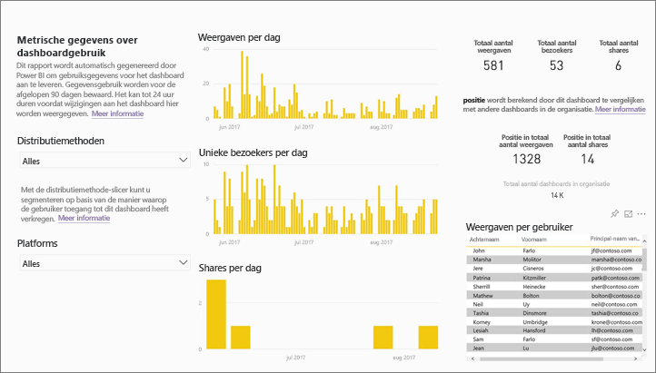

## Waarom zijn metrische gegevens over gebruik belangrijk voor mij?

Wanneer u weet hoe uw inhoud wordt gebruikt, kunt u de invloed ervan demonstreren en prioriteiten vaststellen voor uw inspanningen. De metrische gegevens over gebruik kunnen aantonen dat een van uw rapporten dagelijks wordt gebruikt door een enorm segment van de organisatie en ze kunnen aantonen dat een dashboard dat u hebt gemaakt helemaal niet wordt weergegeven. Dit type feedback is zeer waardevol bij uw inspanningen werk leidt.

Het uitvoeren van rapporten over gebruik van metrische gegevens is alleen beschikbaar in Power BI-service.  Als u een rapport met metrische gegevens over gebruik echter opslaat of vastmaakt aan een dashboard, kunt u het openen met dat rapport werken op mobiele apparaten.

### Vereisten

- De functie metrische gegevens over gebruik legt gebruiksinformatie van alle gebruikers vast, ongeacht de licentie die aan hen is toegewezen. Er is echter een Power BI Pro-licentie vereist om de metrische gegevens over gebruik uit te voeren.
- Metrische gegevens over gebruik zijn beschikbaar op dashboards en rapporten in de geselecteerde werkruimte. Als u toegang wilt tot de metrische gegevens over gebruik voor een bepaald dashboard of rapport, moet u:    
    • Bewerkingsrechten hebben voor dat dashboard of rapport • Beschikken over een Pro-licentie

## Over het rapport Metrische gegevens over gebruik

Wanneer u **Metrische gegevens over gebruik** of het pictogram  selecteert, genereert Power BI een vooraf samengesteld rapport met metrische gegevens over gebruik voor die inhoud voor de afgelopen 90 dagen.  Het rapport is vergelijkbaar met de Power BI-rapporten waarmee u al bekend bent, maar is informatief, niet interactief. U kunt segmenteren op basis van hoe uw eindgebruikers toegang hebben gekregen, of ze toegang kregen via de website of mobiele app, enzovoort. Naarmate uw dashboards en rapporten zich ontwikkelen, vult het rapport met metrische gegevens over gebruik zich ook. Het wordt elke dag wordt bijgewerkt met nieuwe gegevens.  

Rapporten met metrische gegevens over gebruik worden niet weergegeven in **Recent**, **Werkruimten**, **Favorieten** of andere inhoudslijsten. Ze kunnen niet worden toegevoegd aan een app. Als u een tegel van een rapport met metrische gegevens over gebruik vastmaakt aan een dashboard, kan dat dashboard niet worden toegevoegd aan een app of een inhoudspakket.

Om de rapportgegevens nader te bekijken of om uw eigen rapporten samen te stellen op basis van de gegevensset, gebruikt u **Opslaan als** (zie [Het rapport als een volledig Power BI-rapport opslaan](#Save-the-Usage-Metrics-report-as-a-full-featured-Power-BI-report-(personalize)).

## Een rapport met metrische gegevens over gebruik voor een dashboard of rapport openen

1. Begin in de werkruimte die het dashboard of rapport bevat.
2. Selecteer het pictogram **Metrische gegevens over gebruik**  in de inhoudslijst van de werkruimte of in het dashboard of rapport zelf.

    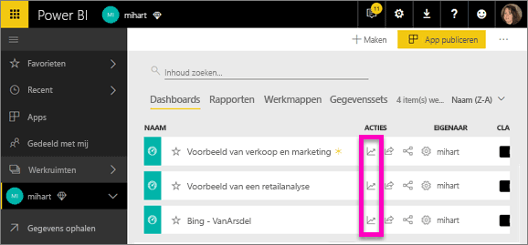

    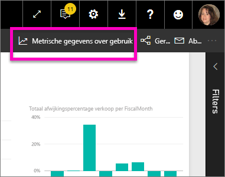
3. De eerste keer dat u dit doet, maakt Power BI het rapport met metrische gegevens over gebruik en laat u weten wanneer het gereed is.

    
4. Selecteer **Metrische gegevens over gebruik weergeven** om de resultaten te openen.

    Metrische gegevens over gebruik zijn een krachtige bondgenoot tijdens het implementeren en beheren van Power BI-dashboards en -rapporten. Wilt u weten welke pagina's van uw rapport het nuttigst zijn en welke u geleidelijk moet opheffen? Segmenteer op **rapportpagina** om erachter te komen. Wilt u weten of u een mobiele indeling voor uw dashboard moet maken? Segmenteer op **platformen** om te ontdekken hoeveel gebruikers gebruikmaken van uw inhoud via de mobiele apps versus via een webbrowser.

5. Beweeg desgewenst de muisaanwijzer over een visualisatie en selecteer het speldpictogram om de visualisatie toe te voegen aan een dashboard. Of selecteer in de bovenste menubalk **Live pagina vastmaken** om de gehele pagina toe te voegen aan een dashboard. Vanuit het dashboard kunt u de metrische gegevens over gebruik eenvoudiger controleren of delen met anderen.

    > [!NOTE]
    > Als u een tegel van een rapport met metrische gegevens over gebruik vastmaakt aan een dashboard, kan dat dashboard niet worden toegevoegd aan een app of een inhoudspakket.

## Welke metrische gegevens worden gerapporteerd?

| Metrische gegevens | Dashboard | Rapport | Beschrijving |
| --- | --- | --- | --- |
| Distributiemethodeslicer |ja |ja |Hoe gebruikers toegang kregen tot de inhoud. Er zijn drie mogelijke methoden: gebruikers kunnen toegang krijgen tot het dashboard of rapport door lid te zijn van een [app-werkruimte](consumer/end-user-experience.md), doordat de inhoud [met hen is gedeeld](service-share-dashboards.md) of door een inhoudspakket/-app te installeren.  Weergaven door middel van een app worden geteld als inhoudspakket. |
| Platformenslicer |ja |ja |Is het dashboard of rapport benaderd via de Power BI-service (powerbi.com) of een mobiel apparaat? Mobiel omvat al onze iOS-, Android- en Windows-apps. |
| Rapportpaginaslicer |nee |ja |Als het rapport meer dan één pagina heeft, segmenteert u het rapport op de pagina('s) die is (zijn) weergegeven. Als u een lijstoptie voor 'Leeg' ziet, betekent dit dat een rapportpagina onlangs is toegevoegd (binnen 24 uur wordt de daadwerkelijke naam van de nieuwe pagina weergegeven in de slicerlijst) en/of dat rapportpagina's zijn verwijderd. 'Leeg' legt deze situaties vast. |
| Weergaven per dag |ja |ja |Totaal aantal weergaven per dag - een weergave wordt gedefinieerd als een gebruiker die een rapportpagina of dashboard laadt. |
| Unieke gebruikers per dag |ja |ja |Aantal *verschillende* gebruikers die het dashboard of rapport hebben weergegeven (op basis van het gebruikersaccount AAD). |
| Weergaven per gebruiker |ja |ja |Het aantal weergaven in de afgelopen 90 dagen, opgedeeld per individuele gebruikers. |
| Shares per dag |ja |nee |Het aantal keren dat het dashboard is gedeeld met een andere gebruiker of groep. |
| Totaal aantal weergaven |ja |ja |Het aantal weergaven in de afgelopen 90 dagen. |
| Totaal aantal bezoekers |ja |ja |Het aantal unieke bezoekers in de afgelopen 90 dagen. |
| Totaal aantal shares |ja |nee |Het aantal keren dat het dashboard of rapport in de afgelopen 90 dagen is gedeeld. |
| Totaal in de organisatie |ja |ja |Totaal aantal weergaven van alle dashboards en rapporten in de hele organisatie die minimaal eenmaal zijn weergegeven in de afgelopen 90 dagen.  Wordt gebruikt om de positie te berekenen. |
| Positie: totaal aantal weergaven |ja |ja |Welke positie neemt dit dashboard of rapport in voor het totale aantal weergaven van alle dashboards en rapporten in de organisatie gedurende de afgelopen 90 dagen. |
| Positie: totaal aantal shares |ja |nee |Welke positie neemt dit dashboard of rapport in voor het totale aantal shares van alle dashboards in de organisatie gedurende de afgelopen 90 dagen. |

### Rapport Metrische gegevens over dashboardgebruik

### Rapport Metrische gegevens over rapportgebruik

## Het rapport met metrische gegevens over gebruik opslaan als een volledig Power BI-rapport (aan persoonlijke voorkeuren aanpassen)

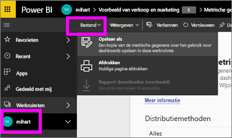

Gebruik **Opslaan als** om het rapport met metrische gegevens over gebruik te converteren naar een volledig Power BI-rapport dat kan worden aangepast en gedeeld. Als u eenmaal een aangepaste kopie hebt gemaakt, krijgt u volledige toegang tot de onderliggende gegevensset, zodat u het rapport met metrische gegevens over gebruik kunt aanpassen aan uw specifieke behoeften. U kunt zelfs Power BI Desktop gebruiken om aangepaste rapporten met metrische gegevens over gebruik te maken met behulp van de [liveverbinding met de functie van Power BI-service](https://powerbi.microsoft.com/blog/connecting-to-datasets-in-the-power-bi-service-from-desktop).

Nog beter, de onderliggende gegevensset bevat de gebruiksdetails voor alle dashboards of rapporten in de werkruimte. Hiermee opent u nog een wereld aan mogelijkheden. U kunt bijvoorbeeld een rapport maken waarin alle dashboards in uw werkruimte met elkaar worden vergeleken op basis van gebruik. U kunt ook een dashboard met metrische gegevens over gebruik voor uw Power BI-app maken door gebruiksgegevens samen te voegen over alle inhoud gedistribueerd binnen die app.  Zie [Het filter Paginaniveau verwijderen](#remove-the-filter-to-see-all-the-usage-metrics-data-in-the-workspace) hieronder.

### Wat wordt gemaakt bij gebruik van 'Opslaan als'?

Wanneer Power BI het volledige rapport maakt, maakt het ook een nieuwe gegevensset **die bestaat uit alle dashboards of alle rapporten die zijn opgenomen in de huidige werkruimte** die in de afgelopen 90 dagen zijn geopend. Stel dat u een werkruimte hebt met de naam 'Verkoop'. Deze bevat drie dashboards en twee rapporten en u maakt een rapport met metrische gegevens over gebruik op het dashboard 'Noordoosten'. U gebruikt vervolgens **Opslaan als** om het aan persoonlijke voorkeuren aan te passen en te converteren naar een volledig rapport. De gegevensset voor dat nieuwe rapport bevat de metrische gegevens over gebruik voor *niet alleen dat ene dashboard met de naam 'Noordoosten'* maar voor alle drie dashboards in de werkruimte 'Verkoop'. Standaard geeft het rapport gegevens weer voor het dashboard 'Noordoosten'. U moet [een filter verwijderen](#remove-the-filter-to-see-all-the-usage-metrics-data-in-the-workspace) (één klik) om gegevens voor alle drie dashboards weer te geven.

### Een kopie maken van het gebruiksrapport met behulp van Opslaan als

Wanneer u een kopie maakt met behulp van 'Opslaan als' (aan persoonlijke voorkeuren aanpassen), zet Power BI het vooraf gemaakte alleen-lezenrapport om naar een volledig rapport.  Op het eerste gezicht ziet het er precies hetzelfde uit. U kunt het rapport nu echter openen in de weergave Bewerken, nieuwe visualisaties filters en pagina's toevoegen, bestaande visualisaties wijzigen of verwijderen en nog veel meer. Power BI slaat het nieuwe rapport en gegevensset op in de huidige werkruimte. In het hierna volgende voorbeeld is de actuele werkruimte **mihart**.

1. Selecteer **Bestand > Opslaan als** in het vooraf samengestelde rapport met metrische gegevens over gebruik. Power BI converteert het rapport met metrische gegevens over gebruik in een volledig Power BI-rapport. Dit wordt een *persoonlijk* rapport met metrische gegevens over gebruik genoemd. Het persoonlijke gebruiksrapport en de persoonlijke gegevensset zijn opgeslagen in de actuele werkruimte met de naam **mihart*.

    
2. Open het rapport in de weergave Bewerken en [werk ermee u zoals u ook met andere Power BI-rapporten werkt](service-interact-with-a-report-in-editing-view.md). Voeg bijvoorbeeld nieuwe pagina's toe en maak nieuwe visualisaties, voeg filters toe, maak de lettertypen en kleuren op, enzovoort.

    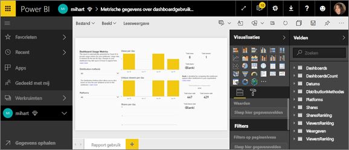
3. U kunt ook beginnen met de nieuwe gegevensset en een compleet nieuw rapport maken.

    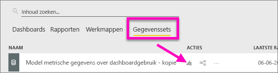
4. Het nieuwe rapport wordt opgeslagen in de huidige werkruimte (mihart) en wordt ook toegevoegd aan de inhoudslijst **Recent**.

    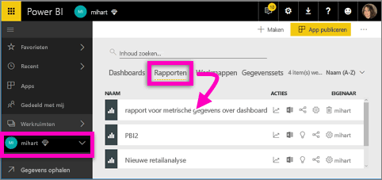

### Het filter verwijderen om ***alle*** metrische gegevens over gebruik in de werkruimte te bekijken

Als u de metrische gegevens over gebruik voor alle dashboards of voor alle rapporten in de werkruimte wilt zien, moet u een filter verwijderen. Het persoonlijke rapport wordt standaard gefilterd om alleen metrische gegevens weer te geven voor het dashboard of rapport dat was gebruikt om het te maken.

Als u bijvoorbeeld het dashboard met de naam 'Europese verkoop' hebt gebruikt om dit nieuwe persoonlijke rapport te maken, worden alleen gebruiksgegevens van het dashboard 'Europese verkoop' weergegeven. Om het filter te verwijderen en gegevens van alle dashboards in die werkruimte in te schakelen:

1. Open het persoonlijke rapport in de weergave Bewerken.

    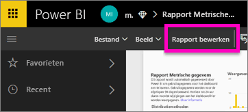
2. Zoek in het deelvenster Filters de bucket **Filters op rapportniveau** en verwijder het filter door de 'x' selecteren.

    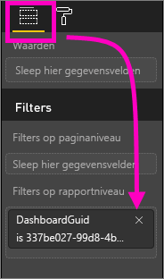

    Het persoonlijke rapport geeft nu metrische gegevens weer voor de hele werkruimte.

## Besturingselementen voor beheerders voor metrische gegevens over gebruik - voor Power BI-beheerders

Rapporten met metrische gegevens over gebruik zijn een functie die de Power BI- of Office 365-beheerder kan in- of uitschakelen. Beheerders hebben gedetailleerde controle welke gebruikers toegang hebben tot metrische gegevens over gebruik hebben; ze zijn standaard ingeschakeld voor alle gebruikers in de organisatie.

1. Open het Beheerportal door het tandwielpictogram te selecteren rechts boven in Power BI-service en **Beheerportal** te kiezen.

    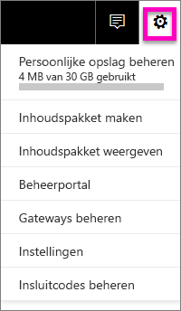
2. Selecteer in het Beheerportal **Tenantinstellingen** en kies **Metrische gegevens over gebruik voor inhoudsmakers**.

    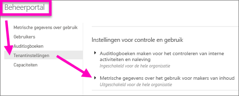
3. Schakel metrische gegevens over gebruik in (of uit) en selecteer **Toepassen**.

    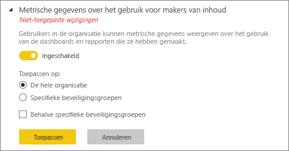

Standaard wordt gegevens per gebruiker ingeschakeld voor metrische gegevens over gebruik. Accountgegevens van makers van inhoud worden in het metrische rapport opgenomen. Als u deze informatie niet voor een bepaalde gebruiker of voor geen enkele gebruiker wilt opnemen, schakelt u de functie voor bepaalde beveiligingsgroepen of voor een hele organisatie uit. Accountgegevens worden dan in het rapport weergegeven als *Naamloos*.

Wanneer beheerders metrische gegevens over gebruik uitschakelen voor de gehele organisatie, kunnen ze de optie **Verwijder alle bestaande inhoud over metrische gegevens over gebruik** gebruiken om alle bestaande rapporten en dashboardtegels te verwijderen die zijn gemaakt met behulp van rapporten met metrische gegevens over gebruik en gegevenssets. Deze optie verwijdert alle toegang tot metrische gegevens voor alle gebruikers in de organisatie die deze mogelijk al gebruiken. Let op, want het verwijderen van bestaande metrische gegevens over gebruik kan niet ongedaan worden gemaakt.

## Metrische gegevens over gebruik in nationale clouds

Power BI is beschikbaar in afzonderlijke nationale clouds. Deze clouds bieden hetzelfde niveau qua beveiliging, privacy, compatibiliteit en transparantie als de algemene versie van Power BI en worden aangevuld met een uniek model voor lokale voorschriften voor het leveren van services, gegevenslocatie, toegang en beheer. Vanwege dit unieke model voor lokale voorschriften zijn metrische gegevens over gebruik niet beschikbaar in nationale clouds. Zie [nationale clouds](https://powerbi.microsoft.com/en-us/clouds/) voor meer informatie.

## Overwegingen en beperkingen

Het is belangrijk om te begrijpen dat er verschillen kunnen optreden wanneer u metrische gegevens over verbruik vergelijkt met auditlogboeken en waarom. *Auditlogboeken* worden verzameld met gegevens uit de Power BI-service en *Metrische gegevens over gebruik* worden verzameld in de client. Vanwege dat verschil komen geaggregeerde tellingen van activiteiten in auditlogboeken mogelijk niet altijd overeen met metrische gegevens over gebruik. Dat zit zo:

* Metrische gegevens over gebruik tellen soms minder activiteiten vanwege inconsistente netwerkverbindingen, ad blockers of andere problemen die de verzending van gebeurtenissen van de client kunnen verstoren.
* Bepaalde typen weergaven zijn niet opgenomen in metrische gegevens over gebruik, zoals eerder in dit artikel is beschreven.
* Metrische gegevens over gebruik tellen soms meer activiteiten. Dat komt voor in gevallen waarin de client vernieuwt zonder dat het nodig is om een aanvraag terug te sturen naar de Power BI-service.

Naast de mogelijke verschillen tussen metrische gegevens over gebruik en auditlogboeken, kunnen de volgende vragen en antwoorden over metrische gegevens over gebruik handig zijn voor gebruikers en beheerders:

V: Ik kan geen metrische gegevens over gebruik uitvoeren op een dashboard of rapport A: U ziet alleen de metrische gegevens over gebruik voor inhoud waarvan u eigenaar bent of waarvoor u machtigingen hebt om te bewerken.

V: Leggen metrische gegevens over gebruik weergaven van de ingesloten dashboards en rapporten vast?
A: Metrische gegevens over gebruik bieden geen ondersteuning voor het vastleggen van gebruik voor ingesloten dashboards en rapporten, en de stroom [publiceren op web](service-publish-to-web.md).          In die gevallen raden we u aan om bestaande platformen voor webanalyse te gebruiken om het gebruik voor de hosting-app of -portal bij te houden.

V: Ik kan geen metrische gegevens over gebruik uitvoeren op geen enkele inhoud.
A1: Beheerders kunnen deze functie uitschakelen voor hun organisatie.  Neem contact op met uw beheerder om te zien of dit het geval is.
A2: Metrische gegevens over gebruik is een functie van Power BI Pro.

V: De gegevens lijken niet up-to-date te zijn. Distributiemethoden worden bijvoorbeeld niet weergegeven, rapportpagina's ontbreken, enzovoort. A: Het kan 24 uur duren voordat gegevens zijn bijgewerkt.

V: Er zijn vier rapporten in de werkruimte, maar het rapport met metrische gegevens over gebruik geeft maar drie weer.
A: Het rapport met metrische gegevens over gebruik bevat alleen rapporten (of dashboards) die in de afgelopen 90 dagen zijn geopend.  Als een rapport (of dashboard) niet wordt weergegeven, is het waarschijnlijk meer dan 90 dagen niet gebruikt.

## Volgende stappen

[Een dashboard aan favorieten toevoegen](consumer/end-user-favorite.md)

Hebt u nog vragen? [Misschien dat de Power BI-community het antwoord weet](http://community.powerbi.com/)