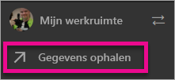
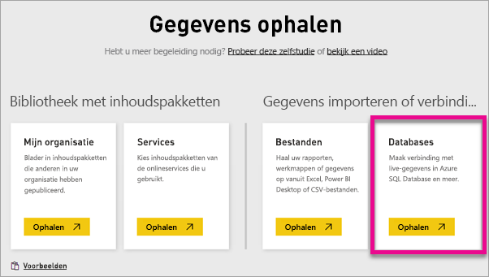
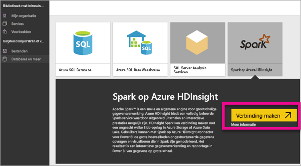
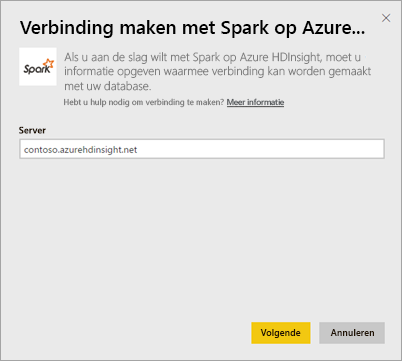
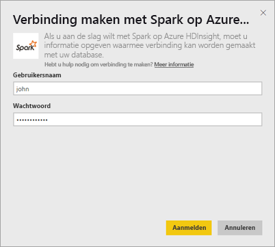
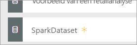
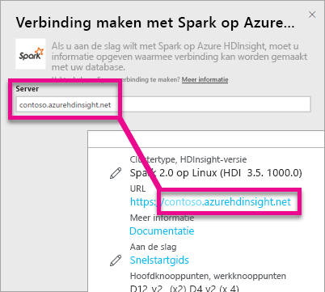
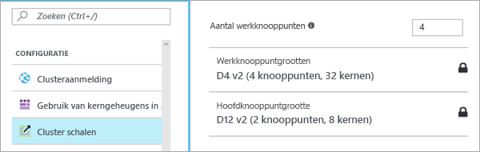

# Spark op HDInsight met DirectQuery

Met Spark in Azure HDInsight met DirectQuery kunt u dynamische rapporten maken op basis van gegevens en metrische gegevens die u al hebt in uw Spark-cluster. Met DirectQuery worden query’s teruggestuurd naar uw Azure HDInsight Spark-cluster terwijl u de gegevens in de rapportweergave verkent. Deze ervaring wordt aangeraden voor gebruikers die vertrouwd zijn met de entiteiten waarmee ze verbinding maken.

> [!WARNING]
> Automatische vernieuwing van tegels is uitgeschakeld voor dashboardtegels die zijn gebouwd op basis van Spark-gegevenssets. U kunt **Dashboardtegels vernieuwen** selecteren om ze handmatig te vernieuwen. Rapporten worden niet beïnvloed en zouden up-to-date moeten blijven. 

Met volgende stappen kunt u verbinding maken met uw Spark op Azure HDInsight-gegevensbron met behulp van DirectQuery binnen de Power BI-service.

> [!Important]
> De connectiviteit met Spark is verbeterd.  Gebruik Power BI Desktop voor de beste ervaring bij het maken van verbinding met uw Spark-gegevensbron.  Als u uw model en het rapport hebt gemaakt, kunt u deze publiceren naar Power BI-service.  De directe verbinding voor Spark in Power BI-service is afgeschaft.

1. Selecteer **Gegevens ophalen** onder in het linkernavigatievenster.

     
2. Selecteer **Databases en meer**.

     
3. Selecteer de connector **Spark in HDInsight** en kies **Verbinding maken**.

     
4. Voer de naam in van de **server** waarmee u verbinding wilt maken, evenals uw **gebruikersnaam** en **wachtwoord**. De servernaam heeft altijd de notatie \<clusternaam\>.azurehdinsight.net. Hieronder vindt u meer over het zoeken naar deze waarden.

     

     
5. Wanneer u verbinding hebt, ziet u een nieuwe gegevensset met de naam ‘SparkDataset’. U kunt de gegevensset ook openen via de gemaakte plaatsaanduidingstegel.

     
6. Door in te zoomen op de gegevensset kunt u alle tabellen en kolommen in de database verkennen. Als u een kolom selecteert, wordt er een query teruggestuurd naar de bron, waardoor uw visualisatie dynamisch wordt gecreëerd. Deze visualisaties kunnen worden opgeslagen in een nieuw rapport en weer worden vastgemaakt aan uw dashboard.

## Uw Spark in HDInsight-parameters vinden

De servernaam heeft altijd de notatie \<clusternaam\>.azurehdinsight.net, en is te vinden in Azure Portal.

De gebruikersnaam en het wachtwoord zijn ook te vinden in Azure Portal.

## Beperkingen

Deze beperkingen en opmerkingen kunnen veranderen, omdat we er voortdurend aan werken de ervaring te verbeteren. Meer documentatie is te vinden op [Use BI tools with Apache Spark on Azure HDInsight](https://azure.microsoft.com/documentation/articles/hdinsight-apache-spark-use-bi-tools/) (Apache Spark BI hulpmiddelen voor gegevensvisualisatie gebruiken met Azure HDInsight)

* De Power BI-service ondersteunt alleen een configuratie van Spark 2.0 en HDInsight 3.5.
* Elke actie, zoals het selecteren van een kolom of het toevoegen van een filter, stuurt een query terug naar de database. Overweeg, voordat u zeer grote velden selecteert, om een geschikt visueel type te kiezen.
* V&A is niet beschikbaar voor DirectQuery-gegevenssets.
* Wijzigingen in het schema worden niet automatisch doorgevoerd.
* Power BI ondersteunt 16.000 kolommen **in alle tabellen** binnen een dataset. Power BI bevat ook een interne kolom met rijnummers per tabel. Dit betekent dat als de gegevensset 100 tabellen bevat, het aantal beschikbare kolommen 15.900 is. Afhankelijk van de hoeveelheid gegevens waarmee u werkt uit uw Spark-gegevensbron, kunt u tegen deze beperking aanlopen.

## Probleemoplossing

Als u problemen ondervindt bij het uitvoeren van query's op uw cluster, controleer dan of de toepassing nog steeds actief is en start deze indien nodig opnieuw op.

U kunt ook aanvullende bronnen binnen Azure Portal toewijzen onder **Configuratie** > **Cluster schalen**:

## Volgende stappen

[Aan de slag: Apache Spark-cluster maken op HDInsight Linux en interactieve query’s uitvoeren met Spark SQL](https://azure.microsoft.com/documentation/articles/hdinsight-apache-spark-jupyter-spark-sql)  
[Wat is Power BI?](power-bi-overview.md)  
[Gegevens ophalen voor Power BI](service-get-data.md)
[Kerberos gebruiken op de on-premises gateway voor eenmalige aanmelding](service-gateway-kerberos-for-sso-pbi-to-on-premises-data.md)

Hebt u nog vragen? [Misschien dat de Power BI-community het antwoord weet](http://community.powerbi.com/)