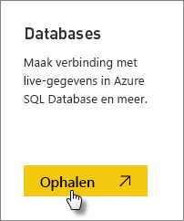
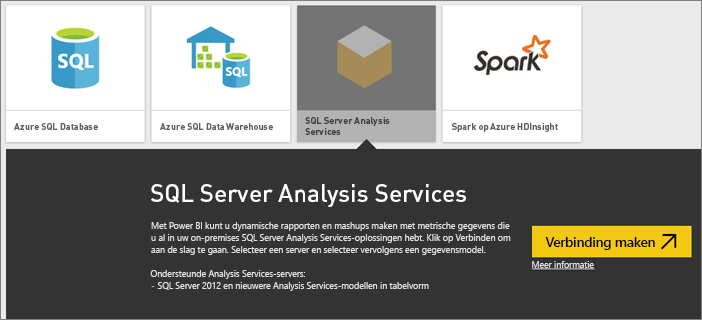
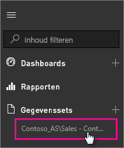

# Live SQL Server Analysis Services-gegevens in Power BI
U kunt in Power BI op twee manieren verbinding maken met een live SQL Server Analysis Services-server. In **Gegevens ophalen** kunt u verbinding maken met een SQL Server Analysis Services-server of u kunt verbinding maken met een [Power BI Desktop-bestand](service-desktop-files.md) of [Excel-werkmap](service-excel-workbook-files.md) die al verbonden is met een Analysis Services-server.

 >[!IMPORTANT]
 >* Als u verbinding wilt maken met een live Analysis Services-server, moet er een on-premises gegevensgateway zijn geïnstalleerd en geconfigureerd door een beheerder. Zie [On-premises gegevensgateway](service-gateway-onprem.md) voor meer informatie.
 >* Wanneer u de gateway gebruikt, blijven uw gegevens on-premises.  De rapporten die u maakt op basis van die gegevens, worden opgeslagen in de Power BI-service. 
 >* [Q&A-query's in natuurlijke taal](service-q-and-a-direct-query.md) bevindt zich in de preview-fase voor Analysis Services-liveverbindingen.

## Verbinding met een model maken via Gegevens ophalen
1. Selecteer in **Mijn werkruimte** de optie **Gegevens ophalen**. U kunt ook naar een groepswerkruimte schakelen als deze beschikbaar is.
   
   
2. Selecteer **Databases en meer**.
   
   
3. Selecteer **SQL Server Analysis Services** > **Verbinding maken**. 
   
   
4. Selecteer een server. Als hier geen servers worden weergegeven, betekent dit dat er geen gateway en gegevensbron zijn geconfigureerd of dat uw account niet wordt vermeld op het tabblad **Gebruikers** van de gegevensbron in de gateway. Neem contact op met uw beheerder.
5. Selecteer het model waarmee u verbinding wilt maken. Dit kan een model in tabelvorm of een multidimensionaal model zijn.

Nadat u verbinding met het model hebt gemaakt, wordt deze weergegeven in uw Power BI-site in **Mijn werkruimte/gegevenssets**. Als u bent overgeheveld naar een groepswerkruimte, wordt de gegevensset weergegeven in de groep.

## Dashboardtegels
Als u visuals uit een rapport aan een dashboard vastmaakt, worden de vastgemaakte tegels automatisch elke tien minuten vernieuwd. Als de gegevens in uw on-premises Analysis Services-server zijn bijgewerkt, worden de tegels na tien minuten automatisch bijgewerkt.

## Volgende stappen
[On-premises gegevensgateway](service-gateway-onprem.md)  
[Uw Analysis Services-gegevensbronnen beheren](service-gateway-enterprise-manage-ssas.md)  
[Problemen met de on-premises gegevensgateway oplossen](service-gateway-onprem-tshoot.md)  
Nog vragen? [Misschien dat de Power BI-community het antwoord weet](http://community.powerbi.com/)

