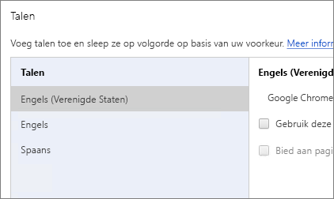
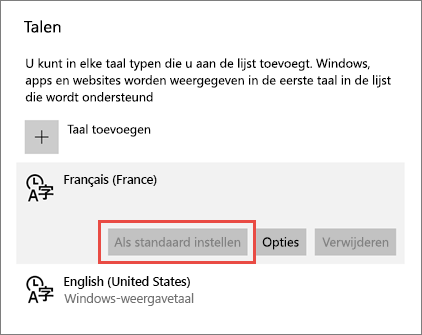
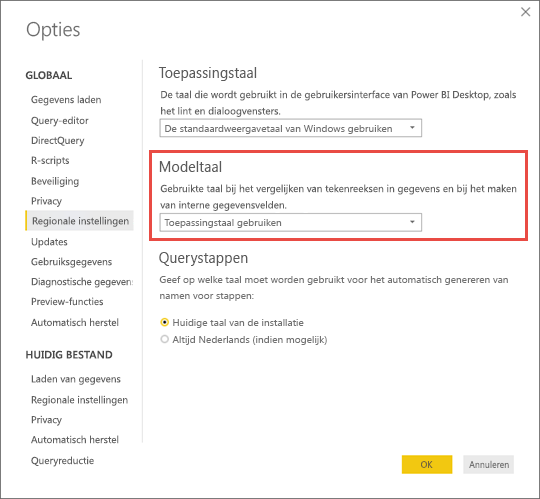

# Ondersteunde talen en landen/regio's voor Power BI

In dit artikel vindt u lijsten met ondersteunde talen en landen/regio's voor de documentatie van de Power BI-service, Power BI Desktop en Power BI.

## Landen en regio's waar Power BI beschikbaar is
Zie de [internationale beschikbaarheidslijst](https://products.office.com/business/international-availability) voor een overzicht met de landen en regio's waar Power BI beschikbaar is. 

## Talen voor de Power BI-service
De Power BI-service (in de browser) is beschikbaar in de volgende 42 talen:

* Arabisch
* Baskisch - Basque
* Bulgaars - Български
* Catalaans - Català
* Vereenvoudigd Chinees - 中文(简体)
* Traditioneel Chinees - 中文(繁體)
* Kroatisch - hrvatski
* Tsjechisch - čeština
* Deens - dansk
* Nederlands - Nederlands
* Engels - English
* Estlands - Eesti
* Fins - Suomi
* Frans - Français
* Galicisch - galego
* Duits - Deutsch
* Grieks - Ελληνικά
* Hebreeuws
* Hindi - हिंदी
* Hongaars - Magyar
* Indonesisch - Bahasa Indonesia
* Italiaans - italiano
* Japans - 日本語
* Kazachstaans - Қазақ
* Koreaans - 한국어
* Lets - Latviešu
* Litouws - Lietuvių
* Maleis - Bahasa Melayu
* Noors (Bokmål) - Norsk (Bokmål)
* Pools - Polski
* Portugees (Brazilië) - Português (Brasil)
* Portugees (Portugal) - Português (Portugal)
* Roemeens - Română
* Russisch - Русский
* Servisch (Cyrillisch) - српски
* Servisch (Latijns alfabet) - Srpski
* Slowaaks - slovenčina
* Sloveens - slovenski
* Spaans - español
* Zweeds - svenska
* Thais - ไทย
* Turks - Türkçe
* Oekraïens - українська
* Vietnamees - Tiếng Việt

### Wat er is vertaald
Menu's, knoppen, berichten en andere elementen van de gebruikerservaring zijn vertaald in uw taal om de navigatie in en het gebruik van Power BI te vereenvoudigen.

Op dit moment zijn een paar functies alleen in het Engels beschikbaar:

* Dashboards en rapporten die in Power BI voor u worden gemaakt wanneer u verbinding maakt met services zoals Microsoft Dynamics CRM, Google Analytics en Salesforce. (U kunt uw eigen dashboards en rapporten wel in uw eigen taal maken.)
* Uw gegevens verkennen met Q&A.

Controleer regelmatig of er meer functies in uw taal beschikbaar zijn gekomen. Hier wordt aan gewerkt. 

### Uw taal kiezen in de Power BI-service
1. Selecteer in de Power BI-service achtereenvolgens het pictogram **Instellingen**  > **Instellingen**.
2. Selecteer op het tabblad **Algemeen** de optie **Taal**.
3. Selecteer uw taal > **Toepassen**.

### Uw taal in de browser kiezen
Power BI detecteert uw taal op basis van de taalvoorkeuren op uw computer. Waar en hoe u de voorkeuren wijzigt is afhankelijk van uw besturingssysteem en browser. Hieronder wordt uitgelegd hoe u deze voorkeuren in Internet Explorer en Google Chrome opent en wijzigt.

#### Internet Explorer (versie 11)
1. Klik in de rechterbovenhoek van uw browservenster op de knop **Extra**:
   
   
2. Klik op **Internetopties**.
3. Klik in het dialoogvenster Internetopties op het tabblad Algemeen bij Vormgeving op de knop **Talen**.

#### Google Chrome (versie 42)
1. Klik op in de rechterbovenhoek van uw browservenster op de menuknop:
   
   
2. Klik op **Instellingen**.
3. Klik op **Geavanceerde instellingen weergeven**.
4. Klik onder talen op de knop **Taal- en invoerinstellingen**.
5. Klik op **Toevoegen**, selecteer een taal en klik op **OK**.
   
   
   
   De nieuwe taal bevindt zich aan het eind van de lijst. 
6. Sleep de nieuwe taal naar boven en klik op **Google Chrome weergeven in deze taal**.
   
   
   
   Mogelijk moet u de browser sluiten en opnieuw openen om de wijzigingen te zien.

## De taal of landinstellingen van Power BI Desktop kiezen
U kunt Power BI Desktop op twee manieren verkrijgen: u Power BI Desktop downloaden of installeren via de Windows Store.

* Wanneer u [Power BI Desktop installeert via de Windows Store](#choose-a-language-for-power-bi-desktop-installed-from-the-windows-store), worden alle talen geïnstalleerd en wordt de taal weergegeven die overeenkomt met de standaardtaal van Windows.
* Wanneer u [Power BI Desktop downloadt](#choose-a-language-when-you-download-power-bi-desktop), kunt u tijdens het downloaden de taal kiezen. 
* U kunt ook [een landinstelling kiezen die moet worden gebruikt wanneer u gegevens importeert](#choose-the-locale-to-be-used-when-importing-data-into-power-bi-desktop) voor een specifiek rapport. 

### Een taal voor Power BI Desktop kiezen wanneer u installeert via de Windows Store
1. [Installeer Power BI Desktop](http://aka.ms/pbidesktopstore) via de Windows Store.
2. Als u de taal wilt wijzigen, zoekt u de **Windows-instellingen** op uw computer. 
3. Selecteer **Tijd en taal**.
   
     
4. Selecteer **Regio en taal**, selecteer een taal en selecteer **Instellen als standaard**.
   
     
   
     Als u Power BI Desktop de volgende keer start, wordt de taal gebruikt die u hebt ingesteld als standaard. 

### Een taal kiezen wanneer u Power BI Desktop downloadt
De taal die u voor Power BI Desktop kiest, is van invloed op de weergavenotatie van de getallen en datums in rapporten. 

* Selecteer een taal wanneer u [Power BI Desktop downloadt](https://powerbi.microsoft.com/desktop). 

Als u de taal in Power BI Desktop wilt wijzigen, gaat u terug naar de downloadpagina en downloadt u Power BI Desktop in een andere taal.

### De landinstellingen kiezen voor het importeren van gegevens in Power BI Desktop
Of u Power BI Desktop downloadt of installeert via de Windows Store, u kunt voor een specifiek rapport een andere landinstelling kiezen dan de landinstelling in uw versie van Power BI Desktop. Hiermee wijzigt u de manier waarop gegevens worden geïnterpreteerd wanneer deze worden geïmporteerd uit de gegevensbron, bijvoorbeeld of 3/4/2017 wordt geïnterpreteerd als 3 april of als 4 maart. 

1. Ga in de Power BI Desktop naar **Bestand** > **Opties en instellingen** > **Opties**.
2. Selecteer onder **Huidig bestand** de optie **Landinstellingen**.
3. Selecteer in het vak **Landinstelling** een andere landinstelling. 
   
   
4. Selecteer **OK**.

### De taal voor het model in Power BI Desktop selecteren

Naast het instellen van de taal voor de Power BI Desktop-toepassing, kunt u ook de taal voor het model instellen. De taal voor het model is met name van invloed op twee dingen:

- Hoe we tekenreeksen vergelijken en sorteren. Turks heeft bijvoorbeeld 2 i’s. Deze kunnen, afhankelijk van de sortering van uw database, op verschillende plekken terechtkomen wanneer u de database sorteert. 
- De die taal Power BI Desktop gebruikt bij het maken van verborgen tabellen via datumvelden. Velden worden bijvoorbeeld Maand/Monat/Mois, etc. genoemd.

Ga als volgt te werk om de taal voor het model in te stellen.

1. Ga in de Power BI Desktop naar **Bestand** > **Opties en instellingen** > **Opties**.
2. Selecteer **Regionale instellingen** onder **Globaal**.
3. Selecteer in het vak **Modeltaal** een andere taal. 

    

## Talen voor de Help-documentatie
De Help is gelokaliseerd in de volgende tien talen: 

* Vereenvoudigd Chinees - 中文(简体)
* Traditioneel Chinees - 中文(繁體)
* Frans - Français
* Duits - Deutsch
* Italiaans - Italiano
* Japans - 日本語
* Koreaans - 한국어
* Portugees (Brazilië) - Português (Brasil)
* Russisch - Русский
* Spaans - español

## Volgende stappen
* Gebruikt u een van de mobiele Power BI-apps? Zie [Ondersteunde talen in de mobiele Power BI-apps](mobile-apps-supported-languages.md) voor meer informatie.
* Vragen? Misschien dat de[Power Bi-community](http://community.powerbi.com/) het antwoord weet.
* Nog steeds geen antwoord? Ga naar de [ondersteuningspagina van Power BI](https://powerbi.microsoft.com/support/).

