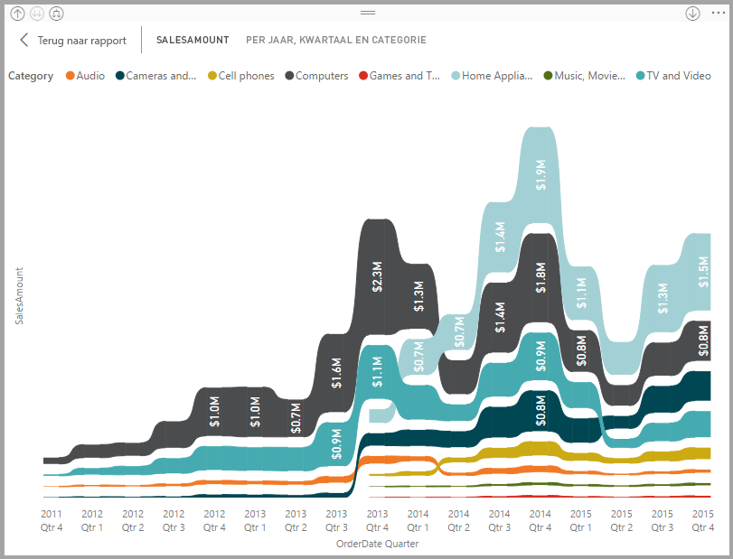
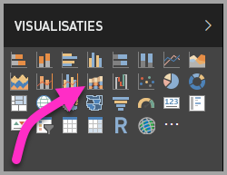
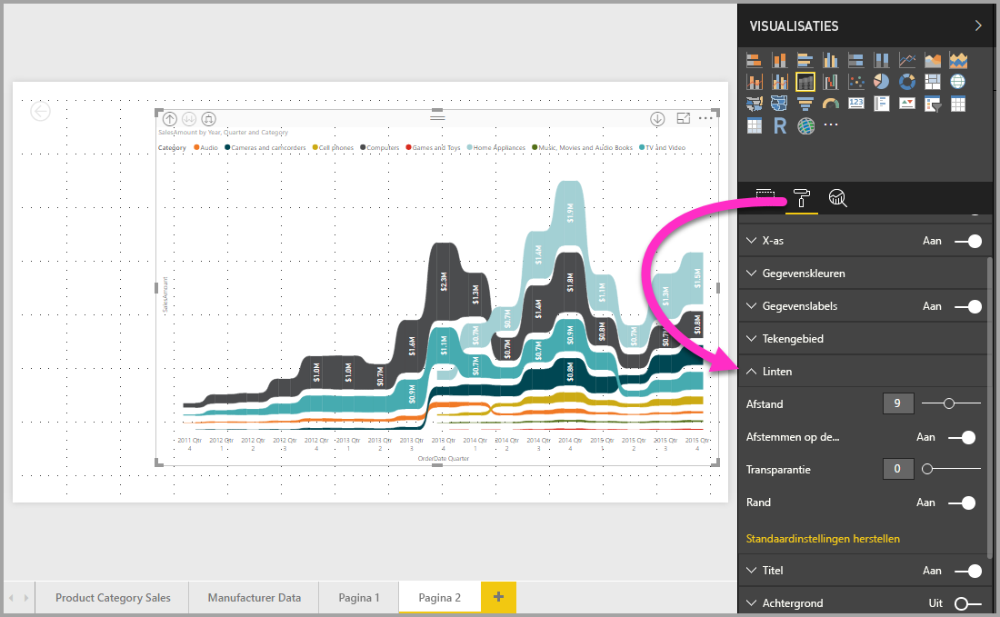

# Lintgrafieken gebruiken in Power BI
In **Power BI** kunt u lintgrafieken gebruiken om gegevens te visualiseren en snel te bepalen welke gegevenscategorie de hoogste rang heeft (hoogste waarde). In lintgrafieken kunnen wijzigingen in de rang goed worden weergegeven, waarbij voor elke periode de hoogste rang (waarde) altijd bovenaan wordt weergegeven. Lintgrafieken zijn beschikbaar in **Power BI Desktop** vanaf de release van september 2017 en in daarop volgende updates van de **Power BI-service**.

## Een lintgrafiek maken
Selecteer **Lintgrafiek** in het deelvenster **Visualisaties** als u een lintgrafiek wilt maken.

Lintgrafieken verbinden met behulp van linten een gegevenscategorie met het gevisualiseerde tijdcontinuüm, zodat u kunt zien hoe de rang van een bepaalde categorie langs de X-as (meestal de tijd) verandert.

## Een lintgrafiek opmaken
Als u een lintgrafiek maakt, hebt u de beschikking over opmaakopties in de sectie **Opmaken** van het deelvenster **Visualisaties**. De opmaakopties voor lintgrafieken zijn soortgelijk als die voor een gestapelde kolomdiagram. Voor linten zijn er daarnaast aanvullende opmaakopties beschikbaar.

Met deze opmaakopties voor lintgrafieken kunt u de volgende aanpassingen aanbrengen:

* **Afstand**: hiermee kunt u aanpassen hoeveel afstand u tussen de linten wilt hebben. Het getal is een percentage van de maximale kolomhoogte.
* **Afstemmen op de kleur van de reeks**: hiermee kunt u de kleur van de linten afstemmen op de kleur van de reeks. Indien deze is uitgeschakeld, zijn alle linten grijs.
* **Doorzichtigheid**: hiermee kunt u aangeven hoe doorzichtig de linten moeten zijn. De standaardwaarde is 30.
* **Rand**: hiermee kunt u een donkere rand boven en onder aan de linten plaatsen. Standaard zijn de randen afwezig.

## Volgende stappen
Lees de volgende artikelen voor meer informatie over **Power BI Desktop** en hoe u aan de slag kunt.

* [Wat is Power BI Desktop?](../desktop-what-is-desktop.md)
* [Query Overview with Power BI Desktop](../desktop-query-overview.md) (Queryoverzicht met Power BI Desktop)
* [Data Sources in Power BI Desktop](../desktop-data-sources.md) (Gegevensbronnen in Power BI Desktop)
* [Connect to Data in Power BI Desktop](../desktop-connect-to-data.md) (Verbinding maken met gegevens in Power BI Desktop)
* [Shape and Combine Data with Power BI Desktop](../desktop-shape-and-combine-data.md) (Gegevens vormgeven en combineren met Power BI Desktop)
* [Common Query Tasks in Power BI Desktop](../desktop-common-query-tasks.md) (Algemene querytaken in Power BI Desktop)   

