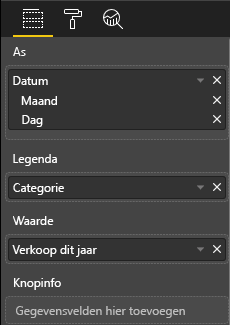
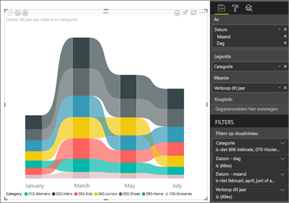
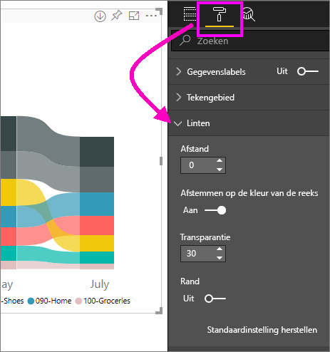
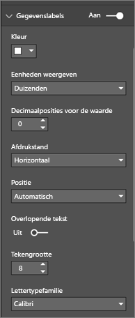
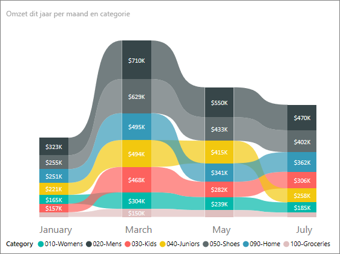

# Lintgrafieken gebruiken in Power BI
U kunt lintgrafieken gebruiken om gegevens te visualiseren en snel te ontdekken welke gegevenscategorie de hoogste rang heeft (hoogste waarde). In lintgrafieken kunnen wijzigingen in de rang goed worden weergegeven, waarbij voor elke periode de hoogste rang (waarde) altijd bovenaan wordt weergegeven. 

## Een lintgrafiek maken
Als u wilt volgen, opent u [Voorbeeldrapport van een retailanalyse](../sample-retail-analysis.md). 

1. Selecteer **Lintgrafiek** in het deelvenster **Visualisaties** als u een lintgrafiek wilt maken.

    

    Lintgrafieken verbinden met behulp van linten een gegevenscategorie met het gevisualiseerde tijdcontinuüm, zodat u kunt zien hoe de rang van een bepaalde categorie langs de X-as (meestal de tijd) verandert.

2. Selecteer velden voor **As**, **Legenda** en **Waarde**.  In dit voorbeeld zijn de volgende velden geselecteerd: **Datum**, **Categorie** en **Verkopen van dit jaar**.  

    

    Omdat de gegevensset gegevens voor slechts één jaar bevat, hebben we het veld **Jaar** uit de well **As** verwijderd. 

3. Het lintdiagram toont de positie van elke andere maand. U ziet hoe de positie in de tijd verandert.  De categorie Startpagina is bijvoorbeeld van de derde naar de vierde positie gegaan en weer terug naar de derde. De categorie Juniors zijn in juli van de derde naar de vijfde positie gegaan. 

    

## Een lintgrafiek opmaken
Als u een lintgrafiek maakt, hebt u de beschikking over opmaakopties in de sectie **Opmaken** van het deelvenster **Visualisaties**. De opmaakopties voor lintgrafieken zijn soortgelijk als die voor een gestapelde kolomdiagram. Voor linten zijn er daarnaast aanvullende opmaakopties beschikbaar.

Met deze opmaakopties voor lintgrafieken kunt u de volgende aanpassingen maken.

* **Afstand**: hiermee kunt u aanpassen hoeveel afstand u tussen de linten wilt hebben. Het getal is een percentage van de maximale kolomhoogte.
* **Afstemmen op de kleur van de reeks**: hiermee kunt u de kleur van de linten afstemmen op de kleur van de reeks. Indien dit is ingesteld op **uit**, zijn alle linten grijs.
* **Doorzichtigheid**: hiermee kunt u aangeven hoe doorzichtig de linten moeten zijn. De standaardwaarde is 30.
* **Rand**: hiermee kunt u een donkere rand boven en onder aan de linten plaatsen. Standaard zijn de randen afwezig.

Omdat het lintdiagram geen Y-as-labels bevat, kunt u eventueel gegevenslabels toevoegen. Selecteer in het deelvenster Opmaak de optie **Gegevenslabels**. 

opmaakopties instellen voor uw gegevenslabels.  In dit voorbeeld hebben we de tekstkleur op wit, het aantal decimalen op nul en de weergave-eenheden op duizenden ingesteld. 

## Volgende stappen

[Spreidingsdiagrammen en bellendiagrammen in Power BI](power-bi-visualization-scatter.md)

[Visualization types in Power BI](power-bi-visualization-types-for-reports-and-q-and-a.md) (Typen visualisaties in Power BI)