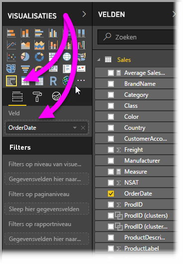
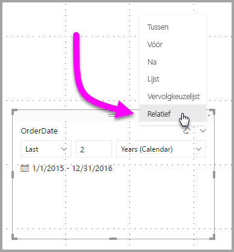
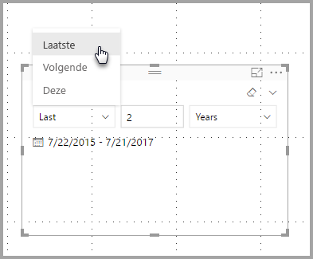
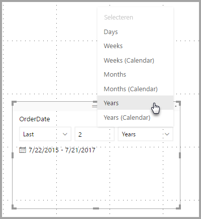
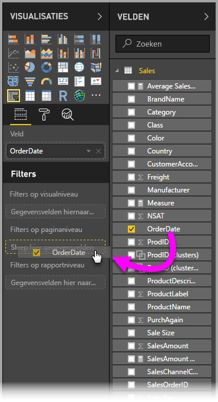
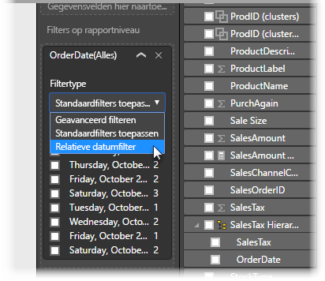
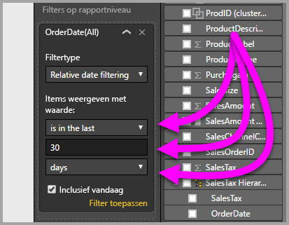

# Een relatieve datumslicer en -filter in Power BI Desktop gebruiken
Met de **relatieve datumslicer** of het **relatieve datumfilter** kunt u tijdgebaseerde filters toepassen op een datumkolom in het gegevensmodel. U kunt bijvoorbeeld de **relatieve datumslicer** gebruiken om alleen gegevens weer te geven over verkopen die hebben plaatsgevonden in de afgelopen 30 dagen (of maand, kalendermaanden enzovoort). En wanneer u de gegevens vernieuwt, wordt de juiste relatieve datumbeperking automatisch toegepast door de relatieve periode.

## De relatieve datumbereikslicer gebruiken
U kunt de relatieve datumslicer net als elke andere slicer gebruiken. Maak eenvoudig een **slicer**-visual voor uw rapport en selecteer vervolgens een datumwaarde voor de waarde **Veld**. Op de volgende afbeelding is *OrderDate* geselecteerd.

Selecteer het dakje in de rechterbovenhoek van de **relatieve datumslicer**. Er wordt dan een menu weergegeven.

Selecteer *Relatief* voor de relatieve datumslicer.

Vervolgens kunt u de instellingen selecteren. Voor de eerste vervolgkeuzelijst in de *relatieve datumslicer* hebt u de volgende opties:

* Laatste
* Volgende
* Deze/dit

Deze selecties worden weergegeven op de volgende afbeelding.

Voor de volgende (middelste) instelling in de *relatieve datumslicer* kunt u een getal invoeren om het relatieve datumbereik te definiëren.

Met de derde instelling kunt u de datummeting kiezen. U hebt de volgende opties:

* Dagen
* Weken
* Weken (kalender)
* Maanden
* Maanden (kalender)
* Jaren
* Jaren (kalender)

Deze selecties worden weergegeven op de volgende afbeelding.

Als u *Maanden* in die lijst selecteert en 2 opgeeft in de middelste instelling, gebeurt het volgende: als het vandaag 20 juli is, geven de gegevens die zijn opgenomen in de visuals en worden beperkt door de slicer gegevens weer voor de vorige twee maanden, vanaf 20 mei tot 20 juli (de datum van vandaag).

Ter vergelijking: als u *Maanden (kalender)* hebt geselecteerd, geven de visuele elementen die worden beperkt gegevens weer van 1 mei tot en met 30 juni (de laatste twee volledige kalendermaanden).

## Het relatieve datumbereikfilter gebruiken
U kunt ook een relatief datumbereikfilter voor uw rapportpagina of het hele rapport maken. Hiertoe sleept u eenvoudigweg een datumveld naar het gebied **Filters op paginaniveau** of **Filters op rapportniveau** in het deelvenster **Veld**, zoals wordt weergegeven op de volgende afbeelding.

Zodra dit zich daar bevindt, kunt u het relatieve datumbereik op dezelfde manier wijzigen als waarop u de **relatieve datumslicer** hebt aangepast. Selecteer **Relatieve datumfilter** in de vervolgkeuzelijst **Filtertype**.

Als **Relatieve datumfilter** is geselecteerd, ziet u drie secties die u kunt wijzigen, inclusief een numeriek middelste vak, net als bij de slicer.

En dat is het enige dat u hoeft te doen om deze relatieve datumbeperkingen in uw rapporten te gebruiken.

## Beperkingen en overwegingen
De volgende beperkingen en overwegingen zijn momenteel van toepassing op de **relatieve datumbereikslicer** en het relatieve datumbereikfilter.

* Gegevensmodellen in **Power BI** bevatten geen informatie over de tijdzone. De modellen kunnen tijden opslaan, maar er is geen indicatie van de tijdzone waarin ze zich bevinden.
* De slicer en het filter zijn altijd op basis van de tijd in UTC, dus als u een filter in een rapport configureert en dit te naar een collega in een andere tijdzone verzendt, ziet u beide dezelfde gegevens. Als u zich echter niet in de UTC-tijdzone bevindt, ziet u mogelijk gegevens voor een ander tijdsverschil dan verwacht.
* Gegevens die zijn vastgelegd in een lokale tijdzone kunnen worden geconverteerd naar UTC met behulp van de **Query-editor**.

