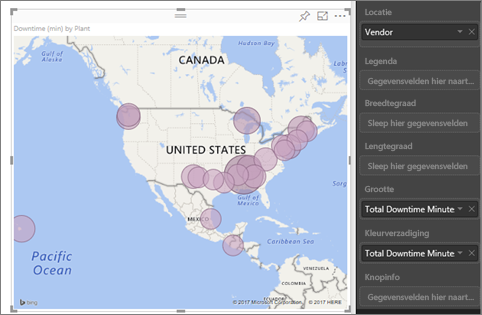
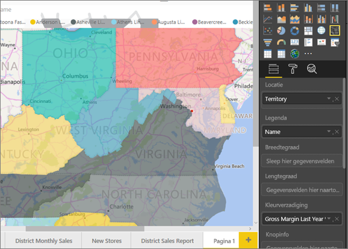
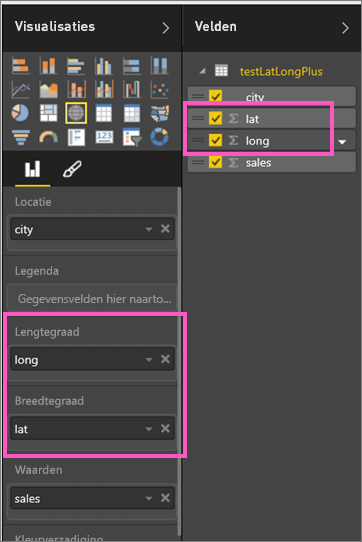
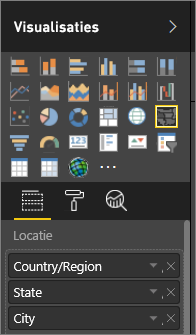

# Tips en trucs voor kaartvisualisaties in Power BI
Power BI biedt integratie met Bing Kaarten om standaard kaartcoördinaten te bieden (een proces dat geocodering wordt genoemd) zodat u kaarten kunt maken. In beide worden algoritmen gebruikt voor het identificeren van de juiste locatie, maar soms is het een schatting. Als pogingen om de kaartvisualisatie te maken in Power BI mislukken, wordt de hulp van Bing Kaarten ingeroepen. 

U of uw beheerder moet mogelijk uw firewall bijwerken om toegang te krijgen tot de URL’s die Bing gebruikt voor geocodering.  Deze URL's zijn:
* https://dev.virtualearth.net/REST/V1/Locations
* https://platform.bing.com/geo/spatial/v1/public/Geodata
* https://www.bing.com/api/maps/mapcontrol

Gebruik de volgende tips om de kans te verhogen dat de geocodering goed verloopt. De eerste reeks tips kunt u gebruiken als u toegang hebt tot de gegevensset zelf. De tweede reeks tips geeft aan wat u kunt doen in Power BI als u geen toegang hebt tot de gegevensset. En de laatste set is een lijst met URL's

## Welke gegevens worden verzonden naar Bing Kaarten?
In de Power BI-service en Power BI Desktop worden de benodigde geografische gegevens voor het maken van de kaartvisualisatie naar Bing verzonden. Dit kunnen ook de gegevens uit de buckets **Locatie**, **Breedtegraad** en **Lengtegraad** en de geovelden uit de buckets voor filters op **rapportniveau**, **paginaniveau** of het **niveau van visuele elementen** zijn. Welke gegevens precies worden verzonden, verschilt per kaarttype. Zie de [privacyverklaring van Bing Kaarten](https://go.microsoft.com/fwlink/?LinkID=248686) voor meer informatie.

* Als de lengte- en breedtegraad voor kaarten (bellenkaarten) zijn opgegeven, worden er geen gegevens verzonden naar Bing. Anders worden alle gegevens uit de bucket **Locatie** (en buckets voor filters) verzonden naar Bing.     
* Voor choropletenkaarten is een veld in de bucket **Locatie** vereist, zelfs als de lengte- en breedtegraad zijn opgegeven. Alle gegevens uit de buckets **Locatie**, **Breedtegraad** en **Lengtegraad** worden verzonden naar Bing.
  
    In het onderstaande voorbeeld wordt het veld **Leverancier** gebruikt voor de geocodering, dus alle leveranciersgegevens worden verzonden naar Bing. De gegevens uit de buckets **Grootte** en **Kleurverzadiging** worden niet verzonden naar Bing.
  
    
  
    In het tweede voorbeeld hieronder wordt het veld **Gebied** gebruikt voor de geocodering, dus alle gebiedsgegevens worden verzonden naar Bing. De gegevens uit de buckets **Legenda** en **Kleurverzadiging** worden niet verzonden naar Bing.
  
    

## In de gegevensset: tips voor het verbeteren van de onderliggende gegevensset
Als u toegang hebt tot de gegevensset die wordt gebruikt voor het maken van de kaartvisualisatie, zijn er enkele dingen die u kunt doen om de kans op de juiste geocodering te vergroten.

**1. Categoriseer de geografische velden in Power BI Desktop**

U kunt in Power BI Desktop zorgen dat velden correct worden gegeocodeerd door de *gegevenscategorie* voor de gegevensvelden in te stellen. Hiervoor selecteert u de gewenste tabel, gaat u naar het lint **Geavanceerd** en stelt u de **gegevenscategorie** in op **Adres**, **Plaats**, **Continent**, **Land/Regio**, **Graafschap**, **Postcode**, **Staat** of **Provincie**. Deze gegevenscategorieën helpen Bing bij het correct coderen van de gegevens. Zie [Gegevenscategorisatie in Power BI Desktop](../desktop-data-categorization.md) voor meer informatie. Als u live verbinding maakt met SQL Server Analysis Services, moet u de gegevenscategorisatie buiten Power BI om instellen met [SQL Server Data Tools (SSDT)](https://docs.microsoft.com/sql/ssdt/download-sql-server-data-tools-ssdt).

**2. Gebruik meerdere locatiekolommen.**    
 Soms wordt uw bedoeling toch niet begrepen in Bing Kaarten, ook al hebt u de gegevenscategorieën voor kaarten ingesteld. Sommige aanduidingen zijn ambigu omdat de locatie voorkomt in meerdere landen of regio's. Er is bijvoorbeeld een ***Southampton*** in Engeland, Pennsylvania en New York.

Power BI maakt gebruik van de [ongestructureerde URL-sjabloonservice](https://msdn.microsoft.com/library/ff701714.aspx) van Bing voor het ophalen van de breedte- en lengtegraadcoördinaten op basis van een set adreswaarden voor elk land. Als uw gegevens onvoldoende locatiegegevens bevatten, kunt u die kolommen toevoegen en op de juiste wijze categoriseren.

 Als u bijvoorbeeld alleen de kolom Plaats hebt, wordt het lastig om goede geocoderingsresultaten met Bing te verkrijgen. Zorg dat de locatie niet meer ambigu is door aanvullende geokolommen toe te voegen.  Soms hoeft u daarvoor maar één extra locatiekolom aan de dataset toe te voegen (in dit geval Staat/provincie). Vergeet ook niet de locaties goed te categoriseren, zoals beschreven in punt 1.

Zorg dat elk veld alleen de specifieke informatie bevat die aan de categorisatie is gekoppeld.  Bijvoorbeeld: het locatieveld Plaats moet **Southampton** bevatten, niet **Southampton, New York**.  Het locatieveld Adres moet **1 Microsoft Way** bevatten, en niet **1 Microsoft Way, Redmond, WA**.

**3. Gebruik een specifieke breedte- en lengtegraad**

Voeg waarden voor de breedte- en lengtegraad toe aan uw gegevensset. Zo voorkomt u elke ambiguïteit en worden resultaten sneller geretourneerd. De velden Breedtegraad en Lengtegraad moeten worden opgegeven in de notatie *Decimaal getal*. U kunt deze notatie instellen in het gegevensmodel.

<iframe width="560" height="315" src="https://www.youtube.com/embed/ajTPGNpthcg" frameborder="0" allowfullscreen></iframe>

**4. Gebruik de categorie Plaats voor kolommen met volledige locatiegegevens**

U wordt aangeraden om geohiërarchieën voor kaarten te gebruiken. Als u echter toch maar één locatiekolom met alle geografische gegevens wilt gebruiken, kunt u de gegevenscategorisatie instellen op **Plaats**. Als uw kolom de volledige adresgegevens bevat, bijvoorbeeld 1 Microsoft Way, Redmond Washington 98052, werkt deze algemene gegevenscategorie het beste met Bing. 

## In Power BI: Tips voor betere resultaten bij het gebruik van kaartvisualisaties
**1. Gebruik de velden Breedtegraad en Lengtegraad (indien aanwezig)**

Als de gegevensset in Power BI velden voor de lengte- en breedtegraad bevat, gebruik deze dan ook.  Power BI bevat speciale buckets ter voorkoming van ambigue kaartgegevens. Sleep het veld met de breedtegraadgegevens naar het gebied **Visualisaties > Breedtegraad**.  Doe hetzelfde voor de lengtegraadgegevens (sleep het veld met de lengtegraadgegevens naar het gebied Visualisaties > Lengtegraad). Als u dit doet, moet u ook het veld *Locatie* invullen bij het maken van uw visualisaties. Anders worden de gegevens standaard geaggregeerd en zouden, in dit geval, de breedte- en lengtegraad worden gekoppeld op staatniveau in plaats van plaatsniveau.

 

## Gebruik geohiërarchieën zodat u kunt inzoomen op verschillende locatieniveaus
Als uw gegevensset al verschillende locatiegegevensniveaus bevat, kunnen u en uw collega's *geohiërarchieën* maken in Power BI. Hiervoor sleept u meerdere velden naar de bucket **Locatie**. Samen vormen deze velden een geohiërarchie. In het onderstaande veld hebben we geovelden toegevoegd voor: Land/regio, staat en plaats. In Power BI kunnen u en uw collega's in- en uitzoomen op deze geohiërarchie.

  

   

Bij het in- en uitzoomen op geohiërarchieën, is het belangrijk te weten hoe de zoomknoppen werken en welke gegevens worden verzonden naar Bing Kaarten. 

* Met de zoomknop helemaal rechts, ook wel de inzoommodus  genoemd, kunt u een kaartlocatie selecteren en steeds één niveau verder inzoomen op die specifieke locatie. Als u bijvoorbeeld Inzoomen inschakelt en op Noord-Amerika klikt, zoomt u in op het volgende niveau in de hiërarchie: staten in Noord-Amerika. Voor de geocodering worden door Power BI alleen de land- en staatgegevens van Noord-Amerika naar Bing Kaarten verzonden.  
* Aan de linkerkant ziet u nog twee inzoomopties. Met de eerste optie, , zoomt u in op het volgende niveau van de hiërarchie voor alle locaties tegelijk. Als u bijvoorbeeld momenteel landen bekijkt en vervolgens deze optie gebruikt om in te zoomen op het volgende niveau, staten, worden in Power BI de staatgegevens van alle landen weergegeven. Voor de geocodering worden door Power BI de staatgegevens (geen landgegevens) van alle locaties naar Bing Kaarten verzonden. Deze optie is handig als alle niveaus van uw hiërarchie niet gerelateerd zijn aan het bovenliggende niveau. 
* De tweede optie,  , is vergelijkbaar met de optie Inzoomen, behalve dat u niet op de kaart hoeft te klikken.  Hiermee wordt ingezoomd op het volgende niveau in de hiërarchie, met behoud van de context van het huidige niveau. Als u bijvoorbeeld momenteel landen bekijkt en op dit pictogram klikt, zoomt u in op het volgende niveau van de hiërarchie: staten. Voor de geocodering worden door Power BI de gegevens van elke staat en het bijbehorende land naar Bing Kaarten verzonden voor een nauwkeurigere geocodering. In de meeste kaarten gebruikt u deze optie óf de optie Inzoomen helemaal rechts, om zoveel mogelijk informatie voor het verkrijgen van nauwkeurige locatiegegevens naar Bing te verzenden. 

## Volgende stappen
[Inzoomen op een visualisatie in Power BI](../consumer/end-user-drill.md)

[Visualisaties in Power BI](power-bi-report-visualizations.md)

Hebt u nog vragen? [Misschien dat de Power BI-community het antwoord weet](http://community.powerbi.com/)

