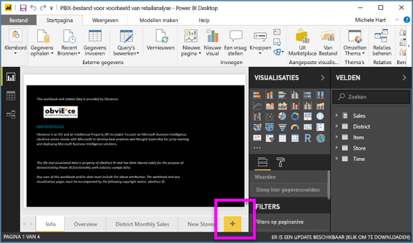
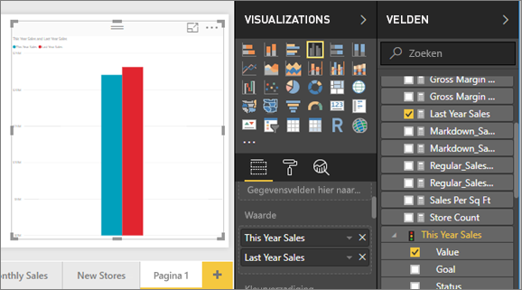
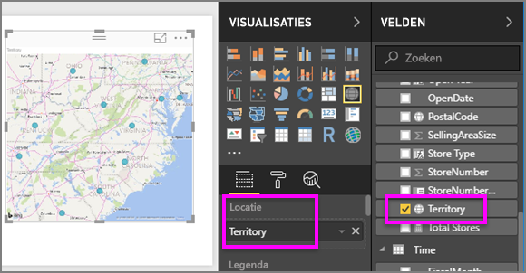
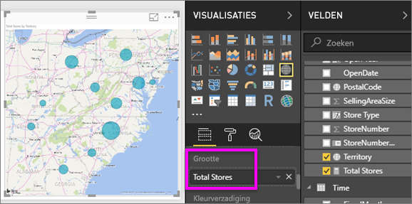

# Deel 2: Visualisaties toevoegen aan een Power BI-rapport
In [Deel 1](power-bi-report-add-visualizations-ii.md) hebt u een eenvoudige visualisatie gemaakt door selectievakjes naast de veldnamen te selecteren.  In deel 2 leert u hoe u slepen-en-neerzetten kunt gebruiken, en hoe u gebruik kunt maken van de volledige functionaliteit van de deelvensters **Velden** en **Visualisaties** om visualisaties te maken en te wijzigen.

### Vereisten
- [Deel 1](power-bi-report-add-visualizations-ii.md)
- Power BI Desktop - visualisaties kunnen worden toegevoegd aan rapporten met gebruik van de Power BI-service of Power BI Desktop. In deze zelfstudie wordt Power BI Desktop gebruikt. 
- [Voorbeeld Retail Analysis](http://download.microsoft.com/download/9/6/D/96DDC2FF-2568-491D-AAFA-AFDD6F763AE3/Retail%20Analysis%20Sample%20PBIX.pbix)

## Een nieuwe visualisatie maken
In deze zelfstudie verdiepen we ons in de gegevensset voor retailanalyse en maken we een aantal belangrijke visualisaties.

### Open een rapport en voeg een nieuwe lege pagina toe.
1. Open het pbix-voorbeeldbestand Retail Analysis in Power BI Desktop. 
      

2.  [Voeg een nieuwe pagina toe](../power-bi-report-add-page.md) door onder aan het tekenpapier het gele pluspictogram te selecteren.

### Voeg een visualisatie toe die een beeld geeft van de jaaromzet vergeleken met vorig jaar.
1. Selecteer in de tabel **Sales** (Omzet): **This Year Sales** (Omzet dit jaar)  > **Value** (Waarde) en **Last Year Sales** (Omzet vorig jaar). In Power BI wordt een kolomdiagram gemaakt.  Dit is interessant en u wilt graag meer details weten. Hoe ziet de omzet eruit per maand?  
   
   
2. Sleep **FiscalMonth** uit de tijdstabel naar het **Axis**-gebied.  
   
3. [Wijzig de visualisatie](power-bi-report-change-visualization-type.md) in een vlakdiagram.  Er zijn veel visualisatietypen waaruit u kunt kiezen. Bekijk [de beschrijvingen van de typen, tips voor aanbevolen procedures en zelfstudies](power-bi-visualization-types-for-reports-and-q-and-a.md) voor hulp bij het bepalen welk type u het beste kunt gebruiken. Selecteer in het venster Visualisaties het pictogram Vlakdiagram .
4. Sorteer de visualisatie door de beletseltekens te selecteren en **Sorteren op FiscalMonth** te kiezen.
5. [Wijzig het formaat van de visualisatie](power-bi-visualization-move-and-resize.md) door de visualisatie te selecteren, en een van de cirkelomtrekken te pakken en te slepen. Maak deze groot genoeg om de schuifbalk te laten verdwijnen en klein genoeg zodat er voldoende ruimte is om nog een visualisatie toe te voegen.
   
   
6. [Sla het rapport op](../service-report-save.md).

### Een kaartvisualisatie toevoegen die de omzet per locatie weergeeft
1. Selecteer **Territory** (Territorium) in de tabel **Store** (Winkel). In Power BI wordt herkend dat Territory (Territorium) een locatie is en wordt een kaartvisualisatie gemaakt.  
   
2. Sleep **Total Stores** (Total aantal winkels) naar het gebied Size (Grootte).  
   
3. Voeg een legenda toe.  Sleep **Chain** (Keten) naar het gebied Legend (Legenda) om de gegevens te bekijken per winkelnaam.  
   

## Volgende stappen
* Meer informatie over [Visualisaties in Power BI-rapporten](power-bi-report-visualizations.md).  
* Hebt u nog vragen? [Misschien dat de Power BI-community het antwoord weet](http://community.powerbi.com/)

