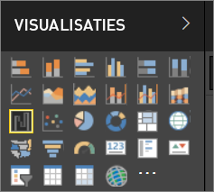

# Visualisaties in Power BI-rapporten
Visualisaties (ook wel visuals genoemd) geven inzichten weer die zijn gedetecteerd in de gegevens. Een Power BI-rapport beschikt mogelijk over één pagina met één visual of over pagina’s vol met visuals. In Power BI-service kunnen visuals [vanuit rapporten aan dashboards worden vastgemaakt](../service-dashboard-pin-tile-from-report.md). 

Het is belangrijk om onderscheid te maken tussen *auteurs* en *gebruikers* van rapporten. Als u degene bent die het rapport maakt of wijzigt, dan bent u de auteur.  Auteurs hebben bewerkmachtigingen voor het rapport en de onderliggende gegevensset. In Power BI Desktop betekent dit dat u de gegevensset kunt openen in de gegevensweergave en visuals in de rapportweergave kunt maken. In Power BI-service betekent dit dat u de gegevensset of het rapport kunt openen in de rapporteditor in de [bewerkweergave](../consumer/end-user-reading-view.md). Wanneer een rapport of dashboard met u [gedeeld is ](../consumer/end-user-shared-with-me.md), bent u een **rapportgebruiker**. U kunt het rapport en de visuals weergeven en ermee communiceren, maar u kunt geen wijzigingen opslaan.

Er zijn veel verschillende typen visuals rechtstreeks beschikbaar vanuit het deelvenster VISUALISATIES in Power BI. 

Ga voor nog meer opties naar de [ communitysite van Microsoft AppSource](https://appsource.microsoft.com) waar u [aangepaste visuals](https://appsource.microsoft.com/marketplace/apps?product=power-bi-visuals&page=1) van Microsoft en de community kunt vinden en downloaden.    

<iframe width="560" height="315" src="https://www.youtube.com/embed/SYk_gWrtKvM?list=PL1N57mwBHtN0JFoKSR0n-tBkUJHeMP2cP" frameborder="0" allowfullscreen></iframe>

  Als u geen ervaring hebt met Power BI, of een opfriscursus nodig hebt, volgt u de onderstaande koppelingen voor meer informatie over de basisprincipes van Power BI-visualisaties.  U kunt ook de inhoudsopgave (aan de linkerkant van dit artikel) gebruiken om nog meer nuttige informatie te vinden.

## Een visualisatie toevoegen in Power BI
U [maakt visualisaties](power-bi-report-add-visualizations-i.md) op de pagina's van uw rapporten. Blader door de [lijst met beschikbare visualisaties en de beschikbare zelfstudies voor visualisaties.](power-bi-visualization-types-for-reports-and-q-and-a.md) 

## Een aangepaste visualisatie uploaden en deze gebruiken in Power BI
U kunt zelfgemaakte, aangepaste visualisaties toevoegen of visualisaties die u hebt gevonden op de [communitysite van Microsoft AppSource](https://appsource.microsoft.com/marketplace/apps?product=power-bi-visuals). Bent u in een creatieve bui? Bestudeer onze broncode en gebruik onze [hulpprogramma's voor ontwikkelaars](../service-custom-visuals-getting-started-with-developer-tools.md) om een nieuw type visualisatie te maken en dit vervolgens te [delen met de community](../developer/office-store.md)

## Het type visualisatie wijzigen
Probeer [het type visualisatie te wijzigen](power-bi-report-change-visualization-type.md) om te kijken of dat misschien beter geschikt is voor uw gegevens.

## Visualisatie vastmaken
Als de visualisatie helemaal aan uw wensen voldoet, kunt u deze in Power BI-service als een tegel [aan een dashboard vastmaken](../service-dashboard-pin-tile-from-report.md). Als u de visualisatie die wordt gebruikt in het rapport wijzigt nadat u deze hebt vastgemaakt, verandert de tegel op het dashboard niet; als het een lijndiagram was, blijft het een lijndiagram, zelfs wanneer u het hebt gewijzigd in een ringdiagram in het rapport.

## Volgende stappen
[Visualization types in Power BI](power-bi-visualization-types-for-reports-and-q-and-a.md) (Typen visualisaties in Power BI)