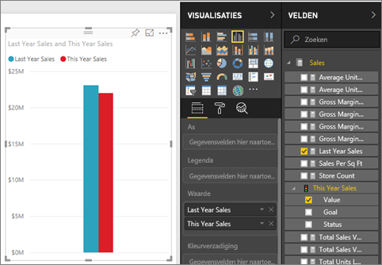
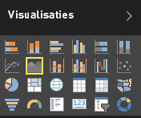

# Eenvoudig vlakdiagram
Het eenvoudige vlakdiagram (ook wel gelaagd vlakdiagram genoemd) is gebaseerd op het lijndiagram. Het gebied tussen as en lijn wordt gevuld met kleuren om het volume aan te geven. 

Vlakdiagrammen benadrukken de mate van wijzigingen in de loop van de tijd en kunnen worden gebruikt om de aandacht te vestigen op de totale waarde voor een trend. Gegevens die bijvoorbeeld de winst in de loop van de tijd voorstellen, kunnen worden afgezet in een vlakdiagram om de totale winst te benadrukken.

## Wanneer wordt een eenvoudig vlakdiagram gebruikt?
In de volgende gevallen komen eenvoudige vlakdiagrammen goed van pas:

* om de volumetrend in een tijdreeks te bekijken en te vergelijken 
* voor afzonderlijke reeksen die een fysiek telbare verzameling voorstellen

### Vereisten
 - Power BI-service
 - Voorbeeld van een retailanalyse

Meld u aan bij Power BI als u mee wilt doen en selecteer achtereenvolgens **Gegevens ophalen\> Voorbeelden \> Voorbeeld van een retailanalyse > Verbinding maken** en kies **Naar dashboard gaan**. 

## Een eenvoudig vlakdiagram maken
 

1. Selecteer op het dashboard Voorbeeld van een retailanalyse de tegel **Totaal aantal winkels** om het rapport Voorbeeld van een retailanalyse te openen.
2. Selecteer **Rapport bewerken** om het rapport in de bewerkingsweergave te openen.
3. Voeg een nieuwe pagina toe door onder aan het rapport het gele pluspictogram (+) te selecteren.
4. Maak een vlakdiagram waarin de omzet van dit jaar en die van vorig jaar per maand worden weergegeven.
   
   a. Selecteer in het deelvenster VELDEN achtereenvolgens **Verkoop \> Omzet vorig jaar** en **Omzet dit jaar > Waarde**.

   

   b.  Converteer het diagram naar een elementair vlakdiagram door het pictogram Vlakdiagram te selecteren in het deelvenster Visualisaties.

   
   
   c.  Selecteer **Tijd\> Maand** om deze waarde toe te voegen aan de bron **As**.   
   
   
   d.  Selecteer het beletselteken (rechtsboven in het visuele element) en kies **Sorteren op maand** om de waarden in de grafiek per maand weer te geven. Als u de sorteervolgorde wilt wijzigen, selecteert u het beletselteken opnieuw en selecteert u **Oplopend sorteren** of **Aflopend sorteren**.

## Markeren en kruislings filteren
Zie [Een filter aan een rapport toevoegen](../power-bi-report-add-filter.md) voor meer informatie over het gebruik van het deelvenster Filters.

Selecteer een bepaald gebied of de bovenrand ervan in uw diagram als u dat gebied wilt markeren.  Als er zich in tegenstelling tot andere visualisatietypen andere visualisaties op dezelfde pagina bevinden, worden andere visualisaties op de rapportpagina niet kruislings gefilterd wanneer er een eenvoudige vlakdiagrammen worden gemarkeerd. Vlakdiagrammen zijn echter wel een doel voor kruislings filteren dat door andere visualisaties op de rapportpagina wordt geactiveerd. 

1. Probeer het uit door uw vlakdiagram te selecteren en te kopiëren naar een andere rapportpagina (Ctrl+C en Ctrl+V).
2. Selecteer een van de gearceerde gebieden en vervolgens het andere gearceerde gebied. U ziet geen gevolgen voor de andere visualisaties op de pagina.

    

3. Selecteer nu een element op een van de andere visualisaties op de pagina, zoals een balk in een kolomdiagram of een maand in een lijndiagram. U ziet de gevolgen voor het vlakdiagram, dat wordt gefilterd.  

     

Zie [Interacties van visuals in rapporten](../service-reports-visual-interactions.md) voor meer informatie.

## Aandachtspunten en probleemoplossing   
* [Het rapport toegankelijker maken voor mensen met beperkingen](../desktop-accessibility.md)
* Met eenvoudige vlakdiagrammen kunnen waarden die het gevolg zijn van bedekking op de gelaagde vlakken niet effectief worden vergeleken. Power BI maakt gebruik van transparantie om de overlapping van gebieden aan te geven. Dit werkt echter alleen goed met twee of drie verschillende vlakken. Als u trends voor drie of meer metingen wilt vergelijken, kunt u lijndiagrammen gebruiken. Als u volumes voor drie of meer metingen wilt vergelijken, kunt u treemapgrafieken gebruiken.

## Volgende stap
[Rapporten in Power BI](power-bi-visualization-card.md)  

